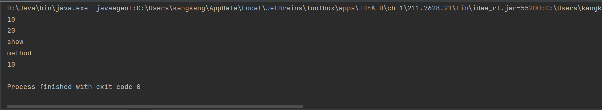
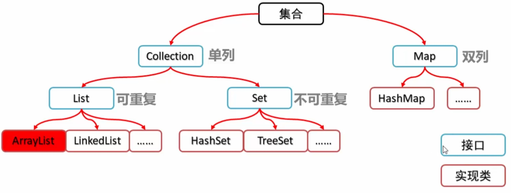
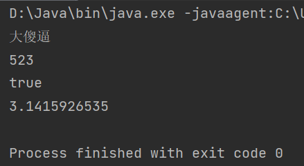
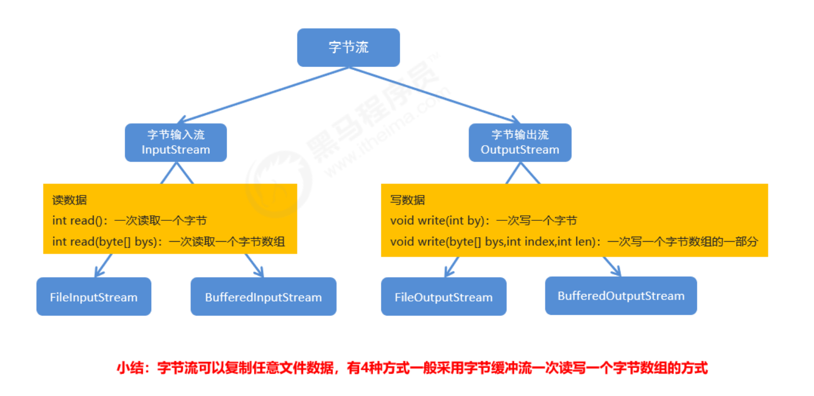
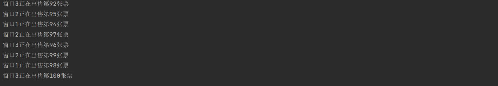

# 类和对象

```java
package text;

public class Student {//此处的Student为类名
    private String name;//name和age为成员变量，加了private后，age和name不能直接通过.name和.age来获取
    private int age;    //通过private可以避免输入非法数据；

    public Student() {//这个是构造方法，如果没写，系统会默认为空，但是建议自己写一个空的构造方法，构造方法可以
    }                 //有多种，类似于方法的重构；

    public Student(String name, int age) {
        this.name = name;//通过this可以访问该类的成员变量；
        this.age = age;
    }

    public void setAge(int age) {//有private修饰的成员变量不能直接通过.操作符来访问，但是Java给出了get和
        this.age = age;          //set方法来给成员变量赋值和获取成员变量；
    }

    public void setName(String name) {
        this.name = name;
    }

    public int getAge() {
        return age;
    }

    public String getName() {
        return name;
    }

    public void show() {//这个是成员方法，成员方法不用static；
        System.out.println(name + "," + age);
    }
}

```

下面的代码是上面类的调用代码；

```java
package text;

public class StudentDemo {
    public static void main(String[] args) {8
        Student s1 = new Student();//通过空变量创建方法
        s1.setAge(19);//通过set来进行赋值
        s1.setName("林宏伟sb");
        s1.show();//调用类的成员方法；
        Student s2 = new Student("林宏伟sb", 19);//通过String和age来创建方法；
        s2.show();
        System.out.println(s2.getName() + "," + s2.getAge());//通过get来获得类的成员变量；
    }
}

```

# 集合ArrayList

## 一、构造和添加

```java
import java.util.ArrayList;

public class Main {
    public static void main(String[] args) {
        ArrayList<String> student = new ArrayList<>();
//        jdk7以后可以这样创建一个新的空集合
//        在之前要在后面的<>中填写数据类型,例如：
//        ArrayList<String> student = new ArrayList<String>();
        System.out.println(student);
        student.add("大傻逼");
        System.out.println(student.add("大傻逼"));
        System.out.println(student);
//        通过ArrayList.add在集合的末尾添加一个数据
//        该方法的返回值为布尔类型
        student.add("二傻逼");
        student.add("三傻逼");
        System.out.println(student);
        student.add(1,"一傻逼");
//        通过索引来在集合的指定位置添加元素，切记索引不要越界
        System.out.println(student);
    }
}
```

输出：

```
[]
true
[大傻逼]
[大傻逼, 二傻逼, 三傻逼]
[大傻逼, 一傻逼, 二傻逼, 三傻逼]
```

## 二、常用方法

```java
import java.util.ArrayList;

public class Main {
    public static void main(String[] args) {
        ArrayList<String> student = new ArrayList<>();
        student.add("大傻逼");
        student.add("二傻逼");
        student.add("三傻逼");
        student.add(1,"一傻逼");
        System.out.println(student);
        System.out.println(student.remove("一傻逼"));
        System.out.println(student.remove("五傻逼"));
        student.remove("一傻逼");
//        删除指定的元素并反回布尔值表示是否删除成功；
        System.out.println(student);
        student.add(1,"一傻逼");
        student.remove(1);
//        通过索引删除指定位置的元素，返回值为布尔类型，切记索引不要越界；
        System.out.println(student);
        student.add(1,"一傻逼");
        System.out.println(student.set(1,"五傻逼"));
        System.out.println(student);
//        修改索引位置的元素并返回被修改的元素；
        student.set(1,"一傻逼");
        System.out.println(student.get(1));
//        获取索引位置的元素并返回索引处元素的值；
        System.out.println(student.size());
//        ArrayList.size()方法返回ArrayList的长度；
    }
}
```

输出

```
[大傻逼, 一傻逼, 二傻逼, 三傻逼]//初始的集合
true//remove的返回值
false
[大傻逼, 二傻逼, 三傻逼]//修改后的集合
[大傻逼, 二傻逼, 三傻逼]//修改后的集合
一傻逼//set的返回值
[大傻逼, 五傻逼, 二傻逼, 三傻逼]//使用set后的方法
一傻逼//get
4//size
```

## 三、集合的遍历


```java
import java.util.ArrayList;

public class Main {
    public static void main(String[] args) {
        ArrayList<String> student = new ArrayList<>();
        student.add("大傻逼");
        student.add("一傻逼");
        student.add("二傻逼");
        student.add("三傻逼");
        for (int i=0;i<student.size();i++){
            System.out.println(student.get(i));
        }//集合的标准遍历
        //以下为加强for
        System.out.println();
        for (String s : student) {
            System.out.println(s);
        }
    }
}
```

# 继承

## 一、继承概述

1、继承的概念
	继承是面向对象三大特征之一，可以使得子类具有父类的属性和方法，还可以在子类中重新定义，以及
追加属性和方法

2、继承的格式

继承通过extends实现
	格式：class 子类 extends 父类 { }

如public class Zi extends Fu

3、继承的好处

继承可以让类与类之间产生关系，子父类关系，产生子父类后，子类则可以使用父类中非私有的成员。

父类

[Fu.java](youdaonote-attachments/WEBRESOURCE0f40a036bbf3b68359ec3dbec1c1dd96Fu.java)

```java
package inherit;

public class Fu {
    String age,name;
}
```

子类

[Zi.java](youdaonote-attachments/WEBRESOURCE676720b3748ca40423537c0495b8a585Zi.java)

```java
package inherit;

public class Zi extends Fu{
    public void pr(){
        System.out.println(name+" "+age);
    }
}
```

测试

[Demo.java](youdaonote-attachments/WEBRESOURCEc703d68b6d1e7b455546f8ce53dc84a0Demo.java)

```java
package inherit;

public class Demo {
    public static void main(String[] args) {
        Zi zi=new Zi();
        zi.age="1";
        zi.name="GHUIY";
        Fu fu = new Fu();
        fu.age="114514";
        fu.name="gauebikgh";
        System.out.println("FU:"+fu.age+"\t"+fu.name);
        zi.pr();
    }
}
```


## 二、继承的好处和弊端

继承好处
		提高了代码的复用性(多个类相同的成员可以放到同一个类中)
		提高了代码的维护性(如果方法的代码需要修改，修改一处即可)
	继承弊端


继承让类与类之间产生了关系，类的耦合性增强了，当父类发生变化时子类实现也不得不跟着变化，削
	      弱了子类的独立性

继承的应用场景：
		使用继承，需要考虑类与类之间是否存在is..a的关系，不能盲目使用继承
			is..a的关系：谁是谁的一种，例如：老师和学生是人的一种，那人就是父类，学生和老师就是子类

## 三、 继承中变量的访问特点

在子类方法中访问一个变量，采用的是就近原则。
	1. 子类局部范围找
	2. 子类成员范围找
	3. 父类成员范围找
	4. 如果都没有就报错(不考虑父亲的父亲…)

父类


[Fu.java](youdaonote-attachments/WEBRESOURCEed3ba727c00bd1dd0527c4022da5d24eFu.java)

```java
package inherit1;

class Fu {
    int num = 10;
}


```

子类

[Zi.java](youdaonote-attachments/WEBRESOURCE76ddf5571d3ea3972530dc036634e5b8Zi.java)

```java
package inherit1;

class Zi {
    int num = 20;
    public void show(){
        int num = 30;
        System.out.println(num);
    }
}

```

测试

[Demo.java](youdaonote-attachments/WEBRESOURCE6b8a69947ece62bb5a839cc7bf8d2a5aDemo.java)

```java
package inherit1;

public class Demo {
    public static void main(String[] args) {
        Zi z = new Zi();
        z.show(); // 输出show方法中的局部变量30
    }
}

```

## 四、super

this&super关键字：
		this：代表本类对象的引用
		super：代表父类存储空间的标识(可以理解为父类对象引用)
	this和super的使用分别
		成员变量：
			this.成员变量 - 访问本类成员变量
			super.成员变量 - 访问父类成员变量
		成员方法：
			this.成员方法 - 访问本类成员方法

  super.成员方法 - 访问父类成员方法
		构造方法：
			this(…) - 访问本类构造方法
			super(…) - 访问父类构造方法

父类

[Fu.java](youdaonote-attachments/WEBRESOURCE3a4b397af0a9ffeb06322ec60bf5894eFu.java)

```java
package inherit2;

public class Fu {
    int age=40;
}

```

子类

[Zi.java](youdaonote-attachments/WEBRESOURCE67b056089adec66281b908b91562e0e9Zi.java)

```java
package inherit2;

public class Zi extends Fu {
    int age=30;
    public void show(){
        int age =20;
        System.out.println(age);
        System.out.println(this.age);
        System.out.println(super.age);
    }
}

```

测试

[Demo.java](youdaonote-attachments/WEBRESOURCEd77eb06866b8b4b84730610eb1e75d21Demo.java)

```java
package inherit2;

public class Demo {
    public static void main(String[] args) {
        Zi zi = new Zi();
        zi.show();
    }
}

```


## 五、 继承中构造方法的访问特点

注意：子类中所有的构造方法默认都会访问父类中无参的构造方法
			子类会继承父类中的数据，可能还会使用父类的数据。所以，子类初始化之前，一定要先完成父类数

			据的初始化，原因在于，每一个子类构造方法的第一条语句默认都是：super()
	问题：如果父类中没有无参构造方法，只有带参构造方法，该怎么办呢？

1. 通过使用super关键字去显示的调用父类的带参构造方法
			2. 在父类中自己提供一个无参构造方法
	推荐方案：
			自己给出无参构造方法

父类

[Fu.java](youdaonote-attachments/WEBRESOURCE85ce35b466f2adf1dc9a72de02151f8bFu.java)

```java
package inherit2;

public class Fu {
    public Fu(){
        System.out.println("fu中无参构造方法被调用");
    }
    public Fu(int age){
        System.out.println("fu中带参构造方法被调用");
    }
}

```

子类

[Zi.java](youdaonote-attachments/WEBRESOURCE5ee5fed84423c11a13ed4e88e8c9d190Zi.java)

```java
package inherit2;

public class Zi extends Fu {
    public Zi(){
        System.out.println("zi的无参构造方法被调用");
    }
    public Zi(int age){
        System.out.println("zi中的带参构造方法被调用");
    }
}

```

测试

[Demo.java](youdaonote-attachments/WEBRESOURCE12c728fd2ecd11545ec4d7e91548f072Demo.java)

```java
package inherit2;

public class Demo {
    public static void main(String[] args) {
        Zi zi = new Zi();
        Zi zi1 = new Zi(78);
    }
}

```


## 六、继承中成员方法的访问特点

同成员变量的访问方法

通过子类对象访问一个方法
		1. 子类成员范围找
		2. 父类成员范围找
		3. 如果都没有就报错(不考虑父亲的父亲…)

## 七、super内存图

对象在堆内存中，会单独存在一块super区域，用来存放父类的数据


## 八、方法重写的注意事项

方法重写的注意事项
			1. 私有方法不能被重写(父类私有成员子类是不能继承的)
			2. 子类方法访问权限不能更低(public > 默认 > 私有)


父类

[Fu.java](youdaonote-attachments/WEBRESOURCE4cd7239c9c8c186af5df2ebc700e76c1Fu.java)

```java
package inherit2;

public class Fu {
    private void show() {
        System.out.println("Fu中show()方法被调用");
    }
    void method() {
        System.out.println("Fu中method()方法被调用");
    }
}
```

子类

[Zi.java](youdaonote-attachments/WEBRESOURCEd305b16ab9bc7eaa2e7b2dd6ab0cde18Zi.java)

```java
package inherit2;

public class Zi extends Fu {
    /* 编译【出错】，子类不能重写父类私有的方法*/
      @Override
      private void show() {
        System.out.println("Zi中show()方法被调用");
    }
    /* 编译【出错】，子类重写父类方法的时候，访问权限需要大于等于父类 */
    @Override
    private void method() {
        System.out.println("Zi中method()方法被调用");
    }
    /* 编译【通过】，子类重写父类方法的时候，访问权限需要大于等于父类 */

    @Override
    public void method() {
        System.out.println("Zi中method()方法被调用");
    }
}


```

测试

[Demo.java](youdaonote-attachments/WEBRESOURCE99938695f447885b136cae3a83c09b77Demo.java)

```java
package inherit2;

public class Demo {
    public static void main(String[] args) {
        Zi zi = new Zi();
        zi.method();
    }
}

```

## 九、 Java中继承的注意事项

Java中继承的注意事项
			1. Java中类只支持单继承，不支持多继承
			错误范例：class A extends B, C { }


多层继承示例代码：

```java
public class Granddad {
    public void drink() {
        System.out.println("爷爷爱喝酒");
    }
}
public class Father extends Granddad {
    public void smoke() {
        System.out.println("爸爸爱抽烟");
    }
}
public class Mother {
    public void dance() {
        System.out.println("妈妈爱跳舞");
    }
}
public class Son extends Father {
// 此时，Son类中就同时拥有drink方法以及smoke方法
}
```

# 修饰符

## 一、package

  1、包的概念
			包就是文件夹，用来管理类文件的
		2、包的定义格式
			package 包名; (多级包用.分开)
				例如：package com.heima.demo;
		3、带包编译&带包运行
			带包编译：javac –d . 类名.java
				例如：javac -d . com.heima.demo.HelloWorld.java（自动生成包）
			带包运行：java 包名+类名
				例如：java com.heima.demo.HelloWorld

## 二、import

导包的意义
			使用不同包下的类时，使用的时候要写类的全路径，写起来太麻烦了
			为了简化带包的操作，Java就提供了导包的功能
		导包的格式
			格式：import 包名;
			范例：import java.util.Scanner;
		示例代码（没有使用导包，创建的Scanner对象）


```java
package com.heima;
public class Demo {
public static void main(String[] args) {
// 1. 没有导包，创建Scnaner对象
        java.util.Scanner sc = new java.util.Scanner(System.in);
    }
}
```

示例代码（使用导包后，创建的Scanner对象）

```java
package com.heima;
import java.util.Scanner;
public class Demo {
public static void main(String[] args) {
// 1. 没有导包，创建Scnaner对象
        Scanner sc = new Scanner(System.in);
    }
}
```

## 三、权限修饰符


## 四、 final

fianl关键字的作用
		final代表最终的意思，可以修饰成员方法，成员变量，类
	final修饰类、方法、变量的效果
		fianl修饰类：该类不能被继承（不能有子类，但是可以有父类）
		final修饰方法：该方法不能被重写
		final修饰变量：表明该变量是一个常量，不能再次赋值


## 五、 final修饰局部变量

fianl修饰基本数据类型变量
		final 修饰指的是基本类型的数据值不能发生改变
	final修饰引用数据类型变量
		final 修饰指的是引用类型的地址值不能发生改变，但是地址里面的内容是可以发生改变的
	举例：

```java
public static void main(String[] args){
    final Student s = new Student(23);
    s = new Student(24); // 错误
    s.setAge(24); // 正确
}
```

## 六、 static

static的概念
		static关键字是静态的意思，可以修饰【成员方法】，【成员变量】
	static修饰的特点
		1. 被类的所有对象共享，这也是我们判断是否使用静态关键字的条件
		2. 可以通过类名调用当然，也可以通过对象名调用【推荐使用类名调用】
	示例代码：


```java
class Student {
        public String name; //姓名
        public int age; //年龄
        public static String university; //学校 共享数据！所以设计为静态！
        public void show() {
        System.out.println(name + "," + age + "," + university);
    }
}
public class StaticDemo {
    public static void main(String[] args) {
// 为对象的共享数据赋值
        Student.university = "传智大学";
        Student s1 = new Student();
        s1.name = "林青霞";
        s1.age = 30;
        s1.show();
        Student s2 = new Student();
        s2.name = "风清扬";
        s2.age = 33;
        s2.show();
    }
}
```

## 七、 static访问特点

static的访问特点
		非静态的成员方法
			能访问静态的成员变量
			能访问非静态的成员变量
			能访问静态的成员方法
			能访问非静态的成员方法
		静态的成员方法
			能访问静态的成员变量
			能访问静态的成员方法
		总结成一句话就是：
			静态成员方法只能访问静态成员

# 多态

## 一、多态的概述

 什么是多态
		同一个对象，在不同时刻表现出来的不同形态
	多态的前提
		要有继承或实现关系
		要有方法的重写
		要有父类引用指向子类对象

## 二、多态中的成员访问特点

成员访问特点
		成员变量
			编译看父类，运行看父类
		成员方法
			编译看父类，运行看子类
	代码演示

父类

[Fu.java](youdaonote-attachments/WEBRESOURCE53b79f4506eef9323d43b6ffda99e3d3Fu.java)

```java
package inherit2;

public class Fu {
    int age=10;
    public void show(){
        System.out.println("FU");
    }
}
```

子类

[Zi.java](youdaonote-attachments/WEBRESOURCE35c2e1fa852fd6a8ba741d1ebe81258eZi.java)

```java
package inherit2;

public class Zi extends Fu {
    int age=20;
    @Override
    public void show() {
        System.out.println("ZI");
    }
}
```

测试

[Demo.java](youdaonote-attachments/WEBRESOURCE38be94e647f01837e50f89e80a10acc0Demo.java)

```java
package inherit2;

public class Demo {
    public static void main(String[] args) {
        Fu fu=new Zi();
        System.out.println(fu.age);
        fu.show();
    }
}
```


## 三、多态的好处和弊端

 好处
		提高程序的扩展性。定义方法时候，使用父类型作为参数，在使用的时候，使用具体的子类型参与操作
	弊端
		不能使用子类的特有成员

## 四、多态中的转型

向上转型
		父类引用指向子类对象就是向上转型
	向下转型
		格式：子类型 对象名 = (子类型)父类引用;

代码演示

父类

[Fu.java](youdaonote-attachments/WEBRESOURCEfbbcb9abc5170fac87ff6377d8dcfd6fFu.java)

```java
package inherit2;

public class Fu {
    public void show(){
        System.out.println("FU.SHOW");
    }
}
```

子类

[Zi.java](youdaonote-attachments/WEBRESOURCEf7d554847acb2f12f10e83e8750f50b7Zi.java)

```java
package inherit2;

public class Zi extends Fu {
    @Override
    public void show() {
        System.out.println("ZI.SHOW");
    }
    public void play(){
        System.out.println("ZI.PLAY");
    }
}
```

测试

[Demo.java](youdaonote-attachments/WEBRESOURCE375474fc06b0d98757e2739e5a68a15aDemo.java)

```java
package inherit2;

public class Demo {
    public static void main(String[] args) {
        //向上转型
        Fu fu=new Zi();
        fu.show();

        //向下转型
        Zi zi=(Zi)fu;
        zi.show();
        zi.play();
    }
}

```


# 抽象类

## 一、抽象类的概述

当我们在做子类共性功能抽取时，有些方法在父类中并没有具体的体现，这个时候就需要抽象类了！
	在Java中，一个没有方法体的方法应该定义为抽象方法，而类中如果有抽象方法，该类必须定义为抽象类！

## 二、抽象类的特点

抽象类和抽象方法必须使用 abstract 关键字修饰

```java
//抽象类的定义
public abstract class 类名 {}
//抽象方法的定义
public abstract void eat();
```

抽象类中不一定有抽象方法，有抽象方法的类一定是抽象类

抽象类不能实例化

 （不可以new 类名( )）
		抽象类如何实例化呢？参照多态的方式，通过子类对象实例化，这叫抽象类多态
	抽象类的子类
		要么重写抽象类中的所有抽象方法
		要么是抽象类

## 三、抽象类的成员特点

成员的特点
		成员变量
			既可以是变量
			也可以是常量（用final修饰）
		构造方法
			空参构造
			有参构造
		成员方法
			抽象方法
			普通方法

代码演示

父类

[Fu.java](youdaonote-attachments/WEBRESOURCEbae0065855cad136816cd3e752b8ac0fFu.java)

```java
package inherit2;

public abstract class Fu {
    int age=10;
    final String a="FU";

    public Fu() {
    }
    public Fu(int age) {
        this.age = age;
    }
    public void show(){
        System.out.println(age);
        System.out.println(a);
    }
    public abstract void eat();
}
```

子类

[Zi.java](youdaonote-attachments/WEBRESOURCE6cc31d47f43dd4b2741c40bb72e4c082Zi.java)

```java
package inherit2;

public class Zi extends Fu {
    @Override
    public void eat() {
        System.out.println("吃食物");
    }
}
```

测试类

[Demo.java](youdaonote-attachments/WEBRESOURCE84e4b5e79212132f584f9cd3fadd1269Demo.java)

```java
package inherit2;

public class Demo {
    public static void main(String[] args) {
        Fu f=new Zi();
        f.show();
        f.eat();
    }
}

```


# 接口

## 一、接口的概述

接口就是一种公共的规范标准，只要符合规范标准，大家都可以通用。
	Java中的接口更多的体现在对行为的抽象！

## 二、接口的特点

接口用关键字interface修饰

public interface 接口名 {}

      类实现接口用implements表示

public class 类名 implements 接口名 {}

接口不能实例化
		接口如何实例化呢？参照多态的方式，通过实现类对象实例化，这叫接口多态。
		多态的形式：具体类多态(基本不用)，抽象类多态，接口多态。
	接口的子类
		要么重写接口中的所有抽象方法
		要么子类也是抽象类

## 三、接口的成员特点

成员特点
		成员变量
			只能是常量 默认修饰符：public static final
		构造方法
			没有，因为接口主要是扩展功能的，而没有具体存在

  一个类如果没有父类，默认继承Object类
		成员方法
			只能是抽象方法
			默认修饰符：public abstract
		关于接口中的方法，JDK8和JDK9中有一些新特性，后面再讲解

代码演示

接口

[inter.java](youdaonote-attachments/WEBRESOURCE85fba05cf294d23f9cdcf04220242d71inter.java)

```java
package inherit2;

public interface inter {
    public int num = 10;
    public final int num2 = 20;
    // public static final int num3 = 30;== int num3 = 30;
    int num3 = 30;
    // public Inter() {}   不存在
    // public void show() {}   不存在
    public abstract void method();//与下一行作用相同
    void show();
}
```

    实现类

[InterImpl.java](youdaonote-attachments/WEBRESOURCEc0f644f6e555d70cfd8951e03beed152InterImpl.java)

```java
package inherit2;

public class InterImpl implements inter{
    public InterImpl() {
        super();//继承Object类
    }

    @Override
    public void show() {
        System.out.println("show");
    }

    @Override
    public void method() {
        System.out.println("method");
    }
}
```

 	 测试

[Demo.java](youdaonote-attachments/WEBRESOURCE2bbcfccbc11c0e0155176df1d820427fDemo.java)

```java
package inherit2;

public class Demo {
    public static void main(String[] args) {
        inter i=new InterImpl();
        System.out.println(i.num);
        System.out.println(i.num2);
        i.show();
        i.method();
        System.out.println(inter.num);
    }
}
```



## 四、类和接口的关系

类与类的关系
		继承关系，只能单继承，但是可以多层继承
	类与接口的关系
		实现关系，可以单实现，也可以多实现，还可以在继承一个类的同时实现多个接口
	接口与接口的关系
		继承关系，可以单继承，也可以多继承

## 五、抽象类和接口的区别

成员区别
		抽象类：
			变量,常量；有构造方法；有抽象方法,也有非抽象方法
		接口：
			常量；抽象方法
	关系区别
		类与类：
			继承，单继承
		类与接口：
			实现，可以单实现，也可以多实现，接口不能继承类
		接口与接口：
			继承，单继承，多继承
	设计理念区别
		抽象类：
			对类抽象，包括属性、行为
		接口：
			对行为抽象，主要是行为

# 参数传递

## 一、类名作为形参和返回值

 类名作为方法的形参
		方法的形参是类名，其实需要的是该类的对象
		实际传递的是该对象的【地址值】
	类名作为方法的返回值
		方法的返回值是类名，其实返回的是该类的对象
		实际传递的，也是该对象的【地址值】

 示例代码

[Main.java](youdaonote-attachments/WEBRESOURCE5420b471da4834849bc1f71f7f7fb1e7Main.java)

```java
class Cat {
    public void eat() {
        System.out.println("猫吃鱼");
    }
}
class CatOperator {
    public void useCat(Cat c) { //Cat c = new Cat();//作为方法的形参
        c.eat();
    }
    public Cat getCat() {
        Cat c = new Cat();
        return c;//作为方法的返回值
    }
}
public class Main {
    public static void main(String[] args) {
//创建操作类对象，并调用方法
        CatOperator co = new CatOperator();
        Cat c = new Cat();
        co.useCat(c);
        Cat c2 = co.getCat(); //new Cat()
        c2.eat();
    }
}
```

##  二、抽象类作为形参和返回值

抽象类作为形参和返回值
	方法的形参是抽象类名，其实需要的是该抽象类的子类对象（抽象类不能直接实例化）
	方法的返回值是抽象类名，其实返回的是该抽象类的子类对象

示例代码：

[Main.java](youdaonote-attachments/WEBRESOURCE48938b83aca9bca980646583c58850baMain.java)

```java
abstract class Animal {
    public abstract void eat();
}
class Cat extends Animal {
    @Override
    public void eat() {
        System.out.println("猫吃鱼");
    }
}
class AnimalOperator {
    public void useAnimal(Animal a) { //Animal a = new Cat();
        a.eat();
    }
    public Animal getAnimal() {
        Animal a = new Cat();
        return a;
    }
}
public class Main {
    public static void main(String[] args) {
//创建操作类对象，并调用方法
        AnimalOperator ao = new AnimalOperator();
        Animal a = new Cat();
        ao.useAnimal(a);
        Animal a2 = ao.getAnimal(); //new Cat()
        a2.eat();
    }
}
```

## 三、接口名作为形参和返回值

接口作为形参和返回值
		方法的形参是接口名，其实需要的是该接口的实现类对象（与抽象类一样，接口不能实例化）
		方法的返回值是接口名，其实返回的是该接口的实现类对象

·示例代码：

[Main.java](youdaonote-attachments/WEBRESOURCE548a61c937029aa5c898b99ebcfd79edMain.java)

```java
interface Jumping {
    void jump();
}
class JumpingOperator {
    public void useJumpping(Jumping j) { //Jumpping j = new Cat();
        j.jump();
    }
    public Jumping getJumpping() {
        Jumping j = new Cat();
        return j;
    }
}
class Cat implements Jumping {
    @Override
    public void jump() {
        System.out.println("猫可以跳高了");
    }
}
public class Main {
    public static void main(String[] args) {
//创建操作类对象，并调用方法
        JumpingOperator jo = new JumpingOperator();
        Jumping j = new Cat();
        jo.useJumpping(j);
        Jumping j2 = jo.getJumpping(); //new Cat()
        j2.jump();
    }
}
```

# 内部类

## 一、内部类的基本使用

 内部类概念
		在一个类中定义一个类。举例：在一个类A的内部定义一个类B，类B就被称为内部类
		内部类定义格式
	格式&举例：

```java
class Outer {
    public class Inner {
    }
}
```

Inner为内部类

内部类的访问特点
		内部类可以直接访问外部类的成员，包括私有
		外部类要访问内部类的成员，必须创建对象

示例代码：

```java
public class Outer {
    private int num = 10;
    public class Inner {
        public void show() {
            System.out.println(num);
        }
    }
    public void method() {
        Inner i = new Inner();
        i.show();
    }
}
```

## 二、 成员内部类

成员内部类的定义位置
		在类中方法，跟成员变量是一个位置
	外界创建成员内部类格式
		格式：外部类名.内部类名 对象名 = 外部类对象.内部类对象;
		举例：Outer.Inner oi = new Outer().new Inner();
	成员内部类的推荐使用方案
		将一个类，设计为内部类的目的，大多数都是不想让外界去访问，所以内部类的定义应该私有化，私有
		化之后，再提供一个可以让外界调用的方法，方法内部创建内部类对象并调用。

示例代码：

```java
class Outer {
    private int num = 10;
    private class Inner {
        public void show() {
            System.out.println(num);
        }
    }
    public void method() {
        Inner i = new Inner();
        i.show();
    }
}
public class Main{
    public static void main(String[] args) {
//Outer.Inner oi = new Outer().new Inner();//类未被私有化可以这样实例化
//oi.show();
        //建议做法
        Outer o = new Outer();
        o.method();
    }
}
```

## 三、局部内部类

 局部内部类定义位置
		局部内部类是在方法中定义的类
	局部内部类方式方式
		局部内部类，外界是无法直接使用，需要在方法内部创建对象并使用
		该类可以直接访问外部类的成员，也可以访问方法内的局部变量

示例代码

```java
class Outer {
    private int num = 10;
    public void method() {
        int num2 = 20;
        class Inner {//Inner为成员内部类
            public void show() {
                System.out.println(num);
                System.out.println(num2);
            }
        }
        Inner i = new Inner();
        i.show();
    }
}
public class Main {
    public static void main(String[] args) {
        Outer o = new Outer();
        o.method();
    }
}

```

## 四、 匿名内部类

 匿名内部类的前提
		存在一个类或者接口，这里的类可以是具体类也可以是抽象类
	匿名内部类的格式
		格式：new 类名 ( ) { 重写方法 } new 接口名 ( ) { 重写方法 }
	举例：

```
new Inter(){
     @Override

     public void method(){}
}

```

 匿名内部类的本质
		本质：是一个继承了该类或者实现了该接口的子类匿名对象
	匿名内部类的细节
		匿名内部类可以通过多态的形式接受


```
Inter i = new Inter(){

    @Override

    public void method(){

    }
}
```

匿名内部类直接调用方法

```java
interface Inter{
    void method();
}
class Test{
    public static void main(String[] args){
        new Inter(){
            @Override
            public void method(){
                System.out.println("我是匿名内部类");
            }
        }.method(); // 直接调用方法
        //方法2，更常用
        Inter i=new Inter() {
            @Override
            public void method() {
                System.out.println("我是匿名内部类");
            }
        };
        i.method();
    }
}
```


## 五、 匿名内部类在开发中的使用

匿名内部类在开发中的使用
		当发现某个方法需要，接口或抽象类的子类对象，我们就可以传递一个匿名内部类过去，来简化传统的
		代码

示例代码

```java
interface jumping {
    void jump();
}
class Cat implements jumping {
    @Override
    public void jump() {
        System.out.println("猫可以跳高了");
    }
}
class Dog implements jumping {
    @Override
    public void jump() {
        System.out.println("狗可以跳高了");
    }
}
class jumpingOperator {
    public void method(jumping j) { //new Cat();new Dog();
        j.jump();
    }
}
class jumpingDemo {
    public static void main(String[] args) {
//需求：创建接口操作类的对象，调用method方法
        /*
        如果需要使用多次方法，并且每次的输出不同时，通过
        创建对象的方法来进行输出就太麻烦了；
        // */
        jumpingOperator jo = new jumpingOperator();
        jumping j = new Cat();
        jo.method(j);
        jumping j2 = new Dog();
        jo.method(j2);
        System.out.println("猫可以跳高了");
// 匿名内部类的简化
        jo.method(new jumping() {
            @Override
            public void jump() {
                System.out.println("猫可以跳高了");
            }
        });
// 匿名内部类的简化
        jo.method(new jumping() {
            @Override
            public void jump() {
                System.out.println("狗可以跳高了");
            }
        });
    }
}
```

#  常用API

## 一、Math

 Math类概述
		Math 包含执行基本数字运算的方法
	Math中方法的调用方式
		Math类中无构造方法，但内部的方法都是静态的，则可以通过 类名.进行调用
	Math类的常用方法


| 方法名 | 说明 |
| - | - |
| public static int abs(int a)  | 返回参数的绝对值 |
| public static double ceil(double a) | 返回大于或等于参数的最小double值，等于一个整<br>数 |
| public static double floor(double a) | 返回小于或等于参数的最大double值，等于一个整<br>数 |
| public static int round(float a) | 按照四舍五入返回最接近参数的int |
| public static int max(int a,int b) | 返回两个int值中的较大值 |
| public static int min(int a,int b)  | 返回两个int值中的较小值 |
| public static double pow (double a,double<br>b)<br> | 返回a的b次幂的值 |
| public static double random() | 返回值为double的正值，[0.0,1.0) |


## 二、 System

System类的常用方法

| 方法名  | 说明 |
| - | - |
| public static void exit(int status)  | 终止当前运行的 Java 虚拟机，非零表示异常终止 |
| public static long currentTimeMillis() | 返回当前时间(以毫秒为单位) |


示例代码

需求：在控制台输出1-10000，计算这段代码执行了多少毫秒

```java
public class Main {
    public static void main(String[] args) {
// 获取开始的时间节点
        long start = System.currentTimeMillis();
        for (int i = 1; i <= 10000; i++) {
            System.out.println(i);
        }
// 获取代码运行结束后的时间节点
        long end = System.currentTimeMillis();
        System.out.println("共耗时：" + (end - start) + "毫秒");
    }
}
```

## 三、Object类的toString方法

 Object类概述
		Object 是类层次结构的根，每个类都可以将 Object 作为超类。所有类都直接或者间接的继承自该类，
		换句话说，该类所具备的方法，所有类都会有一份
	查看方法源码的方式
		选中方法，按下Ctrl + B
	重写toString方法的方式
		1. Alt + Insert 选择toString
		2. 在类的空白区域，右键 -> Generate -> 选择toString
	toString方法的作用：
		以良好的格式，更方便的展示对象中的属性值
	示例代码：

```java
class Student extends Object{
    private String name;
    private int age;

    public Student() {
    }

    public Student(String name, int age) {
        this.name = name;
        this.age = age;
    }

    public String getName() {
        return name;
    }

    public void setName(String name) {
        this.name = name;
    }

    public int getAge() {
        return age;
    }

    public void setAge(int age) {
        this.age = age;
    }

    @Override
    public String toString() {
        return "Student{" +
                "name='" + name + '\'' +
                ", age=" + age +
                '}';
    }
}
public class Main {
    public static void main(String[] args) {
        Student student = new Student();
        student.setName("大傻逼");
        student.setAge(20);
        System.out.println(student);//直接输出时会自动执行toString
        System.out.println(student.toString());
    }
}
```

运行结果

```
Student{name='大傻逼', age=20}
Student{name='大傻逼', age=20}

```

## 四、Object类的equals方法

 equals方法的作用
		用于对象之间的比较，返回true和false的结果
		举例：s1.equals(s2); s1和s2是两个对象
	重写equals方法的场景
		不希望比较对象的地址值，想要结合对象属性进行比较的时候。
	重写equals方法的方式
		1. alt + insert 选择equals() and hashCode()，IntelliJ Default，一路next，finish即可
		2. 在类的空白区域，右键 -> Generate -> 选择equals() and hashCode()，后面的同上。
	示例代码

```java
class Student {
    private String name;
    private int age;
    public Student() {
    }
    public Student(String name, int age) {
        this.name = name;
        this.age = age;
    }
    public String getName() {
        return name;
    }
    public void setName(String name) {
        this.name = name;
    }
    public int getAge() {
        return age;
    }
    public void setAge(int age) {
        this.age = age;
    }
    @Override
    public boolean equals(Object o) {
//this -- s1
//o -- s2
        if (this == o) return true;
        if (o == null || getClass() != o.getClass()) return false;
        Student student = (Student) o; //student -- s2
        if (age != student.age) return false;
        return name != null ? name.equals(student.name) : student.name == null;
    }
}
public class Main {
    public static void main(String[] args) {
        Student s1 = new Student();
        s1.setName("林青霞");
        s1.setAge(30);
        Student s2 = new Student();
        s2.setName("林青霞");
        s2.setAge(30);
//需求：比较两个对象的内容是否相同
        System.out.println(s1.equals(s2));
    }
}
```

## 五、 冒泡排序原理

 冒泡排序概述
		一种排序的方式，对要进行排序的数据中相邻的数据进行两两比较，将较大的数据放在后面，依次对所
		有的数据进行操作，直至所有数据按要求完成排序
	如果有n个数据进行排序，总共需要比较n-1次
		每一次比较完毕，下一次的比较就会少一个数据参与

## 六、冒泡排序代码实现

代码实现

```java
/*
冒泡排序：
一种排序的方式，对要进行排序的数据中相邻的数据进行两两比较，将较大的数据放在后面，
依次对所有的数据进行操作，直至所有数据按要求完成排序
*/
public class Main {
    public static void main(String[] args) {
//定义一个数组
        int[] arr = {24, 69, 80, 57, 13};
        System.out.println("排序前：" + arrayToString(arr));
// 这里减1，是控制每轮比较的次数
        for (int x = 0; x < arr.length - 1; x++) {
// ­1是为了避免索引越界，-x是为了调高比较效率
            for (int i = 0; i < arr.length - 1 - x; i++) {
                if (arr[i] > arr[i + 1]) {
                    int temp = arr[i];
                    arr[i] = arr[i + 1];
                    arr[i + 1] = temp;
                }
            }
        }
        System.out.println("排序后：" + arrayToString(arr));
    }
    //把数组中的元素按照指定的规则组成一个字符串：[元素1, 元素2, ...]
    public static String arrayToString(int[] arr) {
        StringBuilder sb = new StringBuilder();
        sb.append("[");
        for (int i = 0; i < arr.length; i++) {
            if (i == arr.length - 1) {
                sb.append(arr[i]);
            } else {
                sb.append(arr[i]).append(", ");
            }
        }
        sb.append("]");
        String s = sb.toString();
        return s;
    }
}
```

## 七、Arrays

Arrays的常用方法


| 方法名  | 说明 |
| - | - |
| public static String toString(int[] a) | 返回指定数组的内容的字符串表示形式 |
| public static void sort(int[] a) | 按照数字顺序排列指定的数组 |


工具类设计思想
		1、构造方法用 private 修饰
		2、成员用 public static 修饰


# 包装类

## 一、基本类型包装类

基本类型包装类的作用
		将基本数据类型封装成对象的好处在于可以在对象中定义更多的功能方法操作该数据
		常用的操作之一：用于基本数据类型与字符串之间的转换

基本类型对应的包装类

| 基本数据类型  | 包装类<br> |
| - | - |
| byte | Byte |
| short | Short |
| int | Integer |
| long | Long |
| float | Float |
| double | Double |
| char | Character |
| boolean | Boolean |


## 二、Integer类

Integer类概述
		包装一个对象中的原始类型 int 的值

Integer类构造方法

| 方法名 | 说明 |
| - | - |
| public Integer(int value) | 根据 int 值创建 Integer 对象(过时)<br> |
| public Integer(String s) | 根据 String 值创建 Integer 对象(过时 |
| public static Integer valueOf(int i) | 返回表示指定的 int 值的 Integer 实例<br> |
| public static Integer valueOf(String s) | 返回一个保存指定值的 Integer 对象 String |


示例代🐎

```java
public class Main {
    public static void main(String[] args) {
//public Integer(int value)：根据 int 值创建 Integer 对象(过时)
        Integer i1 = new Integer(100);
        System.out.println(i1);
//public Integer(String s)：根据 String 值创建 Integer 对象(过时)
        Integer i2 = new Integer("100");
// Integer i2 = new Integer("abc"); //NumberFormatException
        System.out.println(i2);
        System.out.println("--------");
//public static Integer valueOf(int i)：返回表示指定的 int 值的 Integer 实例
        Integer i3 = Integer.valueOf(100);
        System.out.println(i3);
//public static Integer valueOf(String s)：返回一个保存指定值的Integer对象String
        Integer i4 = Integer.valueOf("100");
        System.out.println(i4);
    }
}

```

无论是public Integer(String s)还是public static Integer valueOf(String s)其中s的值都必须只存在数字

## 三、int和String类型的相互转换

 int转换为String
		转换方式
			方式一：直接在数字后加一个空字符串
			方式二：通过String类静态方法valueOf()
		示例代🐎

```java
public class Main {
    public static void main(String[] args) {
//int --- String
        int number = 100;
//方式1
        String s1 = number + "";
        System.out.println(s1);
//方式2
//public static String valueOf(int i)
        String s2 = String.valueOf(number);
        System.out.println(s2);
        System.out.println("--------");
    }
}
```

String转换为int
		转换方式
			方式一：先将字符串数字转成Integer，再调用valueOf()方法
			方式二：通过Integer静态方法parseInt()进行转换
		示例代码


```java
public class Main {
    public static void main(String[] args) {
//String --- int
        String s = "100";
//方式1：String --- Integer --- int
        Integer i = Integer.valueOf(s);
//public int intValue()
        int x = i.intValue();
        System.out.println(x);
//方式2
//public static int parseInt(String s)
        int y = Integer.parseInt(s);
        System.out.println(y);
    }
}
```

## 四、自动拆箱和自动装箱

自动装箱
		把基本数据类型转换为对应的包装类类型
	自动拆箱
		把包装类类型转换为对应的基本数据类型
	示例代码

```java
Integer i = 100; // 自动装箱
i += 200; // i = i + 200; i + 200 自动拆箱；i = i + 200; 是自动装箱
```

自动装箱可以让Integer直接等于int的值，自动拆箱可以直接让int等于Integer

在自动装箱和自动拆箱的过程中Java自动执行了拆装箱的方法

# 时间日期类

## 一、Date类

Date类概述
		Date 代表了一个特定的时间，精确到毫秒

Date类构造方法

| 方法名 | 说明 |
| - | - |
| public Date()  | 分配一个 Date对象，并初始化，以便它代表它被分配的时间，精确到毫秒<br> |
| public Date(long date) | 分配一个 Date对象，并将其初始化为表示从标准基准时间起指定的毫秒数<br> |


```java
import java.util.Date;
public class Main {
    public static void main(String[] args) {
//public Date()：分配一个 Date对象，并初始化，以便它代表它被分配的时间，精确到毫秒
        Date d1 = new Date();
        System.out.println(d1);
//public Date(long date)：分配一个 Date对象，并将其初始化为表示从标准基准时间起指定的毫秒数
        long date = 1000*60*60;
        Date d2 = new Date(date);
        System.out.println(d2);
    }
}
```

## 二、Date类常用方法

常用方法

| 方法名 | 说明 |
| - | - |
| public long getTime() | 获取的是日期对象从1970年1月1日 00:00:00到现在的毫秒值 |
| public void setTime(long time) | 设置时间，给的是毫秒值 |


```java
import java.util.Date;

public class Main {
    public static void main(String[] args) {
//创建日期对象
        Date d = new Date();
        //public long getTime():获取的是日期对象从1970年1月1日 00:00:00到现在的毫秒值
        System.out.println(d.getTime());
        System.out.println(d.getTime() * 1.0 / 1000 / 60 / 60 / 24 / 365 + "年");
        //public void setTime(long time):设置时间，给的是毫秒值
        // long time = 1000*60*60;
        long time = System.currentTimeMillis();
        d.setTime(time);
        System.out.println(d);
    }
}
```

## 三、SimpleDateFormat类

SimpleDateFormat类概述
		SimpleDateFormat是一个具体的类，用于以区域设置敏感的方式格式化和解析日期。
		我们重点学习日期格式化和解析

SimpleDateFormat类构造方法


| 方法名 | 说明 |
| - | - |
| public SimpleDateFormat() | 构造一个SimpleDateFormat，使用默认模式和日期格式 |
| public SimpleDateFormat(String<br>pattern) | 构造一个SimpleDateFormat使用给定的模式和默认的日期<br>格式<br> |


SimpleDateFormat类的常用方法
		格式化(从Date到String)
			public final String format(Date date)：将日期格式化成日期/时间字符串
		解析(从String到Date)


  public Date parse(String source)：从给定字符串的开始解析文本以生成日期

示例代码


```java
import java.text.ParseException;
import java.text.SimpleDateFormat;
import java.util.Date;
public class Main {
    public static void main(String[] args) throws ParseException {
//格式化：从 Date 到 String
        Date d = new Date();
// SimpleDateFormat sdf = new SimpleDateFormat();
        SimpleDateFormat sdf = new SimpleDateFormat("yyyy年MM月dd日 HH:mm:ss");
        String s = sdf.format(d);
        System.out.println(s);
        System.out.println("--------");
//从 String 到 Date
        String ss = "2048-08-09 11:11:11";
//ParseException
//输入的字符串要和模式串匹配
        SimpleDateFormat sdf2 = new SimpleDateFormat("yyyy-MM-dd HH:mm:ss");
        Date dd = sdf2.parse(ss);
        System.out.println(dd);
    }
}
```

## 四、Calendar类

 Calendar类概述
		Calendar 为特定瞬间与一组日历字段之间的转换提供了一些方法，并为操作日历字段提供了一些方法
		Calendar 提供了一个类方法 getInstance 用于获取这种类型的一般有用的对象。
		该方法返回一个Calendar 对象。
		其日历字段已使用当前日期和时间初始化：Calendar rightNow = Calendar.getInstance();
	Calendar类常用方法

| 方法名  | 说明 |
| - | - |
| public int get(int field)  | 返回给定日历字段的值 |
| public abstract void add(int field, int<br>amount) | 根据日历的规则，将指定的时间量添加或减去给定的日<br>历字段 |
| public final void set(int year,int month,int<br>date) | 设置当前日历的年月日 |


示例代码

```java
import java.util.Calendar;

public class Main {
    public static void main(String[] args) {
        Calendar c=Calendar.getInstance();
        print(c);
        //public abstract void add(int field, int amount):根据日历的规则，将指定的时间量添加或减去给定的日历字段
        c.add(Calendar.DATE,10);
        print(c);
        c.add(Calendar.DATE,-3);
        print(c);
        //public final void set(int year,int month,int date):设置当前日历的年月日
        c.set(2090,5,20);
        print(c);
    }
    public static void print(Calendar c){
        int year=c.get(Calendar.YEAR);
        int month=c.get(Calendar.MONTH)+1;//month的范围是0-11，因此需要加一；
        int day=c.get(Calendar.DATE);
        System.out.println(year+"年"+month+"月"+day+"日");
    }
}
```

# 异常

## 一、异常

 异常的概述
		异常就是程序出现了不正常的情况
	异常的体系结构


Error一般是硬件上出问题，如内存不足；

## 二、JVM默认处理异常的方式

如果程序出现了问题，我们没有做任何处理，最终JVM 会做默认的处理，处理方式有如下两个步骤：
	把异常的名称，错误原因及异常出现的位置等信息输出在了控制台
	程序停止执行

## 三、try-catch方式处理异常

定义格式

```java
try {
可能出现异常的代码;
} catch(异常类名 变量名) {
异常的处理代码;
}

```

执行流程

 程序从 try 里面的代码开始执行
		出现异常，就会跳转到对应的 catch 里面去执行
		执行完毕之后，程序还可以继续往下执行

演示代码

```
public class Main {
    public static void main(String[] args) {
        System.out.println("开始");
        method();
        System.out.println("结束");
    }
    public static void method() {
        try {
            int[] arr = {1, 2, 3};
            System.out.println(arr[3]);
            System.out.println("这里能够访问到吗");//发生错误后直接跳转到catch这里不会被执行
        } catch (ArrayIndexOutOfBoundsException e) {
        // System.out.println("你访问的数组索引不存在，请回去修改为正确的索引");
            e.printStackTrace();
        }
    }
}

```

## 四、Throwable成员方法

常用方法

| 方法名  | 说明 |
| - | - |
| public String getMessage()  | 返回此 throwable 的详细消息字符串<br> |
| public String toString() | 返回此可抛出的简短描述 |
| public void printStackTrace() | 把异常的错误信息输出在控制台<br> |


示例代码

```
public class Main {
    public static void main(String[] args) {
        System.out.println("开始");
        method();
        System.out.println("结束");
    }
    public static void method() {
        try {
            int[] arr = {1, 2, 3};
            System.out.println(arr[3]); //new ArrayIndexOutOfBoundsException();
        } catch (ArrayIndexOutOfBoundsException e) { //newArrayIndexOutOfBoundsException();
            System.out.println(e.getMessage());
            /**输出结果：
             * Index 3 out of bounds for length 3
             */
            System.out.println(e.toString());
            /**输出结果
             * java.lang.ArrayIndexOutOfBoundsException: Index 3 out of bounds for length 3
             */
            e.printStackTrace();//一般使用这个方法
            /**运行结果
             * java.lang.ArrayIndexOutOfBoundsException: Index 3 out of bounds for length 3
             *     at Main.method(Main.java:10)
             *     at Main.main(Main.java:4)
             */
        }
    }
}

```

## 五、编译时异常和运行时异常的区别

 编译时异常
		都是Exception类及其子类
		必须显示处理，否则程序就会发生错误，无法通过编译（在IDEA中会报错）

 编译异常可能有错误也可能没有，但是必须要处理
	运行时异常
		都是RuntimeException类及其子类
		无需显示处理，也可以和编译时异常一样处理

## 六、throws方式处理异常

定义格式

```java
public void 方法() throws 异常类名 {
}

```

示例代码

```
import java.text.ParseException;
import java.text.SimpleDateFormat;
import java.util.Date;

public class Main {
    public static void main(String[] args) {
        System.out.println("开始");
// method();
        try {
            method2();
        }catch (ParseException e) {
            e.printStackTrace();
        }
        System.out.println("结束");
    }
    //编译时异常
    public static void method2() throws ParseException {
        String s = "2048-08-09";
        SimpleDateFormat sdf = new SimpleDateFormat("yyyy-MM-dd");
        Date d = sdf.parse(s);
        System.out.println(d);
    }
    //运行时异常
    public static void method() throws ArrayIndexOutOfBoundsException {
        int[] arr = {1, 2, 3};
        System.out.println(arr[3]);
    }
}
```

注意事项	
		这个throws格式是跟在方法的括号后面的
		编译时异常必须要进行处理，两种处理方案：try...catch …或者 throws，如果采用 throws 这种方案，
		将来谁调用谁处理(throw不会处理异常，只会把异常抛出给调用者，如果不进行处理，同样会在控制台出错误)
		运行时异常可以不处理，出现问题后，需要我们回来修改代码

## 七、throws和throw的区别


## 八、自定义异常

自定义异常类

```
package text;

public class ScoreException extends Exception{
    public ScoreException() {
    }
    public ScoreException(String message) {
        super(message);
    }
}

```

老师类

```java
package text;

public class Teacher {
    public void checkScore(int score) throws ScoreException {
        if(score<0 || score>100) {
// throw new ScoreException();
            throw new ScoreException("你给的分数有误，分数应该在0-100之间");
        } else {
            System.out.println("成绩正常");
        }
    }
}
```

测试类

```java
package text;

import java.util.Scanner;

public class Demo {
    public static void main(String[] args) {
        Scanner sc = new Scanner(System.in);
        System.out.println("请输入分数：");
        int score = sc.nextInt();
        Teacher t = new Teacher();
        try {
            t.checkScore(score);
        } catch (ScoreException e) {
            e.printStackTrace();
        }
    }
}
```

出错运行结果


# colection集合

## 一、集合体系结构

集合类的特点
		提供一种存储空间可变的存储模型，存储的数据容量可以随时发生改变

集合类的体系图



## 二、Collection集合概述和基本使用

 Collection集合概述
		是单例集合的顶层接口，它表示一组对象，这些对象也称为Collection的元素
		JDK 不提供此接口的任何直接实现，它提供更具体的子接口（如Set和List）实现

Collection集合基本使用

```java
import java.util.ArrayList;
import java.util.Collection;

public class Main {
    public static void main(String[] args) {
        Collection<String> co=new ArrayList<>();
        co.add("一傻逼");
        co.add("二傻逼");
        co.add("三傻逼");
        System.out.println(co);
    }
}
```

结果

```
[一傻逼, 二傻逼, 三傻逼]
```

collection中重写了toString方法

## 三、Collection集合的常用方法


| 方法名 | 说明 |
| - | - |
| boolean add(E e)  | 添加元素 |
| boolean remove(Object o)  | 从集合中移除指定的元素 |
| void clear() | 清空集合中的元素<br> |
| boolean contains(Object o)  | 判断集合中是否存在指定的元素 |
| boolean isEmpty()  | 判断集合是否为空 |
| int size() | 集合的长度，也就是集合中元素的个数 |


## 四、Collection集合的遍历

迭代器的介绍
		迭代器，集合的专用遍历方式
		Iterator iterator()：返回此集合中元素的迭代器，通过集合的iterator()方法得到
		迭代器是通过集合的iterator()方法得到的，所以我们说它是依赖于集合而存在的

Collection集合的遍历

```java
import java.util.ArrayList;
import java.util.Collection;
import java.util.Iterator;

public class Main {
    public static void main(String[] args) {
        Collection<String> co=new ArrayList<>();
        co.add("一傻逼");
        co.add("二傻逼");
        co.add("三傻逼");
        Iterator<String> it = co.iterator();
        while (it.hasNext()){
            String s=it.next();//不直接输出是为了可能拿到s后需要做其他操作
            System.out.println(s);
        }
    }
}
```

# List集合

## 一、List集合概述和特点

List集合概述	
		有序集合(也称为序列)，用户可以精确控制列表中每个元素的插入位置。用户可以通过整数索引访问元
		    素，并搜索列表中的元素
		与Set集合不同，列表通常允许重复的元素
	List集合特点
		有索引
		可以存储重复元素
		元素存取有序

## 二、List集合的特有方法

| 方法名  | 描述<br> |
| - | - |
| void add(int index,E element)  | 在此集合中的指定位置插入指定的元素 |
| E remove(int index) | 删除指定索引处的元素，返回被删除的元素 |
| E set(int index,E element) | 修改指定索引处的元素，返回被修改的元素 |
| E get(int index) | 返回指定索引处的元素<br> |


## 三、并发修改异常

出现的原因
	     迭代器遍历的过程中，通过集合对象修改了集合中的元素，造成了迭代器获取元素中判断预期修改值和实际
             修改值不一致，则会出现：ConcurrentModificationException
	解决的方案
             用for循环遍历，然后用集合对象做对应的操作即可

   在使用add是会将实际操作次数加一，使其与预期操作次数不同导致异常

## 四、列表迭代器

ListIterator介绍
		通过List集合的listIterator()方法得到，所以说它是List集合特有的迭代器
		用于允许程序员沿任一方向遍历的列表迭代器，在迭代期间修改列表，并获取列表中迭代器的当前位置

示例代码

```java
import java.util.*;

public class Main {
    public static void main(String[] args) {
        List<String> co=new ArrayList<>();
        co.add("一傻逼");
        co.add("二傻逼");
        co.add("三傻逼");
        ListIterator<String> it=co.listIterator();
        while (it.hasNext()){
            String s=it.next();
            System.out.println(s);
        }
        System.out.println("-------");
        while (it.hasPrevious()){
            String s=it.previous();//向前移动
            System.out.println(s);
        }
        while (it.hasNext()) {
            String s = it.next();
            if(s.equals("三傻逼")) {
                it.add("四傻逼");
            }
        }
        System.out.println(co);
    }
}
```

输出结果

```
一傻逼
二傻逼
三傻逼
-------
三傻逼
二傻逼
一傻逼
[一傻逼, 二傻逼, 三傻逼, 四傻逼]
```

ListIterator很少使用

## 五、增强for循环

定义格式

```java
for(元素数据类型 变量名 : 数组/集合对象名) {
     循环体;

}

```

# 数据结构

## 一、数据结构之栈和队列

栈结构
		先进后出
	队列结构
		先进先出

## 二、数据结构之数组和链表

数组结构
		查询快、增删慢
	链表结构
		查询慢、增删快

# List集合的实现类

## 一、List集合子类的特点

 ArrayList集合
		底层是数组结构实现，查询快、增删慢（在不知道用那个list时一般用ArrayList）
	LinkedList集合
		底层是链表结构实现，查询慢、增删快

## 二、LinkedList集合的特有功能

| 方法名 | 说明 |
| - | - |
| public void addFirst(E e)  | 在该列表开头插入指定的元素<br> |
| public void addLast(E e) | 将指定的元素追加到此列表的末尾 |
| public E getFirst()  | 返回此列表中的第一个元素 |
| public E getLast() | 返回此列表中的最后一个元素 |
| public E removeFirst()  | 从此列表中删除并返回第一个元素 |
| public E removeLast( | 从此列表中删除并返回最后一个元素 |


# set集合

## 一、Set集合概述和特点

Set集合的特点	
		元素存取无序
		没有索引、只能通过迭代器或增强for循环遍历
		不能存储重复元素
	Set集合的基本使用

```java
import java.util.*;

public class Main {
    public static void main(String[] args) {
        Set<String>a=new HashSet<>();
        a.add("一");
        a.add("二");
        a.add("三");
        for (String i:a){
            System.out.println(i);
        }
    }
}
```

输出结果

```
一
三
二
```

## 二、哈希值

 哈希值简介
		是JDK根据对象的地址或者字符串或者数字算出来的int类型的数值
	如何获取哈希值
		Object类中的public int hashCode()：返回对象的哈希码值
	哈希值的特点
		同一个对象多次调用hashCode()方法返回的哈希值是相同的
		默认情况下，不同对象的哈希值是不同的。而重写hashCode()方法，可以实现让不同对象的哈希值相同


演示代码

```java
import java.util.*;
class Student{
    private String name;
    private int age;

    public String getName() {
        return name;
    }

    public void setName(String name) {
        this.name = name;
    }

    public int getAge() {
        return age;
    }

    public void setAge(int age) {
        this.age = age;
    }

    public Student() {
    }

    public Student(String name, int age) {
        this.name = name;
        this.age = age;
    }
}
public class Main {
    public static void main(String[] args) {
        Student a=new Student("张三",15);
        //多次调用同一个对象，哈希值是相同的；
        System.out.println(a.hashCode());
        System.out.println(a.hashCode());
        Student b=new Student("张三",15);
        //不同对象即使是变量相同，哈希值是不同的
        System.out.println(b.hashCode());
        //相同字符串输出的哈希值相同
        System.out.println("hello".hashCode());
        System.out.println("hello".hashCode());
        System.out.println("world".hashCode());
        //重写了hashCode因此哈希值是相同的
        System.out.println("重地".hashCode());
        System.out.println("通话".hashCode());
    }
}
```

代码演示

```
41903949//a
41903949//a
488970385//b
99162322//"hello"
99162322//"hello"
113318802//"world"
1179395//"重地"
1179395//"通话"
```

## 三、HashSet集合概述和特点

 HashSet集合的特点
		底层数据结构是哈希表
		对集合的迭代顺序不作任何保证，也就是说不保证存储和取出的元素顺序一致
		没有带索引的方法，所以不能使用普通for循环遍历(只能用增强for或迭代器)
		由于是Set集合，所以是不包含重复元素的集合1
	HashSet集合的基本使用

```
import java.util.HashSet;

public class Main {
    public static void main(String[] args) {
        HashSet<String> ha = new HashSet<>();
        ha.add("张三");
        ha.add("李四");
        ha.add("王五");
        for (String i:ha){
            System.out.println(i);
        }
    }
}
```

输出结果

```
李四
张三
王五
```

## 四、HashSet集合保证元素唯一性源码分析

HashSet集合保证元素唯一性的原理
		1.根据对象的哈希值计算存储位置
			如果当前位置没有元素则直接存入
			如果当前位置有元素存在，则进入第二步
		2.当前元素的元素和已经存在的元素比较哈希值
			如果哈希值不同，则将当前元素进行存储
			如果哈希值相同，则进入第三步
		3.通过equals()方法比较两个元素的内容
			如果内容不相同，则将当前元素进行存储

  如果内容相同，则不存储当前元素

HashSet集合保证元素唯一性的图解


## 五、常见数据结构之哈希表

哈希表是数组和链表的结合

数组的大小一般为16


## 六、LinkedHashSet集合概述和特点

 LinkedHashSet集合特点
		哈希表和链表实现的Set接口，具有可预测的迭代次序
		由链表保证元素有序，也就是说元素的存储和取出顺序是一致的
		由哈希表保证元素唯一，也就是说没有重复的元素
	LinkedHashSet集合基本使用

```java
import java.util.LinkedHashSet;

public class Main {
    public static void main(String[] args) {
        LinkedHashSet<String> list = new LinkedHashSet<>();

        list.add("一一一");
        list.add("二二二");
        list.add("三三三");
        for (String i:list){
            System.out.println(i);
        }
    }
}

```

输出结果


# Set集合排序

## 一、TreeSet集合概述和特点

TreeSet集合概述

 元素有序，可以按照一定的规则进行排序，具体排序方式取决于构造方法
			TreeSet()：根据其元素的自然排序进行排序
			TreeSet(Comparator comparator) ：根据指定的比较器进行排序
		没有带索引的方法，所以不能使用普通for循环遍历
		由于是Set集合，所以不包含重复元素的集合

TreeSet集合基本使用

```java
import java.util.LinkedHashSet;
import java.util.TreeSet;

public class Main {
    public static void main(String[] args) {
        TreeSet<Integer> set = new TreeSet<>();
        set.add(245789);
        set.add(134);
        set.add(124);
        set.add(1256);
        set.add(215);
        for (int i:set){
            System.out.println(i);
        }
    }
}

```

输出样例


## 二、自然排序Comparable的使用

案例需求
		存储学生对象并遍历，创建TreeSet集合使用无参构造方法
		要求：按照年龄从小到大排序，年龄相同时，按照姓名的字母顺序排序
	实现步骤
		用TreeSet集合存储自定义对象，无参构造方法使用的是自然排序对元素进行排序的
		自然排序，就是让元素所属的类实现Comparable接口，重写compareTo(T o)方法
		重写方法时，一定要注意排序规则必须按照要求的主要条件和次要条件来写

示例代码

学生类

```java
package text;

public class Student implements Comparable<Student> {
    private String name;
    private int age;

    public String getName() {
        return name;
    }

    public void setName(String name) {
        this.name = name;
    }

    public int getAge() {
        return age;
    }

    public void setAge(int age) {
        this.age = age;
    }

    public Student() {
    }

    public Student(String name, int age) {
        this.name = name;
        this.age = age;
    }

    @Override
    public String toString() {
        return name +
                "," + age;
    }

    @Override
    public int compareTo(Student s) {
        int num = this.age - s.age;
        num = num == 0 ? this.name.compareTo(s.name) : num;
        return num;
    }
}

```

测试类

```java
package text;

import java.util.TreeSet;

public class Demo {
    public static void main(String[] args) {
        TreeSet<Student> set = new TreeSet<>();
        set.add(new Student("aaa", 24));
        set.add(new Student("ccc", 29));
        set.add(new Student("vvv", 27));
        set.add(new Student("bbb", 27));
        for (Student i : set) {
            System.out.println(i);
        }
    }
}
```

输出结果


## 三、比较器排序Comparator的使用

案例需求
		存储学生对象并遍历，创建TreeSet集合使用带参构造方法
		要求：按照年龄从小到大排序，年龄相同时，按照姓名的字母顺序排序
	实现步骤
		用TreeSet集合存储自定义对象，带参构造方法使用的是比较器排序对元素进行排序的
		比较器排序，就是让集合构造方法接收Comparator的实现类对象，重写compare(T o1,T o2)方法
		重写方法时，一定要注意排序规则必须按照要求的主要条件和次要条件来写

示例代码

学生类

```java
package text;

public class Student{
    private String name;
    private int age;

    public String getName() {
        return name;
    }

    public void setName(String name) {
        this.name = name;
    }

    public int getAge() {
        return age;
    }

    public void setAge(int age) {
        this.age = age;
    }

    public Student() {
    }

    public Student(String name, int age) {
        this.name = name;
        this.age = age;
    }

    @Override
    public String toString() {
        return name +
                "," + age;
    }
}


```

测试类

```java
package text;

import java.util.Comparator;
import java.util.TreeSet;

public class Demo {
    public static void main(String[] args) {
        TreeSet<Student> set = new TreeSet<>(new Comparator<Student>() {
            @Override
            public int compare(Student s1, Student s2) {
                int num=s1.getAge()-s2.getAge();
                num=num==0?s1.getName().compareTo(s2.getName()):num;
                return num;
            }
        });
        set.add(new Student("aaa", 24));
        set.add(new Student("ccc", 29));
        set.add(new Student("vvv", 27));
        set.add(new Student("bbb", 27));
        for (Student i : set) {
            System.out.println(i);
        }
    }
}

```

# 泛型

## 一、泛型概述和好处

泛型概述
	      是JDK5中引入的特性，它提供了编译时类型安全检测机制，该机制允许在编译时检测到非法的类型
	     它的本质是参数化类型，也就是说所操作的数据类型被指定为一个参数。一提到参数，最熟悉的就是定义方
	     法时有形参，然后调用此方法时传递实参。那么参数化类型怎么理解呢？顾名思义，就是将类型由原来的具
	    体的类型参数化，然后在使用/调用时传入具体的类型。这种参数类型可以用在类、方法和接口中，分别被称
	    为泛型类、泛型方法、泛型接口
	泛型定义格式
	    <类型>：指定一种类型的格式。这里的类型可以看成是形参
	    <类型1,类型2…>：指定多种类型的格式，多种类型之间用逗号隔开。这里的类型可以看成是形参
	    将来具体调用时候给定的类型可以看成是实参，并且实参的类型只能是引用数据类型
	泛型的好处
	    把运行时期的问题提前到了编译期间
	    避免了强制类型转换

## 二、泛型类

定义格式

 修饰符 class 类名<类型> { }


示例代码

泛型类

```java
package text;

public class Generic <T>{
    private T t;

    public T getT() {
        return t;
    }

    public void setT(T t) {
        this.t = t;
    }
}

```

测试类

```
package text;

public class Demo {
    public static void main(String[] args) {
        Generic<String> g1 = new Generic<>();
        g1.setT("大傻逼");
        System.out.println(g1.getT());
        Generic<Integer> g2 = new Generic<>();
        g2.setT(2451);
        System.out.println(g2.getT());
        Generic<Boolean> g3 = new Generic<>();
        g3.setT(true);
        System.out.println(g3.getT());
    }
}

```

输出结果


## 三、泛型方法

定义格式

修饰符 <类型> 返回值类型 方法名(类型 变量名) { }

示例代码

带有泛型方法的类

```
package text;

public class Generic {
    public <T> void show(T t){
        System.out.println(t);
    }
}

```

测试类

```
package text;

public class Demo {
    public static void main(String[] args) {
        Generic g = new Generic();
        g.show("大傻逼");
        g.show(523);
        g.show(true);
        g.show(3.1415926535);
    }
}

```

输出结果



## 四、泛型接口

定义格式

修饰符 interface 接口名<类型> { }

示例代码
		泛型接口

```
package text;

public interface Generic <T>{
    void show(T t);
}

```

泛型接口实现类

```
package text;

public class GenericImpl<T> implements Generic<T>{
    @Override
    public void show(T o) {
        System.out.println(o);
    }
}

```

测试类

```
package text;

public class Demo {
    public static void main(String[] args) {
        Generic<String> g1 = new GenericImpl<>();
        g1.show("林青霞");
        Generic<Integer> g2 = new GenericImpl<>();
        g2.show(30);
    }
}

```

输出结果


## 五、类型通配符

类型通配符的作用

为了表示各种泛型List的父类，可以使用类型通配符
	类型通配符的分类
		类型通配符：
			List<?>：表示元素类型未知的List，它的元素可以匹配任何的类型
			这种带通配符的List仅表示它是各种泛型List的父类，并不能把元素添加到其中
		类型通配符上限：
			List<? extends Number>：它表示的类型是Number或者其子类型
		类型通配符下限：
			List<? super Number>：它表示的类型是Number或者其父类型
	类型通配符的基本使用

```
package text;

import java.util.ArrayList;
import java.util.List;

public class Demo {
    public static void main(String[] args) {
//类型通配符：<?>
        List<?> list1 = new ArrayList<Object>();
        List<?> list2 = new ArrayList<Number>();
        List<?> list3 = new ArrayList<Integer>();
        System.out.println("--------");
//类型通配符上限：<? extends 类型>
// List<? extends Number> list4 = new ArrayList<Object>();//报错
        List<? extends Number> list5 = new ArrayList<Number>();
        List<? extends Number> list6 = new ArrayList<Integer>();
        System.out.println("--------");
//类型通配符下限：<? super 类型>
        List<? super Number> list7 = new ArrayList<Object>();
        List<? super Number> list8 = new ArrayList<Number>();
// List<? super Number> list9 = new ArrayList<Integer>();//报错
    }
}

```

# 可变参数

## 一、可变参数

 可变参数介绍
		可变参数又称参数个数可变，用作方法的形参出现，那么方法参数个数就是可变的了
	可变参数定义格式


 		修饰符 返回值类型 方法名(数据类型… 变量名) { }

可变参数的注意事项
		这里的变量其实是一个数组
		如果一个方法有多个参数，包含可变参数，可变参数要放在最后
	可变参数的基本使用

```
package text;

public class Demo {
    public static void main(String[] args) {
        System.out.println(sum(10, 20));
        System.out.println(sum(10, 20, 30));
        System.out.println(sum(10, 20, 30, 40));
        System.out.println(sum(10,20,30,40,50));
        System.out.println(sum(10,20,30,40,50,60));
        System.out.println(sum(10,20,30,40,50,60,70));
        System.out.println(sum(10,20,30,40,50,60,70,80,90,100));
    }
    // public static int sum(int b,int... a) {
// return 0;
// }
    public static int sum(int... a) {
        int sum = 0;
        for(int i : a) {
            sum += i;
        }
        return sum;
    }

}

```

输出结果


## 二、可变参数的使用

Arrays工具类中有一个静态方法：
		public static List asList(T... a)：返回由指定数组支持的固定大小的列表
		返回的集合不能做增删操作，可以做修改操作
	List接口中有一个静态方法：
		public static List of(E... elements)：返回包含任意数量元素的不可变列表
		返回的集合不能做增删改操作
	Set接口中有一个静态方法：
		public static Set of(E... elements) ：返回一个包含任意数量元素的不可变集合
		在给元素的时候，不能给重复的元素
		返回的集合不能做增删操作，没有修改的方法

示例代码

```
package text;
import java.util.Arrays;
import java.util.List;
import java.util.Set;

public class Demo {
    public static void main(String[] args) {
        List<String> list= Arrays.asList("一一一","二二二","三三三");
        System.out.println(list);
        List<String> list1=List.of("一一一","二二二","三三三");
        System.out.println(list1);
        Set<String> list2 = Set.of("一一一","二二二","三三三");
        System.out.println(list2);
    }
}

```

# Map集合

## 一、Map集合概述和特点

Map集合概述

interface Map <K,V> K：键的类型；V：值的类型
	Map集合的特点
		键值对映射关系
		一个键对应一个值
		键不能重复，值可以重复
		元素存取无序


Map集合的基本使用


```java
package text;

import java.util.HashMap;
import java.util.Map;

public class Demo {
    public static void main(String[] args) {
//创建集合对象
        Map<String, String> map = new HashMap<String, String>();
//V put(K key, V value) 将指定的值与该映射中的指定键相关联
        map.put("itheima001", "林青霞");
        map.put("itheima002", "张曼玉");
        map.put("itheima003", "王祖贤");
        map.put("itheima003", "柳岩");
//输出集合对象
        System.out.println(map);
    }

}

```

## 二、Map集合的基本功能

方法介绍


| 方法名  | 说明 |
| - | - |
| V put(K key,V value)  | 添加元素 |
| V remove(Object key) | 根据键删除键值对元素 |
| void clear()  | 移除所有的键值对元素<br> |
| boolean containsKey(Object key)  | 判断集合是否包含指定的键 |
| boolean containsValue(Object value)  | 判断集合是否包含指定的值<br> |
| boolean isEmpty() | 判断集合是否为空 |
| int size()  | 集合的长度，也就是集合中键值对的个数 |


示例代码

```
package text;

import java.util.HashMap;
import java.util.Map;

public class Demo {
    public static void main(String[] args) {
        Map<String,String>map=new HashMap<>();
        map.put("张无忌","赵敏");
        map.put("郭靖","黄蓉");
        map.put("杨过","小龙女");
        //V remove(Object key)：根据键删除键值对元素
        System.out.println(map.remove("郭靖"));
        System.out.println(map.remove("郭襄"));
        map.put("郭靖","黄蓉");
        //void clear()：移除所有的键值对元素
        map.clear();
        System.out.println(map);
        map.put("张无忌","赵敏");
        map.put("郭靖","黄蓉");
        map.put("杨过","小龙女");
        //boolean containsKey(Object key)：判断集合是否包含指定的键
        System.out.println(map.containsKey("郭靖"));
        System.out.println(map.containsKey("郭襄"));
        //int size()：集合的长度，也就是集合中键值对的个数
        System.out.println(map.size());
        map.clear();
        System.out.println(map.size());
    }

}

```

输出结果


## 三、Map集合的获取功能

方法介绍

| 方法名 | 说明<br> |
| - | - |
| V get(Object key)  | 根据键获取值 |
| Set keySet()  | 获取所有键的集合 |
| Collection values() | 获取所有值的集合 |
| Set&lt;Map.Entry&lt;K,V&gt;&gt;entrySet()<br> | 获取所有键值对对象的集合 |


示例代码

```
package text;

import java.util.Collection;
import java.util.HashMap;
import java.util.Map;
import java.util.Set;

public class Demo {
    public static void main(String[] args) {
    //创建集合对象
        Map<String, String> map = new HashMap<String, String>();
    //添加元素
        map.put("张无忌", "赵敏");
        map.put("郭靖", "黄蓉");
        map.put("杨过", "小龙女");
    //V get(Object key):根据键获取值
        System.out.println(map.get("张无忌"));
        System.out.println(map.get("张三丰"));
    // Set<K> keySet ():获取所有键的集合
        Set<String> keySet = map.keySet();
        for (String key : keySet) {
            System.out.println(key);
        }
        System.out.println("-----------------");
    //Collection<V> values():获取所有值的集合
        Collection<String> values = map.values();
        for (String value : values) {
            System.out.println(value);
        }
    }
}
```

输出结果

```java
赵敏
null
杨过
郭靖
张无忌
-----------------
小龙女
黄蓉
赵敏


```

## 四、Map集合的遍历(方式1)

遍历思路
		我们刚才存储的元素都是成对出现的，所以我们把Map看成是一个夫妻对的集合
		把所有的丈夫给集中起来
		遍历丈夫的集合，获取到每一个丈夫
		根据丈夫去找对应的妻子


步骤分析
		获取所有键的集合。用keySet()方法实现

 遍历键的集合，获取到每一个键。用增强for实现
		根据键去找值。用get(Object key)方法实现

示例代码

```
package text;

import java.util.HashMap;
import java.util.Map;
import java.util.Set;

public class Demo {
    public static void main(String[] args) {
//创建集合对象
        Map<String, String> map = new HashMap<>();
//添加元素
        map.put("张无忌", "赵敏");
        map.put("郭靖", "黄蓉");
        map.put("杨过", "小龙女");
//获取所有键的集合。用keySet()方法实现
        Set<String> keySet = map.keySet();
//遍历键的集合，获取到每一个键。用增强for实现
        for (String key : keySet) {
//根据键去找值。用get(Object key)方法实现
            String value = map.get(key);
            System.out.println(key + "," + value);
        }
    }

}
```

输出结果


## 五、Map集合的遍历(方式2)

	遍历思路
		我们刚才存储的元素都是成对出现的，所以我们把Map看成是一个夫妻对的集合
			获取所有结婚证的集合
			遍历结婚证的集合，得到每一个结婚证
			根据结婚证获取丈夫和妻子
	步骤分析
		获取所有键值对对象的集合
			Set<Map.Entry<K,V>> entrySet()：获取所有键值对对象的集合
			遍历键值对对象的集合，得到每一个键值对对象
			用增强for实现，得到每一个Map.Entry
		根据键值对对象获取键和值
			用getKey()得到键
			用getValue()得到值

示例代码

```
package text;

import java.util.HashMap;
import java.util.Map;
import java.util.Set;

public class Demo {
    public static void main(String[] args) {
//创建集合对象
        Map<String, String> map = new HashMap<>();
//添加元素
        map.put("张无忌", "赵敏");
        map.put("郭靖", "黄蓉");
        map.put("杨过", "小龙女");
        Set<Map.Entry<String, String>> me = map.entrySet();
        for (Map.Entry<String, String> i:me){
            System.out.println(i.getKey()+","+i.getValue());
        }
    }
}

```

# Collections集合工具类

## 一、Collections概述和使用

Collections类的作用
		是针对集合操作的工具类

Collections类常用方法


| 方法名 | 说明 |
| - | - |
| public static void sort(List list)  | 将指定的列表按升序排序 |
| public static void reverse(List list) | 反转指定列表中元素的顺序 |
| public static void shuffle(List list) | 使用默认的随机源随机排列指定的列表 |


示例代码


```
package text;

import java.util.ArrayList;
import java.util.Collection;
import java.util.Collections;
import java.util.List;


public class Demo {
    public static void main(String[] args) {
        List<Integer> list=new ArrayList<>();
        list.add(30);
        list.add(20);
        list.add(50);
        list.add(10);
        list.add(40);
        Collections.sort(list);
        System.out.println(list);
        Collections.reverse(list);
        System.out.println(list);
        Collections.shuffle(list);
        System.out.println(list);
    }
}

```

输出样例


# File类

## 一、File类概述和构造方法


File类介绍
		它是文件和目录路径名的抽象表示
		文件和目录是可以通过File封装成对象的
		对于File而言，其封装的并不是一个真正存在的文件，仅仅是一个路径名而已。它可以是存在的，也可以
		是不存在的。将来是要通过具体的操作把这个路径的内容转换为具体存在的


File类的构造方法

| 方法名 | 说明 |
| - | - |
| File(String pathname)  | 通过将给定的路径名字符串转换为抽象路径名来创建新的 File实例 |
| File(String parent, String child)  | 从父路径名字符串和子路径名字符串创建新的 File实例 |
| File(File parent, String child)  | 从父抽象路径名和子路径名字符串创建新的 File实例 |


示例代码

```
import java.io.File;
public class Main {
    public static void main(String[] args) {
        //File(String pathname)：通过将给定的路径名字符串转换为抽象路径名来创建新的 File实例。
        File f1 = new File("D:\\itcast\\java.txt");
        System.out.println(f1);
        //File(String parent, String child)：从父路径名字符串和子路径名字符串创建新的File实例。
        File f2 = new File("D:\\itcast", "java.txt");
        System.out.println(f2);
        //File(File parent, String child)：从父抽象路径名和子路径名字符串创建新的 File实例。
        File f3 = new File("D:\\itcast");
        File f4 = new File(f3, "java.txt");
        System.out.println(f4);
    }
}

```

## 二、File类创建功能

方法分类

| 方法名  | 说明 |
| - | - |
| public boolean createNewFile() | 当具有该名称的文件不存在时，创建一个由该抽象路径名命名的新空文件<br> |
| public boolean mkdir()  | 创建由此抽象路径名命名的目录 |
| public boolean mkdirs()  | 创建由此抽象路径名命名的目录，包括任何必需但不存在的父目录 |


示例代码

```
import java.io.File;
import java.io.IOException;

public class Main {
    public static void main (String[] args) throws IOException {
        //在D:\\itcast下创建一个java.txt文件
        File f1 = new File("D:\\itcast\\java.txt");
        System.out.println(f1.createNewFile());
        //在D:\\itcast创建一个JavaSE文件夹
        File f2 = new File("D:\\itcast\\JavaSE");
        System.out.println(f2.mkdir());
        ////在D:\\itcast创建一个JavaWeb\\HTML文件夹
        File f3 = new File("D:\\itcast\\JavaWeb\\HTML");
        System.out.println(f3.mkdirs());
    }
}

```

决定创建的是文件还是文件夹的是使用的方法，和起的名字没有关系。

## 三、File类删除功能

方法分类

| 方法名 | 说明 |
| - | - |
| public boolean delete() | 删除由此抽象路径名表示的文件或目录 |


示例代码

```
import java.io.File;
import java.io.IOException;

public class Main {
    public static void main (String[] args) throws IOException {
        //在当前模块下创建文件
        File f1 = new File("java.txt");
        System.out.println(f1.createNewFile());
        //删除当前目录下的java.txt文件
        System.out.println(f1.delete());
        System.out.println("-------");
        //在当前目录下创建itCast文件夹
        File f2 = new File("itCast");
        System.out.println(f2.mkdir());
        System.out.println(f2.delete());
        System.out.println("-------");
        //在当前目录下创建多级目录javaSE\\javaCode
        File f3 = new File("javaSE\\javaCode");
        System.out.println(f3.mkdirs());
        System.out.println(new File("javaSE").delete());
    }
}

```

输出结果

```
true
true
-------
true
true
-------
true
false

```

使用delete只能删除空文件夹和文件，不能删除又包含文件的非空文件夹

绝对路径和相对路径的区别
		绝对路径：完整的路径名，不需要任何其他信息就可以定位它所表示的文件。例如：E:\itcast\java.txt
		相对路径：必须使用取自其他路径名的信息进行解释。例如：myFile\java.txt

## 四、File类判断和获取功能

判断功能

| 方法名 <br> | 说明 |
| - | - |
| public boolean isDirectory()  | 测试此抽象路径名表示的File是否为目录 |
| public boolean isFile()  | 测试此抽象路径名表示的File是否为文件 |
| public boolean exists() | 测试此抽象路径名表示的File是否存在 |


获取功能

| 方法名  | 说明<br> |
| - | - |
| public String getAbsolutePath() | 返回此抽象路径名的绝对路径名字符串 |
| public String getPath() | 将此抽象路径名转换为路径名字符串 |
| public String getName()  | 返回由此抽象路径名表示的文件或目录的名称 |
| public String[] list() | 返回此抽象路径名表示的目录中的文件和目录的名称字符串数组<br> |
| public File[] listFiles()  | 返回此抽象路径名表示的目录中的文件和目录的File对象数组 |


# 递归

## 一、递归

递归的介绍
		以编程的角度来看，递归指的是方法定义中调用方法本身的现象
		把一个复杂的问题层层转化为一个与原问题相似的规模较小的问题来求解
		递归策略只需少量的程序就可描述出解题过程所需要的多次重复计算
	递归的注意事项
		递归一定要有出口。否则内存溢出
		递归虽然有出口，但是递归的次数也不宜过多。否则内存溢出、

## 二、递归遍历目录


实现代码

```
import java.io.File;
import java.io.IOException;

public class Main {
    public static void main (String[] args) throws IOException {
        File file = new File("D:\\BaiduNetdiskDownload");
        getPatch(file);
    }
    public static void getPatch(File f1){
        File[] files = f1.listFiles();
        if(files!=null){
            for (File i:files){
                if(i.isDirectory())
                    getPatch(i);
                else
                    System.out.println(i.getAbsoluteFile());
            }
        }
    }
}

```

运行结果


# IO流

## 一、 IO流概述和分类

IO流介绍
		IO：输入/输出(Input/Output)
		流：是一种抽象概念，是对数据传输的总称。也就是说数据在设备间的传输称为流，流的本质是数据传输
		IO流就是用来处理设备间数据传输问题的。常见的应用：文件复制；文件上传；文件下载
	IO流的分类
		按照数据的流向
			输入流：读数据
			输出流：写数据
		按照数据类型来分
			字节流
				字节输入流
				字节输出流
			字符流
				字符输入流
				字符输出流
	IO流的使用场景
		如果操作的是纯文本文件，优先使用字符流
		如果操作的是图片、视频、音频等二进制文件。优先使用字节流
		如果不确定文件类型，优先使用字节流。字节流是万能的流

## 二、字节流写数据


字节流抽象基类
		InputStream：这个抽象类是表示字节输入流的所有类的超类
		OutputStream：这个抽象类是表示字节输出流的所有类的超类
		子类名特点：子类名称都是以其父类名作为子类名的后缀
	字节输出流
		FileOutputStream(String name)：创建文件输出流以指定的名称写入文件
	使用字节输出流写数据的步骤
		创建字节输出流对象(调用系统功能创建了文件，创建字节输出流对象，让字节输出流对象指向文件)
		调用字节输出流对象的写数据方法
		释放资源(关闭此文件输出流并释放与此流相关联的任何系统资源)
	示例代码

```
import java.io.File;
import java.io.FileNotFoundException;
import java.io.FileOutputStream;
import java.io.IOException;

public class Main {
    public static void main(String[] args) throws IOException {
        FileOutputStream fos = new FileOutputStream("fos.txt");
        /*
            做了三件事情：
                A:调用系统功能创建了文件
                B:创建了字节输出流对象
                C:让字节输出流对象指向创建好的文件
        */
        fos.write(97);
        fos.close();
    }
}

```

## 三、字节流写数据的三种方式

写数据的方法分类

| 方法名  | 说明 |
| - | - |
| void write(int b)  | 将指定的字节写入此文件输出流 一次写一个字节数据 |
| void write(byte[] b)  | 将 b.length字节从指定的字节数组写入此文件输出流 一次写一个字节数组数据 |
| void write(byte[] b, int off, int len)  | 将 len字节从指定的字节数组开始，从偏移量off开始写入此文件输出流 一次写一个字节数组的部分数据 |


·	示例代码

```
import java.io.File;
import java.io.FileNotFoundException;
import java.io.FileOutputStream;
import java.io.IOException;

public class Main {
    public static void main(String[] args) throws IOException {
        FileOutputStream fos = new FileOutputStream("fos.txt");
        //void write(int b)
        fos.write(97);
        fos.write("\r\n-------\r\n".getBytes());
        //void write(byte[] b)
        byte[]by={97,98,99,100,101};
        fos.write(by);
        fos.write("\r\n-------\r\n".getBytes());
        //void write(byte[] b, int off, int len)
        fos.write(by,1,3);
        fos.close();
    }
}

```

## 四、字节流写数据的两个小问题


 字节流写数据如何实现换行
		windows:\r\n
		linux:\n
		mac:\r
	字节流写数据如何实现追加写入
		public FileOutputStream(String name,boolean append)
		创建文件输出流以指定的名称写入文件。如果第二个参数为true ，则字节将写入文件的末尾而不是开头
	示例代码

```
import java.io.FileOutputStream;
import java.io.IOException;

public class Main {
    public static void main(String[] args) throws IOException {
        FileOutputStream fos = new FileOutputStream("fos.txt",true);
        for (int i = 0; i < 10; i++) {
            fos.write("hello\r\n".getBytes());
        }
        fos.close();
    }
}

```

## 五、字节流写数据加异常处理

异常处理格式
		try-catch-finally

```
try{

    可能出现异常的代码;

}catch(异常类名 变量名){

    异常的处理代码;

}finally{

    执行所有清除操作;

}
```

finally特点
		被finally控制的语句一定会执行，除非JVM退出

示例代码

```
import java.io.FileOutputStream;
import java.io.IOException;

public class Main {
    public static void main(String[] args) {
//加入finally来实现释放资源
        FileOutputStream fos = null;
        try {
            fos = new FileOutputStream("myByteStream\\fos.txt");
            fos.write("hello".getBytes());
        } catch (IOException e) {
            e.printStackTrace();
        } finally {
            if(fos != null) {
                try {
                    fos.close();
                } catch (IOException e) {
                    e.printStackTrace();
                }
            }
        }
    }
}

```

一般直接抛出异常而不使用try-catch-finally

## 六、字节流读数据(一次读一个字节数据)

字节输入流
		FileInputStream(String name)：通过打开与实际文件的连接来创建一个FileInputStream ，该文件由文
		件系统中的路径名name命名
	字节输入流读取数据的步骤
		创建字节输入流对象
		调用字节输入流对象的读数据方法
		释放资源

示例代码

```
import java.io.FileInputStream;
import java.io.IOException;

public class Main {
    public static void main(String[] args) throws IOException {
        FileInputStream fis = new FileInputStream("fos.txt");
        int by;
        while ((by=fis.read())!=-1) {
            System.out.print((char)by);
        }
        fis.close();
    }
}

```

## 七、字节流读数据(一次读一个字节数组数据)

一次读一个字节数组的方法
		public int read(byte[] b)：从输入流读取最多b.length个字节的数据
		返回的是读入缓冲区的总字节数,也就是实际的读取字节个数
	示例代码

```
import java.io.FileInputStream;
import java.io.IOException;

public class Main {
    public static void main(String[] args) throws IOException {
        FileInputStream fis = new FileInputStream("fos.txt");
        byte[] by=new byte[1024];
        int len;
        while ((len=fis.read(by))!=-1) {
            System.out.print(new String(by,0,len));
        }
        fis.close();
        fos.close();
    }
}

```

## 八、字节缓冲流构造方法

字节缓冲流介绍

💎 BufferOutputStream：该类实现缓冲输出流。 通过设置这样的输出流，应用程序可以向底层输出	

     流写入字节，而不必为写入的每个字节导致底层系统的调用

💎BufferedInputStream：创建BufferedInputStream将创建一个内部缓冲区数组。 当从流中读取或跳

     过字节时，内部缓冲区将根据需要从所包含的输入流中重新填充，一次很多字节

构造方法：

| 方法名  | 说明 |
| - | - |
| BufferedOutputStream(OutputStream out) | 创建字节缓冲输出流对象 |
| BufferedInputStream(InputStream in) | 创建字节缓冲输入流对 |


示例代码

```
import java.io.*;

public class Main {
    public static void main(String[] args) throws IOException {
        BufferedOutputStream bof = new BufferedOutputStream(new FileOutputStream("bos.txt"));
        bof.write("hello\r\n".getBytes());
        bof.write("world\r\n".getBytes());
        bof.close();
        BufferedInputStream bif = new BufferedInputStream(new FileInputStream("bos.txt"));
        int by;
        while ((by = bif.read()) != -1) {
            System.out.print((char) by);
        }//*/
        System.out.println("-------");
        BufferedInputStream bif2 = new BufferedInputStream(new FileInputStream("bos.txt"));
        byte[] byt = new byte[1024];
        int len;
        while ((len = bif2.read(byt)) != -1) {
            System.out.print(new String(byt, 0, len));
        }
    }
}

```

# 字符流

## 一、为什么会出现字符流

字符流的介绍

💎由于字节流操作中文不是特别的方便，所以Java就提供字符流

💎字符流 = 字节流 + 编码表

中文的字节存储方式

💎用字节流复制文本文件时，文本文件也会有中文，但是没有问题，原因是最终底层操作会自动进行

字节拼接成中文，如何识别是中文的呢？

💎汉字在存储的时候，无论选择哪种编码存储，第一个字节都是负数

## 二、编码表

什么是字符集

💎是一个系统支持的所有字符的集合，包括各国家文字、标点符号、图形符号、数字等l计算机要准

确的存储和识别各种字符集符号，就需要进行字符编码，一套字符集必然至少有一套字符编码。常见

字符集有ASCII字符集、GBXXX字符集、Unicode字符集等

💎常见的字符集

🔹ASCII字符集：

ASCII：是基于拉丁字母的一套电脑编码系统，用于显示现代英语，主要包括

控制字符(回车键、退格、换行键等)和可显示字符(英文大小写字符、阿拉伯数字和西文符号)基本

的ASCII字符集，使用7位表示一个字符，共128字符。ASCII的扩展字符集使用8位表示一个字

符，共256字符，方便支持欧洲常用字符。是一个系统支持的所有字符的集合，包括各国家文

字、标点符号、图形符号、数字等

🔹GBXXX字符集：

GBK：最常用的中文码表。是在GB2312标准基础上的扩展规范，使用了双字

节编码方案，共收录了21003个汉字，完全兼容GB2312标准，同时支持繁体汉字以及日韩汉字等

🔹Unicode字符集：

UTF-8编码：

可以用来表示Unicode标准中任意字符，它是电子邮件、网页及其他存储或传送文字的应用中，

优先采用的编码。互联网工程工作小组（IETF）要求所有互联网协议都必须支持UTF-8编码。它

使用一至四个字节为每个字符编码

编码规则：

128个US-ASCII字符，只需一个字节编码拉丁文等字符，需要二个字节编码大部分常用字（含中

文），使用三个字节编码其他极少使用的Unicode辅助字符，使用四字节编码

## 三、字符串中的编码解码问题

相关方法

| 方法名  | 说明 |
| - | - |
| byte[] getBytes() | 使用平台的默认字符集将该 String编码为一系列字节 |
| byte[] getBytes(String charsetName)  | 使用指定的字符集将该 String编码为一系列字节 |
| String(byte[] bytes) | 使用平台的默认字符集解码指定的字节数组来创建字符串 |
| String(byte[] bytes, String charsetName) | String(byte[] bytes, String charsetName) |


示例代码

```
import java.io.*;
import java.util.Arrays;

public class Main {
    public static void main(String[] args) throws UnsupportedEncodingException {
        String s = "中国";
        byte[] by = s.getBytes();
        System.out.println("默认编码:" + Arrays.toString(by));
        String ss = new String(by);
        System.out.println("默认编码："+ss);
        by = s.getBytes("UTF-8");
        System.out.println("UTF-8编码:" + Arrays.toString(by));
        ss = new String(by,"UTF-8");
        System.out.println("UTF-8编码："+ss);
        by = s.getBytes("GBK");
        System.out.println("GBK编码:" + Arrays.toString(by));
        ss = new String(by,"GBK");
        System.out.println("GBK编码："+ss);

    }
}

```

输出结果


## 四、字符流中的编码解码问题

字符流中和编码解码问题相关的两个类

💎InputStreamReader：是从字节流到字符流的桥梁它读取字节，并使用指定的编码将其解码为字符

它使用的字符集可以由名称指定，也可以被明确指定，或者可以接受平台的默认字符集

💎OutputStreamWriter：是从字符流到字节流的桥梁是从字符流到字节流的桥梁，使用指定的编码将	

写入的字符编码为字节它使用的字符集可以由名称指定，也可以被明确指定，或者可以接受平台的默

认字符集	

构造方法

| 方法名 | 说明 |
| - | - |
| InputStreamReader(InputStream in) | 使用默认字符编码创建InputStreamReader对象 |
| InputStreamReader(InputStream in,Stringchatset) | 使用指定的字符编码创建InputStreamReader对象 |
| OutputStreamWriter(OutputStream out) | 使用默认字符编码创建OutputStreamWriter对象 |
| OutputStreamWriter(OutputStream out,Stringcharset) | 使用指定的字符编码创建OutputStreamWriter对象 |


示例代码

```
import java.io.*;
import java.util.Arrays;

public class Main {
    public static void main(String[] args) throws IOException {
        OutputStreamWriter osw = new OutputStreamWriter(new FileOutputStream("osw.txt"));
        osw.write("中国");
        osw.close();
        InputStreamReader isw = new InputStreamReader(new FileInputStream("osw.txt"));
        int ch;
        while ((ch=isw.read())!=-1){
            System.out.print((char) ch);
        }
    }
}

```

输出样例


## 五、字符流写数据的5种方式

方法介绍

| 方法名 | 说明 |
| - | - |
| void write(int c) | 写一个字符 |
| void write(char[] cbuf) | 写入一个字符数组 |
| void write(char[] cbuf, int off, int len) | 写入字符数组的一部分 |
| void write(String str)  | 写一个字符串 |
| void write(String str, int off, int len) | 写一个字符串的一部分 |


刷新和关闭的方法

| 方法名  | 说明 |
| - | - |
| flush()  | 刷新流，之后还可以继续写数据 |
| close()  | 关闭流，释放资源，但是在关闭之前会先刷新流。一旦关闭，就不能再写数据 |


示例代码

```
import java.io.*;
import java.util.Arrays;

public class Main {
    public static void main(String[] args) throws IOException {
        OutputStreamWriter osw = new OutputStreamWriter(new FileOutputStream("osw.txt"));
        osw.write(97);
        osw.write(98);
        osw.write(99);
        osw.write("\r\n-------\r\n");
        char[] ch={'a','b','c','d','e'};
        osw.write(ch);
        osw.write("\r\n-------\r\n");
        osw.write(ch,1,3);
        osw.write("\r\n-------\r\n");
        osw.write("abcde");
        osw.write("\r\n-------\r\n");
        osw.write("abcde",1,3);
        osw.close();
    }
}

```

## 六、字符流读数据的2种方式

方法介绍

| 方法名 | 说明 |
| - | - |
| int read()  | 一次读一个字符数据 |
| int read(char[] cbuf)  | 一次读一个字符数组数据 |


示例代码

```
import java.io.*;
import java.util.Arrays;

public class Main {
    public static void main(String[] args) throws IOException {
        InputStreamReader osw = new InputStreamReader(new FileInputStream("osw.txt"));
        int ch;
        while ((ch = osw.read()) != -1) {
            System.out.print((char) ch);
        }
        System.out.println();
        System.out.println("------我是华丽的分割线------");
        osw = new InputStreamReader(new FileInputStream("osw1.txt"));
        char[] chs = new char[1024];
        int len;
        while ((len=osw.read(chs))!=-1){
            System.out.print(new String(chs,0,len));
        }
    }
}

```

## 七、便捷流对象

格式

读入：

FileReader fr = new FileReader("myCharStream\\ConversionStreamDemo.java")

输出：

FileWriter fw = new FileWriter("myCharStream\\Copy.java");

## 八、字符缓冲流

字符缓冲流介绍

💎BufferedWriter：将文本写入字符输出流，缓冲字符，以提供单个字符，数组和字符串的高效写

入，可以指定缓冲区大小，或者可以接受默认大小。默认值足够大，可用于大多数用途

💎BufferedReader：从字符输入流读取文本，缓冲字符，以提供字符，数组和行的高效读取，可以指

定缓冲区大小，或者可以使用默认大小。 默认值足够大，可用于大多数用途

构造方法

| 方法名 | 说明 |
| - | - |
| BufferedWriter(Writer out) | 创建字符缓冲输出流对象 |
| BufferedReader(Reader in)  | 创建字符缓冲输入流对象 |


示例代码

```
import java.io.*;
import java.util.Arrays;

public class Main {
    public static void main(String[] args) throws IOException {
        BufferedWriter bw = new BufferedWriter(new FileWriter("put.txt"));
        bw.write("hello\r\n");
        bw.write("world\r\n");
        BufferedReader br = new BufferedReader(new FileReader("put.txt"));
        int ch;
        bw.flush();
        while ((ch = br.read()) != -1) {
            System.out.print((char) ch);
        }
        bw.write("hello\r\n");
        bw.write("world\r\n");
        bw.flush();
        char[] chs = new char[1024];
        int len;
        while ((len = br.read(chs)) != -1) {
            System.out.print(new String(chs, 0, len));
        }
        br.close();
        bw.close();
    }
}

```

## 九、字符缓冲流特有功能

方法介绍

💎BufferedWriter：

| 方法名 | 说明 |
| - | - |
| void newLine() | 写一行行分隔符，行分隔符字符串由系统属性定义 |


💎BufferedReader:

| 方法名 | 说明 |
| - | - |
| String readLine() | 读一行文字。 结果包含行的内容的字符串，不包括任何行终止字符如果流的结尾已经到达，则为null |


## 十、IO流小结

字节流



字符流


# IO特殊操作流

## 一、标准输入流

System类中有两个静态的成员变量

💎public static final InputStream in：标准输入流。通常该流对应于键盘输入或由主机环境或用户指定

的另一个输入源

💎public static final PrintStream out：标准输出流。通常该流对应于显示输出或由主机环境或用户指

定的另一个输出目标

示例代码

```
import java.io.*;
import java.util.Arrays;

public class Main {
    public static void main(String[] args) throws IOException {
        BufferedReader br = new BufferedReader(new InputStreamReader(System.in));
        String s=br.readLine();
        System.out.println(s);
    }
}

```

## 二、标准输出流

	System类中有两个静态的成员变量

💎public static final InputStream in：标准输入流。通常该流对应于键盘输入或由主机环境或用户指定

的另一个输入源

💎public static final PrintStream out：标准输出流。通常该流对应于显示输出或由主机环境或用户指

定的另一个

输出目标输出语句的本质：是一个标准的输出流

PrintStream ps = System.out;

PrintStream类有的方法，System.out都可以使用

示例代码

```
import java.io.*;
import java.util.Arrays;

public class Main {
    public static void main(String[] args) throws IOException {
        PrintStream ps = System.out;
        ps.println("hwrgui");
        ps.println(3245);
    }
}

```

## 三、字节打印流

打印流分类

字节打印流：PrintStream

字符打印流：PrintWriter

打印流的特点

只负责输出数据，不负责读取数据

永远不会抛出IOException

有自己的特有方法

字节打印流

PrintStream(String fileName)：使用指定的文件名创建新的打印流

使用继承父类的方法写数据，查看的时候会转码；使用自己的特有方法写数据，查看的数据原样输出

可以改变输出语句的目的地

public static void setOut(PrintStream out)：重新分配“标准”输出流

示例代码

```
import java.io.*;
import java.util.Arrays;

public class Main {
    public static void main(String[] args) throws IOException {
        PrintStream ps = new PrintStream("ps.txt");
        ps.println("hwrgui");
        ps.println(3245);
    }
}

```

## 四、字符打印流

| 方法名  | 说明 |
| - | - |
| PrintWriter(Stringfile Name) | 使用指定的文件名创建一个新的PrintWriter，而不需要自动执行刷新 |
| PrintWriter(Writerout, booleanauto Flush) | 创建一个新的PrintWriter out：字符输出流 autoFlush： 一个布尔值，如果为真，则println ， printf ，或format方法将刷新输出缓冲区 |


## 五、对象序列化流

对象序列化介绍

💎对象序列化：就是将对象保存到磁盘中，或者在网络中传输对象

💎这种机制就是使用一个字节序列表示一个对象，该字节序列包含：对象的类型、对象的数据和对象

中存储的属性等信息

💎字节序列写到文件之后，相当于文件中持久保存了一个对象的信息

💎反之，该字节序列还可以从文件中读取回来，重构对象，对它进行反序列化

对象序列化流： ObjectOutputStream

💎将Java对象的原始数据类型和图形写入OutputStream。 可以使用ObjectInputStream读取（重构）

对象。 可以通过使用流的文件来实现对象的持久存储。 如果流是网络套接字流，则可以在另一个主机

上或另一个进程中重构对象

构造方法

| 方法名  | 说明 |
| - | - |
| ObjectOutputStream(OutputStream out) | 创建一个写入指定的OutputStream的ObjectOutputStream |


序列化对象的方法

| 方法名 | 说明 |
| - | - |
| void writeObject(Object obj) | 将指定的对象写入ObjectOutputStream |


❗❗注意事项

一个对象要想被序列化，该对象所属的类必须必须实现Serializable 接口Serializable是一个标记接

口，实现该接口，不需要重写任何方法

## 六、对象反序列化流

对象反序列化流： ObjectInputStream

ObjectInputStream反序列化先前使用ObjectOutputStream编写的原始数据和对象

构造方法

| 方法名 | 说明 |
| - | - |
| ObjectInputStream(InputStream in) | 创建从指定的InputStream读取的ObjectInputStream |


反序列化对象的方法

| 方法名 | 说明 |
| - | - |
| Object readObject() | 从ObjectInputStream读取一个对象 |


## 七、serialVersionUID&transient

serialVersionUID

💎用对象序列化流序列化了一个对象后，假如我们修改了对象所属的类文件，读取数据会不会出问题	

呢？

会出问题，会抛出InvalidClassException异常

💎如果出问题了，如何解决呢？

重新序列化

给对象所属的类加一个serialVersionUID

private static final long serialVersionUID = 42L;

transient

💎如果一个对象中的某个成员变量的值不想被序列化，又该如何实现呢？

给该成员变量加transient关键字修饰，该关键字标记的成员变量不参与序列化过程

示例代码

```
package text;

import java.io.*;
import java.util.*;

public class Demo {
    public static void main(String[] args) throws IOException, ClassNotFoundException {
        write();
        read();
    }

    private static void read() throws IOException, ClassNotFoundException {
        ObjectInputStream ois = new ObjectInputStream(new FileInputStream("out.txt"));
        Object o = ois.readObject();
        Student s = (Student) o;
        System.out.println(s);
    }

    private static void write() throws IOException {
        ObjectOutputStream oos = new ObjectOutputStream(new FileOutputStream("out.txt"));
        Student s = new Student("一一一", 23);
        oos.writeObject(s);
        oos.close();
    }
}

```

# Properties集合

## 一、Properties作为Map集合的使用

Properties介绍

是一个Map体系的集合类

Properties可以保存到流中或从流中加载

属性列表中的每个键及其对应的值都是一个字符串

示例代码

```
import java.io.*;
import java.util.Arrays;
import java.util.Properties;
import java.util.Set;

public class Main {
    public static void main(String[] args) {
//创建集合对象
// Properties<String,String> prop = new Properties<String,String>(); //错误
        Properties prop = new Properties();
//存储元素
        prop.put("itheima001", "林青霞");
        prop.put("itheima002", "张曼玉");
        prop.put("itheima003", "王祖贤");
//遍历集合
        Set<Object> keySet = prop.keySet();
        for (Object key : keySet) {
            Object value = prop.get(key);
            System.out.println(key + "," + value);
        }
    }
}

```

## 二、Properties作为Map集合的特有方法

特有方法

| 方法名  | 说明 |
| - | - |
| Object setProperty(String key,String value) | 设置集合的键和值，都是String类型，底层调用 Hashtable方法 put |
| String getProperty(String key)  | 使用此属性列表中指定的键搜索属性 |
| Set stringPropertyNames() | 从该属性列表中返回一个不可修改的键集，其中键及其对应的值是字符串 |


示例代码

```
import java.io.*;
import java.util.Arrays;
import java.util.Properties;
import java.util.Set;

public class Main {
    public static void main(String[] args) {
//创建集合对象
        Properties prop = new Properties();
//Object setProperty(String key, String value)：设置集合的键和值，都是String类型，底层调用Hashtable方法put
        prop.setProperty("itheima001", "林青霞");
/*
//Object setProperty(String key, String value) {
//return put(key, value);
//}
//Object put(Object key, Object value) {
//return map.put(key, value);
//}
*/
        prop.setProperty("itheima002", "张曼玉");
        prop.setProperty("itheima003", "王祖贤");
//String getProperty(String key)：使用此属性列表中指定的键搜索属性
        System.out.println(prop.getProperty("itheima001"));
        System.out.println(prop.getProperty("itheima0011"));
        System.out.println(prop);
//Set<String> stringPropertyNames()：从该属性列表中返回一个不可修改的键集，其中键及其对应的值是字符串
        Set<String> names = prop.stringPropertyNames();
        for (String key : names) {
// System.out.println(key);
            String value = prop.getProperty(key);
            System.out.println(key + "," + value);
        }
    }

}

```

## 三、Properties和IO流相结合的方法

和IO流结合的方法

| 方法名 | 说明 |
| - | - |
| void load(InputStream inStream) | 从输入字节流读取属性列表（键和元素对） |
| void load(Reader reader)  | 从输入字符流读取属性列表（键和元素对） |
| void store(OutputStream out, String comments) | 将此属性列表（键和元素对）写入此 Properties表中，以适合于使用load(InputStream)方法的格式写入输出字节流 |
| void store(Writer writer,String comments) | 将此属性列表（键和元素对）写入此 Properties表中，以适合使用load(Reader)方法的格式写入输出字符流 |


示例代码

```
import java.io.*;
        import java.util.Arrays;
        import java.util.Properties;
        import java.util.Set;

public class Main {
    public static void main(String[] args) throws IOException {
//把集合中的数据保存到文件
        myStore();
//把文件中的数据加载到集合
        myLoad();

    }
    private static void myLoad() throws IOException {
        Properties prop = new Properties();
//void load(Reader reader)：
        FileReader fr = new FileReader("fw.txt");
        prop.load(fr);
        fr.close();
        System.out.println(prop);
    }
    private static void myStore() throws IOException {
        Properties prop = new Properties();
        prop.setProperty("itheima001","林青霞");
        prop.setProperty("itheima002","张曼玉");
        prop.setProperty("itheima003","王祖贤");
//void store(Writer writer, String comments)：
        FileWriter fw = new FileWriter("fw.txt");
        prop.store(fw,null);
        fw.close();
    }

}

```

# 实现多线程

##  一、进程和线程

💎进程：是正在运行的程序

是系统进行资源分配和调用的独立单位

每一个进程都有它自己的内存空间和系统资源

💎线程：是进程中的单个顺序控制流，是一条执行路径

单线程：一个进程如果只有一条执行路径，则称为单线程程序

多线程：一个进程如果有多条执行路径，则称为多线程程序

## 二、实现多线程方式一：继承Thread类

方法介绍

| 方法名 | 说明 |
| - | - |
| void run() | 在线程开启后，此方法将被调用执行 |
| void start() | 使此线程开始执行，Java虚拟机会调用run方法() |


实现步骤

定义一个类MyThread继承Thread类

在MyThread类中重写run()方法

创建MyThread类的对象

启动线程

示例代码

MyThread类

```
package text;

public class MyThread extends Thread {
    @Override
    public void run() {
        for (int i = 0; i < 100; i++) {
            System.out.println(i);
        }
    }
}

```

测试类

```
package text;

import java.io.*;
import java.util.*;

public class Demo {
    public static void main(String[] args) throws IOException, ClassNotFoundException {
        MyThread my1 = new MyThread();
        MyThread my2 = new MyThread();
        my1.start();
        my2.start();
    }
}

```

两个小问题

💎为什么要重写run()方法？

因为run()是用来封装被线程执行的代码

💎run()方法和start()方法的区别？

run()：封装线程执行的代码，直接调用，相当于普通方法的调用

start()：启动线程；然后由JVM调用此线程的run()方法

## 三、设置和获取线程名称

方法介绍

| 方法名 | 说明 |
| - | - |
| void setName(String name)  | 将此线程的名称更改为等于参数name |
| String getName() | 返回此线程的名称 |
| Thread currentThread(） | 返回对当前正在执行的线程对象的引用 |


示例代码

Thread类

```
package text;

public class MyThread extends Thread {
    @Override
    public void run() {
        for (int i = 0; i < 100; i++) {
            System.out.println(this.getName()+","+i);
        }
    }
}

```

测试类

```
package text;

import java.io.*;
import java.util.*;

public class Demo {
    public static void main(String[] args) throws IOException, ClassNotFoundException {
        MyThread my1 = new MyThread();
        MyThread my2 = new MyThread();
        my1.setName("飞机");
        my2.setName("高铁");
        my1.start();
        my2.start();

        System.out.println(Thread.currentThread().getName());
    }
}

```

## 四、线程优先级

线程调度

💎两种调度方式

🔹分时调度模型：所有线程轮流使用 CPU 的使用权，平均分配每个线程占用 CPU 的时间片

🔹抢占式调度模型：优先让优先级高的线程使用 CPU，如果线程的优先级相同，那么会随机选择

一个，优先级高的线程获取的 CPU 时间片相对多一些

💎Java使用的是抢占式调度模型

💎随机性

假如计算机只有一个 CPU，那么 CPU 在某一个时刻只能执行一条指令，线程只有得到CPU时间

片，也就是使用权，才可以执行指令。所以说多线程程序的执行是有随机性，因为谁抢到CPU的

使用权是不一定的

优先级相关方法

| 方法名 | 说明 |
| - | - |
| final int getPriority() | 返回此线程的优先级 |
| final void setPriority(intnewPriority) | 更改此线程的优先级 线程默认优先级是5；线程优先级的范围是：1-10 |


示例代码

Thread类同上

```
package text;

import java.io.*;
import java.util.*;

public class Demo {
    public static void main(String[] args) throws IOException, ClassNotFoundException {
        MyThread my1 = new MyThread();
        MyThread my2 = new MyThread();
        my1.setName("飞机");
        my2.setName("高铁");
        System.out.println(my1.getPriority());
        System.out.println(my2.getPriority());
        my1.setPriority(10);
        my1.start();
        my2.start();
    }
}

```

注意

并不是优先级高就一定先运行，只是抢占到运行权的几率高

## 五、线程控制

相关方法

| 方法名  | 说明 |
| - | - |
| static void sleep(longmillis)  | 使当前正在执行的线程停留（暂停执行）指定的毫秒数 |
| void join() | 等待这个线程死亡 |
| void setDaemon(booleanon) | 将此线程标记为守护线程，当运行的线程都是守护线程时，Java虚拟机将退出 |


代码演示

💎sleep演示

Thread类

```
package text;

public class MyThread extends Thread {
    @Override
    public void run() {
        for (int i = 0; i < 100; i++) {
            System.out.println(this.getName()+","+i);
            try {
                Thread.sleep(100);
            } catch (InterruptedException e) {
                e.printStackTrace();
            }
        }
    }
}

```

测试类

```
package text;

import java.io.*;
import java.util.*;

public class Demo {
    public static void main(String[] args) throws IOException, ClassNotFoundException {
        MyThread my1 = new MyThread();
        MyThread my2 = new MyThread();
        MyThread my3 = new MyThread();
        my1.setName("曹操");
        my2.setName("刘备");
        my3.setName("张飞");
        my1.start();
        my2.start();
        my3.start();
    }
}

```

💎join演示

Thread类

```
package text;

public class MyThread extends Thread {
    @Override
    public void run() {
        for (int i = 0; i < 100; i++) {
            System.out.println(this.getName()+","+i);
        }
    }
}

```

测试类

```
package text;

import java.io.*;
import java.util.*;

public class Demo {
    public static void main(String[] args) throws IOException, ClassNotFoundException {
        MyThread my1 = new MyThread();
        MyThread my2 = new MyThread();
        MyThread my3 = new MyThread();
        my1.setName("康熙");
        my2.setName("四阿哥");
        my3.setName("八阿哥");
        my1.start();
        try {
            my1.join();
        } catch (InterruptedException e) {
            e.printStackTrace();
        }
        my2.start();
        my3.start();
    }
}

```

💎Daemon演示

Thread类

```
package text;

public class MyThread extends Thread {
    @Override
    public void run() {
        for (int i = 0; i < 100; i++) {
            System.out.println(this.getName()+","+i);
        }
    }
}

```

测试类

```
package text;

import java.io.*;
import java.util.*;

public class Demo {
    public static void main(String[] args) throws IOException, ClassNotFoundException {
        MyThread my1 = new MyThread();
        MyThread my2 = new MyThread();
        my1.setName("关羽");
        my2.setName("张飞");
        //设置主线程为刘备
        Thread.currentThread().setName("刘备");
        my1.setDaemon(true);
        my2.setDaemon(true);
        my1.start();
        my2.start();
        for (int i = 0; i < 10; i++) {
            System.out.println(Thread.currentThread().getName()+","+i);
        }
    }
}

```

## 六、线程的生命周期

线程一共有五种状态，线程在各种状态之间转换。


## 七、实现多线程方式二：实现Runnable接口

Thread构造方法

| 方法名 | 说明 |
| - | - |
| Thread(Runnable target) | 分配一个新的Thread对象 |
| Thread(Runnable target, String name) | 分配一个新的Thread对象 |


实现步骤

定义一个类MyRunnable实现Runnable接口

在MyRunnable类中重写run()方法

创建MyRunnable类的对象

创建Thread类的对象，把MyRunnable对象作为构造方法的参数

启动线程

示例代码

Runnable类

```
package text;

public class MyRunnable implements Runnable {
    @Override
    public void run() {
        for (int i = 0; i < 100; i++) {
            System.out.println(Thread.currentThread().getName() + "," + i);
        }
    }
}
```

测试类

```
package text;

import java.io.*;
import java.util.*;

public class Demo {
    public static void main(String[] args) {
        MyRunnable mr = new MyRunnable();
        Thread t1 = new Thread(mr, "飞机");
        Thread t2 = new Thread(mr, "高铁");
        t1.start();
        t2.start();
    }
}

```

多线程的实现方案有两种

💎继承Thread类

💎实现Runnable接口

相比继承Thread类，实现Runnable接口的好处

💎避免了Java单继承的局限性

💎适合多个相同程序的代码去处理同一个资源的情况，把线程和程序的代码、数据有效分离，较好的

体现了面向对象的设计思想

# 线程同步

## 一、卖票

案例需求

🔹某电影院目前正在上映国产大片，共有100张票，而它有3个窗口卖票，请设计一个程序模拟该电影

院卖票

实现步骤

🔹定义一个类SellTicket实现Runnable接口，里面定义一个成员变量：private int tickets = 100;

🔹在SellTicket类中重写run()方法实现卖票，代码步骤如下

🔹判断票数大于0，就卖票，并告知是哪个窗口卖的

🔹卖了票之后，总票数要减1

🔹票没有了，也可能有人来问，所以这里用死循环让卖票的动作一直执行

🔹定义一个测试类SellTicketDemo，里面有main方法，代码步骤如下

🔹创建SellTicket类的对象创建三个Thread类的对象，把SellTicket对象作为构造方法的参数，并给出

对应的窗口名

🔹称启动线程

代码实现

Runnable类

```
package text;

public class MyRunnable implements Runnable {
    private int ticket=100;
    @Override
    public void run() {
        while (true){
            if(ticket>0){
                System.out.println(Thread.currentThread().getName()+"正在出售第"+(101-ticket)+"张票");
                ticket--;
            }
        }
    }
}

```

测试类

```java
package text;

public class Demo {
    public static void main(String[] args) {
        MyRunnable mr = new MyRunnable();
        Thread t1 = new Thread(mr, "窗口1");
        Thread t2 = new Thread(mr, "窗口2");
        Thread t3 = new Thread(mr, "窗口3");
        t1.start();
        t2.start();
        t3.start();
    }
}

```

输出结果



## 二、卖票案例的问题

卖票出现了问题

💎相同的票出现了多次

💎出现了负数的

票问题产生原因

💎线程执行的随机性导致的

## 三、同步代码块解决数据安全问题

安全问题出现的条件

💎是多线程环境

💎有共享数据

💎有多条语句操作共享数据

如何解决多线程安全问题呢?

💎基本思想：让程序没有安全问题的环境

怎么实现呢?

💎把多条语句操作共享数据的代码给锁起来，让任意时刻只能有一个线程执行即可

💎Java提供了同步代码块的方式来解决

同步代码块格式：

```java
synchronized(任意对象) {多条语句操作共享数据的代码}
```

💎synchronized(任意对象)：就相当于给代码加锁了，任意对象就可以看成是一把锁

同步的好处和弊端

💎好处：解决了多线程的数据安全问题

💎弊端：当线程很多时，因为每个线程都会去判断同步上的锁，这是很耗费资源的，无形中会降低程

序的运行效率

示例代码

Runnable类

```
package text;

public class MyRunnable implements Runnable {
    private int ticket=100;
    @Override
    public void run() {
        while (true){
            synchronized (this){
                if (ticket > 0) {
                    try {
                        Thread.sleep(100);
                    } catch (InterruptedException e) {
                        e.printStackTrace();
                    }
                    System.out.println(Thread.currentThread().getName() + "正在出售第" + (101 - ticket) + "张票");
                    ticket--;
                }
            }
        }
    }
}

```

测试类

```java
package text;

public class Demo {
    public static void main(String[] args) {
        MyRunnable mr = new MyRunnable();
        Thread t1 = new Thread(mr, "窗口1");
        Thread t2 = new Thread(mr, "窗口2");
        Thread t3 = new Thread(mr, "窗口3");
        t1.start();
        t2.start();
        t3.start();
    }
}

```

## 四、同步方法解决数据安全问题

同步方法的格式

同步方法：就是把synchronized关键字加到方法上

```java
修饰符 synchronized 返回值类型 方法名(方法参数) {方法体；}
```

同步方法的锁对象是什么呢?

this

静态同步方法

同步静态方法：就是把synchronized关键字加到静态方法上

```java
修饰符 static synchronized 返回值类型 方法名(方法参数) {方法体；}
```

同步静态方法的锁对象是什么呢?

类名.class

## 五、线程安全的类

StringBuffer

💎线程安全，可变的字符序列

💎从版本JDK 5开始，被StringBuilder 替代。 通常应该使用StringBuilder类，因为它支持所有相同的

操作，但它更快，因为它不执行同步

Vector

💎从Java 2平台v1.2开始，该类改进了List接口，使其成为Java Collections Framework的成员。 与

新的集合实现不同， Vector被同步。 如果不需要线程安全的实现，建议使用ArrayList代替Vector

Hashtable

💎该类实现了一个哈希表，它将键映射到值。 任何非null对象都可以用作键或者值

💎从Java 2平台v1.2开始，该类进行了改进，实现了Map接口，使其成为Java Collections 

Framework的成员。 与新的集合实现不同， Hashtable被同步。 如果不需要线程安全的实现，建议使

用HashMap代替Hashtable

## 六、Lock锁

虽然我们可以理解同步代码块和同步方法的锁对象问题，但是我们并没有直接看到在哪里加上了锁，在哪

里释放了锁，为了更清晰的表达如何加锁和释放锁，JDK5以后提供了一个新的锁对象Lock

Lock是接口不能直接实例化，这里采用它的实现类ReentrantLock来实例化

ReentrantLock构造方法

| 方法名 | 说明 |
| - | - |
| ReentrantLock() | 创建一个ReentrantLock的实例 |


加锁解锁方法

| 方法名 | 说明 |
| - | - |
| void lock() | 获得锁 |
| void unlock() | void unlock() |


代码演示

Runnable类

```
package text;

import java.util.concurrent.locks.Lock;
import java.util.concurrent.locks.ReentrantLock;

public class MyRunnable implements Runnable {
    private int ticket = 100;
    private Lock lock=new ReentrantLock();
    @Override
    public void run() {
        while (true) {
            lock.lock();
            if (ticket > 0) {
                try {
                    Thread.sleep(100);
                } catch (InterruptedException e) {
                    e.printStackTrace();
                }
                System.out.println(Thread.currentThread().getName() + "正在出售第" + (101 - ticket) + "张票");
                ticket--;
            }
            lock.unlock();
        }
    }
}

```

测试类

```
package text;

public class Demo {
    public static void main(String[] args) {
        MyRunnable mr = new MyRunnable();
        Thread t1 = new Thread(mr, "窗口1");
        Thread t2 = new Thread(mr, "窗口2");
        Thread t3 = new Thread(mr, "窗口3");
        t1.start();
        t2.start();
        t3.start();
    }
}

```

# 生产者消费者

## 一、生产者和消费者模式概述

概述

生产者消费者模式是一个十分经典的多线程协作的模式，弄懂生产者消费者问题能够让我们对多线程

编程的理解更加深刻。所谓生产者消费者问题，实际上主要是包含了两类线程：一类是生产者线程用

于生产数据一类是消费者线程用于消费数据为了解耦生产者和消费者的关系，通常会采用共享的数据

区域，就像是一个仓库生产者生产数据之后直接放置在共享数据区中，并不需要关心消费者的行为消

费者只需要从共享数据区中去获取数据，并不需要关心生产者的行为


Object类的等待和唤醒方法

| 方法名  | 方法名  |
| - | - |
| void wait() | 导致当前线程等待，直到另一个线程调用该对象的 notify()方法或 notifyAll()方法 |
| void notify() | 唤醒正在等待对象监视器的单个线程 |
| void notifyAll()  | 唤醒正在等待对象监视器的所有线程 |


## 二、生产者和消费者案例

案例需求

生产者消费者案例中包含的类：

奶箱类(Box)：定义一个成员变量，表示第x瓶奶，提供存储牛奶和获取牛奶的操作

生产者类(Producer)：实现Runnable接口，重写run()方法，调用存储牛奶的操作

消费者类(Customer)：实现Runnable接口，重写run()方法，调用获取牛奶的操作

测试类(BoxDemo)：里面有main方法，main方法中的代码步骤如下

①创建奶箱对象，这是共享数据区域

②创建消费者创建生产者对象，把奶箱对象作为构造方法参数传递，因为在这个类中要调用存储

牛奶的操作

③对象，把奶箱对象作为构造方法参数传递，因为在这个类中要调用获取牛奶的操作

④创建2个线程对象，分别把生产者对象和消费者对象作为构造方法参数传递

⑤启动线程

示例代码

box类

```
package text;

public class Box {
    private int milk;
    private boolean flag=false;
    public synchronized void put(int milk){
        if(flag){
            try {
                wait();
            } catch (InterruptedException e) {
                e.printStackTrace();
            }
        }
        this.milk=milk;
        System.out.println("送奶工将第" + this.milk + "瓶奶放入奶箱");
        flag=true;
        notifyAll();
    }
    public synchronized void get(){
        if(!flag){
            try {
                wait();
            } catch (InterruptedException e) {
                e.printStackTrace();
            }
        }
        System.out.println("用户拿到第" + this.milk + "瓶奶");
        flag=false;
        notifyAll();
    }
}

```

producer类

```
package text;

public class Producer implements Runnable{
    Box b;

    public Producer(Box b) {
        this.b = b;
    }

    public Producer() {
    }

    @Override
    public void run() {
        for (int i = 1; i < 80; i++) {
            b.put(i);
        }
    }
}

```

costumer类

```
package text;

public class Customer implements Runnable{
    Box b;

    public Customer() {
    }

    public Customer(Box b) {
        this.b = b;
    }

    @Override
    public void run() {
        while (true){
            b.get();
        }
    }
}

```

测试类

```
package text;

public class Demo {
    public static void main(String[] args) {
        Box box = new Box();
        Producer producer = new Producer(box);
        Customer customer = new Customer(box);
        Thread t1 = new Thread(producer);
        Thread t2 = new Thread(customer);
        t1.start();
        t2.start();
    }
}

```

# 网络编程入门

## 一、网络编程概述

计算机网络

是指将地理位置不同的具有独立功能的多台计算机及其外部设备，通过通信线路连接起来，在网络操

作系统，网络管理软件及网络通信协议的管理和协调下，实现资源共享和信息传递的计算机系统

网络编程

在网络通信协议下，实现网络互连的不同计算机上运行的程序间可以进行数据交换

## 二、网络编程三要素

IP地址

要想让网络中的计算机能够互相通信，必须为每台计算机指定一个标识号，通过这个标识号来指定要

接收数据的计算机和识别发送的计算机，而IP地址就是这个标识号。也就是设备的标识

端口

网络的通信，本质上是两个应用程序的通信。每台计算机都有很多的应用程序，那么在网络通信时，

如何区分这些应用程序呢？如果说IP地址可以唯一标识网络中的设备，那么端口号就可以唯一标识设

备中的应用程序了。也就是应用程序的标识

协议

通过计算机网络可以使多台计算机实现连接，位于同一个网络中的计算机在进行连接和通信时需要遵

守一定的规则，这就好比在道路中行驶的汽车一定要遵守交通规则一样。在计算机网络中，这些连接

和通信的规则被称为网络通信协议，它对数据的传输格式、传输速率、传输步骤等做了统一规定，通

信双方必须同时遵守才能完成数据交换。常见的协议有UDP协议和TCP协议

## 三、IP地址

IP地址：是网络中设备的唯一标识

IP地址分为两大类

💎IPv4：是给每个连接在网络上的主机分配一个32bit地址。按照TCP/IP规定，IP地址用二进制来表

示，每个IP地址长32bit，也就是4个字节。例如一个采用二进制形式的IP地址是“11000000 

1010100000000001 01000010”，这么长的地址，处理起来也太费劲了。为了方便使用，IP地址经常

被写成十进制的形式，中间使用符号“.”分隔不同的字节。于是，上面的IP地址可以表示为

“192.168.1.66”。IP地址的这种表示法叫做“点分十进制表示法”，这显然比1和0容易记忆得多

💎IPv6：由于互联网的蓬勃发展，IP地址的需求量愈来愈大，但是网络地址资源有限，使得IP的分配

越发紧张。为了扩大地址空间，通过IPv6重新定义地址空间，采用128位地址长度，每16个字节一

组，分成8组十六进制数，这样就解决了网络地址资源数量不够的问题

DOS常用命令：

💎ipconfig：查看本机IP地址

💎ping IP地址：检查网络是否连通

特殊IP地址：

127.0.0.1：是回送地址，可以代表本机地址，一般用来测试使用

## 四、InetAddress

InetAddress：此类表示Internet协议（IP）地址

相关方法

| 方法名  | 说明 |
| - | - |
| static InetAddress getByName(String host) | 确定主机名称的IP地址。主机名称可以是机器名称，也可以是IP地址 |
| String getHostName() | 获取此IP地址的主机名 |
| String getHostAddress()  | 返回文本显示中的IP地址字符串 |


示例代码

```
package text;

import java.net.InetAddress;
import java.net.UnknownHostException;

public class Demo {
    public static void main(String[] args) throws UnknownHostException {
        InetAddress ia = InetAddress.getByName("LAPTOP-J66IF2GE");
        System.out.println(ia.getHostAddress());
        System.out.println(ia.getHostName());
        System.out.println("--------------");
        InetAddress ia1 = InetAddress.getByName("192.168.3.21");
        System.out.println(ia1.getHostAddress());
        System.out.println(ia1.getHostName());
    }
}

```

输出结果


## 五、端口和协议

端口

💎设备上应用程序的唯一标识

端口号

💎用两个字节表示的整数，它的取值范围是0~65535。其中，0~1023之间的端口号用于一些知名的

网络服务和应用，普通的应用程序需要使用1024以上的端口号。如果端口号被另外一个服务或应用所

占用，会导致当前程序启动失败

协议

💎计算机网络中，连接和通信的规则被称为网络通信协议

UDP协议

💎用户数据报协议(User Datagram Protocol)

💎UDP是无连接通信协议，即在数据传输时，数据的发送端和接收端不建立逻辑连接。简单来说，当

一台计算机向另外一台计算机发送数据时，发送端不会确认接收端是否存在，就会发出数据，同样接

收端在收到数据时，也不会向发送端反馈是否收到数据。

💎由于使用UDP协议消耗资源小，通信效率高，所以通常都会用于音频、视频和普通数据的传输

💎例如视频会议通常采用UDP协议，因为这种情况即使偶尔丢失一两个数据包，也不会对接收结果产

生太大影响。但是在使用UDP协议传送数据时，由于UDP的面向无连接性，不能保证数据的完整性，

因此在传输重要数据时不建议使用UDP协议

TCP协议

💎传输控制协议 (Transmission Control Protocol)

💎TCP协议是面向连接的通信协议，即传输数据之前，在发送端和接收端建立逻辑连接，然后再传输

数据，它提供了两台计算机之间可靠无差错的数据传输。在TCP连接中必须要明确客户端与服务器

端，由客户端向服务端发出连接请求，每次连接的创建都需要经过“三次握手”

💎三次握手：TCP协议中，在发送数据的准备阶段，客户端与服务器之间的三次交互，以保证连接的

可靠第一次握手，客户端向服务器端发出连接请求，等待服务器确认第二次握手，服务器端向客户端

回送一个响应，通知客户端收到了连接请求第三次握手，客户端再次向服务器端发送确认信息，确认

连接

💎完成三次握手，连接建立后，客户端和服务器就可以开始进行数据传输了。由于这种面向连接的特

性，TCP协议可以保证传输数据的安全，所以应用十分广泛。例如上传文件、下载文件、浏览网页等

# UDP通信程序

## 一、UDP发送数据

Java中的UDP通信

💎UDP协议是一种不可靠的网络协议，它在通信的两端各建立一个Socket对象，但是这两个Socket

只是发送，接收数据的对象，因此对于基于UDP协议的通信双方而言，没有所谓的客户端和服务器的

概念

💎Java提供了DatagramSocket类作为基于UDP协议的Socket

构造方法

| 方法名  | 说明 |
| - | - |
| DatagramSocket() | 创建数据报套接字并将其绑定到本机地址上的任何可用端口 |
| DatagramPacket(byte[] buf,int len,InetAddressadd,int port) | 创建数据包,发送长度为len的数据包到指定主机的指定端口 |


相关方法

| 方法名  | 说明 |
| - | - |
| void send(DatagramPacket p) | 发送数据报包 |
| void close() | 关闭数据报套接字 |
| void receive(DatagramPacket p) | 从此套接字接受数据报包 |


发送数据的步骤

💎创建发送端的Socket对象(DatagramSocket)

💎创建数据，并把数据打包

💎调用DatagramSocket对象的方法发送数据

💎关闭发送端

示例代码

```
package text;

import java.io.IOException;
import java.net.*;

public class Demo {
    public static void main(String[] args) throws IOException {
        DatagramSocket ds = new DatagramSocket();
        byte[]message="hello,UDP,我来了".getBytes();
        DatagramPacket dp = new DatagramPacket(message, message.length, InetAddress.getByName("192.168.3.21"), 10000);
        ds.send(dp);
        ds.close();
    }
}

```

## 二、UDP接收数据

接收数据的步骤

💎创建接收端的Socket对象(DatagramSocket)

💎创建一个数据包，用于接收数据

💎调用DatagramSocket对象的方法接收数据

💎解析数据包，并把数据在控制台显示

💎关闭接收端

构造方法

| 方法名 | 说明 |
| - | - |
| DatagramPacket(byte[] buf, int len) | 创建一个DatagramPacket用于接收长度为len的数据包 |


相关方法

| 方法名  | 说明 |
| - | - |
| byte[] getData()  | 返回数据缓冲区 |
| int getLength()  | 返回要发送的数据的长度或接收的数据的长度 |


示例代码

```
package text;

import java.io.IOException;
import java.net.DatagramPacket;
import java.net.DatagramSocket;

public class Receive {
    public static void main(String[] args) throws IOException {
        DatagramSocket ds = new DatagramSocket(10086);
        byte[] by = new byte[1024];
        DatagramPacket dp = new DatagramPacket(by, by.length);
        ds.receive(dp);
        System.out.println("数据是："+ new String(dp.getData(),0,dp.getLength()));
        ds.close();
    }
}

```

# TCP通信程序

## 一、TCP发送数据

Java中的TCP通信

💎Java对基于TCP协议的的网络提供了良好的封装，使用Socket对象来代表两端的通信端口，并通过

Socket产生IO流来进行网络通信。

💎Java为客户端提供了Socket类，为服务器端提供了ServerSocket类

构造方法

| 方法名 | 说明 |
| - | - |
| Socket(InetAddress address,int port)  | 创建流套接字并将其连接到指定IP指定端口号 |
| Socket(String host, int port)  | 创建流套接字并将其连接到指定主机上的指定端口号 |


相关方法

| 方法名 | 说明 |
| - | - |
| InputStream getInputStream()  | 返回此套接字的输入流 |
| OutputStream getOutputStream() | 返回此套接字的输出流 |


示例代码

```
package text;

import java.io.IOException;
import java.io.OutputStream;
import java.net.*;

public class Demo {
    public static void main(String[] args) throws IOException {
        Socket s = new Socket("192.168.3.21", 10000);
        OutputStream os = s.getOutputStream();
        os.write("hello,TCP,我来了".getBytes());
        s.close();
    }
}

```

## 二、TCP接收数据

构造方法

| 方法名  | 说明 |
| - | - |
| ServletSocket(int port) | 创建绑定到指定端口的服务器套接字 |


相关方法

| 方法名  | 说明 |
| - | - |
| Socket accept() | 监听要连接到此的套接字并接受它 |


示例代码

```
package text;

import java.io.IOException;
import java.io.OutputStream;
import java.net.*;

public class Demo {
    public static void main(String[] args) throws IOException {
        Socket s = new Socket("192.168.3.21", 12345);
        OutputStream os = s.getOutputStream();
        os.write("hello,TCP,我来了".getBytes());
        s.close();
    }
}

```

# Lambda表达式

## 一、体验Lambda表达式

案例需求

启动一个线程，在控制台输出一句话：多线程程序启动了

实现方式一

实现步骤

🔹定义一个类MyRunnable实现Runnable接口，重写run()方法

🔹创建MyRunnable类的对象

🔹创建Thread类的对象，把MyRunnable的对象作为构造参数传递

🔹启动线程

实现方式二

匿名内部类的方式改进

实现方式三

Lambda表达式的方式改进代码演示

示例代码

```
public class Main {
    public static void main(String[] args) {
        MyRunnable my = new MyRunnable();
        Thread t = new Thread(my);
        t.start();
        //方式二
        new Thread(new Runnable() {
            @Override
            public void run() {
                System.out.println("多线程程序启动了");
            }
        }).start();
        //方式三
        new Thread(()->{
            System.out.println("多线程程序启动了");
        }).start();;
    }
}
class MyRunnable implements Runnable{
    @Override
    public void run() {
        System.out.println("多线程程序启动了");
    }
}
```

函数式编程思想概述

函数式思想则尽量忽略面向对象的复杂语法：“强调做什么，而不是以什么形式去做”

而我们要学习的Lambda表达式就是函数式思想的体现

## 二、Lambda表达式的标准格式

格式：

(形式参数) -> {代码块}

🔹形式参数：如果有多个参数，参数之间用逗号隔开；如果没有参数，留空即可

🔹->：由英文中画线和大于符号组成，固定写法。代表指向动作

🔹代码块：是我们具体要做的事情，也就是以前我们写的方法体内容

组成Lambda表达式的三要素：

形式参数，箭头，代码块

## 三、Lambda表达式练习1

Lambda表达式的使用前提

💎有一个接口

💎接口中有且仅有一个抽象方法

练习描述

💎无参无返回值抽象方法的练习

操作步骤

💎定义一个接口(Eatable)，里面定义一个抽象方法：void eat();

💎定义一个测试类(EatableDemo)，在测试类中提供两个方法

🔹一个方法是：useEatable(Eatable e)

🔹一个方法是主方法，在主方法中调用useEatable方法示例代码

示例代码

```
public class Main {
    public static void main(String[] args) {
        //方式一
        EatableImpl e = new EatableImpl();
        useEatable(e);
        //方式二
        useEatable(new Eatable() {
            @Override
            public void eat() {
                System.out.println("一天一苹果，医生远离我");
            }
        });
        //方式三
        useEatable(()->{
            System.out.println("一天一苹果，医生远离我");
        });
    }
    public static void useEatable(Eatable e){
        e.eat();
    }
}

interface Eatable {
    void eat();
}
class EatableImpl implements Eatable{
    @Override
    public void eat() {
        System.out.println("一天一苹果，医生远离我");
    }
}


```

## 四、Lambda表达式练习2

练习描述

💎有参无返回值抽象方法的练习

操作步骤

💎定义一个接口(Flyable)，里面定义一个抽象方法：void fly(String s);

💎定义一个测试类(FlyableDemo)，在测试类中提供两个方法

🔹一个方法是：useFlyable(Flyable f)

🔹一个方法是主方法，在主方法中调用useFlyable方法示例代码

示例代码

```
public class Main {
    public static void main(String[] args) {
        useFlyable(new Flyable() {
            @Override
            public void fly(String s) {
                System.out.println(s);
                System.out.println("飞机自驾游");
            }
        });
        System.out.println("---------");
        useFlyable((s)->{
            System.out.println(s);
            System.out.println("飞机自驾游");
        });
    }
    public static void useFlyable(Flyable f){
        f.fly("风和日丽，晴空万里");
    }
}
interface Flyable{
    void fly(String s);
}


```

## 五、Lambda表达式练习3

练习描述

💎有参有返回值抽象方法的练习

操作步骤

💎定义一个接口(Addable)，里面定义一个抽象方法：int add(int x,int y);

💎定义一个测试类(AddableDemo)，在测试类中提供两个方法

🔹一个方法是：useAddable(Addable a)

🔹一个方法是主方法，在主方法中调用useAddable方法示例代码

示例代码

```
public class Main {
    public static void main(String[] args) {
        useAddable(new Addable() {
            @Override
            public int add(int x, int y) {
                return x+y;
            }
        });
        useAddable((x,y)->{
            return x+y;
        });
    }
    public static void useAddable(Addable a){
        System.out.println(a.add(10,20));
    }
}
interface Addable{
    int add(int x,int y);
}


```

## 六、Lambda表达式的省略模式

省略的规则

💎参数类型可以省略。但是有多个参数的情况下，不能只省略一个

💎如果参数有且仅有一个，那么小括号可以省略

💎如果代码块的语句只有一条，可以省略大括号和分号，和return关键字

代码演示

```
public class Main {
    public static void main(String[] args) {
    //参数的类型可以省略
        /**
         * useAddable((int x,int y) -> {
         *      return x + y;
         * });
         */
        useAddable((x,y)->{
            return x+y;
        });
        //如果参数有且仅有一个，那么小括号可以省略
        /**
         *useFlyable((String s) -> {
         *       System.out.println(s);
         * });
         */
        useFlyable(s -> {
            System.out.println(s);
        });
        //如果代码块的语句只有一条，可以省略大括号和分号
        useFlyable(s -> System.out.println(s));
        //如果代码块的语句只有一条，可以省略大括号和分号，如果有return，return也要省略掉
        useAddable(((x, y) -> x+y));
    }
    private static void useFlyable(Flyable f) {
        f.fly("风和日丽，晴空万里");
    }
    private static void useAddable(Addable a) {
        int sum = a.add(10, 20);
        System.out.println(sum);
    }
}
interface Addable {
    int add(int x, int y);
}
interface Flyable {
    void fly(String s);
}
```

## 七、Lambda表达式的注意事项

使用Lambda必须要有接口，并且要求接口中有且仅有一个抽象方法

必须有上下文环境，才能推导出Lambda对应的接口

💎根据局部变量的赋值得知Lambda对应的接口

Runnable r = () -> System.out.println("Lambda表达式");

💎根据调用方法的参数得知Lambda对应的接口

new Thread(() -> System.out.println("Lambda表达式")).start();

## 八、Lambda表达式和匿名内部类的区别

所需类型不同

💎匿名内部类：可以是接口，也可以是抽象类，还可以是具体类

💎Lambda表达式：只能是接口

使用限制不同

💎如果接口中有且仅有一个抽象方法，可以使用Lambda表达式，也可以使用匿名内部类

💎如果接口中多于一个抽象方法，只能使用匿名内部类，而不能使用Lambda表达式

实现原理不同

💎匿名内部类：编译之后，产生一个单独的.class字节码文件

💎Lambda表达式：编译之后，没有一个单独的.class字节码文件。对应的字节码会在运行的时候动态

生成

# 接口组成更新

## 一、接口组成更新概述‘

常量

public static final

抽象方法

public abstract

默认方法(Java 8)

静态方法(Java 8)

私有方法(Java 9)

## 二、接口中默认方法

格式

public default 返回值类型 方法名(参数列表) { }

范例

```
public default void show3() {
    
}
```

❗❗注意事项

💎默认方法不是抽象方法，所以不强制被重写。但是可以被重写，重写的时候去掉default关键字

💎public可以省略，default不能省略

## 三、接口中静态方法

格式

public static 返回值类型 方法名(参数列表) { }

范例

```
public static void show() {
    
}
```

❗❗注意事项

💎静态方法只能通过接口名调用，不能通过实现类名或者对象名调用

💎public可以省略，static不能省略

## 四、接口中私有方法

私有方法产生原因

Java 9中新增了带方法体的私有方法，这其实在Java 8中就埋下了伏笔：Java 8允许在接口中定义带

方法体的默认方法和静态方法。这样可能就会引发一个问题：当两个默认方法或者静态方法中包含一

段相同的代码实现时，程序必然考虑将这段实现代码抽取成一个共性方法，而这个共性方法是不需要

让别人使用的，因此用私有给隐藏起来，这就是Java 9增加私有方法的必然性

定义格式

💎格式1

private 返回值类型 方法名(参数列表) { }

范例1

```
private void show() {
    
}
```

💎格式2

private static 返回值类型 方法名(参数列表) { }

范例2

```
private static void method() {
    
}
```

❗❗注意事项

💎默认方法可以调用私有的静态方法和非静态方法

💎静态方法只能调用私有的静态方法

# 方法引用

## 一、体验方法引用

方法引用的出现原因

在使用Lambda表达式的时候，我们实际上传递进去的代码就是一种解决方案：拿参数做操作那么考

虑一种情况：如果我们在Lambda中所指定的操作方案，已经有地方存在相同方案，那是否还有必要

再写重复逻辑呢？答案肯定是没有必要

那我们又是如何使用已经存在的方案的呢？

这就是我们要讲解的方法引用，我们是通过方法引用来使用已经存在的方案

代码演示

```
public class Main {
    public static void main(String[] args) {
        //Lambda简化写法
        usePrintable(s -> System.out.println(s));
        //方法引用
        usePrintable(System.out::println);
    }

    public static void usePrintable(Printable p) {
        p.printString("爱生活爱Java");
    }
}

interface Printable {
    void printString(String s);
}
```

## 二、方法引用符

方法引用符

:: 该符号为引用运算符，而它所在的表达式被称为方法引用

推导与省略

 	💎如果使用Lambda，那么根据“可推导就是可省略”的原则，无需指定参数类型，也无需指定的重载

形式，它们都将被自动推导

💎如果使用方法引用，也是同样可以根据上下文进行推导

💎方法引用是Lambda的孪生兄弟

## 三、引用类方法

引用类方法，其实就是引用类的静态方法

格式

💎类名::静态方法

范例

💎Integer::parseInt

💎Integer类的方法：public static int parseInt(String s) 将此String转换为int类型数据

练习描述

💎定义一个接口(Converter)，里面定义一个抽象方法 int convert(String s);

💎定义一个测试类(ConverterDemo)，在测试类中提供两个方法

🔹一个方法是：useConverter(Converter c)

🔹一个方法是主方法，在主方法中调用useConverter方法

代码演示

```
public class Main {
    public static void main(String[] args) {
        usrConverter(Integer::parseInt);
    }
    public static void usrConverter(Converter c){
        System.out.println(c.convert("12345678"));
    }
}
interface Converter{
    int convert(String s);
}
```

使用说明

Lambda表达式被类方法替代的时候，它的形式参数全部传递给静态方法作为参数

## 四、引用对象的实例方法

引用对象的实例方法，其实就引用类中的成员方法

格式

💎对象::成员方法

范例

💎"HelloWorld"::toUpperCase

💎String类中的方法：public String toUpperCase() 将此String所有字符转换为大写

练习描述

💎定义一个类(PrintString)，里面定义一个方法

public void printUpper(String s)：把字符串参数变成大写的数据，然后在控制台输出

💎定义一个接口(Printer)，里面定义一个抽象方法

void printUpperCase(String s)

💎定义一个测试类(PrinterDemo)，在测试类中提供两个方法

🔹一个方法是：usePrinter(Printer p)

🔹一个方法是主方法，在主方法中调用usePrinter方法

代码演示

```
public class Main {
    public static void main(String[] args) {
        PrintString pr = new PrintString();
        usePrint(pr::printUpper);
    }
    public static void usePrint(Printer p){
        p.printUpperCase("Hello World");
    }
}
class PrintString{
    public void printUpper(String s){
        System.out.println(s.toUpperCase());
    }
}
interface Printer{
    void printUpperCase(String s);
}
```

使用说明

Lambda表达式被对象的实例方法替代的时候，它的形式参数全部传递给该方法作为参数

## 五、引用类的实例方法

引用类的实例方法，其实就是引用类中的成员方法

格式

💎类名::成员方法

范例

💎String::substring

public String substring(int beginIndex,int endIndex)

从beginIndex开始到endIndex结束，截取字符串。返回一个子串，子串的长度为endIndex-	

beginIndex

练习描述

💎定义一个接口(MyString)，里面定义一个抽象方法：

🔹String mySubString(String s,int x,int y);

💎定义一个测试类(MyStringDemo)，在测试类中提供两个方法

🔹一个方法是：useMyString(MyString my)

🔹一个方法是主方法，在主方法中调用useMyString方法

代码演示

```
public class Main {
    public static void main(String[] args) {
        useMyString(String::substring);
    }
    public static void useMyString(MyString my){
        System.out.println( my.mySubString("hello world",3,8));
    }
}
interface MyString{
    String mySubString(String s,int x,int y);
}
```

使用说明

Lambda表达式被类的实例方法替代的时候 第一个参数作为调用者 后面的参数全部传递给该方法作为参数

## 六、引用构造器

引用构造器，其实就是引用构造方法

格式

💎类名::new

范例

💎Student::new

练习描述

💎定义一个类(Student)，里面有两个成员变量(name,age)

并提供无参构造方法和带参构造方法，以及成员变量对应的get和set方法

💎定义一个接口(StudentBuilder)，里面定义一个抽象方法

Student build(String name,int age);

💎定义一个测试类(StudentDemo)，在测试类中提供两个方法

🔹一个方法是：useStudentBuilder(StudentBuilder s)

🔹一个方法是主方法，在主方法中调用useStudentBuilder方法

代码演示

```
public class Main {
    public static void main(String[] args) {
        useStudentBuilder(Student::new);
    }
    public static void useStudentBuilder(StudentBuilder s){
        System.out.println(s.build("张三",26));
    }
}
interface StudentBuilder{
    Student build(String name,int age);
}
class Student {
    private String name;
    private int age;

    public Student() {
    }

    public Student(String name, int age) {
        this.name = name;
        this.age = age;
    }

    public String getName() {
        return name;
    }

    public void setName(String name) {
        this.name = name;
    }

    public int getAge() {
        return age;
    }

    public void setAge(int age) {
        this.age = age;
    }

    @Override
    public String toString() {
        return name + "," + age;
    }
}
```

使用说明

Lambda表达式被构造器替代的时候，它的形式参数全部传递给构造器作为参数

# 函数式接口

## 一、函数式接口概述

概念

有且仅有一个抽象方法的接口

如何检测一个接口是不是函数式接口

@FunctionalInterface

放在接口定义的上方：如果接口是函数式接口，编译通过；如果不是，编译失败

注意事项

我们自己定义函数式接口的时候，@FunctionalInterface是可选的，就算我不写这个注解，只要保证满

足函数式接口定义的条件，也照样是函数式接口。但是，建议加上该注解

## 二、函数式接口作为方法的参数

需求描述

定义一个类(RunnableDemo)，在类中提供两个方法

一个方法是：startThread(Runnable r) 方法参数Runnable是一个函数式接口

一个方法是主方法，在主方法中调用startThread方法

代码演示

```java
public class Main {
    public static void main(String[] args) {
        start(()-> System.out.println(Thread.currentThread().getName()+"启动了"));
    }
    public static void start(Runnable r){
        new Thread(r).start();
    }
}
```

## 三、函数式接口作为方法的返回值

需求描述

定义一个类(ComparatorDemo)，在类中提供两个方法

一个方法是：Comparator getComparator() 方法返回值Comparator是一个函数式接口

一个方法是主方法，在主方法中调用getComparator方法

示例代码

```java
import java.util.ArrayList;
import java.util.Collections;
import java.util.Comparator;

public class Main {
    public static void main(String[] args) {
        ArrayList<String> arrays = new ArrayList<>();
        arrays.add("adf");
        arrays.add("hfead");
        arrays.add("fhaesy");
        arrays.add("sa");
        System.out.println("排序前"+arrays);
        Collections.sort(arrays);
        System.out.println("自然排序后"+arrays);
        Collections.sort(arrays,get());
        System.out.println("排序后"+arrays);
    }
    public static Comparator<String> get(){
        return (s1,s2)->s1.length()-s2.length();
    }
}
```

## 四、常用函数式接口之Supplier

Supplier接口

Supplier接口也被称为生产型接口，如果我们指定了接口的泛型是什么类型，那么接口中的get方法就

会生产什么类型的数据供我们使用。

常用方法

只有一个无参的方法

| 方法名  | 说明 |
| - | - |
| T get() | 按照某种实现逻辑(由Lambda表达式实现)返回一个数据 |


示例代码

```java
import java.util.function.Supplier;

public class Main {
    public static void main(String[] args) {
        System.out.println(getInt(()->10000));
        System.out.println(getString(()->"qefrhu"));
    }
    public static Integer getInt(Supplier<Integer> s){
        return s.get();
    }
    public static String getString(Supplier<String> s){
        return s.get();
    }
}
```

## 五、常用函数式接口之Consumer

Consumer接口

Consumer接口也被称为消费型接口，它消费的数据的数据类型由泛型指定

常用方法

Consumer：包含两个方法

| 方法名  | 说明 |
| - | - |
| void accept(T t) | 对给定的参数执行此操作 |
| default Consumer andThen(Consumerafter) | 返回一个组合的Consumer，依次执行此操作，然后执行after操作 |


示例代码

```
import java.util.function.Consumer;

public class Main {
    public static void main(String[] args) {
        opt("张三",System.out::println,s-> System.out.println(new StringBuilder(s).reverse()));
    }
    public static void opt(String name, Consumer<String>c1,Consumer<String>c2){
        c1.andThen(c2).accept(name);
    }
}
```

## 六、常用函数式接口之Predicate

Predicate接口

Predicate接口通常用于判断参数是否满足指定的条件

常用方法

| 方法名 | 说明 |
| - | - |
| boolean test(T t) | 对给定的参数进行判断(判断逻辑由Lambda表达式实现)，返回一个布尔值 |
| default Predicate negate() | 返回一个逻辑的否定，对应逻辑非 |
| default Predicate and(Predicate other) | 返回一个组合判断，对应短路与 |
| default Predicate or(Predicate other) | 返回一个组合判断，对应短路或 |


示例代码

```
import java.util.function.Consumer;
import java.util.function.Predicate;

public class Main {
    public static void main(String[] args) {
        String s1="hello";
        String s2="hello world";
        System.out.println(negate(s1,s->s.length()>8));
        System.out.println(and(s2,s -> s.length()>8,s->s.length()<9));
        System.out.println(or(s2,s -> s.length()>8,s->s.length()<13));
    }
    public static boolean negate(String s,Predicate<String>p){
        return p.negate().test(s);
    }
    public static boolean and(String s,Predicate<String>p1,Predicate<String>p2){
        return p1.and(p2).test(s);
    }
    public static boolean or(String s,Predicate<String>p1,Predicate<String>p2){
        return p1.and(p2).test(s);
    }
}
```

## 七、常用函数式接口之Function

Function接口

Function<T,R>接口通常用于对参数进行处理，转换(处理逻辑由Lambda表达式实现)，然后返回一个

新的值

常用方法

| 方法名  | 说明 |
| - | - |
| R apply(T t) | 将此函数应用于给定的参数 |
| default FunctionandThen(Function after) | 返回一个组合函数，首先将该函数应用于输入，然后将after函数应用于结果 |


示例代码

```
import java.util.function.Function;

public class Main {
    public static void main(String[] args) {
        convert("100", Integer::parseInt);
        convert(100,i -> String.valueOf(i + 566));
        convert("100", Integer::parseInt, i -> String.valueOf(i + 566));
    }
    private static void convert(String s, Function<String,Integer> fun) {
    // Integer i = fun.apply(s);
        int i = fun.apply(s);
        System.out.println(i);
    }
    //定义一个方法，把一个int类型的数据加上一个整数之后，转为字符串在控制台输出
    private static void convert(int i, Function<Integer,String> fun) {
        String s = fun.apply(i);
        System.out.println(s);
    }
    //定义一个方法，把一个字符串转换int类型，把int类型的数据加上一个整数之后，转为字符串在控制台输出
    private static void convert(String s, Function<String,Integer> fun1, Function<Integer,String> fun2) {
        String ss = fun1.andThen(fun2).apply(s);
        System.out.println(ss);
    }

}
```

# Stream流

## 一、体验Stream流

案例需求

按照下面的要求完成集合的创建和遍历

创建一个集合，存储多个字符串元素

把集合中所有以"张"开头的元素存储到一个新的集合

把"张"开头的集合中的长度为3的元素存储到一个新的集合

遍历上一步得到的集合

示例代码

```
import java.util.ArrayList;
import java.util.function.Function;
import java.util.stream.Stream;

public class Main {
    public static void main(String[] args) {
        ArrayList<String> list = new ArrayList<String>();
        list.add("林青霞");
        list.add("张曼玉");
        list.add("王祖贤");
        list.add("柳岩");
        list.add("张敏");
        list.add("张无忌");
        Stream<String> s = list.stream();
        s.filter(s1 -> s1.startsWith("张")).filter(s1 -> s1.length()==3).forEach(System.out::println);
    }
}
```

## 二、Stream流的常见生成方式

Stream流的思想


生成Stream流的方式

💎Collection体系集合

使用默认方法stream()生成流， default Stream stream()

💎Map体系集合

把Map转成Set集合，间接的生成流

💎数组

通过Stream接口的静态方法of(T... values)生成流

示例代码

```
import java.util.*;
import java.util.stream.Stream;

public class Main {
    public static void main(String[] args) {
        //Collection体系的集合可以使用默认方法stream()生成流
        List<String> list = new ArrayList<String>();
        Stream<String> listStream = list.stream();
        Set<String> set = new HashSet<String>();
        Stream<String> setStream = set.stream();
        //Map体系的集合间接的生成流
        Map<String,Integer> map = new HashMap<String, Integer>();
        Stream<String> keyStream = map.keySet().stream();
        Stream<Integer> valueStream = map.values().stream();
        Stream<Map.Entry<String, Integer>> entryStream = map.entrySet().stream();
        //数组可以通过Stream接口的静态方法of(T... values)生成流
        String[] strArray = {"hello","world","java"};
        Stream<String> strArrayStream = Stream.of(strArray);
        Stream<String> strArrayStream2 = Stream.of("hello", "world", "java");
        Stream<Integer> intStream = Stream.of(10, 20, 30);
    }
}
```

## 三、Stream流中间操作方法

概念

中间操作的意思是，执行完此方法之后，Stream流依然可以继续执行其他操作。

常见方法

| 方法名  | 说明 |
| - | - |
| Stream filter(Predicate predicate | 用于对流中的数据进行过滤 |
| Stream limit(long maxSize) | 返回此流中的元素组成的流，截取前指定参数个数的数据 |
| Stream skip(long n) | 跳过指定参数个数的数据，返回由该流的剩余元素组成的流 |
| static Stream concat(Stream a, Stream b) | 合并a和b两个流为一个流 |
| Stream distinct() | 返回由该流的不同元素（根据Object.equals(Object) ）组成的流 |
| Stream sorted() | 返回由此流的元素组成的流，根据自然顺序排序 |
| Stream sorted(Comparator comparator) | 返回由此流的元素组成的流，根据自然顺序排序 |
| Stream map(Function mapper) | 返回由给定函数应用于此流的元素的结果组成的流 |
| Stream map(Function mapper) | 返回一个IntStream其中包含将给定函数应用于此流的元素的结果 |


💎filter代码演示

```
import java.util.*;
import java.util.stream.Stream;

public class Main {
    public static void main(String[] args) {
        ArrayList<String> list = new ArrayList<String>();
        list.add("林青霞");
        list.add("张曼玉");
        list.add("王祖贤");
        list.add("柳岩");
        list.add("张敏");
        list.add("张无忌");
        //需求1：把list集合中以张开头的元素在控制台输出
        list.stream().filter(s -> s.startsWith("张")).forEach(System.out::println);
        System.out.println("--------");
        //需求2：把list集合中长度为3的元素在控制台输出
        list.stream().filter(s -> s.length()==3).forEach(System.out::println);
        System.out.println("--------");
        //需求3：把list集合中以张开头的，长度为3的元素在控制台输出
        list.stream().filter(s -> s.startsWith("张")).filter(s -> s.length()==3).forEach(System.out::println);
    }
}
```

💎limit&skip代码演示

```
import java.util.*;
import java.util.stream.Stream;

public class Main {
    public static void main(String[] args) {
        ArrayList<String> list = new ArrayList<String>();
        list.add("林青霞");
        list.add("张曼玉");
        list.add("王祖贤");
        list.add("柳岩");
        list.add("张敏");
        list.add("张无忌");
        //需求1：取前3个数据在控制台输出
        list.stream().limit(3).forEach(System.out::println);
        System.out.println("---------");
        //需求2：跳过3个元素，把剩下的元素在控制台输出
        list.stream().skip(3).forEach(System.out::println);
        System.out.println("---------");
        //需求3：跳过2个元素，把剩下的元素中前2个在控制台输出
        list.stream().skip(2).limit(2).forEach(System.out::println);
    }
}
```

💎concat&distinct代码演示

```
import java.util.*;
import java.util.stream.Stream;

public class Main {
    public static void main(String[] args) {
        ArrayList<String> list = new ArrayList<String>();
        list.add("林青霞");
        list.add("张曼玉");
        list.add("王祖贤");
        list.add("柳岩");
        list.add("张敏");
        list.add("张无忌");
        //需求1：取前4个数据组成一个流
        Stream<String> s1 = list.stream().limit(4);
        //需求2：跳过2个数据组成一个流
        Stream<String> s2 = list.stream().skip(2);
        //需求3：合并需求1和需求2得到的流，并把结果在控制台输出
//        Stream.concat(s1,s2).forEach(System.out::println);
        //需求4：合并需求1和需求2得到的流，并把结果在控制台输出，要求字符串元素不能重复
        Stream.concat(s1,s2).distinct().forEach(System.out::println);
    }
}
```

💎sorted代码演示

```
import java.util.*;
import java.util.stream.Stream;

public class Main {
    public static void main(String[] args) {
        ArrayList<String> list = new ArrayList<String>();
        list.add("linqingxia");
        list.add("zhangmanyu");
        list.add("wangzuxian");
        list.add("liuyan");
        list.add("zhangmin");
        list.add("zhangwuji");
        //需求1：按照字母顺序把数据在控制台输出
//        list.stream().sorted().forEach(System.out::println);
        //需求2：按照字符串长度把数据在控制台输出
        list.stream().sorted((s1,s2)->{
            int num=s1.length()-s2.length();
            num=num==0?s1.compareTo(s2):num;
            return num;
        }).forEach(System.out::println);//*/
    }
}
```

💎map&mapToInt代码演示

```
import java.util.*;
import java.util.stream.Stream;

public class Main {
    public static void main(String[] args) {
        ArrayList<String> list = new ArrayList<String>();
        list.add("10");
        list.add("20");
        list.add("30");
        list.add("40");
        list.add("50");
        //需求：将集合中的字符串数据转换为整数之后在控制台输出
//        list.stream().map(Integer::parseInt).forEach(System.out::println);
        //int sum() 返回此流中元素的总和
        int ans=list.stream().mapToInt(Integer::parseInt).sum();
        System.out.println(ans);
    }
}
```

## 四、Stream流终结操作方法

概念

终结操作的意思是，执行完此方法之后，Stream流将不能再执行其他操作。

常见方法

| 方法名  | 说明 |
| - | - |
| void forEach(Consumer action) | 对此流的每个元素执行操作 |
| long count() | 返回此流中的元素数 |


代码演示

```
import java.util.*;
import java.util.stream.Stream;

public class Main {
    public static void main(String[] args) {
        ArrayList<String> list = new ArrayList<String>();
        list.add("林青霞");
        list.add("张曼玉");
        list.add("王祖贤");
        list.add("柳岩");
        list.add("张敏");
        list.add("张无忌");
        //需求1：把集合中的元素在控制台输出
        list.stream().forEach(System.out::println);
        System.out.println("---------");
        //需求2：统计集合中有几个以张开头的元素，并把统计结果在控制台输出
        long cnt = list.stream().filter(s -> s.startsWith("张")).count();
        System.out.println(cnt);
    }
}
```

## 五、Stream流的收集操作

概念

对数据使用Stream流的方式操作完毕后，可以把流中的数据收集到集合中。

常用方法

| 方法名  | 说明 |
| - | - |
| R collect(Collector collector) | 把结果收集到集合中 |


工具类Collectors提供了具体的收集方式

| 方法名 | 说明 |
| - | - |
| public static Collector toList()  | 把元素收集到List集合中 |
| public static Collector toSet()  | 把元素收集到Set集合中 |
| public static Collector toMap(Function keyMapper,Functionvalue Mapper) | 把元素收集到Map集合中 |


示例代码

```
import java.util.*;
import java.util.stream.Collectors;
import java.util.stream.Stream;

public class Main {
    public static void main(String[] args) {
        ArrayList<String> list = new ArrayList<String>();
        list.add("林青霞");
        list.add("张曼玉");
        list.add("王祖贤");
        list.add("柳岩");
        /*
        //需求1：得到名字为3个字的流
        Stream<String> listStream = list.stream().filter(s -> s.length() == 3);
        //需求2：把使用Stream流操作完毕的数据收集到List集合中并遍历
        List<String> names = listStream.collect(Collectors.toList());
        for(String s:names)
            System.out.println(s);//*/


        Set<Integer> set = new HashSet<Integer>();
        set.add(10);
        set.add(20);
        set.add(30);
        set.add(33);
        set.add(35);
        /*
        //需求3：得到年龄大于25的流
        Stream<Integer> setStream = set.stream().filter(integer -> integer > 25);
        //需求4：把使用Stream流操作完毕的数据收集到Set集合中并遍历
        Set<Integer> ages = setStream.collect(Collectors.toSet());
        for (int i:ages)
            System.out.println(i);//*/

        String[] strArray = {"林青霞,30", "张曼玉,35", "王祖贤,33", "柳岩,25"};
        //需求5：得到字符串中年龄数据大于28的流
        Stream<String> arrayStream = Stream.of(strArray).filter(s -> Integer.parseInt(s.split(",")[1]) > 28);
        //需求6：把使用Stream流操作完毕的数据收集到Map集合中并遍历，字符串中的姓名作键，年龄作值
        Map<String, Integer> map = arrayStream.collect(Collectors.toMap(s->s.split(",")[0],s -> Integer.parseInt(s.split(",")[1])));
        Set<String> keySet = map.keySet();
        for (String key : keySet) {
            Integer value = map.get(key);
            System.out.println(key + "," + value);
        }

    }
}
```

# 类加载器

## 一、类加载

💎类加载的描述

🔹当程序要使用某个类时，如果该类还未被加载到内存中，则系统会通过类的加载，类的连接，类的

初始化这三个步骤来对类进行初始化。如果不出现意外情况，JVM将会连续完成这三个步骤，所以有

时也把这三个步骤统称为类加载或者类初始化

💎类的加载

🔹就是指将class文件读入内存，并为之创建一个 java.lang.Class 对象

🔹任何类被使用时，系统都会为之建立一个 java.lang.Class 对象

💎类的连接

🔹验证阶段：用于检验被加载的类是否有正确的内部结构，并和其他类协调一致

🔹准备阶段：负责为类的类变量分配内存，并设置默认初始化值

🔹解析阶段：将类的二进制数据中的符号引用替换为直接引用

💎类的初始化

🔹在该阶段，主要就是对类变量进行初始化

💎类的初始化步骤

🔹假如类还未被加载和连接，则程序先加载并连接该类

🔹假如该类的直接父类还未被初始化，则先初始化其直接父类

🔹假如类中有初始化语句，则系统依次执行这些初始化语句

🔹注意：在执行第2个步骤的时候，系统对直接父类的初始化步骤也遵循初始化步骤1-3

💎类的初始化时机

🔹创建类的实例

🔹调用类的类方法

🔹访问类或者接口的类变量，或者为该类变量赋值

🔹使用反射方式来强制创建某个类或接口对应的java.lang.Class对象

🔹初始化某个类的子类

🔹直接使用java.exe命令来运行某个主类

## 二、类加载器

💎类加载器的作用

🔹负责将.class文件加载到内存中，并为之生成对应的 java.lang.Class 对象。虽然我们不用过分关心

类加载机制，但是了解这个机制我们就能更好的理解程序的运行！

💎JVM的类加载机制

🔹全盘负责：就是当一个类加载器负责加载某个Class时，该Class所依赖的和引用的其他Class也将

由该类加载器负责载入，除非显示使用另外一个类加载器来载入

🔹父类委托：就是当一个类加载器负责加载某个Class时，先让父类加载器试图加载该Class，只有在

父类加载器无法加载该类时才尝试从自己的类路径中加载该类

🔹缓存机制：保证所有加载过的Class都会被缓存，当程序需要使用某个Class对象时，类加载器先从

缓存区中搜索该Class，只有当缓存区中不存在该Class对象时，系统才会读取该类对应的二进制数

据，并将其转换成Class对象，存储到缓存区

💎Java中的内置类加载器

🔹Bootstrap class loader：它是虚拟机的内置类加载器，通常表示为null ，并且没有父null

🔹Platform class loader：平台类加载器可以看到所有平台类 ，平台类包括由平台类加载器或其祖先

定义的JavaSE平台API，其实现类和JDK特定的运行时类

🔹System class loader：它也被称为应用程序类加载器 ，与平台类加载器不同。 系统类加载器通常

用于定义应用程序类路径，模块路径和JDK特定工具上的类

🔹类加载器的继承关系：System的父加载器为Platform，而Platform的父加载器为Bootstrap

💎ClassLoader 中的两个方法

🔹方法分类

| 方法名 | 说明 |
| - | - |
| static ClassLoader getSystemClassLoader() | 返回用于委派的系统类加载器 |
| ClassLoader getParent() | 返回父类加载器进行委派 |


🔹示例代码

```
public class Main {
    public static void main(String[] args) {
        //static ClassLoader getSystemClassLoader()：返回用于委派的系统类加载器
        ClassLoader c = ClassLoader.getSystemClassLoader();
        System.out.println(c);
        //ClassLoader getParent()：返回父类加载器进行委派
        System.out.println("-------");
        ClassLoader c2 = c.getParent();
        System.out.println(c2);

        ClassLoader c3 = c2.getParent();
        System.out.println(c3);
    }
}
```

# 反射

## 一、反射的概述

🔹是指在运行时去获取一个类的变量和方法信息。然后通过获取到的信息来创建对象，调用方法的一种机

制。由于这种动态性，可以极大的增强程序的灵活性，程序不用在编译期就完成确定，在运行期仍然可以

扩展

## 二、获取Class类对象的三种方式

💎三种方式分类

🔹类名.class属性

🔹对象名.getClass()方法

🔹Class.forName(全类名)方法

💎代码演示

student类

```
package text;

public class Student {
    //成员变量：一个私有，一个默认，一个公共
    private String name;
    int age;
    public String address;
    //构造方法：一个私有，一个默认，两个公共
    public Student() {
    }
    private Student(String name) {
        this.name = name;
    }
    Student(String name, int age) {
        this.name = name;
        this.age = age;
    }
    public Student(String name, int age, String address) {
        this.name = name;
        this.age = age;
        this.address = address;
    }
    //成员方法：一个私有，四个公共
    private void function() {
        System.out.println("function");
    }
    public void method1() {
        System.out.println("method");
    }
    public void method2(String s) {
        System.out.println("method:" + s);
    }
    public String method3(String s, int i) {
        return s + "," + i;
    }
    @Override
    public String toString() {
        return "Student{" +
                "name='" + name + '\'' +
                ", age=" + age +
                ", address='" + address + '\'' +
                '}';
    }
}
```


```
package text;

public class Demo {
    public static void main(String[] args) throws ClassNotFoundException {
        //使用类的class属性来获取该类对应的Class对象
        Class<Student> c1 = Student.class;
        System.out.println(c1);

        Class<Student> c2 = Student.class;
        System.out.println(c1==c2);
        //调用对象的getClass()方法，返回该对象所属类对应的Class对象
        Student s = new Student();
        Class<? extends Student> c3 = s.getClass();
        System.out.println(c1==c3);
        //使用Class类中的静态方法forName(String className)
        Class<?> c4 = Class.forName("text.Student");
        System.out.println(c1==c4);
    }
}
```

## 三、反射获取构造方法并使用

💎Class类获取构造方法对象的方法

🔹方法分类

| 方法名 | 说明 |
| - | - |
| Constructor[] getConstructors() | 返回所有公共构造方法对象的数组 |
| Constructor[] getDeclaredConstructors() | 返回所有构造方法对象的数组 |
| Constructor getConstructor(Class&lt;?&gt;... parameter Types)  | 返回单个公共构造方法对象 |
| Constructor getDeclaredConstructor(Class&lt;?&gt;...parameter Types) | 返回单个构造方法对象 |


🔹Constructor类用于创建对象的方法

| 方法名  | 说明 |
| - | - |
| T newInstance(Object...initargs) | 根据指定的构造方法创建对象 |


🔹示例代码

```
package text;

import java.lang.reflect.Constructor;
import java.lang.reflect.InvocationTargetException;

public class Demo {
    public static void main(String[] args) throws ClassNotFoundException, NoSuchMethodException, InvocationTargetException, InstantiationException, IllegalAccessException {
        //获取Class对象
        Class<?> c = Class.forName("text.Student");
        //Constructor<?>[] getConstructors() 返回一个包含 Constructor对象的数组，Constructor对象反映了由该 Class对象表示的类的所有公共构造函数
//        Constructor<?>[] cons = c.getConstructors();
        //Constructor<?>[] getDeclaredConstructors() 返回反映由该 Class对象表示的类声明的所有构造函数的 Constructor对象的数组
        Constructor<?>[] cons = c.getDeclaredConstructors();
        for (Constructor con:cons)
            System.out.println(con);
        System.out.println("--------");
        //Constructor<T> getConstructor(Class<?>... parameterTypes) 返回一个Constructor对象，该对象反映由该 Class对象表示的类的指定公共构造函数
        //参数：你要获取的构造方法的参数的个数和数据类型对应的字节码文件对象
        Constructor<?> con = c.getConstructor();
        Object obj = con.newInstance();
        System.out.println(obj);

    }
}
```

## 四、反射获取成员变量并使用

💎Class类获取成员变量对象的方法

🔹方法分类

| 方法名  | 方法名  |
| - | - |
| Field[] getFields() | 返回所有公共成员变量对象的数组 |
| Field[] getDeclaredFields() | 返回所有成员变量对象的数组 |
| Field getField(String name) | 返回单个公共成员变量对象 |
| Field getDeclaredField(String name) | 返回单个成员变量对象 |


🔹Field类用于给成员变量赋值的方法

| 方法名 | 说明 |
| - | - |
| void set(Object obj,Object value) | 给obj对象的成员变量赋值为value |


🔹示例代码

```
package text;

import java.lang.reflect.Constructor;
import java.lang.reflect.Field;
import java.lang.reflect.InvocationTargetException;

public class Demo {
    public static void main(String[] args) throws ClassNotFoundException, NoSuchMethodException, InvocationTargetException, InstantiationException, IllegalAccessException, NoSuchFieldException {
        Class<?> c = Class.forName("text.Student");
        //Field[] getFields() 返回一个包含 Field对象的数组， Field对象反映由该 Class对象表示的类或接口的所有可访问的公共字段
        //Field[] getDeclaredFields() 返回一个 Field对象的数组，反映了由该 Class对象表示的类或接口声明的所有字段
//        Field[] fields = c.getFields();
        Field[] fields = c.getDeclaredFields();
        for (Field field:fields)
            System.out.println(field);
        System.out.println("--------");
        //Field getField(String name) 返回一个 Field对象，该对象反映由该 Class对象表 示的类或接口的指定公共成员字段
        //Field getDeclaredField(String name) 返回一个 Field对象，该对象反映由该Class对象表示的类或接口的指定声明字段
        Constructor<?> con = c.getConstructor();
        Object obj = con.newInstance();
        //Field提供有关类或接口的单个字段的信息和动态访问
        //void set(Object obj, Object value) 将指定的对象参数中由此 Field对象表示的字段设置为指定的新值
        Field address = c.getField("address");
        address.set(obj,"西安");
        System.out.println(obj);
    }
}
```

## 五、反射获取成员方法并使用

💎Class类获取成员方法对象的方法

🔹方法分类

| 方法名 | 说明 |
| - | - |
| Method[] getMethods() | 返回所有公共成员方法对象的数组，包括继承的 |
| Method[] getDeclaredMethods() | 返回所有成员方法对象的数组，不包括继承的 |
| Method getMethod(String name, Class&lt;?&gt; ...parameter Types) | 返回单个公共成员方法对象 |
| Method getDeclaredMethod(String name, Class&lt;? &gt; ...parameter Types) | 返回单个成员方法对象 |


🔹Method类用于执行方法的方法

| 方法名 | 方法名 |
| - | - |
| Objectinvoke(Object obj,Object... args) | 调用obj对象的成员方法，参数是args,返回值是Object类型 |


🔹示例代码

```
package text;

import java.lang.reflect.Constructor;
import java.lang.reflect.Field;
import java.lang.reflect.InvocationTargetException;
import java.lang.reflect.Method;

public class Demo {
    public static void main(String[] args) throws ClassNotFoundException, NoSuchMethodException, InvocationTargetException, InstantiationException, IllegalAccessException, NoSuchFieldException {
        Class<?> c = Class.forName("text.Student");
        //Student s = new Student();
        Constructor<?> con = c.getConstructor();
        Object obj = con.newInstance();
        //s.method1();
        Method m1 = c.getMethod("method1");
        m1.invoke(obj);
        //s.method2("林青霞");
        Method m2 = c.getMethod("method2", String.class);
        m2.invoke(obj,"林青霞");
        // String ss = s.method3("林青霞",30);
        // System.out.println(ss);
        Method m3 = c.getMethod("method3", String.class, int.class);
        Object o = m3.invoke(obj, "林青霞", 30);
        System.out.println(o);
    }
}
```

## 六、反射练习之越过泛型检查

案例需求

通过反射技术，向一个泛型为Integer的集合中添加一些字符串数据

代码实现

```
package text;

import java.lang.reflect.Constructor;
import java.lang.reflect.Field;
import java.lang.reflect.InvocationTargetException;
import java.lang.reflect.Method;
import java.util.ArrayList;

public class Demo {
    public static void main(String[] args) throws ClassNotFoundException, NoSuchMethodException, InvocationTargetException, InstantiationException, IllegalAccessException, NoSuchFieldException {
        ArrayList<Integer> arr = new ArrayList<>();
        Class<? extends ArrayList> c = arr.getClass();
        Method add = c.getMethod("add", Object.class);
        add.invoke(arr,"hello");
        add.invoke(arr,"world");
        add.invoke(arr,"java");
        System.out.println(arr);
    }
}
```

## 七、运行配置文件中指定类的指定方法

案例需求

通过反射运行配置文件中指定类的指定方法

代码实现

class.txt

```
className=text.Teacher
methodName=teach
```

Student类

```
package text;

public class Student {
    public void study(){
        System.out.println("学习");
    }
}
```

Teacher类

```
package text;

public class Teacher {
    public void teach(){
        System.out.println("教学");
    }
}
```

测试类

```
package text;

import java.io.FileNotFoundException;
import java.io.FileReader;
import java.io.IOException;
import java.lang.reflect.Constructor;
import java.lang.reflect.Field;
import java.lang.reflect.InvocationTargetException;
import java.lang.reflect.Method;
import java.util.ArrayList;
import java.util.Properties;

public class Demo {
    public static void main(String[] args) throws ClassNotFoundException, NoSuchMethodException, InvocationTargetException, InstantiationException, IllegalAccessException, NoSuchFieldException, IOException {
        Properties pro = new Properties();
        FileReader fr = new FileReader("src\\class.txt");
        pro.load(fr);
        fr.close();
        Class<?> className = Class.forName(pro.getProperty("className"));
        Object obj = className.getConstructor().newInstance();
        Method m = className.getMethod(pro.getProperty("methodName"));
        m.invoke(obj);
    }
}
```

# 模块化 

## 一、模块化概述

Java语言随着这些年的发展已经成为了一门影响深远的编程语言，无数平台，系统都采用Java语言编写。

但是，伴随着发展，Java也越来越庞大，逐渐发展成为一门“臃肿” 的语言。而且，无论是运行一个大型的

软件系统，还是运行一个小的程序，即使程序只需要使用Java的部分核心功能， JVM也要加载整个JRE环

境。 为了给Java“瘦身”，让Java实现轻量化，Java 9正式的推出了模块化系统。Java被拆分为N多个模

块，并允许Java程序可以根据需要选择加载程序必须的Java模块，这样就可以让Java以轻量化的方式来运

行

其实，Java 7的时候已经提出了模块化的概念，但由于其过于复杂，Java 7，Java 8都一直未能真正推

出，直到Java9才真正成熟起来。对于Java语言来说，模块化系统是一次真正的自我革新，这种革新使得	

“古老而庞大”的Java语言重新焕发年轻的活力

## 二、模块的基本使用

[TheEnd.zip](youdaonote-attachments/WEBRESOURCEb12016470014dd4a4fc44748678c65e9TheEnd.zip)

1. 在项目中创建两个模块。一个是myOne,一个是myTwo

2. 在myOne模块中创建以下包和以下类，并在类中添加方法


3. 在myTwo模块中创建以下包和以下类，并在类中创建对象并使用


4. 在myOne模块中src目录下，创建module-info.java，并写入以下内容


5. 在myTwo模块中src目录下，创建module-info.java，并写入以下内容


## 三、模块服务的基本使用

[TheEnd.zip](youdaonote-attachments/WEBRESOURCEced0caa9e2104eead6d93437702e18d1TheEnd.zip)

1. 在myOne模块中新建一个包，提供一个接口和两个实现类


2. 在myOne模块中修改module-info.java文件，添加以下内容


3. 在myTwo模块中新建一个测试类


4. 在myTwo模块中修改module-info.java文件，添加以下内容


