# 数据库相关概念

## 一、*数据库*

💎存储和管理数据的仓库，数据是有组织的进行存储。

💎数据库英文名是 DataBase，简称DB。

💎数据库就是将数据存储在硬盘上，可以达到持久化存储的效果。那又是如何解决上述问题的？使用数据库管理系统。

## 二、数据库管理系统

💎管理数据库的大型软件

💎英文：DataBase Management System，简称 DBMS

💎在电脑上安装了数据库管理系统后，就可以通过数据库管理系统创建数据库来存储数据，也可以通过该系统对数据库中的数据进行数据的增删改查相关的操作。我们平时说的MySQL数据库其实是MySQL数据库管理系统。


## 三、常见的数据库管理系统


接下来对上面列举的数据库管理系统进行简单的介绍：

Oracle：收费的大型数据库，Oracle 公司的产品

MySQL： 开源免费的中小型数据库。后来 Sun公司收购了 MySQL，而 Sun 公司又被 Oracle 收购

SQL Server：MicroSoft 公司收费的中型的数据库。C#、.net 等语言常使用

PostgreSQL：开源免费中小型的数据库

DB2：IBM 公司的大型收费数据库产品SQLite：嵌入式的微型数据库。如：作为 Android 内置数据库

MariaDB：开源免费中小型的数据库

我们课程上学习的是MySQL数据库管理系统，PostgreSQL在一些公司也有使用，此时大家肯定会想以后在公司中如果使用我们没有学习过程的PostgreSQL数据库管理系统怎么办？这点大家大可不必担心，如下图所示：


我们可以通过数据库管理系统操作数据库，对数据库中的数据进行增删改查操作，而怎么样让用户跟数据库管理系统打交道呢？就可以通过一门编程语言（SQL）来实现。

## 四、SQL

💎英文：Structured Query Language，简称 SQL，结构化查询语言

💎操作关系型数据库的编程语言

💎定义操作所有关系型数据库的统一标准，可以使用SQL操作所有的关系型数据库管理系统，以后工作中如果使用到了其他的数据库管理系统，也同样的使用SQL来操作。

# MySQL

## 一、MySQL数据模型

MySQL数据模型

💎关系型数据库是建立在关系模型基础上的数据库，简单说，关系型数据库是由多张能互相连接的 

二维表 组成的数据库

💎如下图， 订单信息表 和 客户信息表 都是有行有列二维表我们将这样的称为关系型数据库。

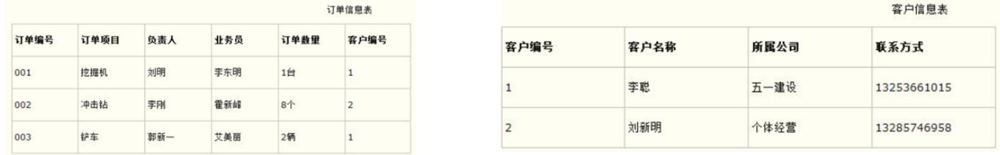

接下来看关系型数据库的优点：

💎都是使用表结构，格式一致，易于维护。

💎使用通用的 SQL 语言操作，使用方便，可用于复杂查询。

🔹关系型数据库都可以通过SQL进行操作，所以使用方便。

🔹复杂查询。现在需要查询001号订单数据，我们可以看到该订单是1号客户的订单，而1号订单

是李聪这个客户。以后也可以在一张表中进行统计分析等操作。

💎数据存储在磁盘中，安全。

数据模型：


如上图，我们通过客户端可以通过数据库管理系统创建数据库，在数据库中创建表，在表中添加数据。创建的每一个数据库对应到磁盘上都是一个文件夹。比如可以通过SQL语句创建一个数据库（数据库名称为db1），语句如下。该语句咱们后面会学习。


我们可以在数据库安装目录下的data目录下看到多了一个 db1 的文件夹。所以，在MySQL中一个数据库对应到磁盘上的一个文件夹。

而一个数据库下可以创建多张表，我们到MySQL中自带的mysql数据库的文件夹目录下：


而上图中右边的 db.frm 是表文件， db.MYD 是数据文件，通过这两个文件就可以查询到数据展示成二维表的效果。

小结：

MySQL中可以创建多个数据库，每个数据库对应到磁盘上的一个文件夹

在每个数据库中可以创建多个表，每张都对应到磁盘上一个 frm 文件

每张表可以存储多条数据，数据会被存储到磁盘中 MYD 文件中

# SQL概述

## 一、SQL概述

💎英文：Structured Query Language，简称 SQL

💎结构化查询语言，一门操作关系型数据库的编程语言

💎定义操作所有关系型数据库的统一标准

💎对于同一个需求，每一种数据库操作的方式可能会存在一些不一样的地方，我们称为“方言”

## 二、通用语法

💎SQL 语句可以单行或多行书写，以分号结尾。


如上，以分号结尾才是一个完整的sql语句。

💎MySQL 数据库的 SQL 语句不区分大小写，关键字建议使用大写。

同样的一条sql语句写成下图的样子，一样可以运行处结果。


💎注释

🔹单行注释: -- 注释内容 或 #注释内容(MySQL 特有）


注意：使用-- 添加单行注释时，--后面一定要加空格，而#没有要求

🔹多行注释: /* 注释 */

## 三、SQL分类

DDL(Data Definition Language) ： 数据定义语言，用来定义数据库对象：数据库，表，列等DDL简单理解就是用来操作数据库，表等


DML(Data Manipulation Language) 数据操作语言，用来对数据库中表的数据进行增删改DML简单理解就对表中数据进行增删改


💎DQL(Data Query Language) 数据查询语言，用来查询数据库中表的记录(数据)

DQL简单理解就是对数据进行查询操作。从数据库表中查询到我们想要的数据。

💎DCL(Data Control Language) 数据控制语言，用来定义数据库的访问权限和安全级别，及创建用户

DML简单理解就是对数据库进行权限控制。比如我让某一个数据库表只能让某一个用户进行操作等。

注意： 以后我们最常操作的是 DML 和 DQL ，因为我们开发中最常操作的就是数据。

# DDL:操作数据库

## 一、查询

查询所有的数据库

1     SHOW DATABASES;

运行上面语句效果如下：


## 二、创建数据库

💎创建数据库：

1   CREATE DATABASE 数据库名称;

运行语句效果如下：


而在创建数据库的时候，我并不知道db1数据库有没有创建，直接再次创建名为db1的数据库就会出现错

误。


为了避免上面的错误，在创建数据库的时候先做判断，如果不存在再创建。

💎创建数据库(判断，如果不存在则创建)

1     CREATE DATABASE IF NOT EXISTS 数据库名称;

运行语句效果如下：


从上面的效果可以看到虽然db1数据库已经存在，再创建db1也没有报错，而创建db2数据库则创建成功。

## 三、删除数据库

💎删除数据库

1    DROP DATABASE 数据库名称;

💎删除数据库(判断，如果存在则删除)

1    DROP DATABASE IF EXISTS 数据库名称;

运行语句效果如下：


## 四、使用数据库

💎使用数据库

1    USE 数据库名称;

💎查看当前使用的数据库

1    SELECT DATABASE();

运行语句效果如下：


# DDL:操作表

## 一、查询表

💎查询当前数据库下所有表名称

1    SHOW TABLES;

我们创建的数据库中没有任何表，因此我们进入mysql自带的mysql数据库，执行上述语句查看


💎查询表结构

1    DESC 表名称;

查看mysql数据库中func表的结构，运行语句如下：


## 二、创建表

💎创建表

```
CREATE TABLE 表名 (
    字段名1 数据类型1,
    字段名2 数据类型2,
    …字段名n 数据类型n
);
```

注意：最后一行末尾，不能加逗号

## 三、数据类型

MySQL 支持多种类型，可以分为三类：

💎数值

```
tinyint : 小整数型，占一个字节
int ： 大整数类型，占四个字节
    eg ： age in
tdouble ： 浮点类型
    使用格式： 字段名 double(总长度,小数点后保留的位数)
    eg ： score double(5,2)
```

💎日期

```
date ： 日期值。只包含年月日
    eg ：birthday date ；
datetime ： 混合日期和时间值。包含年月日时分秒
```

💎字符串

```
char ： 定长字符串。
    优点：存储性能高
    缺点：浪费空间
    eg ： name char(10) 如果存储的数据字符个数不足10个，也会占10个的空间
varchar ： 变长字符串。
    优点：节约空间
    缺点：存储性能底
    eg ： name varchar(10) 如果存储的数据字符个数不足10个，那就数据字符个数是几就占几个的空间
```

其他类型：

[MySQL数据类型.xlsx](youdaonote-attachments/WEBRESOURCE8ca6d131bb3bb89ba550d6a821fdbcdbMySQL数据类型.xlsx)

## 四、删除表

💎删除表

1     DROP TABLE 表名;

💎删除表时判断表是否存在

1     DROP TABLE IF EXISTS 表名;

运行语句效果如下：


## 五、修改表

💎修改表

```
ALTER TABLE 表名 RENAME TO 新的表名;
-- 将表名student修改为stu
alter table student rename to stu;
```

💎添加一列

```
ALTER TABLE 表名 ADD 列名 数据类型;
-- 给stu表添加一列address，该字段类型是varchar(50)
alter table stu add address varchar(50);
```

💎修改数据类型

```
ALTER TABLE 表名 MODIFY 列名 新数据类型;
-- 将stu表中的address字段的类型改为 char(50)
alter table stu modify address char(50);
```

💎修改列名和数据类型

```
ALTER TABLE 表名 CHANGE 列名 新列名 新数据类型;
-- 将stu表中的address字段名改为 addr，类型改为varchar(50)
alter table stu change address addr varchar(50);
```

💎删除列

```
ALTER TABLE 表名 DROP 列名;
-- 将stu表中的addr字段删除
alter table stu drop addr;
```

# DML

## 一、添加数据

💎给指定列添加数据

1    INSERT INTO 表名(列名1,列名2,…) VALUES(值1,值2,…);

💎给全部列添加数据

1    INSERT INTO 表名 VALUES(值1,值2,…);

💎批量添加数据

```
INSERT INTO 表名(列名1,列名2,…) VALUES(值1,值2,…),(值1,值2,…),(值1,值2,…)…;
INSERT INTO 表名 VALUES(值1,值2,…),(值1,值2,…),(值1,值2,…)…;
```

## 二、 修改数据

💎修改表数据

UPDATE 表名 SET 列名1=值1,列名2=值2,… [WHERE 条件] ;

注意：

1. 修改语句中如果不加条件，则将所有数据都修改！

2. 像上面的语句中的中括号，表示在写sql语句中可以省略这部分

## 三、删除数据

💎删除数据

DELETE FROM 表名 [WHERE 条件] ;

# DQL

## 一、基础查询

💎查询多个字段

```
SELECT 字段列表 FROM 表名;
SELECT * FROM 表名; -- 查询所有数据
```

💎去除重复记录

```
SELECT DISTINCT 字段列表 FROM 表名;
```

💎起别名

```
AS: AS 也可以省略
```

## 二、条件查询

💎语法

 SELECT 字段列表 FROM 表名 WHERE 条件列表;

💎条件

条件列表可以使用以下运算符


## 三、模糊查询

模糊查询使用like关键字，可以使用通配符进行占位:

（1）_ : 代表单个任意字符

（2）% : 代表任意个数字符

eg:

查询姓'马'的学员信息

select * from stu where name like '马%';

## 四、排序查询

💎语法

SELECT 字段列表 FROM 表名 ORDER BY 排序字段名1 [排序方式1],排序字段名2 [排序方式2] …;

上述语句中的排序方式有两种，分别是：

🔹ASC ： 升序排列 （默认值）

🔹DESC ： 降序排列

注意：如果有多个排序条件，当前边的条件值一样时，才会根据第二条件进行排序

## 五、聚合函数

💎概念

将一列数据作为一个整体，进行纵向计算。

💎聚合函数分类

| 函数名 | 功能 |
| - | - |
| count(列名) | 统计数量（一般选用不为null的列） |
| max(列名)  | 最大值 |
| min(列名) | 最小值 |
| sum(列名) | 求和 |
| avg(列名) | avg(列名) |


💎语法

SELECT 聚合函数名(列名) FROM 表;

注意：null 值不参与所有聚合函数运算

## 六、分组查询

 	💎语法

```
 SELECT 字段列表 FROM 表名 [WHERE 分组前条件限定] GROUP BY 分组字段名 [HAVING 分组后条件过滤];
```

注意：分组之后，查询的字段为聚合函数和分组字段，查询其他字段无任何意义

## 七、分页查询

💎语法

SELECT 字段列表 FROM 表名 LIMIT 起始索引 , 查询条目数;

注意： 上述语句中的起始索引是从0开始

# 约束

## 一、概念

💎约束是作用于表中列上的规则，用于限制加入表的数据

例如：我们可以给id列加约束，让其值不能重复，不能为null值。

💎约束的存在保证了数据库中数据的正确性、有效性和完整性

添加约束可以在添加数据的时候就限制不正确的数据，年龄是3000，数学成绩是-5分这样无效的数据，继

而保障数据的完整性。

## 二、分类

💎非空约束： 关键字是 NOT NULL

保证列中所有的数据不能有null值。

例如：id列在添加 马花疼 这条数据时就不能添加成功。

💎唯一约束：关键字是 UNIQUE

保证列中所有数据各不相同。

例如：id列中三条数据的值都是1，这样的数据在添加时是绝对不允许的。

💎主键约束： 关键字是 PRIMARY KEY

主键是一行数据的唯一标识，要求非空且唯一。一般我们都会给没张表添加一个主键列用来唯一标识数

据。

例如：上图表中id就可以作为主键，来标识每条数据。那么这样就要求数据中id的值不能重复，不能为null

值。

💎检查约束： 关键字是 CHECK

保证列中的值满足某一条件。

例如：我们可以给age列添加一个范围，最低年龄可以设置为1，最大年龄就可以设置为300，这样的数据

才更合理些。

注意：MySQL不支持检查约束。

💎默认约束： 关键字是 DEFAULT

保存数据时，未指定值则采用默认值。

例如：我们在给english列添加该约束，指定默认值是0，这样在添加数据时没有指定具体值时就会采用默

认给定的0。

💎外键约束： 关键字是 FOREIGN KEY

外键用来让两个表的数据之间建立链接，保证数据的一致性和完整性。

## 三、非空约束

💎概念

非空约束用于保证列中所有数据不能有NULL值

💎语法

🔹添加约束

```
-- 创建表时添加非空约束
CREATE TABLE 表名(
列名 数据类型 NOT NULL,
…
);
```

```
-- 建完表后添加非空约束
ALTER TABLE 表名 MODIFY 字段名 数据类型 NOT NULL;
```

🔹删除约束

ALTER TABLE 表名 MODIFY 字段名 数据类型;

## 四、唯一约束

💎概念

唯一约束用于保证列中所有数据各不相同

💎语法

🔹创建表时添加唯一约束

```
CREATE TABLE 表名(
    列名 数据类型 UNIQUE [AUTO_INCREMENT],
    -- AUTO_INCREMENT: 当不指定值时自动增长
    …
);
CREATE TABLE 表名(
    列名 数据类型,
    …
    [CONSTRAINT] [约束名称] UNIQUE(列名)
);
```

🔹建完表后添加唯一约束

```
ALTER TABLE 表名 MODIFY 字段名 数据类型 UNIQUE;
```

🔹删除约束

ALTER TABLE 表名 DROP INDEX 字段名;

## 五、主键约束

💎概念

主键是一行数据的唯一标识，要求非空且唯一

一张表只能有一个主键

💎语法

🔹创建表时添加主键约束

```
CREATE TABLE 表名 (
	列名 数据类型 PRIMARY KEY [ AUTO_INCREMENT ], …
);

CREATE TABLE 表名 (
	列名 数据类型,
	[ CONSTRAINT ] [ 约束名称 ] PRIMARY KEY (列名)
);
```

🔹建完表后添加主键约束

```
ALTER TABLE 表名 ADD PRIMARY KEY(字段名);
```

🔹删除约束

ALTER TABLE 表名 DROP PRIMARY KEY;

## 六、默认约束

💎概念

保存数据时，未指定值则采用默认值

💎语法

🔹创建表时添加默认约束

```
CREATE TABLE 表名 (
	列名 数据类型 DEFAULT 默认值,
	…
);
```

🔹建完表后添加默认约束

```
ALTER TABLE 表名 ALTER 列名 SET DEFAULT 默认值;
```

🔹删除约束

ALTER TABLE 表名 ALTER 列名 DROP DEFAULT;

## 七、外键约束

💎概述

外键用来让两个表的数据之间建立链接，保证数据的一致性和完整性。

如何理解上面的概念呢？如下图有两张表，员工表和部门表：


员工表中的dep_id字段是部门表的id字段关联，也就是说1号学生张三属于1号部门研发部的员工。现在我要删除1号部门，就会出现错误的数据（员工表中属于1号部门的数据）。而我们上面说的两张表的关系只是我们认为它们有关系，此时需要通过外键让这两张表产生数据库层面的关系，这样你要删除部门表中的1号部门的数据将无法删除。

💎语法

🔹创建表时添加外键约束

```
CREATE TABLE 表名 (
	列名 数据类型,
	… [ CONSTRAINT ] [ 外键名称 ] FOREIGN KEY (外键列名) REFERENCES 主表 (主表列名)
);
```

🔹建完表后添加外键约束

```
ALTER TABLE 表名 ADD CONSTRAINT 外键名称 FOREIGN KEY (外键字段名称) REFERENCES 主表名称(主表列名称);
```

🔹删除外键约束

```
ALTER TABLE 表名 DROP FOREIGN KEY 外键名称;
```

# 数据库设计

## 一、数据库设计

💎软件的研发步骤


💎数据库设计概念

🔹数据库设计就是根据业务系统的具体需求，结合我们所选用的DBMS，为这个业务系统构造出最优

的数据存储模型。

🔹建立数据库中的表结构以及表与表之间的关联关系的过程。

🔹有哪些表？表里有哪些字段？表和表之间有什么关系？

💎数据库设计的步骤

🔹需求分析（数据是什么? 数据具有哪些属性? 数据与属性的特点是什么）

🔹逻辑分析（通过ER图对数据库进行逻辑建模，不需要考虑我们所选用的数据库管理系统）

如下图就是ER(Entity/Relation)图：


🔹物理设计（根据数据库自身的特点把逻辑设计转换为物理设计）

🔹维护设计（1.对新的需求进行建表；2.表优化）

💎表关系

🔹一对一

如：用户 和 用户详情

一对一关系多用于表拆分，将一个实体中经常使用的字段放一张表，不经常使用的字段放另一张

表，用于提升查询性能


上图左边是用户的详细信息，而我们真正在展示用户信息时最长用的则是上图右边红框所示，所

以我们会将详细信息查分成两周那个表。

🔹一对多

如：部门 和 员工

一个部门对应多个员工，一个员工对应一个部门。如下图：


🔹多对多

如：商品 和 订单

一个商品对应多个订单，一个订单包含多个商品。

## 二、表关系(一对多)

💎一对多

如：部门 和 员工

一个部门对应多个员工，一个员工对应一个部门。

💎实现方式

在多的一方建立外键，指向一的一方的主键

## 三、表关系(多对多)

💎多对多

如：商品 和 订单

一个商品对应多个订单，一个订单包含多个商品

💎实现方式

建立第三张中间表，中间表至少包含两个外键，分别关联两方主键


## 四、表关系(一对一)

💎一对一

如：用户 和 用户详情

一对一关系多用于表拆分，将一个实体中经常使用的字段放一张表，不经常使用的字段放另一张表，

用于提升查询性能

💎实现方式

在任意一方加入外键，关联另一方主键，并且设置外键为唯一(UNIQUE)


# 多表查询

## 一、内连接查询

💎语法

```
-- 隐式内连接
SELECT 字段列表 FROM 表1,表2… WHERE 条件;
-- 显示内连接
SELECT 字段列表 FROM 表1 [INNER] JOIN 表2 ON 条件;
```

内连接相当于查询 A B 交集数据


## 二、外连接查询

💎语法

```
-- 左外连接
SELECT 字段列表 FROM 表1 LEFT [OUTER] JOIN 表2 ON 条件;
-- 右外连接
SELECT 字段列表 FROM 表1 RIGHT [OUTER] JOIN 表2 ON 条件;
```

左外连接：相当于查询A表所有数据和交集部分数据

右外连接：相当于查询B表所有数据和交集部分数据


## 三、子查询

💎概念

查询中嵌套查询，称嵌套查询为子查询。

什么是查询中嵌套查询呢？我们通过一个例子来看：

需求：查询工资高于猪八戒的员工信息。

来实现这个需求，我们就可以通过二步实现，第一步：先查询出来 猪八戒的工资

select salary from emp where name = '猪八戒'

第二步：查询工资高于猪八戒的员工信息

select * from emp where salary > 3600;

嵌套查询

select * from emp where salary > (select salary from emp where name = '猪八戒');

💎子查询根据查询结果不同，作用不同

🔹子查询语句结果是单行单列，子查询语句作为条件值，使用 = != > < 等进行条件判断

🔹子查询语句结果是多行单列，子查询语句作为条件值，使用 in 等关键字进行条件判断

🔹子查询语句结果是多行多列，子查询语句作为虚拟表

# 事务

## 一、事务

💎概述

🔹数据库的事务（Transaction）是一种机制、一个操作序列，包含了一组数据库操作命令。

🔹事务把所有的命令作为一个整体一起向系统提交或撤销操作请求，即这一组数据库命令要么同时成

功，要么同时失败。

🔹事务是一个不可分割的工作逻辑单元。

💎语法

🔹开启事务

```
START TRANSACTION;
或者
BEGIN;
```

🔹提交事务

 commit;

🔹回滚事务

rollback;

## 二、事务的四大特征

原子性（Atomicity）: 事务是不可分割的最小操作单位，要么同时成功，要么同时失败

一致性（Consistency） :事务完成时，必须使所有的数据都保持一致状态

隔离性（Isolation） :多个事务之间，操作的可见性

持久性（Durability） :事务一旦提交或回滚，它对数据库中的数据的改变就是永久的

说明：

mysql中事务是自动提交的。

也就是说我们不添加事务执行sql语句，语句执行完毕会自动的提交事务。

可以通过下面语句查询默认提交方式：

SELECT @@autocommit;

查询到的结果是1 则表示自动提交，结果是0表示手动提交。当然也可以通过下面语句修改提交方式

set @@autocommit = 0

# JDBC

## 一、概述

在开发中我们使用的是java语言，那么势必要通过java语言操作数据库中的数据。这就是接下来要学习的	

JDBC。

### 1.概念

JDBC 就是使用Java语言操作关系型数据库的一套API

全称：( Java DataBase Connectivity ) Java 数据库连接


我们开发的同一套Java代码是无法操作不同的关系型数据库，因为每一个关系型数据库的底层实现细节都	

不一样。如果这样，问题就很大了，在公司中可以在开发阶段使用的是MySQL数据库，而上线时公司最终

选用oracle数据库，我们就需要对代码进行大批量修改，这显然并不是我们想看到的。我们要做到的是同

一套Java代码操作不同的关系型数据库，而此时sun公司就指定了一套标准接口（JDBC），JDBC中定义

了所有操作关系型数据库的规则。众所周知接口是无法直接使用的，我们需要使用接口的实现类，而这套

实现类（称之为：驱动）就由各自的数据库厂商给出。

### 2.本质

💎官方（sun公司）定义的一套操作所有关系型数据库的规则，即接口

💎各个数据库厂商去实现这套接口，提供数据库驱动jar包

💎我们可以使用这套接口（JDBC）编程，真正执行的代码是驱动jar包中的实现类

### 3.好处

💎各数据库厂商使用相同的接口，Java代码不需要针对不同数据库分别开发

💎可随时替换底层数据库，访问数据库的Java代码基本不变

💎以后编写操作数据库的代码只需要面向JDBC（接口），操作哪儿个关系型数据库就需要导入该数

据库的驱动包，如需要操作MySQL数据库，就需要再项目中导入MySQL数据库的驱动包。

## 二、JDBC快速入门

先来看看通过Java操作数据库的流程


第一步：编写Java代码

第二步：Java代码将SQL发送到MySQL服务端

第三步：MySQL服务端接收到SQL语句并执行该SQL语句

第四步：将SQL语句执行的结果返回给Java代码

### 1 .编写代码步骤

💎创建工程，导入驱动jar包

💎注册驱动

Class.forName("com.mysql.jdbc.Driver");

💎获取连接

Connection conn =DriverManager.getConnection(url, username,password);

Java代码需要发送SQL给MySQL服务端，就需要先建立连接

💎定义SQL语句

String sql = “update…” ;

💎获取执行SQL对象

执行SQL语句需要SQL执行对象，而这个执行对象就是Statement对象

Statement stmt = conn.createStatement();

💎执行SQL

stmt.executeUpdate(sql);  

💎处理返回结果

💎释放资源

示例代码

mysql

```
CREATE TABLE bank_use(
	usename VARCHAR(20),
	money int
);
INSERT into bank_use VALUES ('张三',2000),('李四',1000);
```

java

```
import java.sql.Connection;
import java.sql.DriverManager;
import java.sql.SQLException;
import java.sql.Statement;

public class demo {
    public static void main(String[] args) throws ClassNotFoundException, SQLException {
        Class.forName("com.mysql.jdbc.Driver");
        Connection coon = DriverManager.getConnection("jdbc:mysql:///db1", "root", "1234");
        String sql="update bank_use set money = 2000 where usename = '李四'";
        Statement stmt = coon.createStatement();
        int i = stmt.executeUpdate(sql);
        System.out.println(i);
        stmt.close();
        coon.close();
    }
}
```

## 三、JDBC API详解

### 1、 DriverManager

💎DriverManager（驱动管理类）作用：

🔹注册驱动

|   |   |   |
| - | - | - |
| static void | registerDriver(Driver driver) | 使用DriverManger注册给定的驱动程序 |


Class.forName("com.mysql.jdbc.Driver")

的源码如下

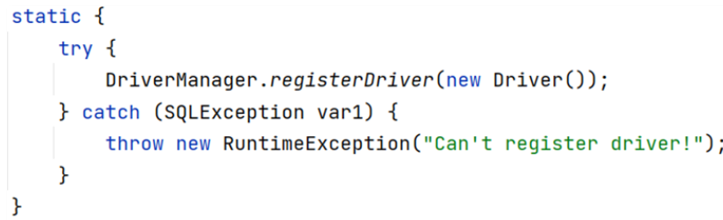


==提示：==

- MySQL 5之后的驱动包，可以省略注册驱动的步骤

- 自动加载jar包中META-INF/services/java.sql.Driver文件中的驱动类

🔹获取数据库连接

|   |   |   |
| - | - | - |
| static Connection | getConnection(String url,Strint user,String password) | 尝试建立与给定数据库的连接 |


参数说明

⚪url:连接路径

- 语法：jdbc:mysql://ip地址(域名):端口号/数据库名称?参数键值对1&参数键值对2…

- 示例：jdbc:mysql://127.0.0.1:3306/db1

- ==细节：==

- 如果连接的是本机mysql服务器，并且mysql服务默认端口是3306，则url可以简写为：jdbc:mysql:///数据库名称?参数键值对

- 配置 useSSL=false 参数，禁用安全连接方式，解决警告提示

⚪user:用户名

⚪password:密码

### 2、Connection

💎获取执行对象

🔹普通执行SQL对象

Statement createStatement()

🔹预编译SQL的执行SQL对象：防止SQL注入

PreparedStatement  prepareStatement(sql)

🔹执行存储过程的对象

CallableStatement prepareCall(sql)

💎事务管理

MySQL事务管理的操作：

- 开启事务 ： BEGIN; 或者 START TRANSACTION;

- 提交事务 ： COMMIT;

- 回滚事务 ： ROLLBACK;

JDBC事务管理方法

- 开启事务 ：

|   |   |   |
| - | - | - |
| void | setAutoCommit(boolean autoCommit) | 将此连接的自动提交设定为给定状态 |


- 提交事务 ：

|   |   |   |
| - | - | - |
| void | commit | 使自上次提交/回滚以来所做的所有更改都将永久性，并释放此 Connection对象当前持有的任何数据库锁。  |


- 回滚事务 ：

|   |   |   |
| - | - | - |
| void | rollback() | 撤消在当前事务中所做的所有更改，并释放此 Connection对象当前持有的任何数据库锁。 <br> |


💎示例代码

```java
import java.sql.Connection;
import java.sql.DriverManager;
import java.sql.SQLException;
import java.sql.Statement;

public class ConnectionDemo {
    public static void main(String[] args) throws Exception {
        //1、获取链接
        Connection conn = DriverManager.getConnection("jdbc:mysql:///db1?useSSL=false",
                "root", "1234");
        //2定义sql
        String sql1 = "update account set money = 3000 where id = 1";
        String sql2 = "update account set money = 3000 where id = 2";
        //3、获取执行sql的对象
        Statement stmt= conn.createStatement();
        try{
            //开启事务
            conn.setAutoCommit(false);
            //执行sql
            System.out.println(stmt.executeUpdate(sql1));
            //制造异常
            //int i=1/0;
            System.out.println(stmt.executeUpdate(sql2));
            //提交事务
            conn.commit();
        }catch (Exception e){
            //回滚事务
            conn.rollback();
            e.printStackTrace();
        }
        stmt.close();
        conn.close();
    }
}

```

### 3、Statement

💎概述

Statement对象的作用就是用来执行SQL语句。而针对不同类型的SQL语句使用的方法也不一样。

- 执行DDL、DML语句

|   |   |   |
| - | - | - |
| int | executeUpdate(String sql)  | 执行给定的SQL语句，这可能是 INSERT ， UPDATE ，或 <br>DELETE语句，或者不返回任何内容，如SQL DDL语句的SQL语句。  |


- 执行DQL语句

|   |   |   |
| - | - | - |
| ResultSet | executeQuery(String sql)  | 执行给定的SQL语句，该语句返回单个 ResultSet对象。 |


💎示例代码

```java
import org.junit.jupiter.api.Test;

import java.sql.Connection;
import java.sql.DriverManager;
import java.sql.SQLException;
import java.sql.Statement;

public class DMLDQLTest {
    /**
     * 执行DML
     * @throws Exception
     */
    @Test
    public void testDML() throws Exception {
        //1、获取链接
        Connection conn = DriverManager.getConnection("jdbc:mysql:///db1?useSSL=false",
                "root", "1234");
        //2定义sql
        String sql = "update account set money = 3000 where id = 1";
        //3、获取执行sql的对象
        Statement stmt = conn.createStatement();
        System.out.println(stmt.executeUpdate(sql));
        stmt.close();
        conn.close();
    }

    /**
     * 执行DDL
     * @throws Exception
     */
    @Test
    public void testDDL() throws Exception {
        //1、获取链接
        Connection conn = DriverManager.getConnection("jdbc:mysql:///db1?useSSL=false",
                "root", "1234");
        //2定义sql
        String sql = "create database db2";
        //3、获取执行sql的对象
        Statement stmt = conn.createStatement();
        System.out.println(stmt.executeUpdate(sql));
        stmt.close();
        conn.close();
    }
}
```

### 4、ResultSet

💎ResultSet（结果集对象）作用：

- ==封装了SQL查询语句的结果。==

而执行了DQL语句后就会返回该对象，对应执行DQL语句的方法如下：

ResultSet  executeQuery(sql)：执行DQL 语句，返回 ResultSet 对象

那么我们就需要从 ResultSet 对象中获取我们想要的数据。ResultSet对象提供	

了操作查询结果数据的方法，如下：'

> boolean  next()

> 将光标从当前位置向前移动一行 

> 判断当前行是否为有效行

>  方法返回值说明：

> true  ： 有效航，当前行有数据

> false ： 无效行，当前行没有数据


> xxx  getXxx(参数)：获取数据

> xxx : 数据类型；如： int getInt(参数) ；

> String getString(参数)

> 参数

> int类型的参数：列的编号，从1开始

> String类型的参数： 列的名称 

如下图为执行SQL语句后的结果


一开始光标指定于第一行前，如图所示红色箭头指向于表头行。当我们调用了 next() 方法后，光

标就下移到第一行数据，并且方法返回true，此时就可以通过 getInt("id") 获取当前行id字段的

值，也可以通过 getString("name") 获取当前行name字段的值。如果想获取下一行的数据，继续

调用 next()  方法，以此类推。

💎示例代码

```java
import org.junit.jupiter.api.Test;

import java.sql.*;

public class ResultSetDemo {
    @Test
    public void testResultSet() throws SQLException {
        //1、获取链接
        Connection conn = DriverManager.getConnection("jdbc:mysql:///db1?useSSL=false",
                "root", "1234");
        //2定义sql
        String sql = "select * from account";
        //3、获取执行sql的对象
        Statement stmt = conn.createStatement();
        //4、执行sql
        ResultSet rs = stmt.executeQuery(sql);
        //5、处理结果
        /*
        // 5.1 光标向下移动一行，并且判断当前行是否有数据
        while (rs.next()){
            //5.2 获取数据  getXxx()
            int id = rs.getInt(1);
            String name = rs.getString(2);
            double money = rs.getDouble(3);
            System.out.println(id);
            System.out.println(name);
            System.out.println(money);
            System.out.println("--------------");
        }
        //*/
        // 5.1 光标向下移动一行，并且判断当前行是否有数据
        while (rs.next()){
            //5.2 获取数据  getXxx()
            int id = rs.getInt("id");
            String name = rs.getString("name");
            double money = rs.getDouble("money");
            System.out.println(id);
            System.out.println(name);
            System.out.println(money);
            System.out.println("--------------");
        }
        //6. 释放资源
        rs.close();
        stmt.close();
        conn.close();
    }
}

```

### 5、PreparedStatement

💎PreparedStatement概述

PreparedStatement作用：

- 预编译SQL语句并执行：预防SQL注入问题

🔹获取 PreparedStatement 对象

```java
// SQL语句中的参数值，使用？占位符替代
String sql = "select * from user where username = ? and password = ?";
// 通过Connection对象获取，并传入对应的sql语句
PreparedStatement pstmt = conn.prepareStatement(sql);
```

🔹设置参数值

上面的sql语句中参数使用 ? 进行占位，在执行之前要设置这些 ?  的值。

> PreparedStatement对象：setXxx(参数1，参数2)：给 ? 赋值

> Xxx：数据类型 ； 如 setInt (参数1，参数2)

> 参数：

> 参数1： ？的位置编号，从1 开始

> 参数2： ？的值

> 

🔹执行SQL语句

> executeUpdate();  执行DDL语句和DML语句

> executeQuery();  执行DQL语句

> ==注意：==

> 调用这两个方法时不需要传递SQL语句，因为获取SQL语句执行对象时已经对SQL语句进行预编译了。

💎PreparedStatement原理

PreparedStatement 好处：

- 预编译SQL，性能更高

- 防止SQL注入：==将敏感字符进行转义==


Java代码操作数据库流程如图所示：

- 将sql语句发送到MySQL服务器端

- MySQL服务端会对sql语句进行如下操作

- 检查SQL语句检查SQL语句的语法是否正确。

- 编译SQL语句。将SQL语句编译成可执行的函数。检查SQL和编译SQL花费的时间比执行SQL的时间还要长。如果我们只是重新设置参数，那么检查SQL语句和编译SQL语句将不需要重复执行。这样就提高了性能。

- 执行SQL语句

PreparedStatement又是如何解决SQL注入？它是将特殊字符进行了转义，转义的SQL如

下：

select * from tb_user where username = 'sjdljfld' and password = ''or '1' = '1'

# 数据库连接池

## 一、 数据库连接池简介

- 数据库连接池是个容器，负责分配、管理数据库连接(Connection)

- 它允许应用程序重复使用一个现有的数据库连接，而不是再重新建立一个；

- 释放空闲时间超过最大空闲时间的数据库连接来避免因为没有释放数据库连接而引起的数据库连接遗漏

- 好处

- 资源重用

- 提升系统响应速度

- 避免数据库连接遗漏

之前我们代码中使用连接是没有使用都创建一个Connection对象，使用完毕就会将其销毁。这样重复

创建销毁的过程是特别耗费计算机的性能的及消耗时间的。

而数据库使用了数据库连接池后，就能达到Connection对象的复用，如下图


连接池是在一开始就创建好了一些连接（Connection）对象存储起来。用户需要连接数据库时，不需

要自己创建连接，而只需要从连接池中获取一个连接进行使用，使用完毕后再将连接对象归还给连接

池；这样就可以起到资源重用，也节省了频繁创建连接销毁连接所花费的时间，从而提升了系统响应

的速度。

## 二、数据库连接池实现

- 标准接口：==DataSource==

官方(SUN) 提供的数据库连接池标准接口，由第三方组织实现此接口。该接口提供了获取连接的

功能：

Connection getConnection()

那么以后就不需要通过 DriverManager 对象获取 Connection 对象，而是通过连接池

（DataSource）获取 Connection 对象。

- 常见的数据库连接池

- DBCP

- C3P0

- Druid

我们现在使用更多的是Druid，它的性能比其他两个会好一些。

- Druid（德鲁伊）

- Druid连接池是阿里巴巴开源的数据库连接池项目 

- 功能强大，性能优秀，是Java语言最好的数据库连接池之一

## 三、Driud使用

> 导入jar包 druid-1.1.12.jar

> 定义配置文件

> 加载配置文件

> 获取数据库连接池对象

> 获取连接

💎示例代码

```java
import com.alibaba.druid.pool.DruidDataSourceFactory;

import javax.sql.DataSource;
import java.io.FileInputStream;
import java.io.FileNotFoundException;
import java.io.IOException;
import java.sql.Connection;
import java.util.Properties;

public class DruidDemo {
    public static void main(String[] args) throws Exception {
        //1、导入jar包
        //2、定义配置文件
        //3、加载配置文件
        Properties prop = new Properties();
        prop.load(new FileInputStream("jdbc_demo/druid.properties"));
        //4、获取连接池对象
        DataSource dataSource = DruidDataSourceFactory.createDataSource(prop);
        //5、获取数据库连接 Connection
        Connection connection = dataSource.getConnection();
        System.out.println(connection); //获取到了连接后就可以继续做其他操作了
        //System.out.println(System.getProperty("user.dir"));

    }
}

```

[JDBC.zip](youdaonote-attachments/WEBRESOURCE708140621329ffebaeff3fc6338769f3JDBC.zip)

# Maven

## 一、Maven简介

### 1、maven模型

- 项目对象模型 (Project Object Model)

- 依赖管理模型(Dependency)

- 插件(Plugin)

### 2、 仓库

仓库分类：

- 本地仓库：自己计算机上的一个目录

- 中央仓库：由Maven团队维护的全球唯一的仓库

- 地址： https://repo1.maven.org/maven2/

- 远程仓库(私服)：一般由公司团队搭建的私有仓库今天我们只学习远程仓库的使用，并不会搭建。

当项目中使用坐标引入对应依赖jar包后，首先会查找本地仓库中是否有对应的jar包：

- 如果有，则在项目直接引用;

- 如果没有，则去中央仓库中下载对应的jar包到本地仓库。

## 二、Maven基本使用

### 1、Maven 常用命令

- compile ：编译

- clean：清理

- test：测试

- package：打包

- install：安装

### 2、Maven 生命周期

Maven 构建项目生命周期描述的是一次构建过程经历经历了多少个事件

Maven 对项目构建的生命周期划分为3套：

- clean ：清理工作。

- default ：核心工作，例如编译，测试，打包，安装等。

- site ： 产生报告，发布站点等。这套声明周期一般不会使用。

同一套生命周期内，执行后边的命令，前面的所有命令会自动执行。例如默认（default）生命周期如

下：


当我们执行 install（安装）命令时，它会先执行 compile命令，再执行 test 命令，再执行 package 命

令，最后执行 install 命令。

当我们执行 package （打包）命令时，它会先执行 compile 命令，再执行 test 命令，最后执行 

package 命令。

默认的生命周期也有对应的很多命令，其他的一般都不会使用，我们只关注常用的：


## 三、IDEA使用Maven

Maven 坐标详解	

什么是坐标？

- Maven 中的坐标是==资源的唯一标识==

- 使用坐标来定义项目或引入项目中需要的依赖

Maven 坐标主要组成

- groupId：定义当前Maven项目隶属组织名称（通常是域名反写，例如：com.itheima）		

- artifactId：定义当前Maven项目名称（通常是模块名称，例如 order-service、goods-service）

- version：定义当前项目版本号

## 四、依赖管理

### 1、使用坐标引入jar包

使用坐标引入jar包的步骤：

- 在项目的 pom.xml 中编写 <dependencies> 标签

- 在 <dependencies> 标签中 使用 <dependency> 引入坐标

- 定义坐标的 groupId，artifactId，version


- 点击刷新按钮，使坐标生效

注意：

- 具体的坐标我们可以到如下网站进行搜索

- https://mvnrepository.com/

快捷方式导入jar包的坐标：

每次需要引入jar包，都去对应的网站进行搜索是比较麻烦的，接下来给大家介绍一种快捷引入坐

标的方式

- 在 pom.xml 中 按 alt + insert，选择 Dependency


- 在弹出的面板中搜索对应坐标，然后双击选中对应坐标	


- 点击刷新按钮，使坐标生效

### 2 、依赖范围

通过设置坐标的依赖范围(scope)，可以设置 对应jar包的作用范围：编译环境、测试环境、运行环

境。

如下图所示给 junit 依赖通过 scope 标签指定依赖的作用范围。 那么这个依赖就只能作用在测试环

境，其他环境下不能使用。


那么 scope 都可以有哪些取值呢？

| 依赖范围 | 编译classpath | 测试classpath | 运行classpath | 例子 |
| - | - | - | - | - |
| compile | Y | Y | Y | logback |
| test | - | Y | - | Junit |
| provided | Y | Y | - | servlet-api |
| runtime | - | Y | Y | jdbc驱动 |
| system | Y | Y | - | 存储在本地的jar包 |


- compile ：作用于编译环境、测试环境、运行环境。

- test ： 作用于测试环境。典型的就是Junit坐标，以后使用Junit时，都会将scope指定为该值

- provided ：作用于编译环境、测试环境。我们后面会学习 servlet-api ，在使用它时，必须将 scope 设置为该值，不然运行时就会报错

- runtime  ： 作用于测试环境、运行环境。jdbc驱动一般将 scope 设置为该值，当然不设置也没有任何问题

> 注意：

> 如果引入坐标不指定 scope 标签时，默认就是 compile  值。以后大部分jar包都是使用默认值。

# Mybatis

## 一、Mybatis概述

### 1、Mybatis概念

- MyBatis 是一款优秀的==持久层框架==，用于简化 JDBC 开发

- MyBatis 本是 Apache 的一个开源项目iBatis, 2010年这个项目由apache software foundation 迁移到了google code，并且改名为MyBatis 。2013年11月迁移到Github

- 官网：https://mybatis.org/mybatis-3/zh/index.html 

持久层：

- 负责将数据到保存到数据库的那一层代码。	

- JavaEE三层架构：表现层、业务层、持久

框架：

- 框架就是一个半成品软件，是一套可重用的、通用的、软件基础代码模型

- 在框架的基础之上构建软件编写更加高效、规范、通用、可扩展

### 2、 JDBC 缺点


- 硬编码

- 注册驱动、获取连接

上图标1的代码有很多字符串，而这些是连接数据库的四个基本信息，以后如果要将Mysql数

据库换成其他的关系型数据库的话，这四个地方都需要修改，如果放在此处就意味着要修改

我们的源代码。

- SQL语句

上图标2的代码。如果表结构发生变化，SQL语句就要进行更改。这也不方便后期的维护。

- 操作繁琐

- 手动设置参数

- 手动封装结果集

上图标4的代码是对查询到的数据进行封装，而这部分代码是没有什么技术含量，而且特别耗

费时间的。

### 4、Mybatis 优化

- 硬编码可以配置到==配置文件==

- 操作繁琐的地方mybatis都==自动完成==

如图所示

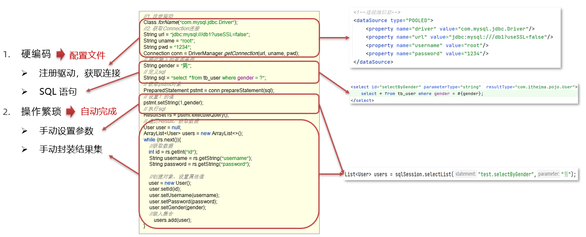

## 二、Mybatis快速入门

- 创建user表，添加数据

```sql
create database mybatis;
use mybatis;

drop table if exists tb_user;

create table tb_user(
	id int primary key auto_increment,
	username varchar(20),
	password varchar(20),
	gender char(1),
	addr varchar(30)
);

INSERT INTO tb_user VALUES (1, 'zhangsan', '123', '男', '北京');
INSERT INTO tb_user VALUES (2, '李四', '234', '女', '天津');
INSERT INTO tb_user VALUES (3, '王五', '11', '男', '西安');
```

- 创建模块，导入坐标

在创建好的模块中的 pom.xml 配置文件中添加依赖的坐标

```xml
<?xml version="1.0" encoding="UTF-8"?>
<project xmlns="http://maven.apache.org/POM/4.0.0"
         xmlns:xsi="http://www.w3.org/2001/XMLSchema-instance"
         xsi:schemaLocation="http://maven.apache.org/POM/4.0.0 http://maven.apache.org/xsd/maven-4.0.0.xsd">
    <modelVersion>4.0.0</modelVersion>

    <groupId>org.example</groupId>
    <artifactId>mybatis_demo</artifactId>
    <version>1.0-SNAPSHOT</version>
    <dependencies>
        <dependency>
            <groupId>org.mybatis</groupId>
            <artifactId>mybatis</artifactId>
            <version>3.5.5</version>
        </dependency>
        <dependency>
            <groupId>mysql</groupId>
            <artifactId>mysql-connector-java</artifactId>
            <version>5.1.46</version>
        </dependency>
        <!--junit 单元测试-->
        <dependency>
            <groupId>junit</groupId>
            <artifactId>junit</artifactId>
            <version>4.13</version>
            <scope>test</scope>
        </dependency>

        <!-- 添加slf4j日志api -->
        <dependency>
            <groupId>org.slf4j</groupId>
            <artifactId>slf4j-api</artifactId>
            <version>1.7.20</version>
        </dependency>
        <!-- 添加logback-classic依赖 -->
        <dependency>
            <groupId>ch.qos.logback</groupId>
            <artifactId>logback-classic</artifactId>
            <version>1.2.3</version>
        </dependency>
        <!-- 添加logback-core依赖 -->
        <dependency>
            <groupId>ch.qos.logback</groupId>
            <artifactId>logback-core</artifactId>
            <version>1.2.3</version>
        </dependency>
    </dependencies>

</project>
```

注意：需要在项目的 resources 目录下创建logback的配置文件

- 编写 MyBatis 核心配置文件 -- > 替换连接信息 解决硬编码问题

在模块下的 resources 目录下创建mybatis的配置文件 mybatis-config.xml，内容如下：

```xml
<?xml version="1.0" encoding="UTF-8" ?>
<!DOCTYPE configuration
        PUBLIC "-//mybatis.org//DTD Config 3.0//EN"
        "http://mybatis.org/dtd/mybatis-3-config.dtd">
<configuration>

    <typeAliases>
        <package name="pojo"/>
    </typeAliases>

    <!--
    environments：配置数据库连接环境信息。可以配置多个environment，通过default属性切换不同的environment
    -->
    <environments default="development">
        <environment id="development">
            <transactionManager type="JDBC"/>
            <dataSource type="POOLED">
                <!--数据库连接信息-->
                <property name="driver" value="com.mysql.jdbc.Driver"/>
                <property name="url" value="jdbc:mysql:///mybatis?useSSL=false"/>
                <property name="username" value="root"/>
                <property name="password" value="1234"/>
            </dataSource>
        </environment>

        <environment id="test">
            <transactionManager type="JDBC"/>
            <dataSource type="POOLED">
                <!--数据库连接信息-->
                <property name="driver" value="com.mysql.jdbc.Driver"/>
                <property name="url" value="jdbc:mysql:///mybatis?useSSL=false"/>
                <property name="username" value="root"/>
                <property name="password" value="1234"/>
            </dataSource>
        </environment>
    </environments>
    <mappers>
        <!--加载sql映射文件-->
        <mapper resource="pojo/UserMapper.xml"/>
    </mappers>
</configuration>
```

- 编写 SQL 映射文件 --> 统一管理sql语句，解决硬编码问题

在模块的 resources 目录下创建映射配置文件 UserMapper.xml，内容如下：

```xml
<?xml version="1.0" encoding="UTF-8" ?>
<!DOCTYPE mapper PUBLIC "-//mybatis.org//DTD Mapper 3.0//EN" "http://mybatis.org/dtd/mybatis-3-mapper.dtd">
<mapper namespace="test">
    <select id="selectAll" resultType="pojo.User">
        select * from tb_user;
    </select>
</mapper>
```

- 编码

- 在 com.itheima.pojo 包下创建 User类

```java
package pojo;

public class User {
    private int id;
    private String username;
    private String password;
    private String gender;
    private String addr;

    public int getId() {
        return id;
    }

    public void setId(int id) {
        this.id = id;
    }

    public String getUsername() {
        return username;
    }

    public void setUsername(String username) {
        this.username = username;
    }

    public String getPassword() {
        return password;
    }

    public void setPassword(String password) {
        this.password = password;
    }

    public String getGender() {
        return gender;
    }

    public void setGender(String gender) {
        this.gender = gender;
    }

    public String getAddr() {
        return addr;
    }

    public void setAddr(String addr) {
        this.addr = addr;
    }

    @Override
    public String toString() {
        return "User{" +
                "id=" + id +
                ", username='" + username + '\'' +
                ", password='" + password + '\'' +
                ", gender='" + gender + '\'' +
                ", addr='" + addr + '\'' +
                '}';
    }
}

```

- 在 com.itheima 包下编写 MybatisDemo 测试类

```java
package test;

import org.apache.ibatis.io.Resources;
import org.apache.ibatis.session.SqlSession;
import org.apache.ibatis.session.SqlSessionFactory;
import org.apache.ibatis.session.SqlSessionFactoryBuilder;
import pojo.User;

import java.io.IOException;
import java.io.InputStream;
import java.util.List;

public class MyBatisDemo {
    public static void main(String[] args) throws IOException {
        //1. 加载mybatis的核心配置文件，获取 SqlSessionFactory
        String resource = "mybatis-config.xml";
        InputStream inputStream = Resources.getResourceAsStream(resource);
        SqlSessionFactory sqlSessionFactory = new SqlSessionFactoryBuilder().build(inputStream);
        //2. 获取SqlSession对象，用它来执行sql
        SqlSession sqlSession = sqlSessionFactory.openSession();
        //3. 执行sql
        List<User> users = sqlSession.selectList("test.selectAll"); //参数是一个字符串，该字符串必须是映射配置文件的namespace.id
        System.out.println(users);
        //4. 释放资源
        sqlSession.close();
    }
}

```

## 三、 Mapper代理开发

### 1、Mapper代理开发概述

之前我们写的代码是基本使用方式，它也存在硬编码的问题，如下：


这里调用 selectList() 方法传递的参数是映射配置文件中的 namespace.id值。这样写也不便于后期的

维护。如果使用 Mapper 代理方式（如下图）则不存在硬编码问题。


通过上面的描述可以看出 Mapper 代理方式的目的：

- 解决原生方式中的硬编码

- 简化后期执行SQL

###  2、案例代码实现

- 在 com.itheima.mapper 包下创建 UserMapper接口，代码如下：

```java
package mapper;

import pojo.User;

import java.util.List;

public interface UserMapper {
    public List<User> selectAll() ;
}

```

- 在 resources 下创建 com/itheima/mapper 目录，并在该目录下创建 UserMapper.xml 映射配置文件

```xml
<?xml version="1.0" encoding="UTF-8" ?>
<!DOCTYPE mapper PUBLIC "-//mybatis.org//DTD Mapper 3.0//EN" "http://mybatis.org/dtd/mybatis-3-mapper.dtd">
<mapper namespace="mapper.UserMapper">
    <select id="selectAll" resultType="pojo.User">
        select * from tb_user;
    </select>
</mapper>
```

- 在 com.itheima 包下创建 MybatisDemo2 测试类，代码如下：

```java
package test;

import mapper.UserMapper;
import org.apache.ibatis.io.Resources;
import org.apache.ibatis.session.SqlSession;
import org.apache.ibatis.session.SqlSessionFactory;
import org.apache.ibatis.session.SqlSessionFactoryBuilder;
import pojo.User;

import java.io.IOException;
import java.io.InputStream;
import java.util.List;

public class MyBatisDemo {
    public static void main(String[] args) throws IOException {
        //1. 加载mybatis的核心配置文件，获取 SqlSessionFactory
        String resource = "mybatis-config.xml";
        InputStream inputStream = Resources.getResourceAsStream(resource);
        SqlSessionFactory sqlSessionFactory = new SqlSessionFactoryBuilder().build(inputStream);
        //2. 获取SqlSession对象，用它来执行sql
        SqlSession sqlSession = sqlSessionFactory.openSession();
        //3. 执行sql
        UserMapper userMapper = sqlSession.getMapper(UserMapper.class);
        List<User> users = userMapper.selectAll();
        System.out.println(users);
        //4. 释放资源
        sqlSession.close();
    }
}

```

## 四、 核心配置文件


### 1、多环境配置

在核心配置文件的 environments 标签中其实是可以配置多个 environment ，使用 id 给每段

环境起名，在 environments 中使用 default='环境id' 来指定使用哪儿段配置。我们一般就配

置一个 environment 即可。

```xml
<environments default="development">
    <environment id="development">
        <transactionManager type="JDBC"/>
        <dataSource type="POOLED">
            <!--数据库连接信息-->
            <property name="driver" value="com.mysql.jdbc.Driver"/>
            <property name="url" value="jdbc:mysql:///mybatis?useSSL=false"/>
            <property name="username" value="root"/>
            <property name="password" value="1234"/>
        </dataSource>
    </environment>

    <environment id="test">
        <transactionManager type="JDBC"/>
        <dataSource type="POOLED">
            <!--数据库连接信息-->
            <property name="driver" value="com.mysql.jdbc.Driver"/>
            <property name="url" value="jdbc:mysql:///mybatis?useSSL=false"/>
            <property name="username" value="root"/>
            <property name="password" value="1234"/>
        </dataSource>
    </environment>
</environments>=
```

### 2、类型别名

在映射配置文件中的 resultType 属性需要配置数据封装的类型（类的全限定名）。而每次这样写是特

别麻烦的，Mybatis 提供了 类型别名(typeAliases) 可以简化这部分的书写。

首先需要现在核心配置文件中配置类型别名，也就意味着给pojo包下所有的类起了别名（别名就是类

名），不区分大小写。内容如下：

```xml
<typeAliases>
    <!--name属性的值是实体类所在包-->
    <package name="com.itheima.pojo"/> 
</typeAliases>
```

通过上述的配置，我们就可以简化映射配置文件中 resultType 属性值的编写

```xml
<mapper namespace="com.itheima.mapper.UserMapper">
    <select id="selectAll" resultType="user">
        select * from tb_user;
    </select>
</mapper>
```

## 五、解决名称不一致

### 1、起别名

在写sql语句时给这两个字段起别名，将别名定义成和属性名一致即可。

```xml
<select id="selectAll" resultType="brand">
    select
    id, brand_name as brandName, company_name as companyName, ordered, description, status
    from tb_brand;
</select>
```

### 2、SQL片段：

- 将需要复用的SQL片段抽取到 sql 标签中

```xml
<sql id="brand_column">
    id, brand_name as brandName, company_name as companyName, ordered, description, status
</sql>
```

id属性值是唯一标识，引用时也是通过该值进行引用。

- 在原sql语句中进行引用

使用 include 标签引用上述的 SQL 片段，而 refid 指定上述 SQL 片段的id值。

```xml
<select id="selectAll" resultType="brand">
    select
    <include refid="brand_column" />
    from tb_brand;
</select>
```

### 3、resultMap

- 在映射配置文件中使用resultMap定义 字段 和 属性 的映射关系

```xml
<resultMap id="brandResultMap" type="brand">
    <!--
            id：完成主键字段的映射
                column：表的列名
                property：实体类的属性名
            result：完成一般字段的映射
                column：表的列名
                property：实体类的属性名
        -->
    <result column="brand_name" property="brandName"/>
    <result column="company_name" property="companyName"/>
</resultMap>
```

> 注意：在上面只需要定义 字段名 和 属性名 不一样的映射，而一样的则不需要专门定义出来。

- SQL语句正常编写

```xml
<select id="selectAll" resultMap="brandResultMap">
    select *
    from tb_brand;
</select>
```

##  六、动态SQL

Mybatis对动态SQL有很强大的支撑：

> if

> choose (when, otherwise)

> trim (where, set)

> foreach

- if 标签：条件判断

- test 属性：逻辑表达式

- where 标签

- 作用：

- 替换where关键字

- 会动态的去掉第一个条件前的 and 

- 如果所有的参数没有值则不加where关键字

- foreach 标签

用来迭代任何可迭代的对象（如数组，集合）。

- collection 属性：

- mybatis会将数组参数，封装为一个Map集合。

- 默认：array = 数组

- 使用@Param注解改变map集合的默认key的名称

- item 属性：本次迭代获取到的元素。

- separator 属性：集合项迭代之间的分隔符。

foreach 标签不会错误地添加多余的分隔符。也就是最后一次迭代不会加分隔符。

- open 属性：该属性值是在拼接SQL语句之前拼接的语句，只会拼接一次

- close 属性：该属性值是在拼接SQL语句拼接后拼接的语句，只会拼接一次

## 七、Mybatis参数传递

### 1 、多个参数

我们在接口方法中定义多个参数，Mybatis 会将这些参数封装成 Map 集合对象，值就是参数值，而键在没

有使用 @Param 注解时有以下命名规则：

- 以 arg 开头  ：第一个参数就叫 arg0，第二个参数就叫 arg1，以此类推。如：

> map.put("arg0"，参数值1);

> map.put("arg1"，参数值2);

- 以 param 开头 ： 第一个参数就叫 param1，第二个参数就叫 param2，依次类推。如：

> map.put("param1"，参数值1);

> map.put("param2"，参数值2);

在接口方法参数上使用 @Param 注解，Mybatis 会将 arg 开头的键名替换为对应注解的属性值。

代码验证：

- 在 UserMapper 接口中定义如下方法，在 username 参数前加上 @Param 注解

```
User select(@Param("username") String username, String password);
```

Mybatis 在封装 Map 集合时，键名就会变成如下：

> map.put("username"，参数值1);

> map.put("arg1"，参数值2);

> map.put("param1"，参数值1);

> map.put("param2"，参数值2);

### 2 、单个参数

- POJO 类型

直接使用。要求 属性名 和 参数占位符名称 一致

- Map 集合类型

直接使用。要求 map集合的键名 和 参数占位符名称 一致

- Collection 集合类型

Mybatis 会将集合封装到 map 集合中，如下：

> map.put("arg0"，collection集合);

> map.put("collection"，collection集合;

==可以使用 @Param 注解替换map集合中默认的 arg 键名。==

- List 集合类型

Mybatis 会将集合封装到 map 集合中，如下：

> map.put("arg0"，list集合);map.put("collection"，list集合);map.put("list"，list集合);

==可以使用 @Param 注解替换map集合中默认的 arg 键名。==

- Array 类型

Mybatis 会将集合封装到 map 集合中，如下：

> map.put("arg0"，数组);map.put("array"，数组);

==可以使用 @Param 注解替换map集合中默认的 arg 键名。==

- 其他类型

比如int类型，参数占位符名称 叫什么都可以。尽量做到见名知意

## 八、注解实现CRUD

使用注解开发会比配置文件开发更加方便。如下就是使用注解进行开发

```java
@Select(value = "select * from tb_user where id = #{id}")
public User select(int id);
```

> ==注意：==注解是用来替换映射配置文件方式配置的，所以使用了注解，就不需要再映射配置文件中书写对应的 statement

Mybatis 针对 CURD 操作都提供了对应的注解，已经做到见名知意。如下：

- 查询 ：@Select

- 添加 ：@Insert

- 修改 ：@Update

- 删除 ：@Delete

==注意：==在官方文档中 入门 中有这样的一段话：


所以，==注解完成简单功能，配置文件完成复杂功能。==

# HTML

## 一、介绍

HTML 是一门语言，所有的网页都是用HTML 这门语言编写出来的，也就是HTML是用来写网页的，像京东，12306等网站有很多网页。

==HTML(HyperText Markup Language)：超文本标记语言：==

- 超文本：超越了文本的限制，比普通文本更强大。除了文字信息，还可以定义图片、音频、视频等内容

如上图看到的页面，我们除了能看到一些文字，同时也有大量的图片展示；有些网页也有视频，音频

等。这种展示效果超越了文本展示的限制。

- 标记语言：由标签构成的语言

之前学习的XML就是标记语言，由一个一个的标签组成，HTML 也是由标签组成 。我们在浏览器页面

右键可以查看页面的源代码，如下


这些标签不像XML那样可以自定义，==HTML中的标签都是预定义好的，运行在浏览器上并由浏览器解

析，==然后展示出对应的效果。例如我们想在浏览器上展示出图片就需要使用预定义的 img 标签；想展示

可以点击的链接的效果就可以使用预定义的 a 标签等。

HTML 预定义了很多标签，由于我们是Java工程师、是做后端开发，所以不会每个都学习，页面开发是有

专门的前端工程来开发。那为什么我们还要学习呢？在公司中或多或少大家也会涉及到前端开发。

开发流程：

以后我们是通过Java程序从数据库中查询出来数据，然后交给页面进行展示，这样用户就能通过在浏

览器通过页面看到数据。

==W3C标准：==

W3C是万维网联盟，这个组成是用来定义标准的。他们规定了一个网页是由三部分组成，分别是：

- 结构：对应的是 HTML 语言

- 表现：对应的是 CSS 语言

- 行为：对应的是 JavaScript 语言

HTML定义页面的整体结构；CSS是用来美化页面，让页面看起来更加美观；JavaScript可以使网

页动起来，比如轮播图也就是多张图片自动的进行切换等效果。

## 二、快速入门

需求：编写如下图效果的页面


要实现这个页面，我们需要从以下三步进行实现

- 新建文本文件，后缀名改为 .html

页面文件的后缀名是 .html，所以需要该后缀名

- 编写 HTML 结构标签

HTML 是由一个一个的标签组成的，但是它也用于表示结构的标签

```html
<html>
	<head>
    	<title> </title>
    </head>
    <body>
        
    </body>
</html>
```

html标签是根标签，下面有 head 标签和 body 标签这两个子标签。而 head 标签的 title 子标签

是用来定义页面标题名称的，它定义的内容会展示在浏览器的标题位置，如下图红框标记


- body标签的内容会被展示在内容区中，如下图红框标记


- 在<body>中定义文字

代码如下：

```html
<html>
    <head>
        <title>html 快速入门</title>
    </head>
    <body>
        乾坤未定，你我皆是黑马~
    </body>
</html>
```

更改字体颜色

font 标签就可以使用，该标签有一个 color 属性可以设置字体颜色，如： <font color='red'></font> 就

是将文字设置成了红颜色。那么我们只需要将需要变成红色的文字放在标签体部分就可以了，如下：

```html
<html>
    <head>
        <title>html 快速入门</title>
    </head>
    <body>
        <font color='red'>乾坤未定，你我皆是黑马~</font>
    </body>
</html>
```

==总结：==

- HTML 文件以.htm或.html为扩展名

- HTML 结构标签

| 标签 | 描述 |
| - | - |
| &lt;HTML&gt; | 定义HTML文档 |
| &lt;head&gt; | 定义关于文档的信息 |
| &lt;title&gt; | 定义文档的标题 |
| &lt;body&gt; | 定义文档的主体 |


- HTML 标签不区分大小写

如上案例中的 font 写成 Font 也是一样可以展示出对应的效果的。

- HTML 标签属性值 单双引皆可

如上案例中的color属性值使用双引号也是可以的。<font color="red"></font> 

- HTML 语法松散

比如 font 标签不加结束标签也是可以展示出效果的。但是建议同学们在写的时候还是不要这样做，严

格按照要求去写。

## 三、基础标签

基础标签就是一些和文字相关的标签，如下：

| 标签 | 描述 |
| - | - |
| &lt;h1&gt;-&lt;h6&gt; | 定义标题，h1最大，h6最小 |
| &lt;font&gt; | 定义文本的字体、字体尺寸、字体颜色 |
| &lt;b&gt; | 定义粗体文本 |
| &lt;i&gt; | 定义斜体文本 |
| &lt;u&gt; | 定义文本下划线 |
| &lt;center&gt; | 定义文本居中 |
| &lt;p&gt; | 定义段落 |
| &lt;br&gt; | 定义换行 |
| &lt;hr&gt; | 定义水平线 |


示例代码

```html
<!DOCTYPE html>
<html lang="en">
<head>
    <meta charset="UTF-8">
    <title>基础标签</title>
</head>
<body>
<h1>我是h1标签</h1>
<h2>我是h2标签</h2>
<h3>我是h3标签</h3>
<h4>我是h4标签</h4>
<h5>我是h5标签</h5>
<h6>我是h6标签</h6>
<hr>
<font face="宋体" size="10" color="#7fffd4">闽江学院</font>
<br>
<p>刚察草原绿草如茵，沙柳河水流淌入湖。藏族牧民索南才让家中，茶几上摆着馓子、麻花和水果，炉子上刚煮开的奶茶香气四溢……</p>

<p>6月8日下午，习近平总书记来到青海省海北藏族自治州刚察县沙柳河镇果洛藏贡麻村，走进牧民索南才让家中，看望慰问藏族群众。</p>
<b>沙柳河水流淌</b><br>
<i>沙柳河水流淌</i><br>
<u>沙柳河水流淌</u><br>
<hr>
<center>
    <b>沙柳河水流淌</b>
</center>
</body>
</html>
```

效果


## 四、图片、音频、视频标签

| 标签 | 描述 |
| - | - |
| &lt;img&gt; | 定义图片 |
| &lt;audio&gt; | 定义音频 |
| &lt;vedio&gt; | 定义视频 |


- img：定义图片

- src：规定显示图像的 URL（统一资源定位符）

- height：定义图像的高度

- width：定义图像的宽度

- audio：定义音频。支持的音频格式：MP3、WAV、OGG 

- src：规定音频的 URL

- controls：显示播放控件

- video：定义视频。支持的音频格式：MP4, WebM、OGG

- src：规定视频的 URL

- controls：显示播放控件

尺寸单位：

height属性和width属性有两种设置方式：

- 像素：单位是px

- 百分比。占父标签的百分比。例如宽度设置为 50%，意思就是占它的父标签宽度的一般（50%）

资源路径：

图片，音频，视频标签都有src属性，而src是用来指定对应的图片，音频，视频文件的路径。此处的图片，音频，视频就称为资源。资源路径有如下两种设置方式：

- 绝对路径：完整路径

- 相对路径：相对位置关系

找页面和其他资源的相对路径。

> ./    表示当前路径

> ../   表示上一级路径

> ../../   表示上两级路径

示例代码

```html
<!DOCTYPE html>
<html lang="en">
<head>
    <meta charset="UTF-8">
    <title>图片、音频、视频标签</title>
</head>
<body>

<audio src="b.mp3" controls></audio>
<video src="c.mp4" controls height="300" width="500" ></video>
</body>
</html>
```

效果


## 五、超链接标签

| 标签 | 描述 |
| - | - |
| &lt;a&gt; | 定义超连接，用于连接到另一个资源 |


a 标签属性：

- href：指定访问资源的URL 

- target：指定打开资源的方式

- _self：默认值，在当前页面打开

- _blank：在空白页面打开

示例代码

```html
<!DOCTYPE html>
<html lang="en">
<head>
    <meta charset="UTF-8">
    <title>超链接标签</title>
</head>
<body>
<a href="https://zh.flightaware.com/live/flight/SPAR19" target="_blank">yo~</a>
</body>
</html>
```

## 六、列表标签

标签说明：

| 标签 | 描述 |
| - | - |
| &lt;ol&gt; | 定义有序列表 |
| &lt;ul&gt; | 定义无需列表 |
| &lt;li&gt; | 定义列表项 |


有序列表中的 type 属性用来指定标记的标号的类型（数字、字母、罗马数字等）

无序列表中的 type 属性用来指定标记的形状

示例代码

```html
<!DOCTYPE html>
<html lang="en">
<head>
    <meta charset="UTF-8">
    <title> 列表标签</title>
</head>
<body>
<ol>
    <li>咖啡</li>
    <li>茶</li>
    <li>牛奶</li>
</ol>
<hr>
<ul>
    <li>咖啡</li>
    <li>茶</li>
    <li>牛奶</li>
</ul>
</body>
</html>
```

效果


## 七、表格标签

- table ：定义表格

- border：规定表格边框的宽度

- width ：规定表格的宽度

- cellspacing：规定单元格之间的空白

- tr ：定义行

- align：定义表格行的内容对齐方式

- td ：定义单元格

- rowspan:规定单元格可横跨的行数

- colspan:规定单元格可横跨的列数

- th：定义表头单元格

## 八、布局标签

| 标签 | 描述 |
| - | - |
| &lt;div&gt; | 定义HTML文档中的一个区域部分，经常与CSS一起使用，用来布局网页 |
| &lt;span&gt; | 用于组合行内元素 |


这两个标签，一般都是和css结合到一块使用来实现页面的布局。

div标签 在浏览器上会有换行的效果，而 span 标签在浏览器上没有换行效果。

示例代码

```html
<!DOCTYPE html>
<html lang="en">
<head>
    <meta charset="UTF-8">
    <title>布局标签</title>
</head>
<body>
<div>我是div</div>
<div>我是div</div>
<span>我是span</span>
<span>我是span</span>
</body>
</html>
```

效果


## 九、表单标签

### 1、表单标签概述

> 表单：在网页中主要负责数据采集功能，使用<form>标签定义表单

> 表单项(元素)：不同类型的 input 元素、下拉列表、文本域等

| 标签 | 描述 |
| - | - |
| &lt;from&gt; | 定义表单 |
| &lt;input&gt; | 定义表单，通过type控制输入形式 |
| &lt;label&gt; | 为表单定义标注 |
| &lt;select&gt; | 定义下拉列表 |
| &lt;option&gt; | 定义下拉列表的列表项 |
| &lt;textarea&gt; | 定义文本域 |


form 是表单标签，它在页面上没有任何展示的效果。需要借助于表单项标签来展示不同的效果。

### 2 、form标签属性

- action：规定当提交表单时向何处发送表单数据，该属性值就是URL

以后会将数据提交到服务端，该属性需要书写服务端的URL。而今天我们可以书写 # ，表示提交到当前页

面来看效果。

- method ：规定用于发送表单数据的方式

method取值有如下两种：

- get：默认值。如果不设置method属性则默认就是该值

- 请求参数会拼接在URL后边

- url的长度有限制 4KB

- post：

- 浏览器会将数据放到http请求消息体中

- 请求参数无限制的

示例代码 

```html
<!DOCTYPE html>
<html lang="en">
<head>
    <meta charset="UTF-8">
    <title> form标签属性</title>
</head>
<body>
<form action="#">
    <input type="text">
    <input type="submit">
</form>
</body>
</html>
```

## 十、表单项标签

表单项标签有很多，不同的表单项标签有不同的展示效果。表单项标签可以分为以下三个：

- <input>：表单项，通过type属性控制输入形式

input 标签有个 type 属性。 type 属性的取值不同，展示的效果也不一样


- <select>：定义下拉列表，<option> 定义列表项 

如下图就是下拉列表的效果：


- <textarea>：文本域

如下图就是文本域效果。它可以输入多行文本，而 input 数据框只能输入一行文本。


> ==注意：==

> 以上标签项的内容要想提交，必须得定义 name 属性。

> 每一个标签都有id属性，id属性值是唯一的标识。

> 单选框、复选框、下拉列表需要使用 value 属性指定提交的值。

示例代码

```html
<!DOCTYPE html>
<html lang="en">
<head>
    <meta charset="UTF-8">
    <title>表单项标签</title>
</head>
<body>
<form action="#" method="post">
    <input type="hidden" name="id" value="123">
    <label for="username">用户名：</label>
    <input type="text" name="username" id="username"><br>
    <label for="password">密码：</label>
    <input type="password" name="password" id="password"><br>
    性别：
    <input type="radio" name="gender" value="1" id="male"> <label for="male">男</label>
    <input type="radio" name="gender" value="2" id="female"> <label for="female">女</label>
    <br>
    爱好：
    <input type="checkbox" name="hobby" value="1"> 旅游
    <input type="checkbox" name="hobby" value="2"> 电影
    <input type="checkbox" name="hobby" value="3"> 游戏
    <br>
    头像：
    <input type="file"><br>
    城市:
    <select name="city">
        <option>北京</option>
        <option value="shanghai">上海</option>
        <option>广州</option>
    </select>
    <br>
    个人描述：
    <textarea cols="20" rows="5" name="desc"></textarea>
    <br>
    <br>
    <input type="submit" value="免费注册">
    <input type="reset" value="重置">
    <input type="button" value="一个按钮">
</form>
</body>
</html>
```

效果


[HTML.zip](youdaonote-attachments/WEBRESOURCE9b961742002dfac1f1870e50d5810681HTML.zip)

# CSS

## 一、概述

CSS 是一门语言，用于控制网页表现。我们之前介绍过W3C标准。W3C标准规定了网页是由以下组成：

- 结构：HTML

- 表现：CSS

- 行为：JavaScript

CSS也有一个专业的名字：Cascading Style Sheet（层叠样式表）。

如下面的代码， style 标签中定义的就是css代码。该代码描述了将 div 标签的内容的字体颜色设置为 红色。

```
<!DOCTYPE html>
<html lang="en">
<head>
    <meta charset="UTF-8">
    <title>Title</title>
    <style>
        div{
            color: red;
        }
    </style>
</head>
<body>
    <div>Hello CSS~</div>
</body>
</html>
```

在浏览器中的效果如下：


## 二、css 导入方式

css 导入方式其实就是 css 代码和 html 代码的结合方式。CSS 导入 HTML有三种方式：

- 内联样式：在标签内部使用style属性，属性值是css属性键值对

```html
<div style="color: red">Hello CSS~</div>
```

> 给方式只能作用在这一个标签上，如果其他的标签也想使用同样的样式，那就需要在其他标签上写上相同的样式。复用性太差。

- 内部样式：定义<style>标签，在标签内部定义css样式

```html
<style type="text/css">
    div{
        color: red;
    }
</style>
```

> 这种方式可以做到在该页面中复用。

- 外部样式：定义link标签，引入外部的css文件

编写一个css文件。名为：demo.css，内容如下:

```css
div{
    color: red;
}
```

在html中引入 css 文件。

```html
<link rel="stylesheet"  href="demo.css">
```

> 这种方式可以在多个页面进行复用。其他的页面想使用同样的样式，只需要使用 link 标签引入该css文件。

示例代码

```html
<!DOCTYPE html>
<html lang="en">
<head>
    <meta charset="UTF-8">
    <title>css 导入方式</title>
    <style>
        span{
            color: gray;
        }
    </style>
    <link href="../css/color.css" rel="stylesheet">
</head>
<body>
    <div style="color: blueviolet">hello css</div>
    <span>hello css</span>
    <p>hello css</p>
</body>
</html>
```

 	css

```css
p{
    color: burlywood;
}
```

效果


## 三、css 选择器

css 选择器就是选取需设置样式的元素（标签），比如如下css代码：

```css
div {
    color:red;
}
```

如上代码中的 div 就是 css 中的选择器。我们只讲下面三种选择器：

- 元素选择器

格式：

```css
元素名称{color: red;}
```

例子：

```css
div {color:red}  /*该代码表示将页面中所有的div标签的内容的颜色设置为红色*/
```

- id选择器

格式：

```css
#id属性值{color: red;}
```

例子：

html代码如下：

```html
<div id="name">hello css2</div>
```

css代码如下：

```css
#name{color: red;}/*该代码表示将页面中所有的id属性值是 name 的标签的内容的颜色设置为红色*/
```

- 类选择器

格式：

```css
.class属性值{color: red;}
```

例子：

html代码如下：

```html
<div class="cls">hello css3</div>
```

css代码如下：

```css
.cls{color: red;} /*该代码表示将页面中所有的class属性值是 cls 的标签的内容的颜色设置为红色*/
```

示例代码

```html
<!DOCTYPE html>
<html lang="en">
<head>
    <meta charset="UTF-8">
    <title>css 选择器</title>
    <style>
        div{
            color: red;
        }
        #name{
            color: blue;
        }
        .cls{
            color: pink;
        }
    </style>
</head>
<body>
<div>div1</div>
<div id="name">div2</div>
<div class="cls">div3</div>
<span class="cls">span</span>
</body>
</html>
```

效果


[CSS.zip](youdaonote-attachments/WEBRESOURCE0f978e7bfa3a930590027f2a52e53e58CSS.zip)


# JavaScript

## 一、JavaScript简介

==JavaScript 是一门跨平台、面向对象的脚本语言==，而Java语言也是跨平台的、面向对象的语言，只不

过Java是编译语言，是需要编译成字节码文件才能运行的；JavaScript是脚本语言，不需要编译，由浏览

器直接解析并执行。

JavaScript 是用来控制网页行为的，它能使网页可交互；那么它可以做什么呢？如改变页面内容、修改指

定元素的属性值、对表单进行校验等，下面是这些功能的效果展示：

- 改变页面内容


当我点击上面左图的 点击我 按钮，按钮上面的文本就改为上面右图内容，这就是js 改变页面内容的功能。

- 修改指定元素的属性值


当我们点击上图的 开灯 按钮，效果就是上面右图效果；当我点击 关灯 按钮，效果就是上面左图效果。其

他这个功能中有两张灯泡的图片（使用img标签进行展示），通过修改 img 标签的 src 属性值改变展示的

图片来实现。

- 对表单进行校验


在上面左图的输入框输入用户名，如果输入的用户名是不满足规则的就展示右图(上) 的效果；如果输入的

用户名是满足规则的就展示右图(下) 的效果。

JavaScript 和 Java 是完全不同的语言，不论是概念还是设计，只是名字比较像而已。但是==基础语法类

似==，所以我们有java的学习经验，再学习JavaScript 语言就相对比较容易些。

JavaScript（简称：JS） 在 1995 年由 Brendan Eich 发明，并于 1997 年成为一部 ECMA 标准。ECMA 

规定了一套标准 就叫 ECMAScript ，所有的客户端校验语言必须遵守这个标准，当然 JavaScript 也遵守了

这个标准。ECMAScript 6 (简称ES6) 是最新的 JavaScript 版本（发布于 2015 年)。

## 二、JavaScript引入方式

JavaScript 引入方式就是 HTML 和 JavaScript 的结合方式。JavaScript引入方式有两种：

- 内部脚本：将 JS代码定义在HTML页面中

- 外部脚本：将 JS代码定义在外部 JS文件中，然后引入到 HTML页面中

### 1、内部脚本

在 HTML 中，JavaScript 代码必须位于 <script> 与 </script> 标签之间

示例代码

```html
<!DOCTYPE html>
<html lang="en">
<head>
    <meta charset="UTF-8">
    <title>内部脚本</title>
</head>
<body>

</body>
<script>
    alert("hello js")
</script>
</html>
```

效果


### 2、外部脚本

第一步：定义外部 js 文件。如定义名为 demo.js的文件

项目结构如下：


demo.js 文件内容如下：

```
alert("hello js");
```

第二步：在页面中引入外部的js文件

在页面使用 script 标签中使用 src 属性指定 js 文件的 URL 路径。

```
<!DOCTYPE html>
<html lang="en">
<head>
    <meta charset="UTF-8">
    <title>Title</title>
</head>
<body>
​
<script src="../js/demo.js"></script>
</body>
</html>
```

> ==注意：==

> 外部脚本不能包含 <script> 标签在js文件中直接写 js 代码即可，不要在 js文件 中写 script 标签

> <script> 标签不能自闭合在页面中引入外部js文件时，不能写成 <script src="../js/demo.js" />。

## 三、JavaScript基础语法

### 1、书写语法

- 区分大小写：与 Java 一样，变量名、函数名以及其他一切东西都是区分大小写的

- 每行结尾的分号可有可无

如果一行上写多个语句时，必须加分号用来区分多个语句。

- 注释

- 单行注释：// 注释内容

- 多行注释：/* 注释内容 */

> 注意：JavaScript 没有文档注释

- 大括号表示代码块

下面语句大家肯定能看懂，和 java 一样 大括号表示代码块。

```javascript
if (count == 3) { 
   alert(count); 
} 
```

### 2、输出语句

js 可以通过以下方式进行内容的输出，只不过不同的语句输出到的位置不同

- 使用 window.alert() 写入警告框

```html
<!DOCTYPE html>
<html lang="en">
<head>
    <meta charset="UTF-8">
    <title>Title</title>
</head>
<body>
    
<script>
    window.alert("hello js");//写入警告框
</script>
</body>
</html>
```

上面代码通过浏览器打开，我们可以看到如下图弹框效果


- 使用 document.write() 写入 HTML 输出

```html
<!DOCTYPE html>
<html lang="en">
<head>
    <meta charset="UTF-8">
    <title>Title</title>
</head>
<body>
    
<script>
    document.write("hello js 2~");//写入html页面
</script>
</body>
</html>
```

上面代码通过浏览器打开，我们可以在页面上看到 document.write(内容) 输出的内容


- 使用 console.log() 写入浏览器控制台

```html
<!DOCTYPE html>
<html lang="en">
<head>
    <meta charset="UTF-8">
    <title>Title</title>
</head>
<body>
​
<script>
    console.log("hello js 3");//写入浏览器的控制台
</script>
</body>
</html>
```

上面代码通过浏览器打开，我们可以在不能页面上看到  console.log(内容) 输出的内容，它是输出在控

制台了，而怎么在控制台查看输出的内容呢？在浏览器界面按 F12 就可以看到下图的控制台

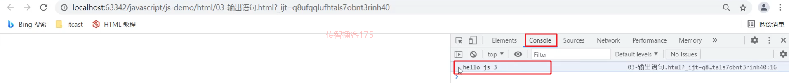

### 3、变量

JavaScript 中用 var 关键字（variable 的缩写）来声明变量。格式 var 变量名 = 数据值;。而在

JavaScript 是一门弱类型语言，变量==可以存放不同类型的值==；如下在定义变量时赋值为数字数

据，还可以将变量的值改为字符串类型的数

```javascript
var test = 20;
test = "张三";
```

js 中的变量名命名也有如下规则，和java语言基本都相同

- 组成字符可以是任何字母、数字、下划线（_）或美元符号（$）

- 数字不能开头

- 建议使用驼峰命名

JavaScript 中 var 关键字有点特殊，有以下地方和其他语言不一样

- 作用域：全局变量

```javascript
{
    var age = 20;
}
alert(age);  // 在代码块中定义的age 变量，在代码块外边还可以使用
```

- 变量可以重复定义

```javascript
{
    var age = 20;
    var age = 30;//JavaScript 会用 30 将之前 age 变量的 20 替换掉
}
alert(age); //打印的结果是 30
```

针对如上的问题，==ECMAScript 6 新增了 let关键字来定义变量。==它的用法类似于 var，但是所声

明的变量，只在 let 关键字所在的代码块内有效，且不允许重复声明。

例如：

```javascript
{
    let age = 20;
}
alert(age); 
```

运行上面代码，浏览器并没有弹框输出结果，说明这段代码是有问题的。通过 F12 打开开发者模式可

以看到如下错误信息


而如果在代码块中定义两个同名的变量，IDEA 开发工具就直接报错了

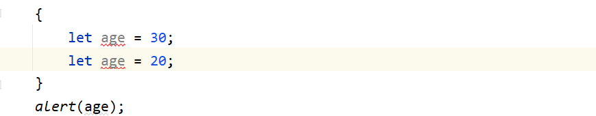

==ECMAScript 6 新增了 const关键字，用来声明一个只读的常量。一旦声明，常量的值就不能改变。

== 通过下面的代码看一下常用的特点就可以了


我们可以看到给 PI 这个常量重新赋值时报错了。

### 4、数据类型

JavaScript 中提供了两类数据类型：原始类型 和 引用类型。

> 使用 typeof 运算符可以获取数据类型alert(typeof age); 以弹框的形式将 age 变量的数据类型输出

原始数据类型：

- number：数字（整数、小数、NaN(Not a Number)）

```javascript
var age = 20;
var price = 99.8;
​
alert(typeof age); // 结果是 ： number
alert(typeof price);// 结果是 ： number
```

> ==注意：== NaN是一个特殊的number类型的值，后面用到再说

- string：字符、字符串，单双引皆可

```javascript
var ch = 'a';
var name = '张三'; 
var addr = "北京";
​
alert(typeof ch); //结果是  string
alert(typeof name); //结果是  string
alert(typeof addr); //结果是  string
```

> ==注意：==在 js 中 双引号和单引号都表示字符串类型的数据

- boolean：布尔。true，false

```javascript
var flag = true;
var flag2 = false;
​
alert(typeof flag); //结果是 boolean
alert(typeof flag2); //结果是 boolean
```

- null：对象为空

```javascript
var obj = null;
​
alert(typeof obj);//结果是 object
```

为什么打印上面的 obj 变量的数据类型，结果是object；这个官方给出了解释，下面是从官方文档截的

图

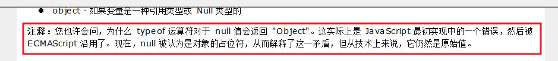

- undefined：当声明的变量未初始化时，该变量的默认值是 undefined

```
var a ;
alert(typeof a); //结果是 undefined
```

### 5、运算符

JavaScript 提供了如下的运算符。大部分和 Java语言 都是一样的，不同的是 JS 关系运算符中的 == 

和 ===，一会我们只演示这两个的区别，其他运算符将不做演示

- 一元运算符：++，--

- 算术运算符：+，-，*，/，%

- 赋值运算符：=，+=，-=…

- 关系运算符：>，<，>=，<=，!=，\==，===…

- 逻辑运算符：&&，||，!

- 三元运算符：条件表达式 ? true_value : false_value 

#### A、==和===区别

概述:

- ==：

1. 判断类型是否一样，如果不一样，则进行类型转换

1. 再去比较其值

- ===：js 中的全等于

1. 判断类型是否一样，如果不一样，直接返回false

1. 再去比较其值	

代码：

```javascript
var age1 = 20;
var age2 = "20";
​
alert(age1 == age2);// true
alert(age1 === age2);// false
```

#### B、类型转换

上述讲解 == 运算符时，发现会进行类型转换，所以接下来我们来详细的讲解一下 JavaScript 中

的类型转换。

- 其他类型转为number

- string 转换为 number 类型：按照字符串的字面值，转为数字。如果字面值不是数字，则转为NaN

将 string 转换为 number 有两种方式：

- 使用 + 正号运算符：

```java
var str = +"20";
alert(str + 1) //21
```

- 使用 parseInt() 函数(方法)：

```javascript
var str = "20";
alert(parseInt(str) + 1);
```

> ==建议使用 parseInt() 函数进行转换。==

- boolean 转换为 number 类型：true 转为1，false转为0

```javascript
var flag = +false;
alert(flag); // 0
```

- 其他类型转为boolean

- number 类型转换为 boolean 类型：0和NaN转为false，其他的数字转为true

- string 类型转换为 boolean 类型：空字符串转为false，其他的字符串转为true

- null类型转换为 boolean 类型是 false

- undefined 转换为 boolean 类型是 false

代码如下：

```javascript
// var flag = 3;
// var flag = "";
var flag = undefined;
​
if(flag){
    alert("转为true");
}else {
    alert("转为false");
}
```

使用场景：

在 Java 中使用字符串前，一般都会先判断字符串不是null，并且不是空字符才会做其他的一

些操作，JavaScript也有类型的操作，代码如下：

```javascript
var str = "abc";
​
//健壮性判断
if(str != null && str.length > 0){
    alert("转为true");
}else {
    alert("转为false");
}
```

但是由于 JavaScript 会自动进行类型转换，所以上述的判断可以进行简化，代码如下：

```javascript
var str = "abc";
​
//健壮性判断
if(str){
    alert("转为true");
}else {
    alert("转为false");
}
```

### 6、流程控制语句

JavaScript 中提供了和 Java 一样的流程控制语句，如下

- if 

- switch

- for

- while

- dowhile

#### A、if 语句

```javascript
var count = 3;
if (count == 3) {
    alert(count);
}
```

#### B、switch 语句

```javascript
var num = 3;
switch (num) {
    case 1:
        alert("星期一");
        break;
    case 2:
        alert("星期二");
        break;
    case 3:
        alert("星期三");
        break;
    case 4:
        alert("星期四");
        break;
    case 5:
        alert("星期五");
        break;
    case 6:
        alert("星期六");
        break;
    case 7:
        alert("星期日");
        break;
    default:
        alert("输入的星期有误");
        break;
}
```

#### C、for 循环语句

```javascript
var sum = 0;
for (let i = 1; i <= 100; i++) { //建议for循环小括号中定义的变量使用let
    sum += i;
}
alert(sum);
```

#### D、while 循环语句

```javascript
var sum = 0;
var i = 1;
while (i <= 100) {
    sum += i;
    i++;
}
alert(sum);
```

#### E、dowhile 循环语句

```javascript
var sum = 0;
var i = 1;
do {
    sum += i;
    i++;
}
while (i <= 100);
alert(sum);
```

### 7、 函数

函数（就是Java中的方法）是被设计为执行特定任务的代码块；JavaScript 函数通过 function 关键词

进行定义。

#### A、定义格式

函数定义格式有两种：

- 方式1

```javascript
function 函数名(参数1,参数2..){
    要执行的代码
}
```

- 方式2

```javascript
var 函数名 = function (参数列表){
    要执行的代码
}
```

> ==注意：==形式参数不需要类型。因为JavaScript是弱类型语言function add(a, b){    return a + b;}上述函数的参数 a 和 b 不需要定义数据类型，因为在每个参数前加上 var 也没有任何意义。返回值也不需要定义类型，可以在函数内部直接使用return返回即可

#### B、函数调用

函数调用函数：

```javascript
函数名称(实际参数列表);
```

eg：

```javascript
let result = add(10,20);
```

> ==注意：==JS中，函数调用可以传递任意个数参数例如  let result = add(1,2,3); 它是将数据 1 传递给了变量a，将数据 2 传递给了变量 b，而数据 3 没有变量接收。

## 四、JavaScript常用对象

JavaScript 提供了很多对象供使用者来使用。这些对象总共分类三类

- 基本对象


- BOM 对象


- DOM对象

DOM 中的对象就比较多了，下图只是截取部分

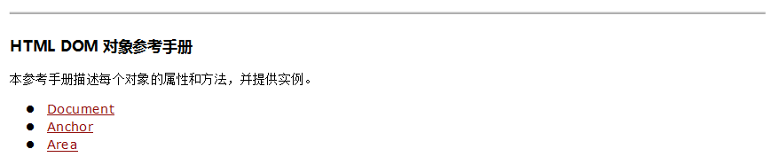

### 1、Array对象

JavaScript Array对象用于定义数组

#### A、定义格式

数组的定义格式有两种：

- 方式1

```javascript
var 变量名 = new Array(元素列表); 
```

例如：

```javascript
var arr = new Array(1,2,3); //1,2,3 是存储在数组中的数据（元素）
```

- 方式2

```javascript
var 变量名 = [元素列表];
```

例如：

```javascript
var arr = [1,2,3]; //1,2,3 是存储在数组中的数据（元素）
```

==注意：Java中的数组静态初始化使用的是{}定义，而 JavaScript 中使用的是 [] 定义==

#### B、元素访问

访问数组中的元素和 Java 语言的一样，格式如下：

```javascript
arr[索引] = 值;
```

代码演示：

```javascript
 // 方式一
var arr = new Array(1,2,3);
// alert(arr);
​
// 方式二
var arr2 = [1,2,3];
//alert(arr2);
​
// 访问
arr2[0] = 10;
alert(arr2)
```

#### C、特点

JavaScript 中的数组相当于 Java 中集合。数组的长度是可以变化的，而 JavaScript 是弱类型，	

所以可以存储任意的类型的数据。

例如如下代码：

```javascript
// 变长
var arr3 = [1,2,3];
arr3[10] = 10;
alert(arr3[10]); // 10
alert(arr3[9]);  //undefined
```

上面代码在定义数组中给了三个元素，又给索引是 10 的位置添加了数据 10，那么 索引3 到 索引

9 位置的元素是什么呢？我们之前就介绍了，在 JavaScript 中没有赋值的话，默认就是 

undefined。

如果给 arr3 数组添加字符串的数据，也是可以添加成功的

```javascript
arr3[5] = "hello";
alert(arr3[5]); // hello
```

#### D、属性

Array 对象提供了很多属性，如下图是官方文档截取的


而我们只讲解 length 属性，该数组可以动态的获取数组的长度。而有这个属性，我们就可以遍历

数组了

```javascript
var arr = [1,2,3];
for (let i = 0; i < arr.length; i++) {
    alert(arr[i]);
}
```

#### E、方法

Array 对象同样也提供了很多方法，如下图是官方文档截取的

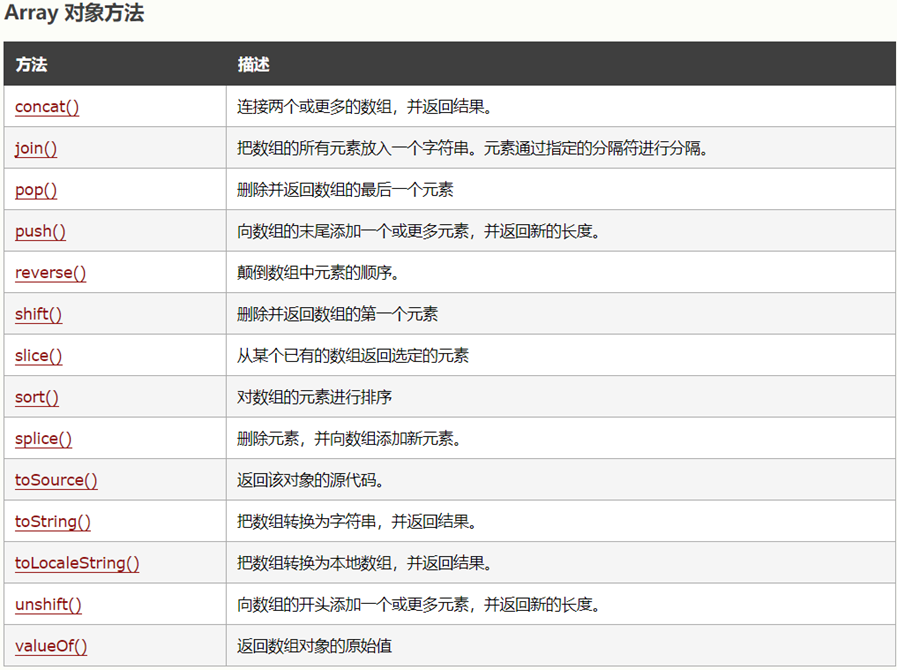

- push 函数：给数组添加元素，也就是在数组的末尾添加元素

参数表示要添加的元素

```javascript
// push:添加方法
var arr5 = [1,2,3];
arr5.push(10);
alert(arr5);  //数组的元素是 {1,2,3,10}
```

- splice 函数：删除元素

参数1：索引。表示从哪个索引位置删除

参数2：个数。表示删除几个元素

```javascript
// splice:删除元素
var arr5 = [1,2,3];
arr5.splice(0,1); //从 0 索引位置开始删除，删除一个元素 
alert(arr5); // {2,3}
```

### 2、String对象

String对象的创建方式有两种

- 方式1：

```javascript
var 变量名 = new String(s); 
```

- 方式2：

```javascript
var 变量名 = "数组"; 
```

属性：

String对象提供了很多属性，下面给大家列举了一个属性 length ，该属性是用于动态的获取字符

串的长度


函数：

String对象提供了很多函数（方法），下面给大家列举了两个方法。


String对象还有一个函数 trim() ，该方法在文档中没有体现，但是所有的浏览器都支持；它是用来

去掉字符串两端的空格。

代码演示：

```javascript
var str4 = '  abc   ';
alert(1 + str4 + 1);
```

上面代码会输出内容 1  abc  1，很明显可以看到 abc 字符串左右两边是有空格的。接下来使用 

trim() 函数

```javascript
var str4 = '  abc   ';
alert(1 + str4.trim() + 1);
```

输出的内容是 1abc1 。这就是 trim() 函数的作用。

trim() 函数在以后开发中还是比较常用的，例如下图所示是登陆界面


用户在输入用户名和密码时，可能会习惯的输入一些空格，这样在我们后端程序中判断用户名和

密码是否正确，结果肯定是失败。所以我们一般都会对用户输入的字符串数据进行去除前后空格

的操作。

### 3、自定义对象

在 JavaScript 中自定义对象特别简单，下面就是自定义对象的格式：

```javascript
var 对象名称 = {
    属性名称1:属性值1,
    属性名称2:属性值2,
    ...,
    函数名称:function (形参列表){},
    ...
};
```

调用属性的格式：

```javascript
对象名.属性名
```

调用函数的格式：

```javascript
对象名.函数名()
```

接下来通过代码演示一下，让大家体验一下 JavaScript 中自定义对象

```javascript
var person = {
        name : "zhangsan",
        age : 23,
        eat: function (){
            alert("干饭~");
        }
    };
​
​
alert(person.name);  //zhangsan
alert(person.age); //23
​
person.eat();  //干饭~
```

## 五、BOM

BOM：Browser Object Model 浏览器对象模型。也就是 JavaScript 将浏览器的各个组成部分封装为对

象。

我们要操作浏览器的各个组成部分就可以通过操作 BOM 中的对象来实现。比如：我现在想将浏览器地址

栏的地址改为 https://www.itheima.com 就可以通过使用 BOM 中定义的 Location 对象的 href 属性，代

码： location.href = "https://itheima.com"; 

BOM 中包含了如下对象：

- Window：浏览器窗口对象

- Navigator：浏览器对象

- Screen：屏幕对象

- History：历史记录对象

- Location：地址栏对象

下图是 BOM 中的各个对象和浏览器的各个组成部分的对应关系


BOM 中的 Navigator 对象和 Screen 对象基本不会使用。

### 1、Window对象

window 对象是 JavaScript 对浏览器的窗口进行封装的对象。

#### A、获取window对象

该对象不需要创建直接使用 window，其中 window. 可以省略。比如我们之前使用的 alert() 函

数，其实就是 window 对象的函数，在调用是可以写成如下两种

- 显式使用 

window 对象调用

```javascript
window.alert("abc");
```

- 隐式调用

```javascript
alert("abc")
```

#### B、window对象属性

window 对象提供了用于获取其他 BOM 组成对象的属性


也就是说，我们想使用 Location 对象的话，就可以使用 window 对象获取；写成 

window.location，而 window. 可以省略，简化写成 location 来获取 Location 对象。

#### C、window对象函数

window 对象提供了很多函数供我们使用，而很多都不常用；下面列举了一些比较常用的函数


> setTimeout(function,毫秒值) : 在一定的时间间隔后执行一个function，只执行一次
setInterval(function,毫秒值) :在一定的时间间隔后执行一个function，循环执行

confirm代码演示：

```javascript
// confirm()，点击确定按钮，返回true，点击取消按钮，返回false
var flag = confirm("确认删除？");
​
alert(flag);
```

下图是 confirm() 函数的效果。当我们点击 确定 按钮，flag 变量值记录的就是 true ；当我们点击 

取消 按钮，flag 变量值记录的就是 false。


而以后我们在页面删除数据时候如下图每一条数据后都有 删除 按钮，有可能是用户的一些误操

作，所以对于删除操作需要用户进行再次确认，此时就需要用到 confirm() 函数。


定时器代码演示：

```javascript
setTimeout(function (){
    alert("hehe");
},3000);
```

当我们打开浏览器，3秒后才会弹框输出 hehe，并且只会弹出一次。

```javascript
setInterval(function (){
    alert("hehe");
},2000);
```

当我们打开浏览器，每隔2秒都会弹框输出 hehe。

### 2、History对象

History 对象是 JavaScript 对历史记录进行封装的对象。

- History 对象的获取

使用 window.history获取，其中window. 可以省略

- History 对象的函数


这两个函数我们平时在访问其他的一些网站时经常使用对应的效果，如下图


当我们点击向左的箭头，就跳转到前一个访问的页面，这就是 back() 函数的作用；当我们点击向右的

箭头，就跳转到下一个访问的页面，这就是 forward() 函数的作用。

### 3、Location对象


Location 对象是 JavaScript 对地址栏封装的对象。可以通过操作该对象，跳转到任意页面。

#### A、获取Location对象

使用 window.location获取，其中window. 可以省略

```javascript
window.location.方法();
location.方法();
```

#### B、Location对象属性

Location对象提供了很对属性。以后常用的只有一个属性 href


代码演示：

```javascript
alert("要跳转了");
location.href = "https://www.baidu.com";
```

在浏览器首先会弹框显示 要跳转了，当我们点击了 确定 就会跳转到 百度 的首页。

## 六、DOM

### 1、概述

DOM：Document Object Model 文档对象模型。也就是 JavaScript 将 HTML 文档的各个组成部分封

装为对象。

DOM 其实我们并不陌生，之前在学习 XML 就接触过，只不过 XML 文档中的标签需要我们写代码解

析，而 HTML 文档是浏览器解析。封装的对象分为

- Document：整个文档对象

- Element：元素对象

- Attribute：属性对象

- Text：文本对象

- Comment：注释对象

如下图，左边是 HTML 文档内容，右边是 DOM 树


作用：

JavaScript 通过 DOM， 就能够对 HTML进行操作了

- 改变 HTML 元素的内容

- 改变 HTML 元素的样式（CSS）

- 对 HTML DOM 事件作出反应

- 添加和删除 HTML 元素

DOM相关概念：

DOM 是 W3C（万维网联盟）定义了访问 HTML 和 XML 文档的标准。该标准被分为 3 个不同的

部分：

1. 核心 DOM：针对任何结构化文档的标准模型。 XML 和 HTML 通用的标准

- Document：整个文档对象

- Element：元素对象

- Attribute：属性对象

- Text：文本对象

- Comment：注释对象

1. XML DOM： 针对 XML 文档的标准模型

1. HTML DOM： 针对 HTML 文档的标准模型

该标准是在核心 DOM 基础上，对 HTML 中的每个标签都封装成了不同的对象

- 例如：

 标签在浏览器加载到内存中时会被封装成 Image 对象，同时该对象也是 Element 对

象。

- 例如：

<input type='button'> 标签在浏览器加载到内存中时会被封装成 Button 对象，同时该对象也

是 Element 对象。

### 2、获取 Element对象

HTML 中的 Element 对象可以通过 Document 对象获取，而 Document 对象是通过 window 对象获

取。

Document 对象中提供了以下获取 Element 元素对象的函数

- getElementById()：根据id属性值获取，返回单个Element对象

- getElementsByTagName()：根据标签名称获取，返回Element对象数组

- getElementsByName()：根据name属性值获取，返回Element对象数组

- getElementsByClassName()：根据class属性值获取，返回Element对象数组

代码演示：

下面有提前准备好的页面：

```html
<!DOCTYPE html>
<html lang="en">
<head>
    <meta charset="UTF-8">
    <title>Title</title>
</head>
<body>
     <br>
​
    <div class="cls">传智教育</div>   <br>
    <div class="cls">黑马程序员</div> <br>
​
    <input type="checkbox" name="hobby"> 电影
    <input type="checkbox" name="hobby"> 旅游
    <input type="checkbox" name="hobby"> 游戏
    <br>
    <script>
        //在此处书写js代码
    </script>
</body>
</html>
```

1. 根据 id 属性值获取上面的 img 元素对象，返回单个对象

```javascript
var img = document.getElementById("light");
alert(img);
```

结果如下：


从弹框输出的内容，也可以看出是一个图片元素对象。

1. 根据标签名称获取所有的 div 元素对象

```javascript
var divs = document.getElementsByTagName("div");// 返回一个数组，数组中存储的是 div 元素对象
// alert(divs.length);  //输出 数组的长度
//遍历数组
for (let i = 0; i < divs.length; i++) {
    alert(divs[i]);
}
```

1. 获取所有的满足 name = 'hobby' 条件的元素对象

```javascript
//3. getElementsByName：根据name属性值获取，返回Element对象数组
var hobbys = document.getElementsByName("hobby");
for (let i = 0; i < hobbys.length; i++) {
    alert(hobbys[i]);
}
```

1. 获取所有的满足 class='cls' 条件的元素对象

```javascript
//4. getElementsByClassName：根据class属性值获取，返回Element对象数组
var clss = document.getElementsByClassName("cls");
for (let i = 0; i < clss.length; i++) {
    alert(clss[i]);
}
```

### 3、HTML Element对象使用

HTML 中的 Element 元素对象有很多，不可能全部记住，以后是根据具体的需求查阅文档使用。

下面我们通过具体的案例演示文档的查询和对象的使用；下面提前给大家准备好的页面

```html
<!DOCTYPE html>
<html lang="en">
<head>
    <meta charset="UTF-8">
    <title>Title</title>
</head>
<body>
     <br>
​
    <div class="cls">传智教育</div>   <br>
    <div class="cls">黑马程序员</div> <br>
​
    <input type="checkbox" name="hobby"> 电影
    <input type="checkbox" name="hobby"> 旅游
    <input type="checkbox" name="hobby"> 游戏
    <br>
    <script>
        //在此处写js代码
    </script>
</body>
</html>
```

需求：

1. 点亮灯泡

此案例由于需要改变 img 标签 的图片，所以我们查询文档，下图是查看文档的流程：


代码实现：

```javascript
//1，根据 id='light' 获取 img 元素对象
var img = document.getElementById("light");
//2，修改 img 对象的 src 属性来改变图片
img.src = "../imgs/on.gif";
```

1. 将所有的 div 标签的标签体内容替换为 呵呵

```javascript
//1，获取所有的 div 元素对象
var divs = document.getElementsByTagName("div");
/*
        style:设置元素css样式
        innerHTML：设置元素内容
    */
//2，遍历数组，获取到每一个 div 元素对象，并修改元素内容
for (let i = 0; i < divs.length; i++) {
    //divs[i].style.color = 'red';
    divs[i].innerHTML = "呵呵";
}
```

1. 使所有的复选框呈现被选中的状态

此案例我们需要看 复选框 元素对象有什么属性或者函数是来操作 复选框的选中状态。下图是文

档的查看


代码实现：

```javascript
//1，获取所有的 复选框 元素对象
var hobbys = document.getElementsByName("hobby");
//2，遍历数组，通过将 复选框 元素对象的 checked 属性值设置为 true 来改变复选框的选中状态
for (let i = 0; i < hobbys.length; i++) {
    hobbys[i].checked = true;
}
```

## 七、事件监听

要想知道什么是事件监听，首先先聊聊什么是事件？

HTML 事件是发生在 HTML 元素上的“事情”。比如：页面上的 按钮被点击、鼠标移动到元素之上、按下键

盘按键 等都是事件。

事件监听是JavaScript 可以在事件被侦测到时==执行一段逻辑代码。==例如下图当我们点击 开灯 按钮，

就需要通过 js 代码实现替换图片


再比如下图输入框，当我们输入了用户名 光标离开 输入框，就需要通过 js 代码对输入的内容进行校验，

没通过校验就在输入框后提示 用户名格式有误!


### 1、事件绑定

JavaScript 提供了两种事件绑定方式：

- 方式一：通过 HTML标签中的事件属性进行绑定

如下面代码，有一个按钮元素，我们是在该标签上定义 事件属性，在事件属性中绑定函数。onclick 

就是 单击事件 的事件属性。onclick='on（）' 表示该点击事件绑定了一个名为 on() 的函数

```html
<input type="button" onclick='on()’>
```

下面是点击事件绑定的 on() 函数

```javascript
function on(){
    alert("我被点了");
}
```

- 方式二：通过 DOM 元素属性绑定

如下面代码是按钮标签，在该标签上我们并没有使用 事件属性，绑定事件的操作需要在 js 代码中实现

```javascript
<input type="button" id="btn">
```

下面 js 代码是获取了 id='btn' 的元素对象，然后将 onclick 作为该对象的属性，并且绑定匿名函数。

该函数是在事件触发后自动执行

```javascript
document.getElementById("btn").onclick = function (){
    alert("我被点了");
}
```

代码演示：

```html
<!DOCTYPE html>
<html lang="en">
<head>
    <meta charset="UTF-8">
    <title>Title</title>
</head>
<body>
    <!--方式1：在下面input标签上添加 onclick 属性，并绑定 on() 函数-->
    <input type="button" value="点我" onclick="on()"> <br>
    <input type="button" value="再点我" id="btn">
​
    <script>
        function on(){
            alert("我被点了");
        }
        //方式2：获取 id="btn" 元素对象，通过调用 onclick 属性 绑定点击事件
        document.getElementById("btn").onclick = function (){
            alert("我被点了");
        }
    </script>
</body>
</html>
```

### 2、常见事件

上面案例中使用到了 onclick 事件属性，那都有哪些事件属性供我们使用呢？下面就给大家列举一些

比较常用的事件属性

| 事件属性名 | 说明 |
| - | - |
| onclick | 鼠标单击事件 |
| onblur | 元素失去焦点 |
| onfocus | 元素获得焦点 |
| onload | 某个页面或图像被完成加载 |
| onsubmit | 当表单提交时触发该事件 |
| onmouseover | 鼠标被移到某元素之上 |
| onmouseout | 鼠标从某元素移开 |


- onfocus

 		获得焦点事件。

如下图，当点击了输入框后，输入框就获得了焦点。而下图示例是当获取焦点后会更改输入框的背景	

颜色。

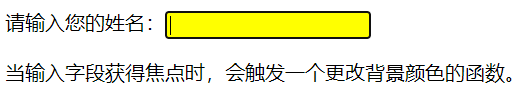

- onblur

 失去焦点事件。

如下图，当点击了输入框后，输入框就获得了焦点；再点击页面其他位置，那输入框就失去焦点了。

下图示例是将输入的文本转换为大写。


- onmouseout

 鼠标移出事件。

- onmouseover

 鼠标移入事件。

如下图，当鼠标移入到 苹果 图片上时，苹果图片变大；当鼠标移出 苹果图片时，苹果图片变小。


- onsubmit

表单提交事件

如下是带有表单的页面

```html
<!DOCTYPE html>
<html lang="en">
<head>
    <meta charset="UTF-8">
    <title>Title</title>
</head>
<body>
    <form id="register" action="#" >
        <input type="text" name="username" />
        <input type="submit" value="提交">
    </form>
    <script>
        
    </script>
</body>
</html>
```

如上代码的表单，当我们点击 提交 按钮后，表单就会提交，此处默认使用的是 GET 提交方式，会将

提交的数据拼接到 URL 后。现需要通过 js 代码实现阻止表单提交的功能，js 代码实现如下：

1. 获取 form 表单元素对象。

1. 给 form 表单元素对象绑定 onsubmit 事件，并绑定匿名函数。

1. 该匿名函数如果返回的是true，提交表单；如果返回的是false，阻止表单提交。

```javascript
document.getElementById("register").onsubmit = function (){
    //onsubmit 返回true，则表单会被提交，返回false，则表单不提交
    return true;
}
```

## 八、RegExp对象

RegExp 是正则对象。正则对象是判断指定字符串是否符合规则。

如下图是百度贴吧中的帖子


我们可以通过爬虫技术去爬取该页面源代码，然后获取页面中所有的邮箱，后期我们可以给这些邮箱地址	

发送推广的邮件。那么问题来了，如何才能知道页面内容中哪些事邮箱地址呢？这里就可以使用正则表达

式来匹配邮箱。

在 js 中对正则表达式封装的对象就是正则对象。

### 1、正则对象使用

#### A、创建对象

正则对象有两种创建方式：

- 直接量方式：注意不要加引号

```javascript
var reg = /正则表达式/;
```

- 创建 RegExp 对象

```javascript
var reg = new RegExp("正则表达式");
```

#### B、函数

test(str) ：判断指定字符串是否符合规则，返回 true或 false

### 2、正则表达式

从上面创建正则对象的格式中可以看出不管哪种方式都需要正则表达式，那么什么是正则表达式呢？

正则表达式定义了字符串组成的规则。也就是判断指定的字符串是否符合指定的规则，如果符合返回

true，如果不符合返回false。

正则表达式是和语言无关的。很多语言都支持正则表达式，Java语言也支持，只不过正则表达式在不

同的语言中的使用方式不同，js 中需要使用正则对象来使用正则表达式。

正则表达式常用的规则如下：

- ^：表示开始

- $：表示结束

- [ ]：代表某个范围内的单个字符，比如： [0-9] 单个数字字符

- .：代表任意单个字符，除了换行和行结束符

- \w：代表单词字符：字母、数字、下划线()，相当于 [A-Za-z0-9]

- \d：代表数字字符： 相当于 [0-9]

量词：

- +：至少一个

- *：零个或多个

- ？：零个或一个

- {x}：x个

- {m,}：至少m个

- {m,n}：至少m个，最多n个

代码演示：

```java
// 规则：单词字符，6~12
//1,创建正则对象，对正则表达式进行封装
var reg = /^\w{6,12}$/;
​
var str = "abcccc";
//2,判断 str 字符串是否符合 reg 封装的正则表达式的规则
var flag = reg.test(str);
alert(flag);
```

## 九、综合案例

[综合案例.zip](youdaonote-attachments/WEBRESOURCE4d76b53830b8797ae7d3d8bb699e3ca1综合案例.zip)

# Web概述

## 一、Web和JavaWeb的概念

==Web是全球广域网，也称为万维网(www)，能够通过浏览器访问的网站。==在我们日常的生活中，经常

会使用浏览器去访问百度、京东、传智官网等这些网站，这些网站统称为Web网站。

## 二、JavaWeb技术栈

### 1、B/S架构

	什么是B/S架构?

B/S 架构：Browser/Server，浏览器/服务器 架构模式，它的特点是，客户端只需要浏览器，应用

程序的逻辑和数据都存储在服务器端。浏览器只需要请求服务器，获取Web资源，服务器把Web

资源发送给浏览器即可。大家可以通过下面这张图来回想下我们平常的上网过程:

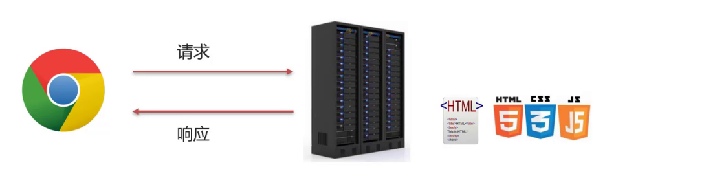

### 2、静态资源

- 静态资源主要包含HTML、CSS、JavaScript、图片等，主要负责页面的展示。

- 我们之前已经学过前端网页制作三剑客(HTML+CSS+JavaScript),使用这些技术我们就可以制作出效果比较丰富的网页，将来展现给用户。但是由于做出来的这些内容都是静态的，这就会导致所有的人看到的内容将是一模一样。

- 在日常上网的过程中，我们除了看到这些好看的页面以外，还会碰到很多动态内容，比如我们常见的百度登录效果:

张三登录以后在网页的右上角看到的是 张三，而李四登录以后看到的则是李四。所以不同

的用户访问相同的资源看到的内容大多数是不一样的，要想实现这样的效果，光靠静态资

源是无法实现的。

### 3、动态资源

- 动态资源主要包含Servlet、JSP等，主要用来负责逻辑处理。

- 动态资源处理完逻辑后会把得到的结果交给静态资源来进行展示，动态资源和静态资源要结合一起使用。

- 动态资源虽然可以处理逻辑，但是当用户来登录百度的时候，就需要输入

用户名和密码,这个时候我们就又需要解决的一个问题是，用户在注册的时候填入的用户名和密码、以

及我们经常会访问到一些数据列表的内容展示(如下图所示)，这些数据都存储在哪里?我们需要的时候

又是从哪里来取呢?


### 4、数据库

- 数据库主要负责存储数据。

- 整个Web的访问过程就如下图所示:


(1)浏览器发送一个请求到服务端，去请求所需要的相关资源;

(2)资源分为动态资源和静态资源,动态资源可以是使用Java代码按照Servlet和JSP的规范编写的内容;

(3)在Java代码可以进行业务处理也可以从数据库中读取数据;

(4)拿到数据后，把数据交给HTML页面进行展示,再结合CSS和JavaScript使展示效果更好;

(5)服务端将静态资源响应给浏览器;

(6)浏览器将这些资源进行解析;

(7)解析后将效果展示在浏览器，用户就可以看到最终的结果。

### 5、HTTP协议

- HTTP协议:主要定义通信规则

- 浏览器发送请求给服务器，服务器响应数据给浏览器，这整个过程都需要遵守一定的规则，之前大家学习过TCP、UDP，这些都属于规则，这里我们需要使用的是HTTP协议，这也是一种规则。

### 6、Web服务器

- Web服务器:负责解析 HTTP 协议，解析请求数据，并发送响应数据

- 浏览器按照HTTP协议发送请求和数据，后台就需要一个Web服务器软件来根据HTTP协议解析请求和数据，然后把处理结果再按照HTTP协议发送给浏览器

# HTTP

## 一、简介

HTTP概念

HyperText Transfer Protocol，超文本传输协议，规定了浏览器和服务器之间==数据传输的规则==。

- 数据传输的规则指的是请求数据和响应数据需要按照指定的格式进行传输。

- 如果想知道具体的格式，可以打开浏览器，点击F12打开开发者工具，点击Network来查看某一次请求的请求数据和响应数据具体的格式内容，

HTTP协议特点

HTTP协议有它自己的一些特点，分别是:

- 基于TCP协议: 面向连接，安全

TCP是一种面向连接的(建立连接之前是需要经过三次握手)、可靠的、基于字节流的传输层通信协

议，在数据传输方面更安全。

- 基于请求-响应模型的:一次请求对应一次响应

请求和响应是一一对应关系

- HTTP协议是无状态协议:对于事物处理没有记忆能力。每次请求-响应都是独立的

无状态指的是客户端发送HTTP请求给服务端之后，服务端根据请求响应数据，响应完后，不会记录

任何信息。这种特性有优点也有缺点，

- 缺点:多次请求间不能共享数据

- 优点:速度快

请求之间无法共享数据会引发的问题，如:

- 京东购物，加入购物车和去购物车结算是两次请求，

- HTTP协议的无状态特性，加入购物车请求响应结束后，并未记录加入购物车是何商品

- 发起去购物车结算的请求后，因为无法获取哪些商品加入了购物车，会导致此次请求无法正确展示数据

具体使用的时候，我们发现京东是可以正常展示数据的，原因是Java早已考虑到这个问题，并提出了

使用会话技术(Cookie、Session)来解决这个问题。

## 二、请求数据格式

### 1、格式介绍

请求数据总共分为三部分内容，分别是==请求行==、==请求头==、==请求体==


- 请求行: HTTP请求中的第一行数据，请求行包含三块内容，分别是 GET[请求方式] /[请求URL路径] HTTP/1.1[HTTP协议及版本]

请求方式有七种,最常用的是GET和POST

- 请求头: 第二行开始，格式为key: value形式

请求头中会包含若干个属性，常见的HTTP请求头有:

```
Host: 表示请求的主机名
User-Agent: 浏览器版本,例如Chrome浏览器的标识类似Mozilla/5.0 ...Chrome/79，IE浏览器的标识类似Mozilla/5.0 (Windows NT ...)like Gecko；
Accept：表示浏览器能接收的资源类型，如text/*，image/*或者*/*表示所有；
Accept-Language：表示浏览器偏好的语言，服务器可以据此返回不同语言的网页；
Accept-Encoding：表示浏览器可以支持的压缩类型，例如gzip, deflate等。
```

 ==这些数据有什么用处?==

举例说明:服务端可以根据请求头中的内容来获取客户端的相关信息，有了这些信息服务端就可以处理不同	

的业务需求，比如:

- 不同浏览器解析HTML和CSS标签的结果会有不一致，所以就会导致相同的代码在不同的浏览器会出现不同的效果

- 服务端根据客户端请求头中的数据获取到客户端的浏览器类型，就可以根据不同的浏览器设置不同的代码来达到一致的效果

- 这就是我们常说的浏览器兼容问题

- 请求体: POST请求的最后一部分，存储请求参数


如上图红线框的内容就是请求体的内容，请求体和请求头之间是有一个空行隔开。此时浏览器发送的是

POST请求，为什么不能使用GET呢?这时就需要回顾GET和POST两个请求之间的区别了:

- GET请求请求参数在请求行中，没有请求体，POST请求请求参数在请求体中

- GET请求请求参数大小有限制，POST没有

## 三、响应数据格式

### 1、格式介绍

响应数据总共分为三部分内容，分别是==响应行==、==响应头==、==响应体==


- 响应行：响应数据的第一行,响应行包含三块内容，分别是 HTTP/1.1[HTTP协议及版本] 200[响应状态码] ok[状态码的描述]

- 响应头：第二行开始，格式为key：value形式

响应头中会包含若干个属性，常见的HTTP响应头有:

```
Content-Type：表示该响应内容的类型，例如text/html，image/jpeg；
Content-Length：表示该响应内容的长度（字节数）；
Content-Encoding：表示该响应压缩算法，例如gzip；
Cache-Control：指示客户端应如何缓存，例如max-age=300表示可以最多缓存300秒
```

- 响应体： 最后一部分。存放响应数据

上图中<html>...</html>这部分内容就是响应体，它和响应头之间有一个空行隔开。

### 2、响应状态码

[响应状态码.md](youdaonote-attachments/WEBRESOURCEa555bfa1e788135696dfd46aef809e13响应状态码.md)

主要认识三个状态码，其余的等后期用到了再去掌握:

- 200  ok 客户端请求成功

- 404  Not Found 请求资源不存在

- 500 Internal Server Error 服务端发生不可预期的错误

# Tomcat

## 一、简介

### 1、什么是Web服务器

Web服务器是一个应用程序（==软件==），对HTTP协议的操作进行封装，使得程序员不必直接对协	

议进行操作，让Web开发更加便捷。主要功能是"提供网上信息浏览服务"。

Web服务器是安装在服务器端的一款软件，将来我们把自己写的Web项目部署到Web Tomcat服务器

软件中，当Web服务器软件启动后，部署在Web服务器软件中的页面就可以直接通过浏览器来访问

了。

Web服务器软件使用步骤

- 准备静态资源

- 下载安装Web服务器软件

- 将静态资源部署到Web服务器上

- 启动Web服务器使用浏览器访问对应的资源

Tomcat

Tomcat的相关概念:

- Tomcat是Apache软件基金会一个核心项目，是一个开源免费的轻量级Web服务器，支持Servlet/JSP少量JavaEE规范。

- 概念中提到了JavaEE规范，那什么又是JavaEE规范呢?

JavaEE: Java Enterprise Edition,Java企业版。指Java企业级开发的技术规范总和。包含13项技

术规范:JDBC、JNDI、EJB、RMI、JSP、Servlet、XML、JMS、Java IDL、JTS、JTA、

JavaMail、JAF。

- 因为Tomcat支持Servlet/JSP规范，所以Tomcat也被称为Web容器、Servlet容器。Servlet需要依赖Tomcat才能运行。

- Tomcat的官网: https://tomcat.apache.org/ 从官网上可以下载对应的版本进行使用。

## 三、Maven创建Web项目

### 1、Web项目结构

Web项目的结构分为:开发中的项目和开发完可以部署的Web项目,这两种项目的结构是不一样的。

- Maven Web项目结构: 开发中的项目


- 开发完成部署的Web项目


- 开发项目通过执行Maven打包命令==package==,可以获取到部署的Web项目目录

- 编译后的Java字节码文件和resources的资源文件，会被放到WEB-INF下的classes目录下

- pom.xml中依赖坐标对应的jar包，会被放入WEB-INF下的lib目录下

### 2、创建Maven Web项目

创建方式有两种:使用骨架和不使用骨架

使用骨架

具体的步骤包含:

1. 创建Maven项目


1. 选择使用Web项目骨架


1. 输入Maven项目坐标创建项目


1. 确认Maven相关的配置信息后，完成项目创建


1. 删除pom.xml中多余内容，只留下面的这些内容，注意打包方式 jar和war的区别


1. 补齐Maven Web项目缺失的目录结构，默认没有java和resources目录，需要手动完成创建补齐，最终的目录结果如下


不使用骨架

1. 创建Maven项目

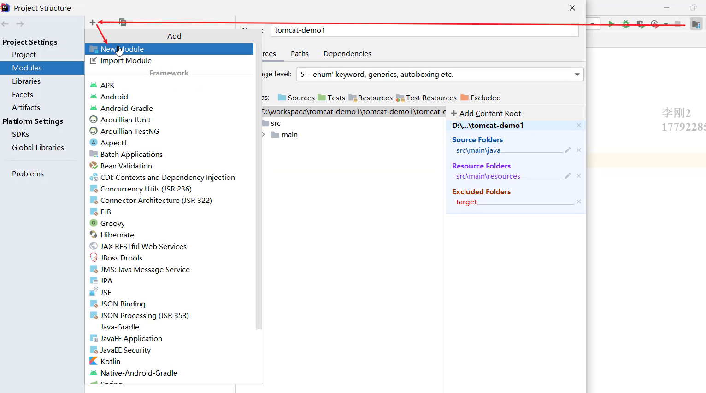

1. 选择不使用Web项目骨架


1. 输入Maven项目坐标创建项目


1. 在pom.xml设置打包方式为war,默认是不写代表打包方式为jar


1. 补齐Maven Web项目缺失webapp的目录结构


1. 补齐Maven Web项目缺失WEB-INF/web.xml的目录结构


1. 补充完后，最终的项目结构如下:


上述两种方式，创建的web项目，都不是很全，需要手动补充内容，至于最终采用哪种方式来创建

Maven Web项目，都是可以的，根据各自的喜好来选择使用即可。

## 四、IDEA使用Tomcat

- Maven Web项目创建成功后，通过Maven的package命令可以将项目打包成war包，将war文件拷贝到Tomcat的webapps目录下，启动Tomcat就可以将项目部署成功，然后通过浏览器进行访问即可。

- 然而我们在开发的过程中，项目中的内容会经常发生变化，如果按照上面这种方式来部署测试，是非常不方便的

- 如何在IDEA中能快速使用Tomcat呢?

在IDEA中集成使用Tomcat有两种方式，分别是==集成本地Tomcat==和==Tomcat Maven插件==

### 1、集成本地Tomcat

1. 打开添加本地Tomcat的面板


1. 指定本地Tomcat的具体路径


1. 修改Tomcat的名称，此步骤可以不改，只是让名字看起来更有意义，HTTP port中的端口也可以进行修改，比如把8080改成80


1. 将开发项目部署项目到Tomcat中


扩展内容： xxx.war和 xxx.war exploded这两种部署项目模式的区别?

- war模式是将WEB工程打成war包，把war包发布到Tomcat服务器上

- war exploded模式是将WEB工程以当前文件夹的位置关系发布到Tomcat服务器上

- war模式部署成功后，Tomcat的webapps目录下会有部署的项目内容

- war exploded模式部署成功后，Tomcat的webapps目录下没有，而使用的是项目的target目录下的内容进行部署

- 建议大家都选war模式进行部署，更符合项目部署的实际情况

1. 部署成功后，就可以启动项目，为了能更好的看到启动的效果，可以在webapp目录下添加a.html页面


1. 启动成功后，可以通过浏览器进行访问测试


1. 最终的注意事项


### 2、Tomcat Maven插件

在IDEA中使用本地Tomcat进行项目部署，相对来说步骤比较繁琐，所以我们需要一种更简便的方式来

替换它，那就是直接使用Maven中的Tomcat插件来部署项目，具体的实现步骤，只需要两步，分别是:

1. 在pom.xml中添加Tomcat插件

```xml
<build>
    <plugins>
        <!--Tomcat插件 -->
        <plugin>
            <groupId>org.apache.tomcat.maven</groupId>
            <artifactId>tomcat7-maven-plugin</artifactId>
            <version>2.2</version>
        </plugin>
    </plugins>
</build>
```

1. 使用Maven Helper插件快速启动项目，选中项目，右键-->Run Maven --> tomcat7:run


==注意:==

- 如果选中项目并右键点击后，看不到Run Maven和Debug Maven，这个时候就需要在IDEA中下载Maven Helper插件，

- Maven Tomcat插件目前只有Tomcat7版本，没有更高的版本可以使用

- 使用Maven Tomcat插件，要想修改Tomcat的端口和访问路径，可以直接修改pom.xml

```xml
<build>
    <plugins>
        <!--Tomcat插件 -->
        <plugin>
            <groupId>org.apache.tomcat.maven</groupId>
            <artifactId>tomcat7-maven-plugin</artifactId>
            <version>2.2</version>
            <configuration>
                <port>80</port><!--访问端口号 -->
                <!--项目访问路径
                    未配置访问路径: http://localhost:8080/tomcat-demo2/a.html
                    配置/后访问路径: http://localhost:80/a.html
                    如果配置成 /hello,访问路径会变成什么?
                        答案: http://localhost:80/hello/a.html
                -->
                <path>/</path>
            </configuration>
        </plugin>
    </plugins>
</build>
```

#  Servlet

## 一、简介

- Servlet是JavaWeb最为核心的内容，它是Java提供的一门==动态==web资源开发技术。

- 使用Servlet就可以实现，根据不同的登录用户在页面上动态显示不同内容。

- Servlet是JavaEE规范之一，其实就是一个接口，将来我们需要定义Servlet类实现Servlet接口，并由web服务器运行Servlet


## 二、快速入门

==需求分析: 编写一个Servlet类，并使用IDEA中Tomcat插件进行部署，最终通过浏览器访问所编写的

Servlet程序。==

具体的实现步骤为:

1. 创建Web项目web-demo，导入Servlet依赖坐标

```xml
<dependency>
    <groupId>javax.servlet</groupId>
    <artifactId>javax.servlet-api</artifactId>
    <version>3.1.0</version>
    <!--
      此处为什么需要添加该标签?
      provided指的是在编译和测试过程中有效,最后生成的war包时不会加入
       因为Tomcat的lib目录中已经有servlet-api这个jar包，如果在生成war包的时候生效就会和Tomcat中的jar包冲突，导致报错
    -->
    <scope>provided</scope>
</dependency>
```

1. 创建:定义一个类，实现Servlet接口，并重写接口中所有方法，并在service方法中输入一句话

```java
package com.itheima.web;
​
import javax.servlet.*;
import java.io.IOException;
​
public class ServletDemo1 implements Servlet {
​
    public void service(ServletRequest servletRequest, ServletResponse servletResponse) throws ServletException, IOException {
        System.out.println("servlet hello world~");
    }
    public void init(ServletConfig servletConfig) throws ServletException {
​
    }
​
    public ServletConfig getServletConfig() {
        return null;
    }
​
    public String getServletInfo() {
        return null;
    }
​
    public void destroy() {
​
    }
}
```

1. 配置:在类上使用@WebServlet注解，配置该Servlet的访问路径

```java
@WebServlet("/demo1")
```

1. 访问:启动Tomcat,浏览器中输入URL地址访问该Servlet

```
http://localhost:8080/web-demo/demo1
```

1. 器访问后，在控制台会打印servlet hello world~ 说明servlet程序已经成功运行。

## 三、执行流程


- 浏览器发出http://localhost:8080/web-demo/demo1请求，从请求中可以解析出三部分内容，分别是localhost:8080、web-demo、demo1

- 根据localhost:8080可以找到要访问的Tomcat Web服务器

- 根据web-demo可以找到部署在Tomcat服务器上的web-demo项目

- 根据demo1可以找到要访问的是项目中的哪个Servlet类，根据@WebServlet后面的值进行匹配

- 找到ServletDemo1这个类后，Tomcat Web服务器就会为ServletDemo1这个类创建一个对象，然后调用对象中的service方法

- ServletDemo1实现了Servlet接口，所以类中必然会重写service方法供Tomcat Web服务器进行调用

- service方法中有ServletRequest和ServletResponse两个参数，ServletRequest封装的是请求数据，ServletResponse封装的是响应数据，后期我们可以通过这两个参数实现前后端的数据交互

小结

介绍完Servlet的执行流程，需要大家掌握两个问题：

1. Servlet由谁创建?Servlet方法由谁调用?

Servlet由web服务器创建，Servlet方法由web服务器调用

1. 服务器怎么知道Servlet中一定有service方法?

因为我们自定义的Servlet,必须实现Servlet接口并复写其方法，而Servlet接口中有service方法

## 四、生命周期

介绍完Servlet的执行流程后，我们知道Servlet是由Tomcat Web服务器帮我们创建的。

接下来咱们再来思考一个问题:==Tomcat什么时候创建的Servlet对象?==

要想回答上述问题，我们就需要对Servlet的生命周期进行一个学习。

- 生命周期: 对象的生命周期指一个对象从被创建到被销毁的整个过程。

- Servlet运行在Servlet容器(web服务器)中，其生命周期由容器来管理，分为4个阶段：

1. ==加载和实例化==：默认情况下，当Servlet第一次被访问时，由容器创建Servlet对象

```
默认情况，Servlet会在第一次访问被容器创建，但是如果创建Servlet比较耗时的话，那么第一个访问的人等待的时间就比较长，用户的体验就比较差，那么我们能不能把Servlet的创建放到服务器启动的时候来创建，具体如何来配置?
​
@WebServlet(urlPatterns = "/demo1",loadOnStartup = 1)
loadOnstartup的取值有两类情况
    （1）负整数:第一次访问时创建Servlet对象
    （2）0或正整数:服务器启动时创建Servlet对象，数字越小优先级越高
```

1. ==初始化==：在Servlet实例化之后，容器将调用Servlet的==init()==方法初始化这个对象，完成一些如加载配置文件、创建连接等初始化的工作。该方法只==调用一次==

1. ==请求处理==：==每次==请求Servlet时，Servlet容器都会调用Servlet的==service()==方法对请求进行处理

1. ==服务终止==：当需要释放内存或者容器关闭时，容器就会调用Servlet实例的==destroy()==方法完成资源的释放。在destroy()方法调用之后，容器会释放这个Servlet实例，该实例随后会被Java的垃圾收集器所回收

- 通过案例演示下上述的生命周期

```java
package com.itheima.web;
​
import javax.servlet.*;
import javax.servlet.annotation.WebServlet;
import java.io.IOException;
/**
* Servlet生命周期方法
*/
@WebServlet(urlPatterns = "/demo2",loadOnStartup = 1)
public class ServletDemo2 implements Servlet {
​
    /**
     *  初始化方法
     *  1.调用时机：默认情况下，Servlet被第一次访问时，调用
     *      * loadOnStartup: 默认为-1，修改为0或者正整数，则会在服务器启动的时候，调用
     *  2.调用次数: 1次
     * @param config
     * @throws ServletException
     */
    public void init(ServletConfig config) throws ServletException {
        System.out.println("init...");
    }
​
    /**
     * 提供服务
     * 1.调用时机:每一次Servlet被访问时，调用
     * 2.调用次数: 多次
     * @param req
     * @param res
     * @throws ServletException
     * @throws IOException
     */
    public void service(ServletRequest req, ServletResponse res) throws ServletException, IOException {
        System.out.println("servlet hello world~");
    }
​
    /**
     * 销毁方法
     * 1.调用时机：内存释放或者服务器关闭的时候，Servlet对象会被销毁，调用
     * 2.调用次数: 1次
     */
    public void destroy() {
        System.out.println("destroy...");
    }
    public ServletConfig getServletConfig() {
        return null;
    }
​
    public String getServletInfo() {
        return null;
    }
​
​
}
```

==注意:如何才能让Servlet中的destroy方法被执行？==


在Terminal命令行中，先使用mvn tomcat7:run启动，然后再使用ctrl+c关闭tomcat

小结

这节中需要掌握的内容是:

1. Servlet对象在什么时候被创建的?

> 默认是第一次访问的时候被创建，可以使用@WebServlet(urlPatterns = "/demo2",loadOnStartup = 1)的loadOnStartup 修改成在服务器启动的时候创建。

1. Servlet生命周期中涉及到的三个方法，这三个方法是什么?什么时候被调用?调用几次?

> 涉及到三个方法，分别是 init()、service()、destroy()init方法在Servlet对象被创建的时候执行，只执行1次service方法在Servlet被访问的时候调用，每访问1次就调用1次destroy方法在Servlet对象被销毁的时候调用，只执行1次

## 五、方法介绍

Servlet中总共有5个方法，我们已经介绍过其中的三个，剩下的两个方法作用分别是什么？

我们先来回顾下前面讲的三个方法，分别是:

- 初始化方法，在Servlet被创建时执行，只执行一次	

```java
void init(ServletConfig config) 
```

- 提供服务方法， 每次Servlet被访问，都会调用该方法

```java
void service(ServletRequest req, ServletResponse res)
```

- 销毁方法，当Servlet被销毁时，调用该方法。在内存释放或服务器关闭时销毁Servlet

```java
void destroy() 
```

剩下的两个方法是:

- 获取Servlet信息	

```java
String getServletInfo() 
//该方法用来返回Servlet的相关信息，没有什么太大的用处，一般我们返回一个空字符串即可
public String getServletInfo() {
    return "";
}
```

- 获取ServletConfig对象

```
ServletConfig getServletConfig()
```

ServletConfig对象，在init方法的参数中有，而Tomcat Web服务器在创建Servlet对象的时候会调用init

方法，必定会传入一个ServletConfig对象，我们只需要将服务器传过来的ServletConfig进行返回即

可。具体如何操作?

```java
package com.itheima.web;
​
import javax.servlet.*;
import javax.servlet.annotation.WebServlet;
import java.io.IOException;
​
/**
 * Servlet方法介绍
 */
@WebServlet(urlPatterns = "/demo3",loadOnStartup = 1)
public class ServletDemo3 implements Servlet {
​
    private ServletConfig servletConfig;
    /**
     *  初始化方法
     *  1.调用时机：默认情况下，Servlet被第一次访问时，调用
     *      * loadOnStartup: 默认为-1，修改为0或者正整数，则会在服务器启动的时候，调用
     *  2.调用次数: 1次
     * @param config
     * @throws ServletException
     */
    public void init(ServletConfig config) throws ServletException {
        this.servletConfig = config;
        System.out.println("init...");
    }
    public ServletConfig getServletConfig() {
        return servletConfig;
    }
    
    /**
     * 提供服务
     * 1.调用时机:每一次Servlet被访问时，调用
     * 2.调用次数: 多次
     * @param req
     * @param res
     * @throws ServletException
     * @throws IOException
     */
    public void service(ServletRequest req, ServletResponse res) throws ServletException, IOException {
        System.out.println("servlet hello world~");
    }
​
    /**
     * 销毁方法
     * 1.调用时机：内存释放或者服务器关闭的时候，Servlet对象会被销毁，调用
     * 2.调用次数: 1次
     */
    public void destroy() {
        System.out.println("destroy...");
    }
    
    public String getServletInfo() {
        return "";
    }
}
```

getServletInfo()和getServletConfig()这两个方法使用的不是很多。

## 六、体系结构

通过上面的学习，我们知道要想编写一个Servlet就必须要实现Servlet接口，重写接口中的5个方法，虽然

已经能完成要求，但是编写起来还是比较麻烦的，因为我们更关注的其实只有service方法，那有没有更简

单方式来创建Servlet呢?

要想解决上面的问题，我们需要先对Servlet的体系结构进行下了解:


因为我们将来开发B/S架构的web项目，都是针对HTTP协议，所以我们自定义Servlet,会通过继承

==HttpServlet==具体的编写格式如下:

```java
@WebServlet("/demo4")
public class ServletDemo4 extends HttpServlet {
    @Override
    protected void doGet(HttpServletRequest req, HttpServletResponse resp) throws ServletException, IOException {
        //TODO GET 请求方式处理逻辑
        System.out.println("get...");
    }
    @Override
    protected void doPost(HttpServletRequest req, HttpServletResponse resp) throws ServletException, IOException {
        //TODO Post 请求方式处理逻辑
        System.out.println("post...");
    }
}
```

- 要想发送一个GET请求，请求该Servlet，只需要通过浏览器发送http://localhost:8080/web-demo/demo4,就能看到doGet方法被执行了

- 要想发送一个POST请求，请求该Servlet，单单通过浏览器是无法实现的，这个时候就需要编写一个form表单来发送请求，在webapp下创建一个a.html页面，内容如下:

```html
<!DOCTYPE html>
<html lang="en">
<head>
    <meta charset="UTF-8">
    <title>Title</title>
</head>
<body>
    <form action="/web-demo/demo4" method="post">
        <input name="username"/><input type="submit"/>
    </form>
</body>
</html>
```

启动测试，即可看到doPost方法被执行了。

Servlet的简化编写就介绍完了，接着需要思考两个问题:

1. HttpServlet中为什么要根据请求方式的不同，调用不同的方法?

1. 如何调用?

针对问题一，我们需要回顾之前的知识点==前端发送GET和POST请求的时候，参数的位置不一致，GET

请求参数在请求行中，POST请求参数在请求体中==，为了能处理不同的请求方式，我们得在service方法

中进行判断，然后写不同的业务处理，这样能实现，但是每个Servlet类中都将有相似的代码，针对这个问

题，有什么可以优化的策略么?

```java
package com.itheima.web;
​
import javax.servlet.*;
import javax.servlet.annotation.WebServlet;
import javax.servlet.http.HttpServlet;
import javax.servlet.http.HttpServletRequest;
import javax.servlet.http.HttpServletResponse;
import java.io.IOException;
​
​
@WebServlet("/demo5")
public class ServletDemo5 implements Servlet {
​
    public void init(ServletConfig config) throws ServletException {
​
    }
​
    public ServletConfig getServletConfig() {
        return null;
    }
​
    public void service(ServletRequest req, ServletResponse res) throws ServletException, IOException {
        //如何调用?
        //获取请求方式，根据不同的请求方式进行不同的业务处理
        HttpServletRequest request = (HttpServletRequest)req;
       //1. 获取请求方式
        String method = request.getMethod();
        //2. 判断
        if("GET".equals(method)){
            // get方式的处理逻辑
        }else if("POST".equals(method)){
            // post方式的处理逻辑
        }
    }
​
    public String getServletInfo() {
        return null;
    }
​
    public void destroy() {
​
    }
}
​
```

要解决上述问题，我们可以对Servlet接口进行继承封装，来简化代码开发。

```java
package com.itheima.web;
​
import javax.servlet.*;
import javax.servlet.http.HttpServletRequest;
import java.io.IOException;
​
public class MyHttpServlet implements Servlet {
    public void init(ServletConfig config) throws ServletException {
​
    }
​
    public ServletConfig getServletConfig() {
        return null;
    }
​
    public void service(ServletRequest req, ServletResponse res) throws ServletException, IOException {
        HttpServletRequest request = (HttpServletRequest)req;
        //1. 获取请求方式
        String method = request.getMethod();
        //2. 判断
        if("GET".equals(method)){
            // get方式的处理逻辑
            doGet(req,res);
        }else if("POST".equals(method)){
            // post方式的处理逻辑
            doPost(req,res);
        }
    }
​
    protected void doPost(ServletRequest req, ServletResponse res) {
    }
​
    protected void doGet(ServletRequest req, ServletResponse res) {
    }
​
    public String getServletInfo() {
        return null;
    }
​
    public void destroy() {
​
    }
}
​
```

有了MyHttpServlet这个类，以后我们再编写Servlet类的时候，只需要继承MyHttpServlet，重写父类中的

doGet和doPost方法，就可以用来处理GET和POST请求的业务逻辑。接下来，可以把ServletDemo5代码

进行改造

```java
@WebServlet("/demo5")
public class ServletDemo5 extends MyHttpServlet {
​
    @Override
    protected void doGet(ServletRequest req, ServletResponse res) {
        System.out.println("get...");
    }
​
    @Override
    protected void doPost(ServletRequest req, ServletResponse res) {
        System.out.println("post...");
    }
}
​
```

将来页面发送的是GET请求，则会进入到doGet方法中进行执行，如果是POST请求，则进入到doPost方

法。这样代码在编写的时候就相对来说更加简单快捷。

类似MyHttpServlet这样的类Servlet中已经为我们提供好了，就是HttpServlet,翻开源码，搜索service()方

法，你会发现HttpServlet做的事更多，不仅可以处理GET和POST还可以处理其他五种请求方式。

```java
protected void service(HttpServletRequest req, HttpServletResponse resp)
        throws ServletException, IOException
    {
        String method = req.getMethod();
​
        if (method.equals(METHOD_GET)) {
            long lastModified = getLastModified(req);
            if (lastModified == -1) {
                // servlet doesn't support if-modified-since, no reason
                // to go through further expensive logic
                doGet(req, resp);
            } else {
                long ifModifiedSince = req.getDateHeader(HEADER_IFMODSINCE);
                if (ifModifiedSince < lastModified) {
                    // If the servlet mod time is later, call doGet()
                    // Round down to the nearest second for a proper compare
                    // A ifModifiedSince of -1 will always be less
                    maybeSetLastModified(resp, lastModified);
                    doGet(req, resp);
                } else {
                    resp.setStatus(HttpServletResponse.SC_NOT_MODIFIED);
                }
            }
​
        } else if (method.equals(METHOD_HEAD)) {
            long lastModified = getLastModified(req);
            maybeSetLastModified(resp, lastModified);
            doHead(req, resp);
​
        } else if (method.equals(METHOD_POST)) {
            doPost(req, resp);
            
        } else if (method.equals(METHOD_PUT)) {
            doPut(req, resp);
            
        } else if (method.equals(METHOD_DELETE)) {
            doDelete(req, resp);
            
        } else if (method.equals(METHOD_OPTIONS)) {
            doOptions(req,resp);
            
        } else if (method.equals(METHOD_TRACE)) {
            doTrace(req,resp);
            
        } else {
            //
            // Note that this means NO servlet supports whatever
            // method was requested, anywhere on this server.
            //
​
            String errMsg = lStrings.getString("http.method_not_implemented");
            Object[] errArgs = new Object[1];
            errArgs[0] = method;
            errMsg = MessageFormat.format(errMsg, errArgs);
            
            resp.sendError(HttpServletResponse.SC_NOT_IMPLEMENTED, errMsg);
        }
    }
```

小结

通过这一节的学习，要掌握:

1. HttpServlet的使用步骤

继承HttpServlet重写doGet和doPost方法

1. HttpServlet原理

获取请求方式，并根据不同的请求方式，调用不同的doXxx方法

## 七、urlPattern配置

Servlet类编写好后，要想被访问到，就需要配置其访问路径（==urlPattern==）

- 一个Servlet,可以配置多个urlPattern


```java
package com.itheima.web;
​
import javax.servlet.ServletRequest;
import javax.servlet.ServletResponse;
import javax.servlet.annotation.WebServlet;
​
/**
* urlPattern: 一个Servlet可以配置多个访问路径
*/
@WebServlet(urlPatterns = {"/demo7","/demo8"})
public class ServletDemo7 extends MyHttpServlet {
​
    @Override
    protected void doGet(ServletRequest req, ServletResponse res) {
        
        System.out.println("demo7 get...");
    }
    @Override
    protected void doPost(ServletRequest req, ServletResponse res) {
    }
}
```

在浏览器上输入http://localhost:8080/web-demo/demo7,http://localhost:8080/web-demo/demo8这两个地

址都能访问到ServletDemo7的doGet方法。

- ==urlPattern配置规则==

- 精确匹配


```java
/**
 * UrlPattern:
 * * 精确匹配
 */
@WebServlet(urlPatterns = "/user/select")
public class ServletDemo8 extends MyHttpServlet {
​
    @Override
    protected void doGet(ServletRequest req, ServletResponse res) {
​
        System.out.println("demo8 get...");
    }
    @Override
    protected void doPost(ServletRequest req, ServletResponse res) {
    }
}
```

访问路径http://localhost:8080/web-demo/user/select

- 目录匹配


```java
package com.itheima.web;
​
import javax.servlet.ServletRequest;
import javax.servlet.ServletResponse;
import javax.servlet.annotation.WebServlet;
​
/**
 * UrlPattern:
 * * 目录匹配: /user/*
 */
@WebServlet(urlPatterns = "/user/*")
public class ServletDemo9 extends MyHttpServlet {
​
    @Override
    protected void doGet(ServletRequest req, ServletResponse res) {
​
        System.out.println("demo9 get...");
    }
    @Override
    protected void doPost(ServletRequest req, ServletResponse res) {
    }
}
```

访问路径http://localhost:8080/web-demo/user/任意

==思考:==

1. 访问路径http://localhost:8080/web-demo/user是否能访问到demo9的doGet方法?

1. 访问路径http://localhost:8080/web-demo/user/a/b是否能访问到demo9的doGet方法?

1. 访问路径http://localhost:8080/web-demo/user/select是否能访问到demo9还是demo8的doGet方法?

答案是: 能、能、demo8，进而我们可以得到的结论是/user/*中的/*代表的是零或多个层级访问目录同

时精确匹配优先级要高于目录匹配。

- 扩展名匹配


```
package com.itheima.web;
​
import javax.servlet.ServletRequest;
import javax.servlet.ServletResponse;
import javax.servlet.annotation.WebServlet;
​
/**
 * UrlPattern:
 * * 扩展名匹配: *.do
 */
@WebServlet(urlPatterns = "*.do")
public class ServletDemo10 extends MyHttpServlet {
​
    @Override
    protected void doGet(ServletRequest req, ServletResponse res) {
​
        System.out.println("demo10 get...");
    }
    @Override
    protected void doPost(ServletRequest req, ServletResponse res) {
    }
}
```

访问路径http://localhost:8080/web-demo/任意.do

==注意==:

1. 如果路径配置的不是扩展名，那么在路径的前面就必须要加/否则会报错

1. 如果路径配置的是*.do,那么在*.do的前面不能加/,否则会报错

- 任意匹配

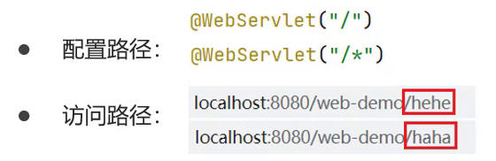

```java
package com.itheima.web;
​
import javax.servlet.ServletRequest;
import javax.servlet.ServletResponse;
import javax.servlet.annotation.WebServlet;
​
/**
 * UrlPattern:
 * * 任意匹配： /
 */
@WebServlet(urlPatterns = "/")
public class ServletDemo11 extends MyHttpServlet {
​
    @Override
    protected void doGet(ServletRequest req, ServletResponse res) {
​
        System.out.println("demo11 get...");
    }
    @Override
    protected void doPost(ServletRequest req, ServletResponse res) {
    }
}
```

访问路径http://localhost:8080/demo-web/任意

```java
package com.itheima.web;
​
import javax.servlet.ServletRequest;
import javax.servlet.ServletResponse;
import javax.servlet.annotation.WebServlet;
​
/**
 * UrlPattern:
 * * 任意匹配： /*
 */
@WebServlet(urlPatterns = "/*")
public class ServletDemo12 extends MyHttpServlet {
​
    @Override
    protected void doGet(ServletRequest req, ServletResponse res) {
​
        System.out.println("demo12 get...");
    }
    @Override
    protected void doPost(ServletRequest req, ServletResponse res) {
    }
}
​
```

访问路径`http://localhost:8080/demo-web/任意

==注意:==/和/*的区别?

1. 当我们的项目中的Servlet配置了 "/",会覆盖掉tomcat中的DefaultServlet,当其他的url-pattern都匹配不上时都会走这个Servlet

1. 当我们的项目中配置了"/*",意味着匹配任意访问路径

1. DefaultServlet是用来处理静态资源，如果配置了"/"会把默认的覆盖掉，就会引发请求静态资源的时候没有走默认的而是走了自定义的Servlet类，最终导致静态资源不能被访问

小结

1. urlPattern总共有四种配置方式，分别是精确匹配、目录匹配、扩展名匹配、任意匹配

1. 五种配置的优先级为 精确匹配 > 目录匹配> 扩展名匹配 > /* > / ,无需记，以最终运行结果为准。

## 八、XML配置

前面对应Servlet的配置，都使用的是@WebServlet,这个是Servlet从3.0版本后开始支持注解配置，3.0版本

前只支持XML配置文件的配置方法。

对于XML的配置步骤有两步:

- 编写Servlet类	

```java
package com.itheima.web;
​
import javax.servlet.ServletRequest;
import javax.servlet.ServletResponse;
import javax.servlet.annotation.WebServlet;
​
public class ServletDemo13 extends MyHttpServlet {
​
    @Override
    protected void doGet(ServletRequest req, ServletResponse res) {
​
        System.out.println("demo13 get...");
    }
    @Override
    protected void doPost(ServletRequest req, ServletResponse res) {
    }
}
```

- 在web.xml中配置该Servlet

```xml
<?xml version="1.0" encoding="UTF-8"?>
<web-app xmlns="http://xmlns.jcp.org/xml/ns/javaee"
         xmlns:xsi="http://www.w3.org/2001/XMLSchema-instance"
         xsi:schemaLocation="http://xmlns.jcp.org/xml/ns/javaee http://xmlns.jcp.org/xml/ns/javaee/web-app_4_0.xsd"
         version="4.0">
    
    
    
    <!-- 
        Servlet 全类名
    -->
    <servlet>
        <!-- servlet的名称，名字任意-->
        <servlet-name>demo13</servlet-name>
        <!--servlet的类全名-->
        <servlet-class>com.itheima.web.ServletDemo13</servlet-class>
    </servlet>
​
    <!-- 
        Servlet 访问路径
    -->
    <servlet-mapping>
        <!-- servlet的名称，要和上面的名称一致-->
        <servlet-name>demo13</servlet-name>
        <!-- servlet的访问路径-->
        <url-pattern>/demo13</url-pattern>
    </servlet-mapping>
</web-app>
```

这种配置方式和注解比起来，确认麻烦很多，所以建议大家使用注解来开发。要认识上面这种配置方式，

因为并不是所有的项目都是基于注解开发的。

# Request和Response的概述

==Request是请求对象，Response是响应对象。==这两个对象在我们使用Servlet的时候有看到：


此时，我们就需要思考一个问题request和response这两个参数的作用是什么?


- request:==获取==请求数据

- 浏览器会发送HTTP请求到后台服务器[Tomcat]

- HTTP的请求中会包含很多请求数据[请求行+请求头+请求体]

- 后台服务器[Tomcat]会对HTTP请求中的数据进行解析并把解析结果存入到一个对象中

- 所存入的对象即为request对象，所以我们可以从request对象中获取请求的相关参数

- 获取到数据后就可以继续后续的业务，比如获取用户名和密码就可以实现登录操作的相关业务

- response:==设置==响应数据

- 业务处理完后，后台就需要给前端返回业务处理的结果即响应数据

- 把响应数据封装到response对象中

- 后台服务器[Tomcat]会解析response对象,按照[响应行+响应头+响应体]格式拼接结果

- 浏览器最终解析结果，把内容展示在浏览器给用户浏览

# Request对象

## 一、Request继承体系

- 当我们的Servlet类实现的是Servlet接口的时候，service方法中的参数是ServletRequest和ServletResponse

- 当我们的Servlet类继承的是HttpServlet类的时候，doGet和doPost方法中的参数就变成HttpServletRequest和HttpServletReponse

那么，

- ServletRequest和HttpServletRequest的关系是什么?

- request对象是有谁来创建的?

- request提供了哪些API,这些API从哪里查?

首先，先来看下Request的继承体系:

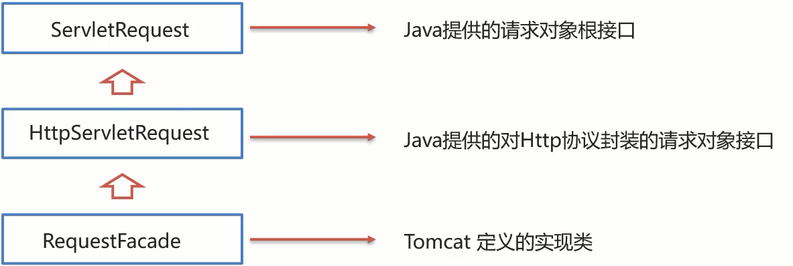

从上图中可以看出，ServletRequest和HttpServletRequest都是Java提供的，打开JavaEE提供的API文档

可以看到:


所以ServletRequest和HttpServletRequest是继承关系，并且两个都是接口，接口是无法创建对象，这个时

候就引发了下面这个问题:


这个时候，我们就需要用到Request继承体系中的RequestFacade:

- 该类实现了HttpServletRequest接口，也间接实现了ServletRequest接口。

- Servlet类中的service方法、doGet方法或者是doPost方法最终都是由Web服务器[Tomcat]来调用的，所以Tomcat提供了方法参数接口的具体实现类，并完成了对象的创建

- 要想了解RequestFacade中都提供了哪些方法，我们可以直接查看JavaEE的API文档中关于ServletRequest和HttpServletRequest的接口文档，因为RequestFacade实现了其接口就需要重写接口中的方法

对于上述结论，要想验证，可以编写一个Servlet，在方法中把request对象打印下，就能看到最终的对象是不是RequestFacade,代码如下:

```
@WebServlet("/demo2")
public class ServletDemo2 extends HttpServlet {
    @Override
    protected void doGet(HttpServletRequest request, HttpServletResponse response) throws ServletException, IOException {
        System.out.println(request);
    }
​
    @Override
    protected void doPost(HttpServletRequest request, HttpServletResponse response) throws ServletException, IOException {
    }
}
```

启动服务器，运行访问http://localhost:8080/request-demo/demo2,得到运行结果:


## 二、Request获取请求数据

### 1、 获取请求行数据

请求行包含三块内容，分别是请求方式、请求资源路径、HTTP协议及版本

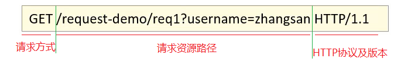

对于这三部分内容，request对象都提供了对应的API方法来获取，具体如下:

- 获取请求方式: GET

```java
String getMethod()
```

- 获取虚拟目录(项目访问路径): /request-demo

```java
String getContextPath()
```

- 获取URL(统一资源定位符): http://localhost:8080/request-demo/req1

```java
StringBuffer getRequestURL()
```

- 获取URI(统一资源标识符): /request-demo/req1

```java
String getRequestURI()
```

- 获取请求参数(GET方式): username=zhangsan&password=123

```java
String getQueryString()
```

### 2、获取请求头数据

对于请求头的数据，格式为key: value如下:


所以根据请求头名称获取对应值的方法为:

```java
String getHeader(String name)
```

示例代码

```java
package web;

import javax.servlet.ServletException;
import javax.servlet.annotation.WebServlet;
import javax.servlet.http.HttpServlet;
import javax.servlet.http.HttpServletRequest;
import javax.servlet.http.HttpServletResponse;
import java.io.IOException;

@WebServlet("/demo2")
public class demo2 extends HttpServlet {
    @Override
    protected void doGet(HttpServletRequest request, HttpServletResponse response) throws ServletException, IOException {
        String header = request.getHeader("user-agent");
        System.out.println(header);
    }

    @Override
    protected void doPost(HttpServletRequest request, HttpServletResponse response) throws ServletException, IOException {
        this.doGet(request,response);
    }
}

```

### 3、获取请求体数据

浏览器在发送GET请求的时候是没有请求体的，所以需要把请求方式变更为POST，请求体中的数据

格式如下:


对于请求体中的数据，Request对象提供了如下两种方式来获取其中的数据，分别是:

- 获取字节输入流，如果前端发送的是字节数据，比如传递的是文件数据，则使用该方法

```java
ServletInputStream getInputStream()
该方法可以获取字节
```

- 获取字符输入流，如果前端发送的是纯文本数据，则使用该方法

```java
BufferedReader getReader()
```

要想获取到请求体的内容该如何实现?

> 具体实现的步骤如下:

> 1.准备一个页面，在页面中添加form表单,用来发送post请求

> 2.在Servlet的doPost方法中获取请求体数据

> 3.在doPost方法中使用request的getReader()或者getInputStream()来获取

> 4.访问测试

示例代码

```html
<!DOCTYPE html>
<html lang="en">
<head>
    <meta charset="UTF-8">
    <title>Title</title>
</head>
<body>
<form action="demo3" method="post">
    用户名：<input type="text" name="username">
    密码：<input type="password" name="password">
    <input type="submit">
</form>
</body>
</html>
```

```java
package web;

import javax.servlet.ServletException;
import javax.servlet.annotation.WebServlet;
import javax.servlet.http.HttpServlet;
import javax.servlet.http.HttpServletRequest;
import javax.servlet.http.HttpServletResponse;
import java.io.BufferedReader;
import java.io.IOException;

@WebServlet("/demo3")
public class demo3 extends HttpServlet {
    @Override
    protected void doGet(HttpServletRequest request, HttpServletResponse response) throws ServletException, IOException {

    }

    @Override
    protected void doPost(HttpServletRequest request, HttpServletResponse response) throws ServletException, IOException {
        BufferedReader reader = request.getReader();
        String s = reader.readLine();
        System.out.println(s);
    }
}

```

小结

HTTP请求数据中包含了请求行、请求头和请求体，针对这三部分内容，Request对象都提供了对应的API方法来获取对应的值:

- 请求行

- getMethod()获取请求方式

- getContextPath()获取项目访问路径

- getRequestURL()获取请求URL

- getRequestURI()获取请求URI

- getQueryString()获取GET请求方式的请求参数

- 请求头

- getHeader(String name)根据请求头名称获取其对应的值

- 请求体

- 注意: ==浏览器发送的POST请求才有请求体==

- 如果是纯文本数据:getReader()

- 如果是字节数据如文件数据:getInputStream()

### 4、获取请求参数的通用方式

1.什么是请求参数?

拿用户登录的例子来说明

1.1 想要登录网址，需要进入登录页面

1.2 在登录页面输入用户名和密码

1.3 将用户名和密码提交到后台

1.4 后台校验用户名和密码是否正确

1.5 如果正确，则正常登录，如果不正确，则提示用户名或密码错误

上述例子中，用户名和密码其实就是我们所说的请求参数。

2.什么是请求数据?

请求数据则是包含请求行、请求头和请求体的所有数据

3.请求参数和请求数据的关系是什么?

3.1 请求参数是请求数据中的部分内容

3.2 如果是GET请求，请求参数在请求行中

3.3 如果是POST请求，请求参数一般在请求体中

对于请求参数的获取,常用的有以下两种:

- GET方式:

```java
String getQueryString()
```

- POST方式:

```java
BufferedReader getReader();
```

GET请求方式和POST请求方式区别主要在于获取请求参数的方式不一样，是否可以提供一种==统一

==获取请求参数的方式，从而==统一==doGet和doPost方法内的代码?

解决方案一:

```java
@WebServlet("/req1")
public class RequestDemo1 extends HttpServlet {
    @Override
    protected void doGet(HttpServletRequest req, HttpServletResponse resp) throws ServletException, IOException {
        //获取请求方式
        String method = req.getMethod();
        //获取请求参数
        String params = "";
        if("GET".equals(method)){
            params = req.getQueryString();
        }else if("POST".equals(method)){
            BufferedReader reader = req.getReader();
            params = reader.readLine();
        }
        //将请求参数进行打印控制台
        System.out.println(params);
      
    }
    @Override
    protected void doPost(HttpServletRequest req, HttpServletResponse resp) throws ServletException, IOException {
        this.doGet(req,resp);
    }
}
```

使用request的getMethod()来获取请求方式，根据请求方式的不同分别获取请求参数值，这样就可以

解决上述问题，但是以后每个Servlet都需要这样写代码，实现起来比较麻烦，这种方案我们不采用

解决方案二:

request对象已经将上述获取请求参数的方法进行了封装，并且request提供的方法实现的功能更强

大，以后只需要调用request提供的方法即可，在request的方法中都实现了哪些操作?

(1)根据不同的请求方式获取请求参数，获取的内容如下:


(2)把获取到的内容进行分割，内容如下:


(3)把分割后端数据，存入到一个Map集合中:


注意:因为参数的值可能是一个，也可能有多个，所以Map的值的类型为String数组。

基于上述理论，request对象为我们提供了如下方法:

- 获取所有参数Map集合

```java
Map<String,String[]> getParameterMap()
```

- 根据名称获取参数值（数组）

```java
String[] getParameterValues(String name)
```

- 根据名称获取参数值(单个值)

```java
String getParameter(String name)
```

## 三、IDEA快速创建Servlet

(1)按照自己的需求，修改Servlet创建的模板内容


(2)使用servlet模板创建Servlet类	

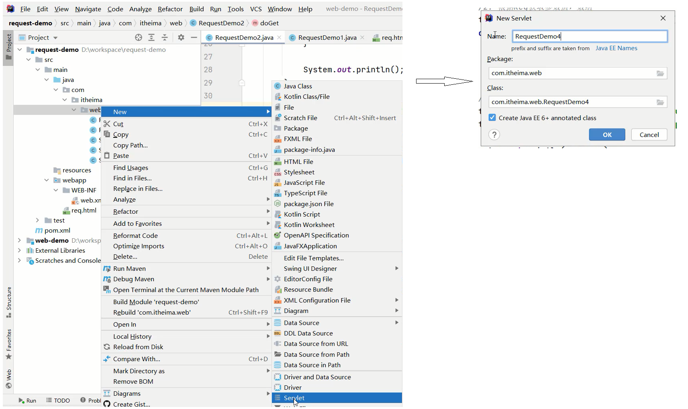

## 四、请求参数中文乱码问题

### 1、POST请求解决方案

- 分析出现中文乱码的原因：

- POST的请求参数是通过request的getReader()来获取流中的数据

- TOMCAT在获取流的时候采用的编码是ISO-8859-1

- ISO-8859-1编码是不支持中文的，所以会出现乱码

- 解决方案：

- 页面设置的编码格式为UTF-8

- 把TOMCAT在获取流数据之前的编码设置为UTF-8

- 通过request.setCharacterEncoding("UTF-8")设置编码,UTF-8也可以写成小写

修改后的代码为:

```java
/**
 * 中文乱码问题解决方案
 */
@WebServlet("/req4")
public class RequestDemo4 extends HttpServlet {
    @Override
    protected void doGet(HttpServletRequest request, HttpServletResponse response) throws ServletException, IOException {
        //1. 解决乱码: POST getReader()
        //设置字符输入流的编码，设置的字符集要和页面保持一致
        request.setCharacterEncoding("UTF-8");
       //2. 获取username
       String username = request.getParameter("username");
       System.out.println(username);
    }
​
    @Override
    protected void doPost(HttpServletRequest request, HttpServletResponse response) throws ServletException, IOException {
        this.doGet(request, response);
    }
}
```

重新发送POST请求，就会在控制台看到正常展示的中文结果。

### 2、GET请求解决方案

- 分析出现中文乱码的原因：

- 浏览器把中文参数按照UTF-8进行URL编码

- Tomcat对获取到的内容进行了ISO-8859-1的URL解码

- 在控制台就会出现类似å¼ ä¸‰的乱码，最后一位是个空格

- 解决方案

- 在进行编码和解码的时候，不管使用的是哪个字符集，他们对应的%E5%BC%A0%E4%B8%89是一致的

- 那他们对应的二进制值也是一样的，为:

- 1110 0101 1011 1100 1010 0000 1110 0100 1011 1000 1000 1001

- 所以我们可以考虑把å¼ ä¸‰转换成字节，在把字节转换成张三，在转换的过程中是它们的编码一致，就可以解决中文乱码问题。

具体的实现步骤为:

> 1.按照ISO-8859-1编码获取乱码å¼ ä¸‰对应的字节数组

> 2.按照UTF-8编码获取字节数组对应的字符串

示例代码

```java
package web;

import javax.servlet.ServletException;
import javax.servlet.annotation.WebServlet;
import javax.servlet.http.HttpServlet;
import javax.servlet.http.HttpServletRequest;
import javax.servlet.http.HttpServletResponse;
import java.io.BufferedReader;
import java.io.IOException;
import java.nio.charset.StandardCharsets;

@WebServlet("/demo4")
public class demo4 extends HttpServlet {
    @Override
    protected void doGet(HttpServletRequest request, HttpServletResponse response) throws ServletException, IOException {
        String username = request.getParameter("username");
        username=new String(username.getBytes(StandardCharsets.ISO_8859_1),StandardCharsets.UTF_8);
        System.out.println(username);
    }

    @Override
    protected void doPost(HttpServletRequest request, HttpServletResponse response) throws ServletException, IOException {
        this.doGet(request,response);
    }
}

```

注意

- 把request.setCharacterEncoding("UTF-8")代码注释掉后，会发现GET请求参数乱码解决方案同时也可也把POST请求参数乱码的问题也解决了

- 只不过对于POST请求参数一般都会比较多，采用这种方式解决乱码起来比较麻烦，所以对于POST请求还是建议使用设置编码的方式进行。

另外需要说明一点的是==Tomcat8.0之后，已将GET请求乱码问题解决，设置默认的解码方式为UTF-

8==

## 五、Request请求转发

1. ==请求转发(forward):一种在服务器内部的资源跳转方式。==

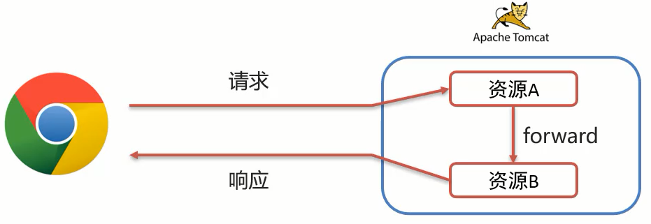

(1)浏览器发送请求给服务器，服务器中对应的资源A接收到请求

(2)资源A处理完请求后将请求发给资源B

(3)资源B处理完后将结果响应给浏览器

(4)请求从资源A到资源B的过程就叫==请求转发==

1. 请求转发的实现方式:

```java
req.getRequestDispatcher("资源B路径").forward(req,resp);
```

具体如何来使用，我们先来看下需求:


针对上述需求，具体的实现步骤为:

> 1.创建一个RequestDemo5类，接收/req5的请求，在doGet方法中打印demo52.创建一个RequestDemo6类，接收/req6的请求，在doGet方法中打印demo63.在RequestDemo5的方法中使用	req.getRequestDispatcher("/req6").forward(req,resp)进行请求转发4.启动测试

(1)创建RequestDemo5类

```java
/**
 * 请求转发
 */
@WebServlet("/req5")
public class RequestDemo5 extends HttpServlet {
    @Override
    protected void doGet(HttpServletRequest request, HttpServletResponse response) throws ServletException, IOException {
        System.out.println("demo5...");
    }
​
    @Override
    protected void doPost(HttpServletRequest request, HttpServletResponse response) throws ServletException, IOException {
        this.doGet(request, response);
    }
}
```

(2)创建RequestDemo6类

```java
/**
 * 请求转发
 */
@WebServlet("/req6")
public class RequestDemo6 extends HttpServlet {
    @Override
    protected void doGet(HttpServletRequest request, HttpServletResponse response) throws ServletException, IOException {
        System.out.println("demo6...");
    }
​
    @Override
    protected void doPost(HttpServletRequest request, HttpServletResponse response) throws ServletException, IOException {
        this.doGet(request, response);
    }
}
```

(3)在RequestDemo5的doGet方法中进行请求转发

```java
/**
 * 请求转发
 */
@WebServlet("/req5")
public class RequestDemo5 extends HttpServlet {
    @Override
    protected void doGet(HttpServletRequest request, HttpServletResponse response) throws ServletException, IOException {
        System.out.println("demo5...");
        //请求转发
        request.getRequestDispatcher("/req6").forward(request,response);
    }
​
    @Override
    protected void doPost(HttpServletRequest request, HttpServletResponse response) throws ServletException, IOException {
        this.doGet(request, response);
    }
}
```

(4)启动测试

访问http://localhost:8080/request-demo/req5,就可以在控制台看到如下内容:


说明请求已经转发到了/req6

1. 请求转发资源间共享数据:使用Request对象

此处主要解决的问题是把请求从/req5转发到/req6的时候，如何传递数据给/req6。

需要使用request对象提供的三个方法:

- 存储数据到request域[范围,数据是存储在request对象]中

```java
void setAttribute(String name,Object o);
```

- 根据key获取值

```java
Object getAttribute(String name);
```

- 根据key删除该键值对

```java
void removeAttribute(String name);
```

接着上个需求来:


> 1.在RequestDemo5的doGet方法中转发请求之前，将数据存入request域对象中

> 2.在RequestDemo6的doGet方法从request域对象中获取数据，并将数据打印到控制台

> 3.启动访问测试

(1)修改RequestDemo5中的方法

```java
@WebServlet("/req5")
public class RequestDemo5 extends HttpServlet {
    @Override
    protected void doGet(HttpServletRequest request, HttpServletResponse response) throws ServletException, IOException {
        System.out.println("demo5...");
        //存储数据
        request.setAttribute("msg","hello");
        //请求转发
        request.getRequestDispatcher("/req6").forward(request,response);
​
    }
​
    @Override
    protected void doPost(HttpServletRequest request, HttpServletResponse response) throws ServletException, IOException {
        this.doGet(request, response);
    }
}
```

(2)修改RequestDemo6中的方法

```java
/**
 * 请求转发
 */
@WebServlet("/req6")
public class RequestDemo6 extends HttpServlet {
    @Override
    protected void doGet(HttpServletRequest request, HttpServletResponse response) throws ServletException, IOException {
        System.out.println("demo6...");
        //获取数据
        Object msg = request.getAttribute("msg");
        System.out.println(msg);
​
    }
​
    @Override
    protected void doPost(HttpServletRequest request, HttpServletResponse response) throws ServletException, IOException {
        this.doGet(request, response);
    }
}
```

(3)启动测试

访问http://localhost:8080/request-demo/req5,就可以在控制台看到如下内容:


此时就可以实现在转发多个资源之间共享数据。

1. 请求转发的特点

- 浏览器地址栏路径不发生变化

虽然后台从/req5转发到/req6,但是浏览器的地址一直是/req5,未发生变化


- 只能转发到当前服务器的内部资源

不能从一个服务器通过转发访问另一台服务器

- 一次请求，可以在转发资源间使用request共享数据

虽然后台从/req5转发到/req6，但是这个==只有一次请求==

# Response对象

## 一、 Response设置响应数据功能介绍

HTTP响应数据总共分为三部分内容，分别是==响应行、响应头、响应体==，对于这三部分内容的数据，

respone对象都提供了哪些方法来进行设置?

1. 响应行


对于响应头，比较常用的就是设置响应状态码:

```java
void setStatus(int sc);
```

1. 响应头


设置响应头键值对：

```java
void setHeader(String name,String value);
```

1. 响应体


对于响应体，是通过字符、字节输出流的方式往浏览器写，

获取字符输出流:

```java
PrintWriter getWriter();
```

获取字节输出流

```java
ServletOutputStream getOutputStream();
```

## 二、Respones请求重定向

1. ==Response重定向(redirect):一种资源跳转方式。==


(1)浏览器发送请求给服务器，服务器中对应的资源A接收到请求

(2)资源A现在无法处理该请求，就会给浏览器响应一个302的状态码+location的一个访问资源B的路径

(3)浏览器接收到响应状态码为302就会重新发送请求到location对应的访问地址去访问资源B

(4)资源B接收到请求后进行处理并最终给浏览器响应结果，这整个过程就叫==重定向==

1. 重定向的实现方式:

```java
resp.setStatus(302);
resp.setHeader("location","资源B的访问路径");
```

具体如何来使用，我们先来看下需求:


针对上述需求，具体的实现步骤为:

> 1.创建一个ResponseDemo1类，接收/resp1的请求，在doGet方法中打印resp1....

> 2.创建一个ResponseDemo2类，接收/resp2的请求，在doGet方法中打印resp2....

> 3.在ResponseDemo1的方法中使用	response.setStatus(302);	response.setHeader("Location","/request-demo/resp2") 来给前端响应结果数据

> 4.启动测试

示例代码

```java
package web;

import javax.servlet.*;
import javax.servlet.http.*;
import javax.servlet.annotation.*;
import java.io.IOException;

@WebServlet("/demo1")
public class demo1 extends HttpServlet {
    @Override
    protected void doGet(HttpServletRequest request, HttpServletResponse response) throws ServletException, IOException {
        response.setStatus(302);
        response.setHeader("location","demo2");
        System.out.println("demo1");
    }

    @Override
    protected void doPost(HttpServletRequest request, HttpServletResponse response) throws ServletException, IOException {
        this.doGet(request, response);
    }
}

```

```java
package web;

import javax.servlet.ServletException;
import javax.servlet.annotation.WebServlet;
import javax.servlet.http.HttpServlet;
import javax.servlet.http.HttpServletRequest;
import javax.servlet.http.HttpServletResponse;
import java.io.IOException;

@WebServlet("/demo2")
public class demo2 extends HttpServlet {
    @Override
    protected void doGet(HttpServletRequest request, HttpServletResponse response) throws ServletException, IOException {
        System.out.println("demo2");
    }

    @Override
    protected void doPost(HttpServletRequest request, HttpServletResponse response) throws ServletException, IOException {
        this.doGet(request, response);
    }
}

```

虽然功能已经实现，但是从设置重定向的两行代码来看，会发现除了重定向的地址不一样，其他的内容都

是一模一样，所以request对象给我们提供了简化的编写方式为:

```java
resposne.sendRedirect("demo2")
```

1. 重定向的特点	

- 浏览器地址栏路径发送变化

当进行重定向访问的时候，由于是由浏览器发送的两次请求，所以地址会发生变化

- 可以重定向到任何位置的资源(服务内容、外部均可)

因为第一次响应结果中包含了浏览器下次要跳转的路径，所以这个路径是可以任意位置资源。

- 两次请求，不能在多个资源使用request共享数据

因为浏览器发送了两次请求，是两个不同的request对象，就无法通过request对象进行共享数据

介绍完==请求重定向==和==请求转发==以后，接下来需要把这两个放在一块对比下:


以后到底用哪个，还是需要根据具体的业务来决定。

## 三、路径问题

1. 问题1：转发的时候路径上没有加/request-demo而重定向加了，那么到底什么时候需要加，什么时候不需要加呢?


其实判断的依据很简单，只需要记住下面的规则即可:

- 浏览器使用:需要加虚拟目录(项目访问路径)


- 服务端使用:不需要加虚拟目录

对于转发来说，因为是在服务端进行的，所以不需要加虚拟目录

对于重定向来说，路径最终是由浏览器来发送请求，就需要添加虚拟目录。

掌握了这个规则，接下来就通过一些练习来强化下知识的学习:

- <a href='路劲'>

- <form action='路径'>

- req.getRequestDispatcher("路径")

- resp.sendRedirect("路径")

答案:

```
1.超链接，从浏览器发送，需要加
2.表单，从浏览器发送，需要加
3.转发，是从服务器内部跳转，不需要加
4.重定向，是由浏览器进行跳转，需要加。
```

1. 问题2：在重定向的代码中，/request-demo是固定编码的，如果后期通过Tomcat插件配置了项目的访问路径，那么所有需要重定向的地方都需要重新修改，该如何优化?


答案也比较简单，我们可以在代码中动态去获取项目访问的虚拟目录，具体如何获取，我们可以借助前面

咱们所学习的request对象中的getContextPath()方法，修改后的代码如下:

```java
@WebServlet("/resp1")
public class ResponseDemo1 extends HttpServlet {
    @Override
    protected void doGet(HttpServletRequest request, HttpServletResponse response) throws ServletException, IOException {
        System.out.println("resp1....");
​
        //简化方式完成重定向
        //动态获取虚拟目录
        String contextPath = request.getContextPath();
        response.sendRedirect(contextPath+"/resp2");
    }
​
    @Override
    protected void doPost(HttpServletRequest request, HttpServletResponse response) throws ServletException, IOException {
        this.doGet(request, response);
    }
}
```

重新启动访问测试，功能依然能够实现，此时就可以动态获取项目访问的虚拟路径，从而降低代码的耦合

度。

## 四、 Response响应字符数据

要想将字符数据写回到浏览器，我们需要两个步骤:

- 通过Response对象获取字符输出流： PrintWriter writer = resp.getWriter();

- 通过字符输出流写数据: writer.write("aaa");

接下来，我们实现通过些案例把响应字符数据给实际应用下:

1. 返回一个简单的字符串aaa

```
/**
 * 响应字符数据：设置字符数据的响应体
 */
@WebServlet("/resp3")
public class ResponseDemo3 extends HttpServlet {
    @Override
    protected void doGet(HttpServletRequest request, HttpServletResponse response) throws ServletException, IOException {
        response.setContentType("text/html;charset=utf-8");
        //1. 获取字符输出流
        PrintWriter writer = response.getWriter();
         writer.write("aaa");
    }
    @Override
    protected void doPost(HttpServletRequest request, HttpServletResponse response) throws ServletException, IOException {
        this.doGet(request, response);
    }
}
```


1. 返回一串html字符串，并且能被浏览器解析

```
PrintWriter writer = response.getWriter();
//content-type，告诉浏览器返回的数据类型是HTML类型数据，这样浏览器才会解析HTML标签
response.setHeader("content-type","text/html");
writer.write("<h1>aaa</h1>");
```

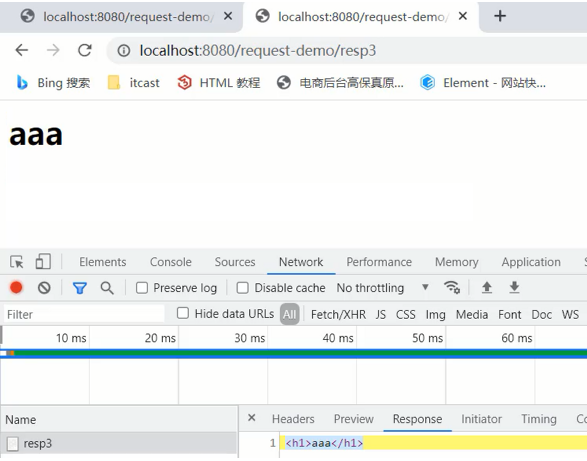

==注意:==一次请求响应结束后，response对象就会被销毁掉，所以不要手动关闭流。

1. 返回一个中文的字符串你好，需要注意设置响应数据的编码为utf-8

```java
//设置响应的数据格式及数据的编码
response.setContentType("text/html;charset=utf-8");
writer.write("你好");
```


Response响应字节数据

要想将字节数据写回到浏览器，我们需要两个步骤:

- 通过Response对象获取字节输出流：ServletOutputStream outputStream = resp.getOutputStream();

- 通过字节输出流写数据: outputStream.write(字节数据);

接下来，我们实现通过些案例把响应字符数据给实际应用下:

1. 返回一个图片文件到浏览器

```java
package web;

import javax.servlet.ServletException;
import javax.servlet.ServletOutputStream;
import javax.servlet.annotation.WebServlet;
import javax.servlet.http.HttpServlet;
import javax.servlet.http.HttpServletRequest;
import javax.servlet.http.HttpServletResponse;
import java.io.FileInputStream;
import java.io.IOException;

@WebServlet("/demo3")
public class demo3 extends HttpServlet {
    @Override
    protected void doGet(HttpServletRequest request, HttpServletResponse response) throws ServletException, IOException {
        FileInputStream fileInputStream = new FileInputStream("C:\\Users\\kangkang\\Pictures\\QQ图片20210903095843.jpg");
        ServletOutputStream outputStream = response.getOutputStream();
        byte[] bytes = new byte[1024];
        int len=0;
        while ((len=fileInputStream.read(bytes))!=-1){
            outputStream.write(bytes,0,len);
        }
        fileInputStream.close();
    }

    @Override
    protected void doPost(HttpServletRequest request, HttpServletResponse response) throws ServletException, IOException {
        this.doGet(request, response);
    }
}

```


上述代码中，对于流的copy的代码还是比较复杂的，所以我们可以使用别人提供好的方法来简化代码的开

发，具体的步骤是:

(1)pom.xml添加依赖

```xml
<dependency>
    <groupId>commons-io</groupId>
    <artifactId>commons-io</artifactId>
    <version>2.6</version>
</dependency>
```

(2)调用工具类方法

```java
//fis:输入流
//os:输出流
IOUtils.copy(fis,os);
```

优化后的代码:

```java
package web;

import org.apache.commons.io.IOUtils;

import javax.servlet.ServletException;
import javax.servlet.ServletOutputStream;
import javax.servlet.annotation.WebServlet;
import javax.servlet.http.HttpServlet;
import javax.servlet.http.HttpServletRequest;
import javax.servlet.http.HttpServletResponse;
import java.io.FileInputStream;
import java.io.IOException;

@WebServlet("/demo3")
public class demo3 extends HttpServlet {
    @Override
    protected void doGet(HttpServletRequest request, HttpServletResponse response) throws ServletException, IOException {
        FileInputStream fileInputStream = new FileInputStream("C:\\Users\\kangkang\\Pictures\\QQ图片20210903095843.jpg");
        ServletOutputStream outputStream = response.getOutputStream();
        IOUtils.copy(fileInputStream,outputStream);
    }

    @Override
    protected void doPost(HttpServletRequest request, HttpServletResponse response) throws ServletException, IOException {
        this.doGet(request, response);
    }
}

```

## 五、SqlSessionFactory工具类抽取

综合案例

[ResponseExample.zip](youdaonote-attachments/WEBRESOURCEcf2209e4cd5cf59209efec1acd69797fResponseExample.zip)

在综合案例中，在写Servlet的时候，因为需要使用Mybatis来完成数据库的操作，所以对于Mybatis的基础

操作就出现了些重复代码，如下

```java
String resource = "mybatis-config.xml";
InputStream inputStream = Resources.getResourceAsStream(resource);
SqlSessionFactory sqlSessionFactory = new 
    SqlSessionFactoryBuilder().build(inputStream);
```

有了这些重复代码就会造成一些问题:

- 重复代码不利于后期的维护

- SqlSessionFactory工厂类进行重复创建

- 就相当于每次买手机都需要重新创建一个手机生产工厂来给你制造一个手机一样，资源消耗非常大但性能却非常低。所以这么做是不允许的。

那如何来优化呢？

- 代码重复可以抽取工具类

- 对指定代码只需要执行一次可以使用静态代码块

有了这两个方向后，代码具体该如何编写?

```java
public class SqlSessionFactoryUtils {
​
    private static SqlSessionFactory sqlSessionFactory;
​
    static {
        //静态代码块会随着类的加载而自动执行，且只执行一次
        try {
            String resource = "mybatis-config.xml";
            InputStream inputStream = Resources.getResourceAsStream(resource);
            sqlSessionFactory = new SqlSessionFactoryBuilder().build(inputStream);
        } catch (IOException e) {
            e.printStackTrace();
        }
    }
​
​
    public static SqlSessionFactory getSqlSessionFactory(){
        return sqlSessionFactory;
    }
}
```

工具类抽取以后，以后在对Mybatis的SqlSession进行操作的时候，就可以直接使用

```java
SqlSessionFactory sqlSessionFactory =SqlSessionFactoryUtils.getSqlSessionFactory();
```

这样就可以很好的解决上面所说的代码重复和重复创建工厂导致性能低的问题了。

# JSP

## 一、JSP 概述

==JSP（全称：Java Server Pages）：Java 服务端页面。==是一种动态的网页技术，其中既可以定义 

HTML、JS、CSS等静态内容，还可以定义 Java代码的动态内容，也就是 JSP = HTML + Java。如下就是

jsp代码

```
<html>
    <head>
        <title>Title</title>
    </head>
    <body>
        <h1>JSP,Hello World</h1>
        <%
            System.out.println("hello,jsp~");
        %>
    </body>
</html>
```

上面代码 h1 标签内容是展示在页面上，而 Java 的输出语句是输出在 idea 的控制台。

JSP 作用：简化开发，避免了在Servlet中直接输出HTML标签。

## 二、JSP 快速入门

### 1、搭建环境

创建一个maven的 web 项目，项目结构如下：

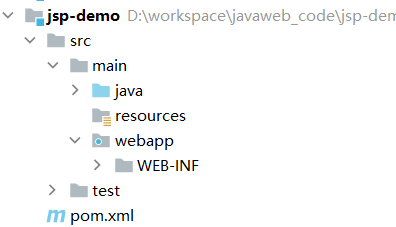

pom.xml 文件内容如下：

```xml
<?xml version="1.0" encoding="UTF-8"?>
<project xmlns="http://maven.apache.org/POM/4.0.0"
         xmlns:xsi="http://www.w3.org/2001/XMLSchema-instance"
         xsi:schemaLocation="http://maven.apache.org/POM/4.0.0 http://maven.apache.org/xsd/maven-4.0.0.xsd">
    <modelVersion>4.0.0</modelVersion>
​
    <groupId>org.example</groupId>
    <artifactId>jsp-demo</artifactId>
    <version>1.0-SNAPSHOT</version>
    <packaging>war</packaging>
​
    <properties>
        <maven.compiler.source>8</maven.compiler.source>
        <maven.compiler.target>8</maven.compiler.target>
    </properties>
​
    <dependencies>
      <dependency>
            <groupId>javax.servlet</groupId>
            <artifactId>javax.servlet-api</artifactId>
            <version>3.1.0</version>
            <scope>provided</scope>
        </dependency>
    </dependencies>
​
    <build>
        <plugins>
            <plugin>
                <groupId>org.apache.tomcat.maven</groupId>
                <artifactId>tomcat7-maven-plugin</artifactId>
                <version>2.2</version>
            </plugin>
        </plugins>
    </build>
</project>
```

### 2、导入 JSP 依赖

在 dependencies 标签中导入 JSP 的依赖，如下

```xml
<dependency>
    <groupId>javax.servlet.jsp</groupId>
    <artifactId>jsp-api</artifactId>
    <version>2.2</version>
    <scope>provided</scope>
</dependency>
```

该依赖的 scope 必须设置为 provided，因为 tomcat 中有这个jar包了，所以在打包时我们是不希望将

该依赖打进到我们工程的war包中。

### 3、创建 jsp 页面

在项目的 webapp 下创建jsp页面

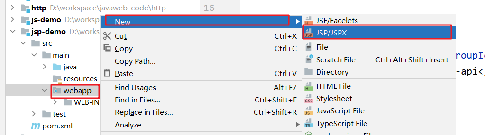

通过上面方式创建一个名为 hello.jsp 的页面。

### 4、编写代码

在 hello.jsp 页面中书写 HTML 标签和 Java 代码，如下

```
<%@ page contentType="text/html;charset=UTF-8" language="java" %>
<html>
<head>
    <title>Title</title>
</head>
<body>
    <h1>hello jsp</h1>
​
    <%
        System.out.println("hello,jsp~");
    %>
</body>
</html>
```

### 5、测试

启动服务器并在浏览器地址栏输入 http://localhost:8080/jsp-demo/hello.jsp，我们可以在页面上看到如

下内容


同时也可以看到在 idea 的控制台看到输出的 hello,jsp~ 内容。

## 三、JSP 原理

我们之前说 JSP 就是一个页面，那么在 JSP 中写 html 标签，我们能理解，但是为什么还可以写 Java 代

码呢？

因为 ==JSP 本质上就是一个 Servlet。==接下来我们聊聊访问jsp时的流程


1. 浏览器第一次访问 hello.jsp 页面

1. tomcat会将 hello.jsp 转换为名为 hello_jsp.java 的一个 Servlet

1. tomcat再将转换的 servlet 编译成字节码文件 hello_jsp.class

1. tomcat会执行该字节码文件，向外提供服务

我们可以到项目所在磁盘目录下找 target\tomcat\work\Tomcat\localhost\jsp-demo\org\apache\jsp 目录，

而这个目录下就能看到转换后的 servlet


打开 hello_jsp.java 文件，来查看里面的代码


由上面的类的继承关系可以看到继承了名为 HttpJspBase 这个类，那我们在看该类的继承关系。到资料中	

的找如下目录： 资料\tomcat源码\apache-tomcat-8.5.68-src\java\org\apache\jasper\runtime ，该目录下就

有 HttpJspBase 类，查看该类的继承关系


可以看到该类继承了 HttpServlet ；那么 hello_jsp 这个类就间接的继承了 HttpServlet ，也就说明 

hello_jsp 是一个 servlet。

继续阅读 hello_jsp 类的代码，可以看到有一个名为 _jspService() 的方法，该方法就是每次访问 jsp 时自

动执行的方法，和 servlet 中的 service 方法一样 。

而在 _jspService() 方法中可以看到往浏览器写标签的代码：


以前我们自己写 servlet 时，这部分代码是由我们自己来写，现在有了 jsp 后，由tomcat完成这部分功能。

## 四、JSP 脚本

### 1、JSP 脚本分类

JSP 脚本有如下三个分类：

- <%...%>：内容会直接放到_jspService()方法之中	

- <%=…%>：内容会放到out.print()中，作为out.print()的参数

- <%!…%>：内容会放到_jspService()方法之外，被类直接包含

代码演示：

在 hello.jsp 中书写

```
<%
    System.out.println("hello,jsp~");
    int i = 3;
%>
```

通过浏览器访问 hello.jsp 后，查看转换的 hello_jsp.java 文件，i 变量定义在了 _jspService() 方

法中


在 hello.jsp 中书写

```
<%="hello"%>
<%=i%>
```

通过浏览器访问 hello.jsp 后，查看转换的 hello_jsp.java 文件，该脚本的内容被放在了 out.print() 

中，作为参数


在 hello.jsp 中书写

```
<%!
    void  show(){}
    String name = "zhangsan";
%>
```

通过浏览器访问 hello.jsp 后，查看转换的 hello_jsp.java 文件，该脚本的内容被放在了成员位置


### 2、JSP 缺点

由于 JSP页面内，既可以定义 HTML 标签，又可以定义 Java代码，造成了以下问题：

- 书写麻烦：特别是复杂的页面

既要写 HTML 标签，还要写 Java 代码

- 阅读麻烦

案例的代码，相信你后期再看这段代码时还需要花费很长的时间去梳理

- 复杂度高：运行需要依赖于各种环境，JRE，JSP容器，JavaEE…

- 占内存和磁盘：JSP会自动生成.java和.class文件占磁盘，运行的是.class文件占内存

- 调试困难：出错后，需要找到自动生成的.java文件进行调试

- 不利于团队协作：前端人员不会 Java，后端人员不精 HTML

如果页面布局发生变化，前端工程师对静态页面进行修改，然后再交给后端工程师，由后端工程师再

将该页面改为 JSP 页面

由于上述的问题， ==JSP 已逐渐退出历史舞台，==以后开发更多的是使用 ==HTML +  Ajax== 来替

代。Ajax 是我们后续会重点学习的技术。有个这个技术后，前端工程师负责前端页面开发，而后端工		

程师只负责前端代码开发。下来对技术的发展进行简单的说明


1. 第一阶段：使用 servlet 即实现逻辑代码编写，也对页面进行拼接。这种模式我们之前也接触过

1. 第二阶段：随着技术的发展，出现了 JSP ，人们发现 JSP 使用起来比 Servlet 方便很多，但是还是要在 JSP 中嵌套 Java 代码，也不利于后期的维护

1. 第三阶段：使用 Servlet 进行逻辑代码开发，而使用 JSP 进行数据展示


1. 第四阶段：使用 servlet 进行后端逻辑代码开发，而使用 HTML 进行数据展示。而这里面就存在问题，HTML 是静态页面，怎么进行动态数据展示呢？这就是 ajax 的作用了。

那既然 JSP 已经逐渐的退出历史舞台，那我们为什么还要学习 JSP 呢？原因有两点：

- 一些公司可能有些老项目还在用 JSP ，所以要求我们必须动 JSP

- 我们如果不经历这些复杂的过程，就不能体现后面阶段开发的简单

## 五、EL 表达式

### 1、概述

EL（全称Expression Language ）表达式语言，用于简化 JSP 页面内的 Java 代码。

EL 表达式的主要作用是 ==获取数据==。其实就是从域对象中获取数据，然后将数据展示在页面上。

而 EL 表达式的语法也比较简单，==${expression}== 。例如：${brands} 就是获取域中存储的 key 为 

brands 的数据。

### 2、代码演示

- 定义servlet，在 servlet 中封装一些数据并存储到 request 域对象中并转发到 el-demo.jsp 页面。

```java
@WebServlet("/demo1")
public class ServletDemo1 extends HttpServlet {
    @Override
    protected void doGet(HttpServletRequest request, HttpServletResponse response) throws ServletException, IOException {
        //1. 准备数据
        List<Brand> brands = new ArrayList<Brand>();
        brands.add(new Brand(1,"三只松鼠","三只松鼠",100,"三只松鼠，好吃不上火",1));
        brands.add(new Brand(2,"优衣库","优衣库",200,"优衣库，服适人生",0));
        brands.add(new Brand(3,"小米","小米科技有限公司",1000,"为发烧而生",1));
​
        //2. 存储到request域中
        request.setAttribute("brands",brands);
​
        //3. 转发到 el-demo.jsp
        request.getRequestDispatcher("/el-demo.jsp").forward(request,response);
    }
​
    @Override
    protected void doPost(HttpServletRequest request, HttpServletResponse response) throws ServletException, IOException {
        this.doGet(request, response);
    }
}
```

> ==注意：== 此处需要用转发，因为转发才可以使用 request 对象作为域对象进行数据共享

- 在 el-demo.jsp 中通过 EL表达式 获取数据

```
<%@ page contentType="text/html;charset=UTF-8" language="java" %>
<html>
<head>
    <title>Title</title>
</head>
<body>
    ${brands}
</body>
</html>
```

- 在浏览器的地址栏输入 http://localhost:8080/jsp-demo/demo1 ，页面效果如下：


### 3、域对象

JavaWeb中有四大域对象，分别是：

- page：当前页面有效

- request：当前请求有效

- session：当前会话有效

- application：当前应用有效

el 表达式获取数据，会依次从这4个域中寻找，直到找到为止。而这四个域对象的作用范围如下图所

示


例如： ${brands}，el 表达式获取数据，会先从page域对象中获取数据，如果没有再到 requet 域对象

中获取数据，如果再没有再到 session 域对象中获取，如果还没有才会到 application 中获取数据。

### 4、jsp中${}中的数据不显示的处理办法

```
<%@ page language="java" contentType="text/html; charset=UTF-8" pageEncoding="UTF-8"%>
<!DOCTYPE html PUBLIC "-//W3C//DTD HTML 4.01 Transitional//EN" "http://www.w3.org/TR/html4/loose.dtd">
<html>
<head>
<meta http-equiv="Content-Type" content="text/html; charset=UTF-8">
<title>主页</title>
</head>
<body>
<h3>欢迎，${user.username }</h3>
</body>
</html>

例如，我们传的 user.username的值为 小明，

这个页面进入后，显示的是    欢迎，${user.username }，而不是我们希望的    欢迎，小明。

原因是：JSP和Servlet版本导致el功能默认关闭，加入<%@page isELIgnored="false"%>标签手动开启el功能。

加入后的页面代码为

<%@ page language="java" contentType="text/html; charset=UTF-8" pageEncoding="UTF-8"%>
<%@ page isELIgnored="false"%>
<!DOCTYPE html PUBLIC "-//W3C//DTD HTML 4.01 Transitional//EN" "http://www.w3.org/TR/html4/loose.dtd">
<html>
<head>
<meta http-equiv="Content-Type" content="text/html; charset=UTF-8">
<title>主页</title>
</head>
<body>
<h3>欢迎，${user.username }</h3>
</body>
</html>

显示为   欢迎，小明  

ok，完美解决
```

## 六、JSTL标签

### 1、概述

JSP标准标签库(Jsp Standarded Tag Library) ，使用标签取代JSP页面上的Java代码。如下代码就是

JSTL标签

```
<c:if test="${flag == 1}">
    男
</c:if>
<c:if test="${flag == 2}">
    女
</c:if>
```

上面代码看起来是不是比 JSP 中嵌套 Java 代码看起来舒服好了。而且前端工程师对标签是特别敏感

的，他们看到这段代码是能看懂的。

JSTL 提供了很多标签，如下图


我们只对两个最常用的标签进行讲解，<c:forEach> 标签和 <c:if> 标签。

JSTL 使用也是比较简单的，分为如下步骤：

- 导入坐标

```
<dependency>
    <groupId>jstl</groupId>
    <artifactId>jstl</artifactId>
    <version>1.2</version>
</dependency>
<dependency>
    <groupId>taglibs</groupId>
    <artifactId>standard</artifactId>
    <version>1.1.2</version>
</dependency>
```

- 在JSP页面上引入JSTL标签库

```
<%@ taglib prefix="c" uri="http://java.sun.com/jsp/jstl/core" %> 
```

- 使用标签

### 2、if 标签

<c:if>：相当于 if 判断

- 属性：test，用于定义条件表达式

```
<c:if test="${flag == 1}">
    男
</c:if>
<c:if test="${flag == 2}">
    女
</c:if>
```

代码演示：

- 定义一个 servlet ，在该 servlet 中向 request 域对象中添加 键是 status ，值为 1 的数据

```java
@WebServlet("/demo2")
public class ServletDemo2 extends HttpServlet {
    @Override
    protected void doGet(HttpServletRequest request, HttpServletResponse response) throws ServletException, IOException {
        //1. 存储数据到request域中
        request.setAttribute("status",1);
​
        //2. 转发到 jstl-if.jsp
        数据request.getRequestDispatcher("/jstl-if.jsp").forward(request,response);
    }
​
    @Override
    protected void doPost(HttpServletRequest request, HttpServletResponse response) throws ServletException, IOException {
        this.doGet(request, response);
    }
}
```

- 定义 jstl-if.jsp 页面，在该页面使用 <c:if> 标签

```
<%@ page contentType="text/html;charset=UTF-8" language="java" %>
<%@ taglib prefix="c" uri="http://java.sun.com/jsp/jstl/core" %>
<html>
<head>
    <title>Title</title>
</head>
<body>
    <%--
        c:if：来完成逻辑判断，替换java  if else
    --%>
    <c:if test="${status ==1}">
        启用
    </c:if>
​
    <c:if test="${status ==0}">
        禁用
    </c:if>
</body>
</html>
```

> ==注意：== 在该页面已经要引入 JSTL核心标签库<%@ taglib prefix="c" uri="http://java.sun.com/jsp/jstl/core" %>

### 3、forEach 标签

<c:forEach>：相当于 for 循环。java中有增强for循环和普通for循环，JSTL 中的 <c:forEach> 也有两

种用法

#### A、用法一

类似于 Java 中的增强for循环。涉及到的 <c:forEach> 中的属性如下

- items：被遍历的容器

- var：遍历产生的临时变量

- varStatus：遍历状态对象

如下代码，是从域对象中获取名为 brands 数据，该数据是一个集合；遍历遍历，并给该集合中

的每一个元素起名为 brand，是 Brand对象。在循环里面使用 EL表达式获取每一个Brand对象的

属性值

```
<c:forEach items="${brands}" var="brand">
    <tr align="center">
        <td>${brand.id}</td>
        <td>${brand.brandName}</td>
        <td>${brand.companyName}</td>
        <td>${brand.description}</td>
    </tr>
</c:forEach>
```

代码演示：

- servlet	

 				还是使用之前的名为 ServletDemo1 。

- 定义名为 jstl-foreach.jsp 页面，内容如下：

```
<%@ page contentType="text/html;charset=UTF-8" language="java" %>
<%@ taglib prefix="c" uri="http://java.sun.com/jsp/jstl/core" %>
​
<!DOCTYPE html>
<html lang="en">
<head>
    <meta charset="UTF-8">
    <title>Title</title>
</head>
<body>
<input type="button" value="新增"><br>
<hr>
<table border="1" cellspacing="0" width="800">
    <tr>
        <th>序号</th>
        <th>品牌名称</th>
        <th>企业名称</th>
        <th>排序</th>
        <th>品牌介绍</th>
        <th>状态</th>
        <th>操作</th>
    </tr>
​
    <c:forEach items="${brands}" var="brand" varStatus="status">
        <tr align="center">
            <%--<td>${brand.id}</td>--%>
            <td>${status.count}</td>
            <td>${brand.brandName}</td>
            <td>${brand.companyName}</td>
            <td>${brand.ordered}</td>
            <td>${brand.description}</td>
            <c:if test="${brand.status == 1}">
                <td>启用</td>
            </c:if>
            <c:if test="${brand.status != 1}">
                <td>禁用</td>
            </c:if>
            <td><a href="#">修改</a> <a href="#">删除</a></td>
        </tr>
    </c:forEach>
</table>
</body>
</html>
```

#### B、用法二

类似于 Java 中的普通for循环。涉及到的 <c:forEach> 中的属性如下

- begin：开始数

- end：结束数

- step：步长

实例代码：

从0循环到10，变量名是 i ，每次自增1

```
<c:forEach begin="0" end="10" step="1" var="i">
    ${i}
</c:forEach>
```

## 七、MVC模式和三层架构

### 1、MVC模式

MVC 是一种分层开发的模式，其中：

- M：Model，业务模型，处理业务

- V：View，视图，界面展示

- C：Controller，控制器，处理请求，调用模型和视图


控制器（serlvlet）用来接收浏览器发送过来的请求，控制器调用模型（JavaBean）来获取数据，比

如从数据库查询数据；控制器获取到数据后再交由视图（JSP）进行数据展示。

MVC 好处：

- 职责单一，互不影响。每个角色做它自己的事，各司其职。

- 有利于分工协作。

- 有利于组件重用

### 2、三层架构

三层架构是将我们的项目分成了三个层面，分别是 表现层、业务逻辑层、数据访问层。


- 数据访问层：对数据库的CRUD基本操作

- 业务逻辑层：对业务逻辑进行封装，组合数据访问层层中基本功能，形成复杂的业务逻辑功能。例如 注册业务功能 ，我们会先调用 数据访问层 的 selectByName() 方法判断该用户名是否存在，如果不存在再调用 数据访问层 的 insert() 方法进行数据的添加操作

- 表现层：接收请求，封装数据，调用业务逻辑层，响应数据

而整个流程是，浏览器发送请求，表现层的Servlet接收请求并调用业务逻辑层的方法进行业务逻辑处

理，而业务逻辑层方法调用数据访问层方法进行数据的操作，依次返回到serlvet，然后servlet将数据

交由 JSP 进行展示。

三层架构的每一层都有特有的包名称：

- 表现层： com.itheima.controller 或者 com.itheima.web

- 业务逻辑层：com.itheima.service

- 数据访问层：com.itheima.dao 或者 com.itheima.mapper

后期我们还会学习一些框架，不同的框架是对不同层进行封装的


### 3、MVC 和 三层架构

通过 MVC 和 三层架构 的学习，有些人肯定混淆了。那他们有什么区别和联系？


如上图上半部分是 MVC 模式，上图下半部分是三层架构。 MVC 模式 中的 C（控制器）和 V（视

图）就是 三层架构 中的表现层，而 MVC 模式 中的 M（模型）就是 三层架构 中的 业务逻辑层 和 数

据访问层。

可以将 MVC 模式 理解成是一个大的概念，而 三层架构 是对 MVC 模式 实现架构的思想。 那么我们

以后按照要求将不同层的代码写在不同的包下，每一层里功能职责做到单一，将来如果将表现层的技

术换掉，而业务逻辑层和数据访问层的代码不需要发生变化。

## 八、综合案例

[JSP.zip](youdaonote-attachments/WEBRESOURCEc61aa31ef0e4558f47ce4114d1db5b57JSP.zip)

# 会话技术

## 一、会话跟踪技术的概述

对于会话跟踪这四个词，我们需要拆开来进行解释，首先要理解什么是会话，然后再去理解什么是会话跟

踪:

- 会话:用户打开浏览器，访问web服务器的资源，会话建立，直到有一方断开连接，会话结束。在一次会话中可以包含==多次==请求和响应。

- 从浏览器发出请求到服务端响应数据给前端之后，一次会话(在浏览器和服务器之间)就被建立了

- 会话被建立后，如果浏览器或服务端都没有被关闭，则会话就会持续建立着

- 浏览器和服务器就可以继续使用该会话进行请求发送和响应，上述的整个过程就被称之为==会话==。

用实际场景来理解下会话，比如在我们访问京东的时候，当打开浏览器进入京东首页后，浏览器和京

东的服务器之间就建立了一次会话，后面的搜索商品,查看商品的详情,加入购物车等都是在这一次会话

中完成。

思考:下图中总共建立了几个会话?


每个浏览器都会与服务端建立了一个会话，加起来总共是==3==个会话。

- 会话跟踪:一种维护浏览器状态的方法，服务器需要识别多次请求是否来自于同一浏览器，以便在同一次会话的多次请求间==共享数据==。

- 服务器会收到多个请求，这多个请求可能来自多个浏览器，如上图中的6个请求来自3个浏览器

- 服务器需要用来识别请求是否来自同一个浏览器

- 服务器用来识别浏览器的过程，这个过程就是==会话跟踪==

- 服务器识别浏览器后就可以在同一个会话中多次请求之间来共享数据

那么我们又有一个问题需要思考，一个会话中的多次请求为什么要共享数据呢?有了这个数据共享功能后能

实现哪些功能呢?

- 购物车: 加入购物车和去购物车结算是两次请求，但是后面这次请求要想展示前一次请求所添加的商品，就需要用到数据共享。


- 页面展示用户登录信息:很多网站，登录后访问多个功能发送多次请求后，浏览器上都会有当前登录用户的信息[用户名]，比如百度、京东、码云等。


- 网站登录页面的记住我功能:当用户登录成功后，勾选记住我按钮后下次再登录的时候，网站就会自动填充用户名和密码，简化用户的登录操作，多次登录就会有多次请求，他们之间也涉及到共享数据


- 登录页面的验证码功能:生成验证码和输入验证码点击注册这也是两次请求，这两次请求的数据之间要进行对比，相同则允许注册，不同则拒绝注册，该功能的实现也需要在同一次会话中共享数据。


## 二、Cookie

### 1、Cookie的基本使用

1.概念

==Cookie==：客户端会话技术，将数据保存到客户端，以后每次请求都携带Cookie数据进行访

问。

2.Cookie的工作流程


- 服务端提供了两个Servlet，分别是ServletA和ServletB

- 浏览器发送HTTP请求1给服务端，服务端ServletA接收请求并进行业务处理

- 服务端ServletA在处理的过程中可以创建一个Cookie对象并将name=zs的数据存入Cookie

- 服务端ServletA在响应数据的时候，会把Cookie对象响应给浏览器

- 浏览器接收到响应数据，会把Cookie对象中的数据存储在浏览器内存中，此时浏览器和服务端就==建立了一次会话==

- ==在同一次会话==中浏览器再次发送HTTP请求2给服务端ServletB，浏览器会携带Cookie对象中的所有数据

- ServletB接收到请求和数据后，就可以获取到存储在Cookie对象中的数据，这样同一个会话中的多次请求之间就实现了数据共享

3.Cookie的基本使用

对于Cookie的使用，我们更关注的应该是后台代码如何操作Cookie，对于Cookie的操作主要分两

大类，本别是==发送Cookie==和==获取Cookie==,对于上面这两块内容，分别该如何实现呢?

3.1 发送Cookie

- 创建Cookie对象，并设置数据

```
Cookie cookie = new Cookie("key","value");
```

- 发送Cookie到客户端：使用==response==对象

```
response.addCookie(cookie);
```

介绍完发送Cookie对应的步骤后，接下面通过一个案例来完成Cookie的发送，具体实现步骤为:

> 需求:在Servlet中生成Cookie对象并存入数据，然后将数据发送给浏览器

> 1.创建Maven项目,项目名称为cookie-demo，并在pom.xml添加依赖

> 2.编写Servlet类，名称为AServlet

> 3.在AServlet中创建Cookie对象，存入数据，发送给前端

> 4.启动测试，在浏览器查看Cookie对象中的值

(1)创建Maven项目cookie-demo，并在pom.xml添加依赖

```xml
<properties>
    <maven.compiler.source>8</maven.compiler.source>
    <maven.compiler.target>8</maven.compiler.target>
</properties>
​
<dependencies>
    <!--servlet-->
    <dependency>
        <groupId>javax.servlet</groupId>
        <artifactId>javax.servlet-api</artifactId>
        <version>3.1.0</version>
        <scope>provided</scope>
    </dependency>
    <!--jsp-->
    <dependency>
        <groupId>javax.servlet.jsp</groupId>
        <artifactId>jsp-api</artifactId>
        <version>2.2</version>
        <scope>provided</scope>
    </dependency>
    <!--jstl-->
    <dependency>
        <groupId>jstl</groupId>
        <artifactId>jstl</artifactId>
        <version>1.2</version>
    </dependency>
    <dependency>
        <groupId>taglibs</groupId>
        <artifactId>standard</artifactId>
        <version>1.1.2</version>
    </dependency>
</dependencies>
<build>
    <plugins>
        <plugin>
            <groupId>org.apache.tomcat.maven</groupId>
            <artifactId>tomcat7-maven-plugin</artifactId>
            <version>2.2</version>
        </plugin>
    </plugins>
</build>
```

(2)编写Servlet类，名称为AServlet

```java
@WebServlet("/aServlet")
public class AServlet extends HttpServlet {
    @Override
    protected void doGet(HttpServletRequest request, HttpServletResponse response) throws ServletException, IOException {
​
    }
​
    @Override
    protected void doPost(HttpServletRequest request, HttpServletResponse response) throws ServletException, IOException {
        this.doGet(request, response);
    }
}
```

(3)在Servlet中创建Cookie对象，存入数据，发送给前端

```java
@WebServlet("/aServlet")
public class AServlet extends HttpServlet {
    @Override
    protected void doGet(HttpServletRequest request, HttpServletResponse response) throws ServletException, IOException {
        //发送Cookie
        //1. 创建Cookie对象
        Cookie cookie = new Cookie("username","zs");
        //2. 发送Cookie，response
        response.addCookie(cookie);
    }
​
    @Override
    protected void doPost(HttpServletRequest request, HttpServletResponse response) throws ServletException, IOException {
        this.doGet(request, response);
    }
}
```

（4）启动测试，在浏览器查看Cookie对象中的值

 		访问http://localhost:8080/cookie-demo/aServlet

3.2 获取Cookie

- 获取客户端携带的所有Cookie，使用==request==对象

```
Cookie[] cookies = request.getCookies();
```

- 遍历数组，获取每一个Cookie对象：for

- 使用Cookie对象方法获取数据

```java
cookie.getName();
cookie.getValue();
```

介绍完获取Cookie对应的步骤后，接下面再通过一个案例来完成Cookie的获取，具体实现步骤为:

> 需求:在Servlet中获取前一个案例存入在Cookie对象中的数据

> 1.编写一个新Servlet类，名称为BServlet

> 2.在BServlet中使用request对象获取Cookie数组，遍历数组，从数据中获取指定名称对应的值

> 3.启动测试，在控制台打印出获取的值

(1)编写一个新Servlet类，名称为BServlet

```java
@WebServlet("/bServlet")
public class BServlet extends HttpServlet {
    @Override
    protected void doGet(HttpServletRequest request, HttpServletResponse response) throws ServletException, IOException {
​
    }
​
    @Override
    protected void doPost(HttpServletRequest request, HttpServletResponse response) throws ServletException, IOException {
        this.doGet(request, response);
    }
}
```

（2）在BServlet中使用request对象获取Cookie数组，遍历数组，从数据中获取指定名称对应的值

```java
@WebServlet("/bServlet")
public class BServlet extends HttpServlet {
    @Override
    protected void doGet(HttpServletRequest request, HttpServletResponse response) throws ServletException, IOException {
        //获取Cookie
        //1. 获取Cookie数组
        Cookie[] cookies = request.getCookies();
        //2. 遍历数组
        for (Cookie cookie : cookies) {
            //3. 获取数据
            String name = cookie.getName();
            if("username".equals(name)){
                String value = cookie.getValue();
                System.out.println(name+":"+value);
                break;
            }
        }
​
    }
​
    @Override
    protected void doPost(HttpServletRequest request, HttpServletResponse response) throws ServletException, IOException {
        this.doGet(request, response);
    }
}
```

（3）启动测试，在控制台打印出获取的值

访问http://localhost:8080/cookie-demo/bServlet


在IDEA控制台就能看到输出的结果:


小结

在这节中，我们主要讲解了Cookie的基本使用,包含两部分内容

- 发送Cookie:

- 创建Cookie对象，并设置值:Cookie cookie = new Cookie("key","value");

- 发送Cookie到客户端使用的是Reponse对象:response.addCookie(cookie);

- 获取Cookie:

- 使用Request对象获取Cookie数组:Cookie[] cookies = request.getCookies();

- 遍历数组

- 获取数组中每个Cookie对象的值:cookie.getName()和cookie.getValue()

### 2、Cookie的原理分析

对于Cookie的实现原理是基于HTTP协议的,其中设计到HTTP协议中的两个请求头信息:

- 响应头:set-cookie

- 请求头: cookie


- 前面的案例中已经能够实现，AServlet给前端发送Cookie,BServlet从request中获取Cookie的功能

- 对于AServlet响应数据的时候，Tomcat服务器都是基于HTTP协议来响应数据

- 当Tomcat发现后端要返回的是一个Cookie对象之后，Tomcat就会在响应头中添加一行数据==Set-Cookie:username=zs==

- 浏览器获取到响应结果后，从响应头中就可以获取到Set-Cookie对应值username=zs,并将数据存储在浏览器的内存中

- 浏览器再次发送请求给BServlet的时候，浏览器会自动在请求头中添加==Cookie: username=zs==发送给服务端BServlet

- Request对象会把请求头中cookie对应的值封装成一个个Cookie对象，最终形成一个数组

- BServlet通过Request对象获取到Cookie[]后，就可以从中获取自己需要的数据

接下来，使用刚才的案例，把上述结论验证下:

(1)访问AServlet对应的地址http://localhost:8080/cookie-demo/aServlet

使用Chrom浏览器打开开发者工具(F12或Crtl+Shift+I)进行查看==响应头==中的数据

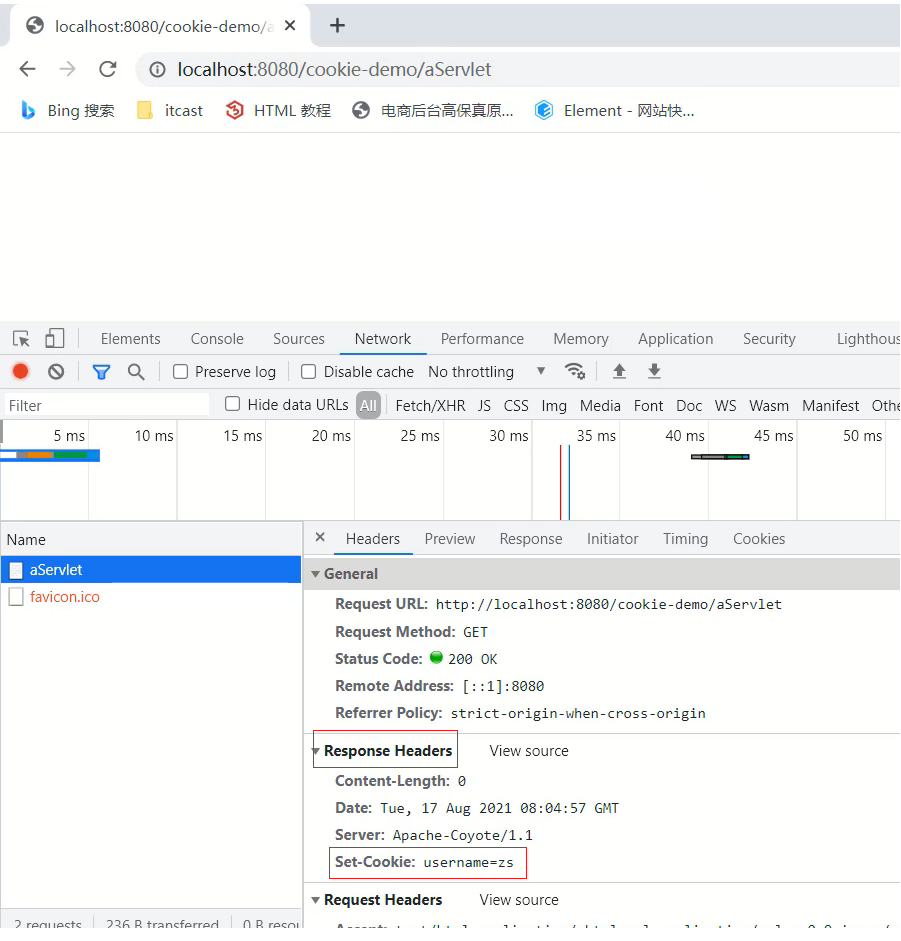

（2）访问BServlet对应的地址`http://localhost:8080/cookie-demo/bServlet

使用Chrom浏览器打开开发者工具(F12或Crtl+Shift+I)进行查看==请求头==中的数据


### 3、Cookie的使用细节

在这节我们主要讲解两个知识，第一个是Cookie的存活时间，第二个是Cookie如何存储中文，首先来学习

下Cookie的存活时间。

#### 1、Cookie的存活时间


(1)浏览器发送请求给AServlet,AServlet会响应一个存有usernanme=zs的Cookie对象给浏览器

(2)浏览器接收到响应数据将cookie存入到浏览器内存中

(3)当浏览器再次发送请求给BServlet,BServlet就可以使用Request对象获取到Cookie数据

(4)在发送请求到BServlet之前，如果把浏览器关闭再打开进行访问，BServlet能否获取到Cookie数据?

==注意：浏览器关闭再打开不是指打开一个新的选显卡，而且必须是先关闭再打开，顺序不能变。==

针对上面这个问题，通过演示，会发现，BServlet中无法再获取到Cookie数据，这是为什么呢?

- 默认情况下，Cookie存储在浏览器内存中，当浏览器关闭，内存释放，则Cookie被销毁

这个结论就印证了上面的演示效果，但是如果使用这种默认情况下的Cookie,有些需求就无法实现，比

如:

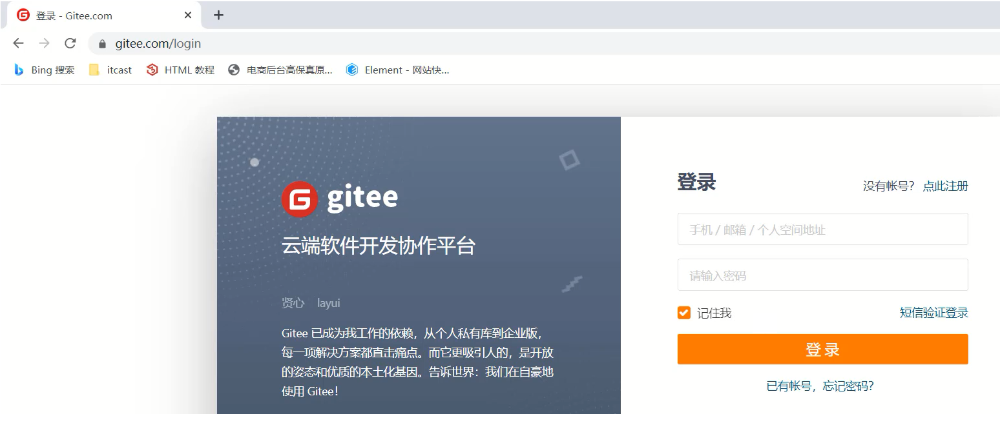

上面这个网站的登录页面上有一个记住我的功能，这个功能大家都比较熟悉

- 第一次输入用户名和密码并勾选记住我然后进行登录

- 下次再登陆的时候，用户名和密码就会被自动填充，不需要再重新输入登录

- 比如记住我这个功能需要记住用户名和密码一个星期，那么使用默认情况下的Cookie就会出现问题

- 因为默认情况，浏览器一关，Cookie就会从浏览器内存中删除，对于记住我功能就无法实现

所以我们现在就遇到一个难题是如何将Cookie持久化存储?

Cookie其实已经为我们提供好了对应的API来完成这件事，这个API就是==setMaxAge==,

- 设置Cookie存活时间

```
setMaxAge(int seconds)
```

参数值为:

1.正数：将Cookie写入浏览器所在电脑的硬盘，持久化存储。到时间自动删除

2.负数：默认值，Cookie在当前浏览器内存中，当浏览器关闭，则Cookie被销毁

3.零：删除对应Cookie

接下来，咱们就在AServlet中去设置Cookie的存活时间。

```java
@WebServlet("/aServlet")
public class AServlet extends HttpServlet {
    @Override
    protected void doGet(HttpServletRequest request, HttpServletResponse response) throws ServletException, IOException {
        //发送Cookie
        //1. 创建Cookie对象
        Cookie cookie = new Cookie("username","zs");
        //设置存活时间   ，1周 7天
        cookie.setMaxAge(60*60*24*7); //易阅读，需程序计算
        //cookie.setMaxAge(604800); //不易阅读(可以使用注解弥补)，程序少进行一次计算
        //2. 发送Cookie，response
        response.addCookie(cookie);
    }
​
    @Override
    protected void doPost(HttpServletRequest request, HttpServletResponse response) throws ServletException, IOException {
        this.doGet(request, response);
    }
}
```

修改完代码后，启动测试，访问http://localhost:8080/cookie-demo/aServlet

- 访问一个AServlet后，把浏览器关闭重启后，再去访问http://localhost:8080/cookie-demo/bServet,能在控制台打印出username:zs,说明Cookie没有随着浏览器关闭而被销毁

- 通过浏览器查看Cookie的内容，会发现Cookie的相关信息


#### 2、Cookie存储中文

首先，先来演示一个效果，将之前username=zs的值改成username=张三，把汉字张三存入到Cookie

中，看是什么效果:

```java
@WebServlet("/aServlet")
public class AServlet extends HttpServlet {
    @Override
    protected void doGet(HttpServletRequest request, HttpServletResponse response) throws ServletException, IOException {
        //发送Cookie
        String value = "张三";
        Cookie cookie = new Cookie("username",value);
        //设置存活时间   ，1周 7天
        cookie.setMaxAge(60*60*24*7);
        //2. 发送Cookie，response
        response.addCookie(cookie);
    }
​
    @Override
    protected void doPost(HttpServletRequest request, HttpServletResponse response) throws ServletException, IOException {
        this.doGet(request, response);
    }
}
```

启动访问测试，访问http://localhost:8080/cookie-demo/aServlet会发现浏览器会提示错误信息

通过上面的案例演示，我们得到一个结论:

- Cookie不能直接存储中文

Cookie不能存储中文，但是如果有这方面的需求，这个时候该如何解决呢?

这个时候，我们可以使用之前学过的一个知识点叫URL编码，所以如果需要存储中文，就需要进行转

码，具体的实现思路为:

> 1.在AServlet中对中文进行URL编码，采用URLEncoder.encode()，将编码后的值存入Cookie中

> 2.在BServlet中获取Cookie中的值,获取的值为URL编码后的值

> 3.将获取的值在进行URL解码,采用URLDecoder.decode()，就可以获取到对应的中文值

(1)在AServlet中对中文进行URL编码

```java
@WebServlet("/aServlet")
public class AServlet extends HttpServlet {
    @Override
    protected void doGet(HttpServletRequest request, HttpServletResponse response) throws ServletException, IOException {
        //发送Cookie
        String value = "张三";
        //对中文进行URL编码
        value = URLEncoder.encode(value, "UTF-8");
        System.out.println("存储数据："+value);
        //将编码后的值存入Cookie中
        Cookie cookie = new Cookie("username",value);
        //设置存活时间   ，1周 7天
        cookie.setMaxAge(60*60*24*7);
        //2. 发送Cookie，response
        response.addCookie(cookie);
    }
​
    @Override
    protected void doPost(HttpServletRequest request, HttpServletResponse response) throws ServletException, IOException {
        this.doGet(request, response);
    }
}
```

(2)在BServlet中获取值，并对值进行解码

```java
@WebServlet("/bServlet")
public class BServlet extends HttpServlet {
    @Override
    protected void doGet(HttpServletRequest request, HttpServletResponse response) throws ServletException, IOException {
        //获取Cookie
        //1. 获取Cookie数组
        Cookie[] cookies = request.getCookies();
        //2. 遍历数组
        for (Cookie cookie : cookies) {
            //3. 获取数据
            String name = cookie.getName();
            if("username".equals(name)){
                String value = cookie.getValue();//获取的是URL编码后的值 %E5%BC%A0%E4%B8%89
                //URL解码
                value = URLDecoder.decode(value,"UTF-8");
                System.out.println(name+":"+value);//value解码后为 张三
                break;
            }
        }
​
    }
​
    @Override
    protected void doPost(HttpServletRequest request, HttpServletResponse response) throws ServletException, IOException {
        this.doGet(request, response);
    }
}
```

至此，我们就可以将中文存入Cookie中进行使用。

小结

Cookie的使用细节中，我们讲了Cookie的存活时间和存储中文:

- 存活时间，需要掌握setMaxAage()API的使用

- 存储中文，需要掌握URL编码和解码的使用

## 三、Session

### 1、Session的基本使用

1.概念

==Session==：服务端会话跟踪技术：将数据保存到服务端。

- Session是存储在服务端而Cookie是存储在客户端

- 存储在客户端的数据容易被窃取和截获，存在很多不安全的因素

- 存储在服务端的数据相比于客户端来说就更安全

2.Session的工作流程

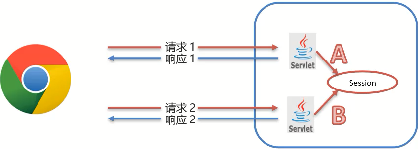

- 在服务端的AServlet获取一个Session对象，把数据存入其中

- 在服务端的BServlet获取到相同的Session对象，从中取出数据

- 就可以实现一次会话中多次请求之间的数据共享了

- 现在最大的问题是如何保证AServlet和BServlet使用的是同一个Session对象(在原理分析会讲解)?

3.Session的基本使用

在JavaEE中提供了HttpSession接口，来实现一次会话的多次请求之间数据共享功能。

具体的使用步骤为:

- 获取Session对象,使用的是request对象

```
HttpSession session = request.getSession();
```

- Session对象提供的功能:

- 存储数据到 session 域中

```
void setAttribute(String name, Object o)
```

- 根据 key，获取值

```
Object getAttribute(String name)
```

- 根据 key，删除该键值对

```
void removeAttribute(String name)
```

介绍完Session相关的API后，接下来通过一个案例来完成对Session的使用，具体实现步骤为:

> 需求:在一个Servlet中往Session中存入数据，在另一个Servlet中获取Session中存入的数据

> 1.创建名为SessionDemo1的Servlet类

> 2.创建名为SessionDemo2的Servlet类

> 3.在SessionDemo1的方法中:获取Session对象、存储数据4.在SessionDemo2的方法中:获取Session对象、获取数据5.启动测试

(1)创建名为SessionDemo1的Servlet类

```java
@WebServlet("/demo1")
public class SessionDemo1 extends HttpServlet {
    @Override
    protected void doGet(HttpServletRequest request, HttpServletResponse response) throws ServletException, IOException {
    
    }
​
    @Override
    protected void doPost(HttpServletRequest request, HttpServletResponse response) throws ServletException, IOException {
        this.doGet(request, response);
    }
}
```

(2)创建名为SessionDemo2的Servlet类

```java
@WebServlet("/demo2")
public class SessionDemo2 extends HttpServlet {
    @Override
    protected void doGet(HttpServletRequest request, HttpServletResponse response) throws ServletException, IOException {
    
    }
​
    @Override
    protected void doPost(HttpServletRequest request, HttpServletResponse response) throws ServletException, IOException {
        this.doGet(request, response);
    }
}
```

(3)SessionDemo1:获取Session对象、存储数据

```java
@WebServlet("/demo1")
public class SessionDemo1 extends HttpServlet {
    @Override
    protected void doGet(HttpServletRequest request, HttpServletResponse response) throws ServletException, IOException {
        //存储到Session中
        //1. 获取Session对象
        HttpSession session = request.getSession();
        //2. 存储数据
        session.setAttribute("username","zs");
    }
​
    @Override
    protected void doPost(HttpServletRequest request, HttpServletResponse response) throws ServletException, IOException {
        this.doGet(request, response);
    }
}
```

(4)SessionDemo2:获取Session对象、获取数据

```java
@WebServlet("/demo2")
public class SessionDemo2 extends HttpServlet {
    @Override
    protected void doGet(HttpServletRequest request, HttpServletResponse response) throws ServletException, IOException {
        //获取数据，从session中
        //1. 获取Session对象
        HttpSession session = request.getSession();
        //2. 获取数据
        Object username = session.getAttribute("username");
        System.out.println(username);
    }
​
    @Override
    protected void doPost(HttpServletRequest request, HttpServletResponse response) throws ServletException, IOException {
        this.doGet(request, response);
    }
}
```

(5)启动测试，

- 先访问http://localhost:8080/cookie-demo/demo1,将数据存入Session

- 在访问http://localhost:8080/cookie-demo/demo2,从Session中获取数据

- 查看控制台

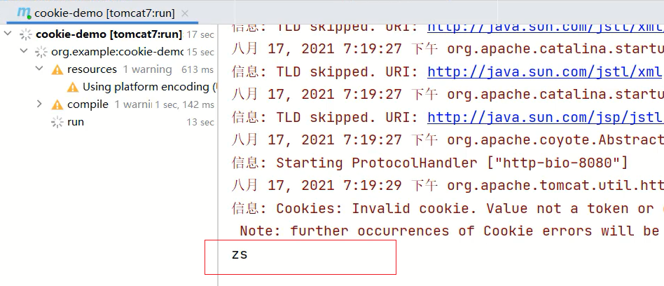

通过案例的效果，能看到Session是能够在一次会话中两次请求之间共享数据。

小结

至此Session的基本使用就已经完成了，重点要掌握的是:

- Session的获取

```
HttpSession session = request.getSession();
```

- Session常用方法的使用

```
void setAttribute(String name, Object o)
Object getAttribute(String name)
```

注意:Session中可以存储的是一个Object类型的数据，也就是说Session中可以存储任意数据类型。

Session的底层到底是如何实现一次会话两次请求之间的数据共享呢?

### 2、Session的原理分析

- Session是基于Cookie实现的

这句话其实不太能详细的说明Session的底层实现，接下来，咱们一步步来分析下Session的具体实现

原理:

(1)前提条件


Session要想实现一次会话多次请求之间的数据共享，就必须要保证多次请求获取Session的对象是同

一个。

那么它们是一个对象么？要验证这个结论也很简单，只需要在上面案例中的两个Servlet中分别打印下

Session对象

SessionDemo1

```java
@WebServlet("/demo1")
public class SessionDemo1 extends HttpServlet {
    @Override
    protected void doGet(HttpServletRequest request, HttpServletResponse response) throws ServletException, IOException {
        //存储到Session中
        //1. 获取Session对象
        HttpSession session = request.getSession();
        System.out.println(session);
        //2. 存储数据
        session.setAttribute("username","zs");
    }
​
    @Override
    protected void doPost(HttpServletRequest request, HttpServletResponse response) throws ServletException, IOException {
        this.doGet(request, response);
    }
}
```

SessionDemo2

```java
@WebServlet("/demo2")
public class SessionDemo2 extends HttpServlet {
    @Override
    protected void doGet(HttpServletRequest request, HttpServletResponse response) throws ServletException, IOException {
        //获取数据，从session中
        //1. 获取Session对象
        HttpSession session = request.getSession();
        System.out.println(session);
        //2. 获取数据
        Object username = session.getAttribute("username");
        System.out.println(username);
    }
​
    @Override
    protected void doPost(HttpServletRequest request, HttpServletResponse response) throws ServletException, IOException {
        this.doGet(request, response);
    }
}
```

启动测试，分别访问http://localhost:8080/cookie-demo/demo1 http://localhost:8080/cookie-demo/de

mo2


通过打印可以得到如下结论:

- 两个Servlet类中获取的Session对象是同一个

- 把demo1和demo2请求刷新多次，控制台最终打印的结果都是同一个

那么问题又来了，如果新开一个浏览器，访问demo1或者demo2,打印在控制台的Session还是同一个

对象么?


==注意:在一台电脑上演示的时候，如果是相同的浏览器必须要把浏览器全部关掉重新打开，才算新开

的一个浏览器。==

当然也可以使用不同的浏览器进行测试，就不需要把之前的浏览器全部关闭。

测试的结果：如果是不同浏览器或者重新打开浏览器后，打印的Session就不一样了。

所以Session实现的也是一次会话中的多次请求之间的数据共享。

那么最主要的问题就来了，Session是如何保证在一次会话中获取的Session对象是同一个呢?


(1)demo1在第一次获取session对象的时候，session对象会有一个唯一的标识，假如是id:10

(2)demo1在session中存入其他数据并处理完成所有业务后，需要通过Tomcat服务器响应结果给浏览

器

(3)Tomcat服务器发现业务处理中使用了session对象，就会把session的唯一标识id:10当做一个cookie，添加Set-Cookie:JESSIONID=10到响应头中，并响应给浏览器

(4)浏览器接收到响应结果后，会把响应头中的coookie数据存储到浏览器的内存中

(5)浏览器在同一会话中访问demo2的时候，会把cookie中的数据按照cookie: JESSIONID=10的格式添加到请求头中并发送给服务器Tomcat

(6)demo2获取到请求后，从请求头中就读取cookie中的JSESSIONID值为10，然后就会到服务器内存中寻找id:10的session对象，如果找到了，就直接返回该对象，如果没有则新创建一个session对象

(7)关闭打开浏览器后，因为浏览器的cookie已被销毁，所以就没有JESSIONID的数据，服务端获取到的session就是一个全新的session对象

至此，Session是基于Cookie来实现的这就话，我们就解释完了，接下来通过实例来演示下:

(1)使用chrome浏览器访问http://localhost:8080/cookie-demo/demo1,打开开发者模式(F12或Ctrl+Shift+I),查看==响应头(Response Headers)==数据:


(2)使用chrome浏览器再次访问http://localhost:8080/cookie-demo/demo2，查看==请求头(Request Headers)==数据:

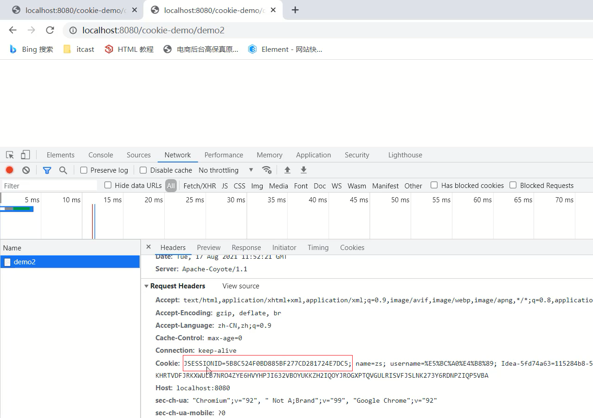

小结

介绍完Session的原理，我们只需要记住

- Session是基于Cookie来实现的


### 3、Session的使用细节

#### 1、Session钝化与活化

首先需要大家思考的问题是: 

- 服务器重启后，Session中的数据是否还在?

要想回答这个问题，我们可以先看下下面这幅图，


(1)服务器端AServlet和BServlet共用的session对象应该是存储在服务器的内存中

(2)服务器重新启动后，内存中的数据应该是已经被释放，对象也应该都销毁了

所以session数据应该也已经不存在了。但是如果session不存在会引发什么问题呢?

举个例子说明下，

(1)用户把需要购买的商品添加到购物车，因为要实现同一个会话多次请求数据共享，所以假设把数据存入Session对象中

(2)用户正要付钱的时候接到一个电话，付钱的动作就搁浅了

(3)正在用户打电话的时候，购物网站因为某些原因需要重启

(4)重启后session数据被销毁，购物车中的商品信息也就会随之而消失

(5)用户想再次发起支付，就会出为问题

所以说对于session的数据，我们应该做到就算服务器重启了，也应该能把数据保存下来才对。

分析了这么多，那么Tomcat服务器在重启的时候，session数据到底会不会保存以及是如何保存的，我们可以通过实际案例来演示下:

==注意:这里所说的关闭和启动应该要确保是正常的关闭和启动。==

那如何才是正常关闭Tomcat服务器呢?

需要使用命令行的方式来启动和停止Tomcat服务器:

==启动==:进入到项目pom.xml所在目录，执行tomcat7:run


==停止==:在启动的命令行界面，输入ctrl+c

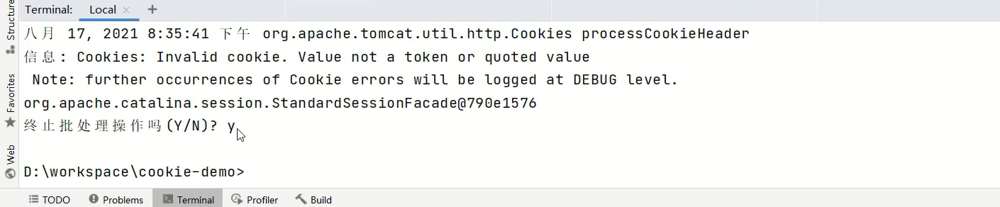

有了上述两个正常启动和关闭的方式后，接下来的测试流程是:

(1)先启动Tomcat服务器

(2)访问http://localhost:8080/cookie-demo/demo1将数据存入session中

(3)正确停止Tomcat服务器

(4)再次重新启动Tomcat服务器

(5)访问http://localhost:8080/cookie-demo/demo2 查看是否能获取到session中的数据


经过测试，会发现只要服务器是正常关闭和启动，session中的数据是可以被保存下来的。

那么Tomcat服务器到


底是如何做到的呢?

具体的原因就是:Session的钝化和活化:

- 钝化：在服务器正常关闭后，Tomcat会自动将Session数据写入硬盘的文件中


- 钝化的数据路径为:

项目目录\target\tomcat\work\Tomcat\localhost\项目名称\SESSIONS.ser


- 活化：再次启动服务器后，从文件中加载数据到Session中

- 数据加载到Session中后，路径中的

SESSIONS.ser文件会被删除掉

对于上述的整个过程，大家只需要了解下即可。因为所有的过程都是Tomcat自己完成的，不需要我们参与。

小结

Session的钝化和活化介绍完后，需要我们注意的是:

- session数据存储在服务端，服务器重启后，session数据会被保存

- 浏览器被关闭启动后，重新建立的连接就已经是一个全新的会话，获取的session数据也是一个新的对象

- session的数据要想共享，浏览器不能关闭，所以session数据不能长期保存数据

- cookie是存储在客户端，是可以长期保存

#### 2、Session销毁

session的销毁会有两种方式:

- 默认情况下，无操作，30分钟自动销毁

- 对于这个失效时间，是可以通过配置进行修改的

- 在项目的web.xml中配置

```xml
<?xml version="1.0" encoding="UTF-8"?>
<web-app xmlns="http://xmlns.jcp.org/xml/ns/javaee"
         xmlns:xsi="http://www.w3.org/2001/XMLSchema-instance"
         xsi:schemaLocation="http://xmlns.jcp.org/xml/ns/javaee http://xmlns.jcp.org/xml/ns/javaee/web-app_3_1.xsd"
         version="3.1">
​
    <session-config>
        <session-timeout>100</session-timeout>
    </session-config>
</web-app>
```

- 如果没有配置，默认是30分钟，默认值是在Tomcat的web.xml配置文件中写死的


- 调用Session对象的invalidate()进行销毁

- 在SessionDemo2类中添加session销毁的方法

```
@WebServlet("/demo2")
public class SessionDemo2 extends HttpServlet {
    @Override
    protected void doGet(HttpServletRequest request, HttpServletResponse response) throws ServletException, IOException {
        //获取数据，从session中
​
        //1. 获取Session对象
        HttpSession session = request.getSession();
        System.out.println(session);
​
        // 销毁
        session.invalidate();
        //2. 获取数据
        Object username = session.getAttribute("username");
        System.out.println(username);
    }
​
    @Override
    protected void doPost(HttpServletRequest request, HttpServletResponse response) throws ServletException, IOException {
        this.doGet(request, response);
    }
}
```

- 启动访问测试，先访问demo1将数据存入到session，再次访问demo2从session中获取数据


- 该销毁方法一般会在用户退出的时候，需要将session销毁掉。

Cookie和Session小结

- Cookie 和 Session 都是来完成一次会话内多次请求间==数据共享==的。

所需两个对象放在一块，就需要思考:

Cookie和Session的区别是什么?

Cookie和Session的应用场景分别是什么?

- 区别:

- 存储位置：Cookie 是将数据存储在客户端，Session 将数据存储在服务端

- 安全性：Cookie不安全，Session安全

- 数据大小：Cookie最大3KB，Session无大小限制

- 存储时间：Cookie可以通过setMaxAge()长期存储，Session默认30分钟

- 服务器性能：Cookie不占服务器资源，Session占用服务器资源

- 应用场景:

- 购物车:使用Cookie来存储

- 以登录用户的名称展示:使用Session来存储

- 记住我功能:使用Cookie来存储

- 验证码:使用session来存储

- 结论

- Cookie是用来保证用户在未登录情况下的身份识别

- Session是用来保存用户登录后的数据

介绍完Cookie和Session以后，具体用哪个还是需要根据具体的业务进行具体分析。

## 四、综合案例

[User.zip](youdaonote-attachments/WEBRESOURCE12c135b4570d82d5abfe88c22cd3784fUser.zip)

# Filter

## 一、Filter概述

Filter 表示过滤器，是 JavaWeb 三大组件(Servlet、Filter、Listener)之一。Servlet 我们之前都已经学习过了，Filter和Listener 我们今天都会进行学习。

过滤器可以把对资源的请求==拦截==下来，从而实现一些特殊的功能。

如下图所示，浏览器可以访问服务器上的所有的资源（servlet、jsp、html等）


而在访问到这些资源之前可以使过滤器拦截来下，也就是说在访问资源之前会先经过 Filter，如下图


拦截器拦截到后可以做什么功能呢？

==过滤器一般完成一些通用的操作。==比如每个资源都要写一些代码完成某个功能，我们总不能在每个资源中写这样的代码吧，而此时我们可以将这些代码写在过滤器中，因为请求每一个资源都要经过过滤器。

我们之前做的品牌数据管理的案例中就已经做了登陆的功能，而如果我们不登录能不能访问到数据呢？我们可以在浏览器直接访问首页 ，可以看到 查询所有 的超链接


当我点击该按钮，居然可以看到品牌的数据


这显然和我们的要求不符。我们希望实现的效果是用户如果登陆过了就跳转到品牌数据展示的页面；如果没有登陆就跳转到登陆页面让用户进行登陆，要实现这个效果需要在每一个资源中都写上这段逻辑，而像这种通用的操作，我们就可以放在过滤器中进行实现。这个就是==权限控制==，以后我们还会进行细粒度权限控制。过滤器还可以做 统一编码处理、 敏感字符处理 等等…

## 二、Filter快速入门

### 1、开发步骤

进行 Filter 开发分成以下三步实现

- 定义类，实现 Filter接口，并重写其所有方法


- 配置Filter拦截资源的路径：在类上定义 @WebFilter 注解。而注解的 value 属性值 /* 表示拦截所有的资源

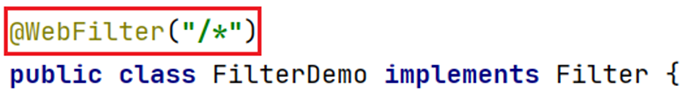

- 在doFilter方法中输出一句话，并放行


> 上述代码中的 chain.doFilter(request,response); 就是放行，也就是让其访问本该访问的资源。

### 2、代码演示

创建一个项目，项目下有一个 hello.jsp 页面，项目结构如下：


pom.xml 配置文件内容如下：

```xml
<?xml version="1.0" encoding="UTF-8"?>
<project xmlns="http://maven.apache.org/POM/4.0.0"
         xmlns:xsi="http://www.w3.org/2001/XMLSchema-instance"
         xsi:schemaLocation="http://maven.apache.org/POM/4.0.0 http://maven.apache.org/xsd/maven-4.0.0.xsd">
    <modelVersion>4.0.0</modelVersion>
​
    <groupId>org.example</groupId>
    <artifactId>filter-demo</artifactId>
    <version>1.0-SNAPSHOT</version>
    <packaging>war</packaging>
​
    <properties>
        <maven.compiler.source>8</maven.compiler.source>
        <maven.compiler.target>8</maven.compiler.target>
    </properties>
​
    <dependencies>
        <dependency>
            <groupId>javax.servlet</groupId>
            <artifactId>javax.servlet-api</artifactId>
            <version>3.1.0</version>
            <scope>provided</scope>
        </dependency>
    </dependencies>
​
    <build>
        <plugins>
            <plugin>
                <groupId>org.apache.tomcat.maven</groupId>
                <artifactId>tomcat7-maven-plugin</artifactId>
                <version>2.2</version>
                <configuration>
                    <port>80</port>
                </configuration>
            </plugin>
        </plugins>
    </build>
</project>
```

hello.jsp 页面内容如下：

```
<%@ page contentType="text/html;charset=UTF-8" language="java" %>
<html>
<head>
    <title>Title</title>
</head>
<body>
    <h1>hello JSP~</h1>
</body>
</html>
```

我们现在在浏览器输入 http://localhost/filter-demo/hello.jsp 访问 hello.jsp 页面，这里是可以访问到 hello.jsp 页面内容的。


接下来编写过滤器。过滤器是 Web 三大组件之一，所以我们将 filter 创建在 com.itheima.web.filter 包下，起名为 FilterDemo

```java
@WebFilter("/*")
public class FilterDemo implements Filter {
​
    @Override
    public void doFilter(ServletRequest request, ServletResponse response, FilterChain chain) throws IOException, ServletException {
        System.out.println("FilterDemo...");
    }
​
    @Override
    public void init(FilterConfig filterConfig) throws ServletException {
    }
​
    @Override
    public void destroy() {
    }
}
​
```

重启启动服务器，再次重新访问 hello.jsp 页面，这次发现页面没有任何效果，但是在 idea 的控制台可以看到如下内容


上述效果说明 FilterDemo 这个过滤器的 doFilter() 方法执行了，但是为什么在浏览器上看不到 hello.jsp 页面的内容呢？这是因为在 doFilter() 方法中添加放行的方法才能访问到 hello.jsp 页面。那就在 doFilter() 方法中添加放行的代码

```java
//放行
 chain.doFilter(request,response);
```

再次重启服务器并访问 hello.jsp 页面，发现这次就可以在浏览器上看到页面效果。

FilterDemo 过滤器完整代码如下：

```java
@WebFilter("/*")
public class FilterDemo implements Filter {
​
    @Override
    public void doFilter(ServletRequest request, ServletResponse response, FilterChain chain) throws IOException, ServletException {
        System.out.println("1.FilterDemo...");
        //放行
        chain.doFilter(request,response);
    }
​
    @Override
    public void init(FilterConfig filterConfig) throws ServletException {
    }
​
    @Override
    public void destroy() {
    }
}
​
```

## 三、 Filter执行流程


如上图是使用过滤器的流程，我们通过以下问题来研究过滤器的执行流程：

- 放行后访问对应资源，资源访问完成后，还会回到Filter中吗？

从上图就可以看出肯定 ==会== 回到Filter中

- 如果回到Filter中，是重头执行还是执行放行后的逻辑呢？

如果是重头执行的话，就意味着 放行前逻辑 会被执行两次，肯定不会这样设计了；所以访问完资源后，会回到 放行后逻辑，执行该部分代码。

通过上述的说明，我们就可以总结Filter的执行流程如下：


接下来我们通过代码验证一下，在 doFilter() 方法前后都加上输出语句，如下


同时在 hello.jsp 页面加上输出语句，如下


执行访问该资源打印的顺序是按照我们标记的标号进行打印的话，说明我们上边总结出来的流程是没有问题的。启动服务器访问 hello.jsp 页面，在控制台打印的内容如下：


以后我们可以将对请求进行处理的代码放在放行之前进行处理，而如果请求完资源后还要对响应的数据进行处理时可以在放行后进行逻辑处理。

## 四、Filter拦截路径配置

拦截路径表示 Filter 会对请求的哪些资源进行拦截，使用 @WebFilter 注解进行配置。如：@WebFilter("拦截路径") 

拦截路径有如下四种配置方式：

- 拦截具体的资源：/index.jsp：只有访问index.jsp时才会被拦截

- 目录拦截：/user/*：访问/user下的所有资源，都会被拦截

- 后缀名拦截：*.jsp：访问后缀名为jsp的资源，都会被拦截

- 拦截所有：/*：访问所有资源，都会被拦截

通过上面拦截路径的学习，大家会发现拦截路径的配置方式和 Servlet 的请求资源路径配置方式一样，但是表示的含义不同。

## 五、过滤器链

### 1、概述

过滤器链是指在一个Web应用，可以配置多个过滤器，这多个过滤器称为过滤器链。

如下图就是一个过滤器链，我们学习过滤器链主要是学习过滤器链执行的流程


上图中的过滤器链执行是按照以下流程执行：

1. 执行 Filter1 的放行前逻辑代码

1. 执行 Filter1 的放行代码

1. 执行 Filter2 的放行前逻辑代码

1. 执行 Filter2 的放行代码

1. 访问到资源

1. 执行 Filter2 的放行后逻辑代码

1. 执行 Filter1 的放行后逻辑代码

以上流程串起来就像一条链子，故称之为过滤器链。

### 2、代码演示

- 编写第一个过滤器FilterDemo ，配置成拦截所有资源

```java
@WebFilter("/*")
public class FilterDemo implements Filter {
​
    @Override
    public void doFilter(ServletRequest request, ServletResponse response, FilterChain chain) throws IOException, ServletException {
​
        //1. 放行前，对 request数据进行处理
        System.out.println("1.FilterDemo...");
        //放行
        chain.doFilter(request,response);
        //2. 放行后，对Response 数据进行处理
        System.out.println("3.FilterDemo...");
    }
​
    @Override
    public void init(FilterConfig filterConfig) throws ServletException {
    }
​
    @Override
    public void destroy() {
    }
}
```

- 编写第二个过滤器FilterDemo2 ，配置成拦截所有资源

```java
@WebFilter("/*")
public class FilterDemo2 implements Filter {
​
    @Override
    public void doFilter(ServletRequest request, ServletResponse response, FilterChain chain) throws IOException, ServletException {
​
        //1. 放行前，对 request数据进行处理
        System.out.println("2.FilterDemo...");
        //放行
        chain.doFilter(request,response);
        //2. 放行后，对Response 数据进行处理
        System.out.println("4.FilterDemo...");
    }
​
    @Override
    public void init(FilterConfig filterConfig) throws ServletException {
    }
​
    @Override
    public void destroy() {
    }
}
​
```

- 修改 hello.jsp 页面中脚本的输出语句

```
<%@ page contentType="text/html;charset=UTF-8" language="java" %>
<html>
<head>
    <title>Title</title>
</head>
<body>
    <h1>hello JSP~</h1>
    <%
        System.out.println("3.hello jsp");
    %>
</body>
</html>
```

- 启动服务器，在浏览器输入 http://localhost/filter-demo/hello.jsp 进行测试，在控制台打印内容如下


从结果可以看到确实是按照我们之前说的执行流程进行执行的。

### 3、问题

上面代码中为什么是先执行 FilterDemo ，后执行 FilterDemo2 呢？

我们现在使用的是注解配置Filter，而这种配置方式的优先级是按照过滤器类名(字符串)的自然排序。

比如有如下两个名称的过滤器 ： BFilterDemo 和 AFilterDemo 。那一定是 AFilterDemo 过滤器先执行。

# Listener

## 一、 概述

- Listener 表示监听器，是 JavaWeb 三大组件(Servlet、Filter、Listener)之一。

- 监听器可以监听就是在 application，session，request 三个对象创建、销毁或者往其中添加修改删除属性时自动执行代码的功能组件。

request 和 session 我们学习过。而 application 是 ServletContext 类型的对象。

ServletContext 代表整个web应用，在服务器启动的时候，tomcat会自动创建该对象。在服务器关闭时会自动销毁该对象。

## 二、 分类

JavaWeb 提供了8个监听器：


这里面只有 ServletContextListener 这个监听器后期我们会接触到，ServletContextListener 是用来监听 ServletContext 对象的创建和销毁。

ServletContextListener 接口中有以下两个方法

- void contextInitialized(ServletContextEvent sce)：ServletContext 对象被创建了会自动执行的方法

- void contextDestroyed(ServletContextEvent sce)：ServletContext 对象被销毁时会自动执行的方法

## 三、代码演示

我们只演示一下 ServletContextListener 监听器

- 定义一个类，实现ServletContextListener 接口

- 重写所有的抽象方法

- 使用 @WebListener 进行配置

代码如下：

```java
@WebListener
public class ContextLoaderListener implements ServletContextListener {
    @Override
    public void contextInitialized(ServletContextEvent sce) {
        //加载资源
        System.out.println("ContextLoaderListener...");
    }
​
    @Override
    public void contextDestroyed(ServletContextEvent sce) {
        //释放资源
    }
}
```

启动服务器，就可以在启动的日志信息中看到 contextInitialized() 方法输出的内容，同时也说明了 ServletContext 对象在服务器启动的时候被创建了。

# Ajax

## 一、概述

==AJAX (Asynchronous JavaScript And XML)：异步的 JavaScript 和 XML。==

我们先来说概念中的 JavaScript 和 XML，JavaScript 表明该技术和前端相关；XML 是指以此进行数据交换。而这两个我们之前都学习过。

### 1、作用

AJAX 作用有以下两方面：

1. 与服务器进行数据交换：通过AJAX可以给服务器发送请求，服务器将数据直接响应回给浏览器。

我们先来看之前做功能的流程，如下图：

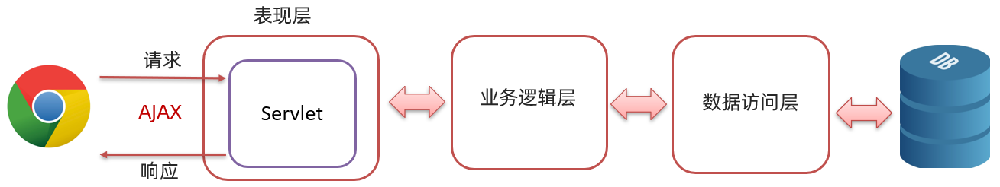

如上图，Servlet 调用完业务逻辑层后将数据存储到域对象中，然后跳转到指定的 jsp 页面，在页面上使用 EL表达式 和 JSTL 标签库进行数据的展示。

而我们学习了AJAX 后，就可以==使用AJAX和服务器进行通信，以达到使用 HTML+AJAX来替换JSP页面==了。如下图，浏览器发送请求servlet，servlet 调用完业务逻辑层后将数据直接响应回给浏览器页面，页面使用 HTML 来进行数据展示。


1. 异步交互：可以在==不重新加载整个页面==的情况下，与服务器交换数据并==更新部分网页==的技术，如：搜索联想、用户名是否可用校验，等等…


上图所示的效果我们经常见到，在我们输入一些关键字（例如 奥运）后就会在下面联想出相关的内容，而联想出来的这部分数据肯定是存储在百度的服务器上，而我们并没有看出页面重新刷新，这就是 ==更新局部页面== 的效果。再如下图：


我们在用户名的输入框输入用户名，当输入框一失去焦点，如果用户名已经被占用就会在下方展示提示的信息；在这整个过程中也没有页面的刷新，只是在局部展示出了提示信息，这就是 ==更新局部页面== 的效果。

### 2、同步和异步

知道了局部刷新后，接下来我们再聊聊同步和异步:

- 同步发送请求过程如下


浏览器页面在发送请求给服务器，在服务器处理请求的过程中，浏览器页面不能做其他的操作。只能等到服务器响应结束后才能，浏览器页面才能继续做其他的操作。

- 异步发送请求过程如下


浏览器页面发送请求给服务器，在服务器处理请求的过程中，浏览器页面还可以做其他的操作。

## 二、快速入门

### 1、服务端实现

在项目的创建 com.itheima.web.servlet ，并在该包下创建名为  AjaxServlet 的servlet

```java
@WebServlet("/ajaxServlet")
public class AjaxServlet extends HttpServlet {
    @Override
    protected void doGet(HttpServletRequest request, HttpServletResponse response) throws ServletException, IOException {
        //1. 响应数据
        response.getWriter().write("hello ajax~");
    }
​
    @Override
    protected void doPost(HttpServletRequest request, HttpServletResponse response) throws ServletException, IOException {
        this.doGet(request, response);
    }
}
```

### 2、客户端实现

在 webapp 下创建名为 01-ajax-demo1.html 的页面，在该页面书写 ajax 代码

- 创建核心对象，不同的浏览器创建的对象是不同的

```
 var xhttp;
if (window.XMLHttpRequest) {
    xhttp = new XMLHttpRequest();
} else {
    // code for IE6, IE5
    xhttp = new ActiveXObject("Microsoft.XMLHTTP");
}
```

- 发送请求

```
//建立连接
xhttp.open("GET", "http://localhost:8080/ajax-demo/ajaxServlet");
//发送请求
xhttp.send();
```

- 获取响应

```
xhttp.onreadystatechange = function() {
    if (this.readyState == 4 && this.status == 200) {
        // 通过 this.responseText 可以获取到服务端响应的数据
        alert(this.responseText);
    }
};
```

完整代码如下：

```
<!DOCTYPE html>
<html lang="en">
<head>
    <meta charset="UTF-8">
    <title>Title</title>
</head>
<body>
​
<script>
    //1. 创建核心对象
    var xhttp;
    if (window.XMLHttpRequest) {
        xhttp = new XMLHttpRequest();
    } else {
        // code for IE6, IE5
        xhttp = new ActiveXObject("Microsoft.XMLHTTP");
    }
    //2. 发送请求
    xhttp.open("GET", "http://localhost:8080/ajax-demo/ajaxServlet");
    xhttp.send();
​
    //3. 获取响应
    xhttp.onreadystatechange = function() {
        if (this.readyState == 4 && this.status == 200) {
            alert(this.responseText);
        }
    };
</script>
</body>
</html>
```

### 3、测试

在浏览器地址栏输入 http://localhost:8080/ajax-demo/01-ajax-demo1.html ，在 01-ajax-demo1.html加载的时候就会发送 ajax 请求，效果如下


我们可以通过 开发者模式 查看发送的 AJAX 请求。在浏览器上按 F12 快捷键


这个是查看所有的请求，如果我们只是想看 异步请求的话，点击上图中 All 旁边的 XHR，会发现只展示 Type 是 xhr 的请求。如下图：


# axios

## 一、基本使用

axios 使用是比较简单的，分为以下两步：

- 引入 axios 的 js 文件

```
<script src="js/axios-0.18.0.js"></script>
```

- 使用axios 发送请求，并获取响应结果

- 发送 get 请求

```
axios({
    method:"get",
    url:"http://localhost:8080/ajax-demo1/aJAXDemo1?username=zhangsan"
}).then(function (resp){
    alert(resp.data);
})
```

- 发送 post 请求

```
axios({
    method:"post",
    url:"http://localhost:8080/ajax-demo1/aJAXDemo1",
    data:"username=zhangsan"
}).then(function (resp){
    alert(resp.data);
});
```

axios() 是用来发送异步请求的，小括号中使用 js 对象传递请求相关的参数：

- method

 属性：用来设置请求方式的。取值为 get 或者 post。

- url

 属性：用来书写请求的资源路径。如果是 get 请求，需要将请求参数拼接到路径的后面，格式为： url?参数名=参数值&参数名2=参数值2。

- data

 属性：作为请求体被发送的数据。也就是说如果是 post 请求的话，数据需要作为 data 属性的值。

then() 需要传递一个匿名函数。我们将 then() 中传递的匿名函数称为 ==回调函数==，意思是该匿名函数在发送请求时不会被调用，而是在成功响应后调用的函数。而该回调函数中的 resp 参数是对响应的数据进行封装的对象，通过 resp.data 可以获取到响应的数据。

## 二、快速入门

### 1、后端实现

定义一个用于接收请求的servlet，代码如下：

```java
@WebServlet("/axiosServlet")
public class AxiosServlet extends HttpServlet {
    @Override
    protected void doGet(HttpServletRequest request, HttpServletResponse response) throws ServletException, IOException {
        System.out.println("get...");
        //1. 接收请求参数
        String username = request.getParameter("username");
        System.out.println(username);
        //2. 响应数据
        response.getWriter().write("hello Axios~");
    }
​
    @Override
    protected void doPost(HttpServletRequest request, HttpServletResponse response) throws ServletException, IOException {
        System.out.println("post...");
        this.doGet(request, response);
    }
}
```

### 2、前端实现

- 引入 js 文件

```
<script src="js/axios-0.18.0.js"></script>
```

- 发送 ajax 请求

- get 请求

```
axios({
    method:"get",
    url:"http://localhost:8080/ajax-demo/axiosServlet?username=zhangsan"
}).then(function (resp) {
    alert(resp.data);
})
```

- post 请求

```
axios({
    method:"post",
    url:"http://localhost:8080/ajax-demo/axiosServlet",
    data:"username=zhangsan"
}).then(function (resp) {
    alert(resp.data);
})
```

整体页面代码如下：

```
<!DOCTYPE html>
<html lang="en">
<head>
    <meta charset="UTF-8">
    <title>Title</title>
</head>
<body>
​
<script src="js/axios-0.18.0.js"></script>
<script>
    //1. get
   /* axios({
        method:"get",
        url:"http://localhost:8080/ajax-demo/axiosServlet?username=zhangsan"
    }).then(function (resp) {
        alert(resp.data);
    })*/
​
    //2. post  在js中{} 表示一个js对象，而这个js对象中有三个属性
    axios({
        method:"post",
        url:"http://localhost:8080/ajax-demo/axiosServlet",
        data:"username=zhangsan"
    }).then(function (resp) {
        alert(resp.data);
    })
</script>
</body>
</html>
```

## 三、请求方法别名

为了方便起见， Axios 已经为所有支持的请求方法提供了别名。如下：

- get 请求 ： axios.get(url[,config])

- delete 请求 ： axios.delete(url[,config])

- head 请求 ： axios.head(url[,config])

- options 请求 ： axios.option(url[,config])

- post 请求：axios.post(url[,data[,config])

- put 请求：axios.put(url[,data[,config])

- patch 请求：axios.patch(url[,data[,config])

而我们只关注 get 请求和 post 请求。

入门案例中的 get 请求代码可以改为如下：

```
axios.get("http://localhost:8080/ajax-demo/axiosServlet?username=zhangsan").then(function (resp) {
    alert(resp.data);
});
```

入门案例中的 post 请求代码可以改为如下：

```
axios.post("http://localhost:8080/ajax-demo/axiosServlet","username=zhangsan").then(function (resp) {
    alert(resp.data);
})
```

# JSON

## 一、概述

==概念：JavaScript Object Notation。JavaScript 对象表示法.==

如下是 JavaScript 对象的定义格式：

```javascript
{
    name:"zhangsan",
    age:23,
    city:"北京"
}
```

接下来我们再看看 JSON 的格式：

```json
{
    "name":"zhangsan",
    "age":23,
    "city":"北京"
}
```

通过上面 js 对象格式和 json 格式进行对比，发现两个格式特别像。只不过 js 对象中的属性名可以使用引号（可以是单引号，也可以是双引号）；而 json 格式中的键要求必须使用双引号括起来，这是 json 格式的规定。json 格式的数据有什么作用呢？

作用：由于其语法格式简单，层次结构鲜明，现多用于作为==数据载体==，在网络中进行数据传输。如下图所示就是服务端给浏览器响应的数据，这个数据比较简单，如果现需要将 JAVA 对象中封装的数据响应回给浏览器的话，应该以何种数据传输呢？

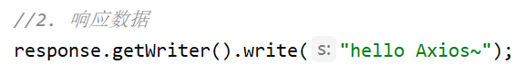

大家还记得 ajax 的概念吗？ 是 ==异步的 JavaScript 和 xml==。这里的 xml就是以前进行数据传递的方式，如下：

```
<student>
    <name>张三</name>
    <age>23</age>
    <city>北京</city>
</student>
```

再看 json 描述以上数据的写法：

```
{   
    "name":"张三",
    "age":23,
    "city":"北京"
}
```

上面两种格式进行对比后就会发现 json 格式数据的简单，以及所占的字节数少等优点。

## 二、JSON 基础语法

### 1、定义格式

JSON 本质就是一个字符串，但是该字符串内容是有一定的格式要求的。 定义格式如下：

```
var 变量名 = '{"key":value,"key":value,...}';
```

JSON 串的键要求必须使用双引号括起来，而值根据要表示的类型确定。value 的数据类型分为如下

- 数字（整数或浮点数）

- 字符串（使用双引号括起来）

- 逻辑值（true或者false）

- 数组（在方括号中）

- 对象（在花括号中）

- null

示例：

```
var jsonStr = '{"name":"zhangsan","age":23,"addr":["北京","上海","西安"]}'
```

### 2、代码演示

创建一个页面，在该页面的 <script> 标签中定义json字符串

```
<!DOCTYPE html>
<html lang="en">
<head>
    <meta charset="UTF-8">
    <title>Title</title>
</head>
<body>
<script>
    //1. 定义JSON字符串
    var jsonStr = '{"name":"zhangsan","age":23,"addr":["北京","上海","西安"]}'
    alert(jsonStr);
​
</script>
</body>
</html>
```

通过浏览器打开，页面效果如下图所示


现在我们需要获取到该 JSON 串中的 name 属性值，应该怎么处理呢？

如果它是一个 js 对象，我们就可以通过 js对象.属性名 的方式来获取数据。JS 提供了一个对象 JSON ，该对象有如下两个方法：

- parse(str) ：将 JSON串转换为 js 对象。使用方式是： ==var jsObject = JSON.parse(jsonStr);==

- stringify(obj) ：将 js 对象转换为 JSON 串。使用方式是：==var jsonStr = JSON.stringify(jsObject)==

代码演示：

```
<!DOCTYPE html>
<html lang="en">
<head>
    <meta charset="UTF-8">
    <title>Title</title>
</head>
<body>
<script>
    //1. 定义JSON字符串
    var jsonStr = '{"name":"zhangsan","age":23,"addr":["北京","上海","西安"]}'
    alert(jsonStr);
​
    //2. 将 JSON 字符串转为 JS 对象
    let jsObject = JSON.parse(jsonStr);
    alert(jsObject)
    alert(jsObject.name)
    //3. 将 JS 对象转换为 JSON 字符串
    let jsonStr2 = JSON.stringify(jsObject);
    alert(jsonStr2)
</script>
</body>
</html>
```

### 3、发送异步请求携带参数

后面我们使用 axios 发送请求时，如果要携带复杂的数据时都会以 JSON 格式进行传递，如下

```
axios({
    method:"post",
    url:"http://localhost:8080/ajax-demo/axiosServlet",
    data:"username=zhangsan"
}).then(function (resp) {
    alert(resp.data);
})
```

请求参数不可能由我们自己拼接字符串吧？肯定不用，可以提前定义一个 js 对象，用来封装需要提交的参数，然后使用 JSON.stringify(js对象) 转换为 JSON 串，再将该 JSON 串作为 axios 的 data 属性值进行请求参数的提交。如下：

```
var jsObject = {name:"张三"};
​
axios({
    method:"post",
    url:"http://localhost:8080/ajax-demo/axiosServlet",
    data: JSON.stringify(jsObject)
}).then(function (resp) {
    alert(resp.data);
})
```

而 axios 是一个很强大的工具。我们只需要将需要提交的参数封装成 js 对象，并将该 js 对象作为 axios 的 data 属性值进行，它会自动将 js 对象转换为 JSON 串进行提交。如下：

```
var jsObject = {name:"张三"};
​
axios({
    method:"post",
    url:"http://localhost:8080/ajax-demo/axiosServlet",
    data:jsObject  //这里 axios 会将该js对象转换为 json 串的
}).then(function (resp) {
    alert(resp.data);
})
```

> ==注意：==js 提供的 JSON 对象我们只需要了解一下即可。因为 axios 会自动对 js 对象和 JSON 串进行想换转换。发送异步请求时，如果请求参数是 JSON 格式，那请求方式必须是 POST。因为 JSON 串需要放在请求体中。

## 三、JSON串和Java对象的相互转换

学习完 json 后，接下来聊聊 json 的作用。以后我们会以 json 格式的数据进行前后端交互。前端发送请求时，如果是复杂的数据就会以 json 提交给后端；而后端如果需要响应一些复杂的数据时，也需要以 json 格式将数据响应回给浏览器。


在后端我们就需要重点学习以下两部分操作：

- 请求数据：JSON字符串转为Java对象

- 响应数据：Java对象转为JSON字符串

接下来给大家介绍一套 API，可以实现上面两部分操作。这套 API 就是 Fastjson

### 1、Fastjson 概述

Fastjson 是阿里巴巴提供的一个Java语言编写的高性能功能完善的 JSON 库，是目前Java语言中最快的 JSON 库，可以实现 Java 对象和 JSON 字符串的相互转换。

### 2、Fastjson 使用

Fastjson 使用也是比较简单的，分为以下三步完成

1. 导入坐标

```
<dependency>
    <groupId>com.alibaba</groupId>
    <artifactId>fastjson</artifactId>
    <version>1.2.62</version>
</dependency>
```

1. Java对象转JSON

```java
String jsonStr = JSON.toJSONString(obj);
```

将 Java 对象转换为 JSON 串，只需要使用 Fastjson 提供的 JSON 类中的 toJSONString() 静态方法即可。

1. JSON字符串转Java对象

```
User user = JSON.parseObject(jsonStr, User.class);
```

将 json 转换为 Java 对象，只需要使用 Fastjson 提供的 JSON 类中的 parseObject() 静态方法即可。

### 3、代码演示

- 引入坐标

- 创建一个类，专门用来测试 Java 对象和 JSON 串的相互转换，代码如下：

```
public class FastJsonDemo {
​
    public static void main(String[] args) {
        //1. 将Java对象转为JSON字符串
        User user = new User();
        user.setId(1);
        user.setUsername("zhangsan");
        user.setPassword("123");
​
        String jsonString = JSON.toJSONString(user);
        System.out.println(jsonString);//{"id":1,"password":"123","username":"zhangsan"}
​
​
        //2. 将JSON字符串转为Java对象
        User u = JSON.parseObject("{\"id\":1,\"password\":\"123\",\"username\":\"zhangsan\"}", User.class);
        System.out.println(u);
    }
}
```

# VUE

## 一、概述

接下来我们学习一款前端的框架，就是 VUE。

==Vue 是一套前端框架，免除原生JavaScript中的DOM操作，简化书写。==

我们之前也学习过后端的框架 Mybatis ，Mybatis 是用来简化 jdbc 代码编写的；而 VUE 是前端的框架，是用来简化 JavaScript 代码编写的。前一天我们做了一个综合性的案例，里面进行了大量的DOM操作，如下


学习了 VUE 后，这部分代码我们就不需要再写了。那么 VUE 是如何简化 DOM 书写呢？

==基于MVVM(Model-View-ViewModel)思想，实现数据的双向绑定，将编程的关注点放在数据上。==之前我们是将关注点放在了 DOM 操作上；而要了解 MVVM 思想，必须先聊聊 MVC 思想，如下图就是 MVC 思想图解


C 就是咱们 js 代码，M 就是数据，而 V 是页面上展示的内容，如下图是我们之前写的代码


MVC 思想是没法进行双向绑定的。双向绑定是指当数据模型数据发生变化时，页面展示的会随之发生变化，而如果表单数据发生变化，绑定的模型数据也随之发生变化。接下来我们聊聊 MVVM 思想，如下图是三个组件图解


图中的 Model 就是我们的数据，View 是视图，也就是页面标签，用户可以通过浏览器看到的内容；Model 和 View 是通过 ViewModel 对象进行双向绑定的，而 ViewModel 对象是 Vue 提供的。接下来让大家看一下双向绑定的效果，下图是提前准备的代码，输入框绑定了 username 模型数据，而在页面上也使用 {{}} 绑定了 username 模型数据


通过浏览器打开该页面可以看到如下页面


当我们在输入框中输入内容，而输入框后面随之实时的展示我们输入的内容，这就是双向绑定的效果。

## 二、快速入门

Vue 使用起来是比较简单的，总共分为如下三步：

1. 新建 HTML 页面，引入 Vue.js文件

```
<script src="js/vue.js"></script>
```

1. 在JS代码区域，创建Vue核心对象，进行数据绑定

```
new Vue({
    el: "#app",
    data() {
        return {
            username: ""
        }
    }
});
```

创建 Vue 对象时，需要传递一个 js 对象，而该对象中需要如下属性：

- el ： 用来指定哪儿些标签受 Vue 管理。 该属性取值 #app 中的 app 需要是受管理的标签的id属性值

- data ：用来定义数据模型

- methods ：用来定义函数。这个我们在后面就会用到

1. 编写视图

```
<div id="app">
    <input name="username" v-model="username" >
    {{username}}
</div>
```

{{}} 是 Vue 中定义的 插值表达式 ，在里面写数据模型，到时候会将该模型的数据值展示在这个位置。

整体代码如下：

```
<!DOCTYPE html>
<html lang="en">
<head>
    <meta charset="UTF-8">
    <title>Title</title>
</head>
<body>
<div id="app">
    <input v-model="username">
    <!--插值表达式-->
    {{username}}
</div>
<script src="js/vue.js"></script>
<script>
    //1. 创建Vue核心对象
    new Vue({
        el:"#app",
        data(){  // data() 是 ECMAScript 6 版本的新的写法
            return {
                username:""
            }
        }
​
        /*data: function () {
            return {
                username:""
            }
        }*/
    });
​
</script>
</body>
</html>
```

## 三、Vue 指令

指令：HTML 标签上带有 v- 前缀的特殊属性，不同指令具有不同含义。例如：v-if，v-for…

常用的指令有：

| 指令 | 作用 |
| - | - |
| v-bind | 为HTML标签绑定属性值，如设置  href , css样式等 |
| v-model | 在表单元素上创建双向数据绑定 |
| v-on | 为HTML标签绑定事件 |
| v-if | 条件性的渲染某元素，判定为true时渲染,否则不渲染 |
| v-else | 、 |
| v-else-if | 、 |
| v-show | 根据条件展示某元素，区别在于切换的是display属性的值 |
| v-for | 列表渲染，遍历容器的元素或者对象的属性 |


接下来我们挨个学习这些指令

### 1、v-bind & v-model 指令


- v-bind

该指令可以给标签原有属性绑定模型数据。这样模型数据发生变化，标签属性值也随之发生变化

例如：

```
<a v-bind:href="url">百度一下</a>
```

上面的 v-bind:"  可以简化写成 :  ，如下：

```
<!--
    v-bind 可以省略
-->
<a :href="url">百度一下</a>
```

- v-model

该指令可以给表单项标签绑定模型数据。这样就能实现双向绑定效果。例如：

```
<input name="username" v-model="username">
```

代码演示：

```
<!DOCTYPE html>
<html lang="en">
<head>
    <meta charset="UTF-8">
    <title>Title</title>
</head>
<body>
<div id="app">
    <a v-bind:href="url">点击一下</a>
    <a :href="url">点击一下</a>
    <input v-model="url">
</div>
​
<script src="js/vue.js"></script>
<script>
    //1. 创建Vue核心对象
    new Vue({
        el:"#app",
        data(){
            return {
                username:"",
                url:"https://www.baidu.com"
            }
        }
    });
</script>
</body>
</html>
```

通过浏览器打开上面页面，并且使用检查查看超链接的路径，该路径会根据输入框输入的路径变化而变化，这是因为超链接和输入框绑定的是同一个模型数据


### 2、v-on 指令

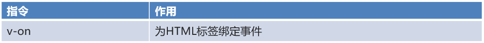

我们在页面定义一个按钮，并给该按钮使用 v-on 指令绑定单击事件，html代码如下

```
<input type="button" value="一个按钮" v-on:click="show()">
```

而使用 v-on 时还可以使用简化的写法，将 v-on: 替换成 @，html代码如下

```
<input type="button" value="一个按钮" @click="show()">
```

上面代码绑定的 show() 需要在 Vue 对象中的 methods 属性中定义出来

```
new Vue({
    el: "#app",
    methods: {
        show(){
            alert("我被点了");
        }
    }
});
```

> ==注意：v-on: 后面的事件名称是之前原生事件属性名去掉on。==例如：单击事件 ： 事件属性名是 onclick，而在vue中使用是 v-on:click失去焦点事件：事件属性名是 onblur，而在vue中使用时 v-on:blur

整体页面代码如下：

```
<!DOCTYPE html>
<html lang="en">
<head>
    <meta charset="UTF-8">
    <title>Title</title>
</head>
<body>
<div id="app">
    <input type="button" value="一个按钮" v-on:click="show()"><br>
    <input type="button" value="一个按钮" @click="show()">
</div>
<script src="js/vue.js"></script>
<script>
    //1. 创建Vue核心对象
    new Vue({
        el:"#app",
        data(){
            return {
                username:"",
            }
        },
        methods:{
            show(){
                alert("我被点了...");
            }
        }
    });
</script>
</body>
</html>
```

### 3、条件判断指令


接下来通过代码演示一下。在 Vue中定义一个 count 的数据模型，如下

```
//1. 创建Vue核心对象
new Vue({
    el:"#app",
    data(){
        return {
            count:3
        }
    }
});
```

现在要实现，当 count 模型的数据是3时，在页面上展示 div1 内容；当 count 模型的数据是4时，在页面上展示 div2 内容；count 模型数据是其他值时，在页面上展示 div3。这里为了动态改变模型数据 count 的值，再定义一个输入框绑定 count 模型数据。html 代码如下：

```
<div id="app">
    <div v-if="count == 3">div1</div>
    <div v-else-if="count == 4">div2</div>
    <div v-else>div3</div>
    <hr>
    <input v-model="count">
</div>
```

整体页面代码如下：

```
<!DOCTYPE html>
<html lang="en">
<head>
    <meta charset="UTF-8">
    <title>Title</title>
</head>
<body>
<div id="app">
    <div v-if="count == 3">div1</div>
    <div v-else-if="count == 4">div2</div>
    <div v-else>div3</div>
    <hr>
    <input v-model="count">
</div>
​
<script src="js/vue.js"></script>
<script>
    //1. 创建Vue核心对象
    new Vue({
        el:"#app",
        data(){
            return {
                count:3
            }
        }
    });
</script>
</body>
</html>
```

通过浏览器打开页面并在输入框输入不同的值，效果如下

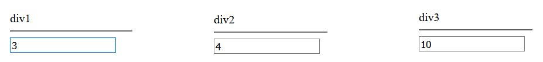

然后我们在看看 v-show 指令的效果，如果模型数据 count 的值是3时，展示 div v-show 内容，否则不展示，html页面代码如下

```
<div v-show="count == 3">div v-show</div>
<br>
<input v-model="count">
```

浏览器打开效果如下：


通过上面的演示，发现 v-show 和 v-if 效果一样，那它们到底有什么区别呢？我们根据浏览器的检查功能查看源代码


通过上图可以看出 v-show 不展示的原理是给对应的标签添加 display css属性，并将该属性值设置为 none ，这样就达到了隐藏的效果。而 v-if 指令是条件不满足时根本就不会渲染。

### 4、v-for 指令


这个指令看到名字就知道是用来遍历的，该指令使用的格式如下：

```
<标签 v-for="变量名 in 集合模型数据">
    {{变量名}}
</标签>
```

> ==注意：需要循环那个标签，v-for 指令就写在那个标签上。==

如果在页面需要使用到集合模型数据的索引，就需要使用如下格式：

```
<标签 v-for="(变量名,索引变量) in 集合模型数据">
    <!--索引变量是从0开始，所以要表示序号的话，需要手动的加1-->
   {{索引变量 + 1}} {{变量名}}
</标签>
```

代码演示：

```
<!DOCTYPE html>
<html lang="en">
<head>
    <meta charset="UTF-8">
    <title>Title</title>
</head>
<body>
<div id="app">
    <div v-for="addr in addrs">
        {{addr}} <br>
    </div>
​
    <hr>
    <div v-for="(addr,i) in addrs">
        {{i+1}}--{{addr}} <br>
    </div>
</div>
​
<script src="js/vue.js"></script>
<script>
​
    //1. 创建Vue核心对象
    new Vue({
        el:"#app",
        data(){
            return {
                addrs:["北京","上海","西安"]
            }
        }
    });
</script>
</body>
</html>
```

通过浏览器打开效果如下


## 四、生命周期 

生命周期的八个阶段：每触发一个生命周期事件，会自动执行一个生命周期方法，这些生命周期方法也被称为钩子方法。


下图是 Vue 官网提供的从创建 Vue 到效果 Vue 对象的整个过程及各个阶段对应的钩子函数


看到上面的图，大家无需过多的关注这张图。这些钩子方法我们只关注 mounted 就行了。

mounted：挂载完成，Vue初始化成功，HTML页面渲染成功。而以后我们会在该方法中==发送异步请求，加载数据。==

# Element

Element：是饿了么公司前端开发团队提供的一套基于 Vue 的网站组件库，用于快速构建网页。

Element 提供了很多组件（组成网页的部件）供我们使用。例如 超链接、按钮、图片、表格等等~

如下图左边的是我们编写页面看到的按钮，上图右边的是 Element 提供的页面效果，效果一目了然。


我们学习 Element 其实就是学习怎么从官网拷贝组件到我们自己的页面并进行修改，官网网址是

```
https://element.eleme.cn/#/zh-CN
```

进入官网能看到如下页面


接下来直接点击 组件 ，页面如下


## 一、快速入门

1. 将资源 04-资料\02-element 下的 element-ui 文件夹直接拷贝到项目的 webapp 下。目录结构如下


1. 创建页面，并在页面引入Element 的css、js文件 和 Vue.js

```
<script src="vue.js"></script>
<script src="element-ui/lib/index.js"></script>
<link rel="stylesheet" href="element-ui/lib/theme-chalk/index.css">
```

1. .创建Vue核心对象

Element 是基于 Vue 的，所以使用Element时必须要创建 Vue 对象

```
<script>
    new Vue({
        el:"#app"
    })
</script>
```

1. 官网复制Element组件代码


在左菜单栏找到 Button 按钮 ，然后找到自己喜欢的按钮样式，点击 显示代码 ，在下面就会展示出对应的代码，将这些代码拷贝到我们自己的页面即可。

整体页面代码如下：

```
<!DOCTYPE html>
<html lang="en">
<head>
    <meta charset="UTF-8">
    <title>Title</title>
</head>
<body>
<div id="app">
​
​
    <el-row>
        <el-button>默认按钮</el-button>
        <el-button type="primary">主要按钮</el-button>
        <el-button type="success">成功按钮</el-button>
        <el-button type="info">信息按钮</el-button>
        <el-button type="warning">警告按钮</el-button>
        <el-button type="danger">删除</el-button>
    </el-row>
    <el-row>
        <el-button plain>朴素按钮</el-button>
        <el-button type="primary" plain>主要按钮</el-button>
        <el-button type="success" plain>成功按钮</el-button>
        <el-button type="info" plain>信息按钮</el-button>
        <el-button type="warning" plain>警告按钮</el-button>
        <el-button type="danger" plain>危险按钮</el-button>
    </el-row>
​
    <el-row>
        <el-button round>圆角按钮</el-button>
        <el-button type="primary" round>主要按钮</el-button>
        <el-button type="success" round>成功按钮</el-button>
        <el-button type="info" round>信息按钮</el-button>
        <el-button type="warning" round>警告按钮</el-button>
        <el-button type="danger" round>危险按钮</el-button>
    </el-row>
​
    <el-row>
        <el-button icon="el-icon-search" circle></el-button>
        <el-button type="primary" icon="el-icon-edit" circle></el-button>
        <el-button type="success" icon="el-icon-check" circle></el-button>
        <el-button type="info" icon="el-icon-message" circle></el-button>
        <el-button type="warning" icon="el-icon-star-off" circle></el-button>
        <el-button type="danger" icon="el-icon-delete" circle></el-button>
    </el-row>
</div>
​
<script src="js/vue.js"></script>
<script src="element-ui/lib/index.js"></script>
<link rel="stylesheet" href="element-ui/lib/theme-chalk/index.css">
​
<script>
    new Vue({
        el:"#app"
    })
</script>
​
</body>
</html>
```

## 二、Element 布局

Element 提供了两种布局方式，分别是：

- Layout 布局

- Container 布局容器

### 1、Layout 局部

通过基础的 24 分栏，迅速简便地创建布局。也就是默认将一行分为 24 栏，根据页面要求给每一列设置所占的栏数。

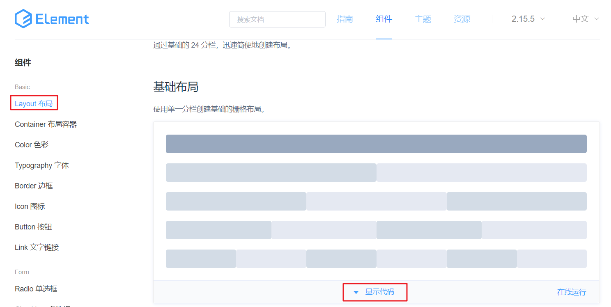

在左菜单栏找到 Layout 布局 ，然后找到自己喜欢的按钮样式，点击 显示代码 ，在下面就会展示出对应的代码，显示出的代码中有样式，有html标签。将样式拷贝我们自己页面的 head 标签内，将html标签拷贝到  <div id="app"></div> 标签内。

整体页面代码如下：

```
<!DOCTYPE html>
<html lang="en">
<head>
    <meta charset="UTF-8">
    <title>Title</title>
​
    <style>
        .el-row {
            margin-bottom: 20px;
        }
        .el-col {
            border-radius: 4px;
        }
        .bg-purple-dark {
            background: #99a9bf;
        }
        .bg-purple {
            background: #d3dce6;
        }
        .bg-purple-light {
            background: #e5e9f2;
        }
        .grid-content {
            border-radius: 4px;
            min-height: 36px;
        }
        .row-bg {
            padding: 10px 0;
            background-color: #f9fafc;
        }
    </style>
</head>
<body>
<div id="app">
    <el-row>
        <el-col :span="24"><div class="grid-content bg-purple-dark"></div></el-col>
    </el-row>
    <el-row>
        <el-col :span="12"><div class="grid-content bg-purple"></div></el-col>
        <el-col :span="12"><div class="grid-content bg-purple-light"></div></el-col>
    </el-row>
    <el-row>
        <el-col :span="8"><div class="grid-content bg-purple"></div></el-col>
        <el-col :span="8"><div class="grid-content bg-purple-light"></div></el-col>
        <el-col :span="8"><div class="grid-content bg-purple"></div></el-col>
    </el-row>
    <el-row>
        <el-col :span="6"><div class="grid-content bg-purple"></div></el-col>
        <el-col :span="6"><div class="grid-content bg-purple-light"></div></el-col>
        <el-col :span="6"><div class="grid-content bg-purple"></div></el-col>
        <el-col :span="6"><div class="grid-content bg-purple-light"></div></el-col>
    </el-row>
    <el-row>
        <el-col :span="4"><div class="grid-content bg-purple"></div></el-col>
        <el-col :span="4"><div class="grid-content bg-purple-light"></div></el-col>
        <el-col :span="4"><div class="grid-content bg-purple"></div></el-col>
        <el-col :span="4"><div class="grid-content bg-purple-light"></div></el-col>
        <el-col :span="4"><div class="grid-content bg-purple"></div></el-col>
        <el-col :span="4"><div class="grid-content bg-purple-light"></div></el-col>
    </el-row>
</div>
<script src="js/vue.js"></script>
<script src="element-ui/lib/index.js"></script>
<link rel="stylesheet" href="element-ui/lib/theme-chalk/index.css">
​
<script>
    new Vue({
        el:"#app"
    })
</script>
</body>
</html>
```

现在需要添加一行，要求该行显示8个格子，通过计算每个格子占 3 栏，具体的html 代码如下

```
<!--
添加一行，8个格子  24/8 = 3
-->
<el-row>
    <el-col :span="3"><div class="grid-content bg-purple"></div></el-col>
    <el-col :span="3"><div class="grid-content bg-purple-light"></div></el-col>
    <el-col :span="3"><div class="grid-content bg-purple"></div></el-col>
    <el-col :span="3"><div class="grid-content bg-purple-light"></div></el-col>
    <el-col :span="3"><div class="grid-content bg-purple"></div></el-col>
    <el-col :span="3"><div class="grid-content bg-purple-light"></div></el-col>
    <el-col :span="3"><div class="grid-content bg-purple"></div></el-col>
    <el-col :span="3"><div class="grid-content bg-purple-light"></div></el-col>
</el-row>
```

### 2、Container 布局容器

用于布局的容器组件，方便快速搭建页面的基本结构。如下图就是布局容器效果。

如下图是官网提供的 Container 布局容器实例：


该效果代码中包含了样式、页面标签、模型数据。将里面的样式 <style> 拷贝到我们自己页面的 head 标签中；将html标签拷贝到 <div id="app"></div> 标签中，再将数据模型拷贝到 vue 对象的 data() 中。

整体页面代码如下：

```
<!DOCTYPE html>
<html lang="en">
<head>
    <meta charset="UTF-8">
    <title>Title</title>
​
    <style>
        .el-header {
            background-color: #B3C0D1;
            color: #333;
            line-height: 60px;
        }
​
        .el-aside {
            color: #333;
        }
    </style>
</head>
<body>
<div id="app">
    <el-container style="height: 500px; border: 1px solid #eee">
        <el-aside width="200px" style="background-color: rgb(238, 241, 246)">
            <el-menu :default-openeds="['1', '3']">
                <el-submenu index="1">
                    <template slot="title"><i class="el-icon-message"></i>导航一</template>
                    <el-menu-item-group>
                        <template slot="title">分组一</template>
                        <el-menu-item index="1-1">选项1</el-menu-item>
                        <el-menu-item index="1-2">选项2</el-menu-item>
                    </el-menu-item-group>
                    <el-menu-item-group title="分组2">
                        <el-menu-item index="1-3">选项3</el-menu-item>
                    </el-menu-item-group>
                    <el-submenu index="1-4">
                        <template slot="title">选项4</template>
                        <el-menu-item index="1-4-1">选项4-1</el-menu-item>
                    </el-submenu>
                </el-submenu>
                <el-submenu index="2">
                    <template slot="title"><i class="el-icon-menu"></i>导航二</template>
                    <el-submenu index="2-1">
                        <template slot="title">选项1</template>
                        <el-menu-item index="2-1-1">选项1-1</el-menu-item>
                    </el-submenu>
                </el-submenu>
                <el-submenu index="3">
                    <template slot="title"><i class="el-icon-setting"></i>导航三</template>
                    <el-menu-item-group>
                        <template slot="title">分组一</template>
                        <el-menu-item index="3-1">选项1</el-menu-item>
                        <el-menu-item index="3-2">选项2</el-menu-item>
                    </el-menu-item-group>
                    <el-menu-item-group title="分组2">
                        <el-menu-item index="3-3">选项3</el-menu-item>
                    </el-menu-item-group>
                    <el-submenu index="3-4">
                        <template slot="title">选项4</template>
                        <el-menu-item index="3-4-1">选项4-1</el-menu-item>
                    </el-submenu>
                </el-submenu>
            </el-menu>
        </el-aside>
​
        <el-container>
            <el-header style="text-align: right; font-size: 12px">
                <el-dropdown>
                    <i class="el-icon-setting" style="margin-right: 15px"></i>
                    <el-dropdown-menu slot="dropdown">
                        <el-dropdown-item>查看</el-dropdown-item>
                        <el-dropdown-item>新增</el-dropdown-item>
                        <el-dropdown-item>删除</el-dropdown-item>
                    </el-dropdown-menu>
                </el-dropdown>
                <span>王小虎</span>
            </el-header>
​
            <el-main>
                <el-table :data="tableData">
                    <el-table-column prop="date" label="日期" width="140">
                    </el-table-column>
                    <el-table-column prop="name" label="姓名" width="120">
                    </el-table-column>
                    <el-table-column prop="address" label="地址">
                    </el-table-column>
                </el-table>
            </el-main>
        </el-container>
    </el-container>
</div>
<script src="js/vue.js"></script>
<script src="element-ui/lib/index.js"></script>
<link rel="stylesheet" href="element-ui/lib/theme-chalk/index.css">
​
<script>
    new Vue({
        el:"#app",
        data() {
            const item = {
                date: '2016-05-02',
                name: '王小虎',
                address: '上海市普陀区金沙江路 1518 弄'
            };
            return {
                tableData: Array(20).fill(item)
            }
        }
    })
</script>
</body>
</html>
```

# 综合案例

[JavaWebEnd.zip](youdaonote-attachments/WEBRESOURCE3f23912c486a220144bdd07bb22c097eJavaWebEnd.zip)

